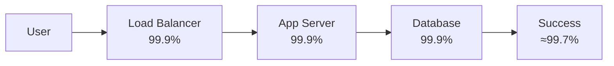

# Risk and Failure Probabilities — Junior

> **What?** Risk is not a vibe — it is a number you can estimate: `risk = probability × impact`. "Failure probability" is the chance a component or system fails in a given window. Reasoning about risk means putting rough numbers on *how likely* a bad thing is and *how bad* it is, then deciding what's worth fixing.
>
> **How?** At the junior level you learn to (1) split risk into its two factors, (2) read a risk matrix, (3) do the basic availability arithmetic — the "nines" table, `availability = uptime / total time`, and why chaining components in series makes things worse. You stop saying "this might break" and start saying "this has roughly a 1-in-100 chance per deploy, and if it breaks we lose checkout for ~10 minutes."

---

## 1. Risk = Probability × Impact

Every risk has two independent dials:

- **Probability** — how likely the bad event is (per hour, per request, per deploy, per year).
- **Impact** — how much it costs if it happens (money, users, data, trust, minutes of downtime).

A useful risk number multiplies them:

```
expected_loss = probability × impact
```

This is just [expected value](../02-base-rates-and-expected-value/) applied to bad outcomes. Two risks can have the same expected loss for opposite reasons:

| Risk | Probability | Impact | Expected loss |
|------|------------:|-------:|--------------:|
| Flaky cron job fails | 1 in 10 (0.10) | $100 | $10 |
| Datacenter fire | 1 in 100,000 (0.00001) | $1,000,000 | $10 |

Both "cost" $10 in expectation, but you'd treat them completely differently — one is annoying and frequent, the other is catastrophic and rare. **That is the whole game: the same expected loss can demand very different responses.** We'll come back to this (rare-but-huge risks — *tail risk* — get special treatment).

### Why both dials matter

Junior engineers tend to fixate on probability ("how do I make this never fail?"). But you can often do far more by shrinking **impact**:

- You can't stop a server from ever dying — but you can run two servers, so one death is invisible.
- You can't make a deploy 100% safe — but you can make rollback take 30 seconds instead of 30 minutes.

Reducing impact is frequently cheaper than reducing probability. Hold that thought.

---

## 2. The Risk Matrix

The risk matrix is the most common tool for ranking risks. You place each risk on a grid of probability (rows) vs. impact (columns):

| | **Low impact** | **Medium impact** | **High impact** |
|---|---|---|---|
| **High prob.** | 🟡 Medium | 🟠 High | 🔴 Critical |
| **Med prob.** | 🟢 Low | 🟡 Medium | 🟠 High |
| **Low prob.** | 🟢 Low | 🟢 Low | 🟡 Medium |

You work the red cells first, ignore the green ones, and argue about the yellows. It's a fast way to align a team on *what to worry about*.

### Its limits (know them early)

The matrix is a starting point, not the truth:

1. **It hides the math.** "Low probability × high impact = medium" is a judgment call, not arithmetic. A 1-in-a-million chance of losing all customer data is *not* "medium."
2. **Categories are coarse.** "High impact" covers both "$10k" and "company-ending." Bucketing throws away exactly the differences that matter.
3. **It invites theater.** Filling a matrix can *feel* like managing risk while changing nothing.

Use it to communicate and prioritize. Use real numbers to decide.

---

## 3. Availability and the "Nines"

**Availability** is the fraction of time a system is working:

```
availability = uptime / (uptime + downtime)
```

It's usually quoted in "nines." Memorize this table — you will use it constantly:

| Availability | "Nines" | Downtime per year | Downtime per day |
|---|---|---|---|
| 90% | one nine | 36.5 days | 2.4 hours |
| 99% | two nines | 3.65 days | 14.4 minutes |
| 99.9% | three nines | 8.76 hours | 1.44 minutes |
| 99.99% | four nines | 52.6 minutes | 8.6 seconds |
| 99.999% | five nines | 5.26 minutes | 0.86 seconds |

Each extra nine cuts allowed downtime by 10× — and usually costs far more than 10× the effort. "Five nines" sounds like a small step up from "four nines," but it's the difference between an hour of yearly downtime and five minutes.

> **Reality check:** Most products don't need five nines. A 99.9% internal tool is fine. Chasing nines you don't need is a classic waste — match the target to what users actually feel.

---

## 4. Components in Series Multiply Down

Here's the trap that surprises everyone. If your request must pass through several components **in series** — each one required for success — the availabilities **multiply**:

```
A_system = A₁ × A₂ × A₃ × ...
```

Say a request hits a load balancer, an app server, and a database, each at 99.9%:

```
A_system = 0.999 × 0.999 × 0.999 = 0.997   (≈ 99.7%)
```

Three "three-nines" components in series give you **less than three nines**. Downtime nearly tripled. Add more hops (cache, auth service, payment gateway, DNS) and it keeps eroding.



**The lesson:** every component you *require* is another way to fail. Long dependency chains are fragile by construction. This is why senior engineers count hops and ask "do we really need this dependency in the request path?"

---

## 5. A Worked Example

Your checkout flow needs all of these to work:

| Component | Availability |
|---|---|
| CDN | 99.99% |
| Load balancer | 99.99% |
| App server | 99.9% |
| Database | 99.95% |
| Payment provider | 99.9% |

Multiply them:

```
0.9999 × 0.9999 × 0.999 × 0.9995 × 0.999
≈ 0.9974   →  ~99.74%
```

That's about **23 hours of downtime per year** for checkout, even though every single piece is "highly available." Your weakest links (the two 99.9% services) dominate. If you want better, the cheapest win is fixing the *worst* component, not the best one.

---

## 6. Most Outages Are Self-Inflicted

One base-rate fact every junior should internalize: **the large majority of outages are caused by change** — a deploy, a config push, a feature flag, a schema migration — not by hardware spontaneously dying. Google's SRE practice and most postmortem corpora point the same way: change is the dominant trigger.

Practical consequences:

- A frozen system (no deploys) is usually a *more available* system — which is why teams freeze during high-traffic events.
- Safer deploys (canaries, gradual rollout, fast rollback) attack the *biggest* source of risk.
- "We added more redundant servers" does nothing against a bad deploy that ships to all of them at once.

This connects to [base rates](../02-base-rates-and-expected-value/): before you ask "how could this fail?", ask "how do things *usually* fail?" The answer is almost always: *somebody changed something.*

---

## 7. What To Practice Now

1. **Always state both dials.** Don't say "this is risky." Say "≈X% chance, costing ≈Y."
2. **Count your series dependencies.** For any feature, list everything that must work, and multiply the availabilities. The number will surprise you.
3. **Learn the nines table cold.** Translate any availability into "minutes of downtime" — that's the unit humans feel.
4. **Ask "what changed?" first.** When something breaks, the base rate says: a recent change.
5. **Separate "less likely" from "less harmful."** When you propose a fix, know which dial you're turning.

---

## Where this goes next

- [Middle](middle.md) adds **redundancy math** (parallel components) and **MTBF/MTTR**.
- [Senior](senior.md) covers **correlated failure** — why independence is a lie — and **tail risk**.
- See sibling topics: [reasoning under uncertainty](../01-reasoning-under-uncertainty/), [base rates and expected value](../02-base-rates-and-expected-value/), [estimation under uncertainty](../04-estimation-under-uncertainty/).
- Zoom out to [systems thinking](../../03-systems-thinking/) and [the probabilistic-thinking section root](../).
- Back to the [Engineering Thinking overview](../../README.md).

---
## Check your understanding

Try to answer these questions from memory:

1. Define risk in one formula. Why two factors?
2. Three services at 99.9% sit in series in a request path. System availability?
3. Compute the availability of two replicas at 99% each. Why isn't it 99% + 99%?
