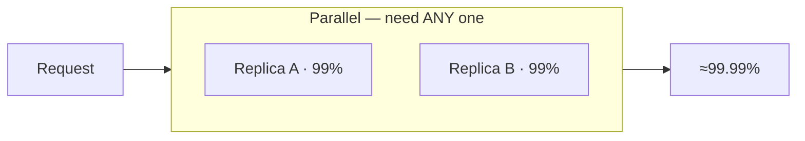
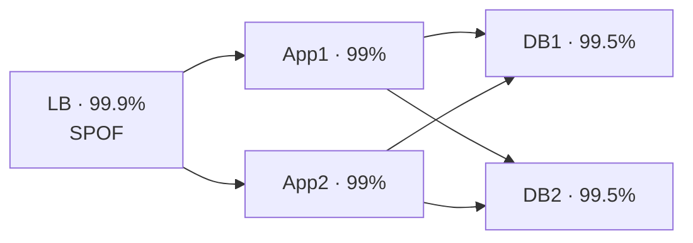

# Risk and Failure Probabilities — Middle

> **What?** Failure probability you can *engineer*. At this level "risk and failure probabilities" means: combining component reliabilities into a system number (series **and** parallel), reasoning with **MTBF/MTTR**, deriving `availability = MTBF / (MTBF + MTTR)`, and choosing deliberately between *reducing failure probability* and *reducing time-to-recover*.
>
> **How?** You compute. Given a topology and per-component numbers, you produce a system availability. You add redundancy and show how it multiplies *unavailability* down. You measure MTBF and MTTR for your services, and you argue — with arithmetic — that cutting MTTR in half is often cheaper and more effective than chasing one more nine of MTBF.

---

## Quick use
1. Draw the request path and calculate series and parallel availability.
2. Measure MTBF and MTTR.
3. Compare reducing failure frequency with reducing recovery time.

**Decision rule:** improve the cheaper lever that most reduces user-visible unavailability.

## 1. Recap: Series Multiplies Down

For components that *all* must work (a series chain), availabilities multiply:

```
A_series = A₁ × A₂ × ... × Aₙ
```

The system is **worse than its worst component**, and more hops always make it worse. This is the default for a request path: load balancer → app → cache → database → downstream API. (See [junior](junior.md) for the worked basics.) Now we attack the other direction.

---

## 2. Parallel Redundancy: Unavailability Multiplies Down

Redundancy works on the *failure* side. Define **unavailability** `U = 1 − A`. For `N` identical, **independent** components in parallel (the system works if *at least one* works):

```
U_parallel = U₁ × U₂ × ... × Uₙ
A_parallel = 1 − U_parallel
```

You multiply the *small* numbers (the failure probabilities), so they shrink fast.

**Worked example — two replicas at 99% each:**

```
U_single   = 1 − 0.99 = 0.01
U_parallel = 0.01 × 0.01 = 0.0001
A_parallel = 1 − 0.0001 = 0.9999   →  99.99%
```

Two 99% replicas give **99.99%** — two nines became four nines. Three replicas:

```
U = 0.01³ = 0.000001  →  A = 99.9999%
```

Each redundant copy (if truly independent) adds roughly *double the nines* of the single component. This is the most powerful lever in reliability — **and** the one most often undermined by correlation (covered in [senior](senior.md)).



> **The asymmetry to remember:** in series you multiply the *availabilities* (close to 1 → erodes slowly but surely). In parallel you multiply the *unavailabilities* (small → collapses fast). Series = "every dependency is a liability." Parallel = "every spare is an insurance policy."

---

## 3. Mixed Topologies

Real systems mix both. Reduce them piecewise — collapse each parallel block into a single equivalent availability, then multiply the blocks in series.

**Example.** A request needs: a load balancer (single, 99.9%) → *one of two* app servers (each 99%) → *one of two* database replicas (each 99.5%).

```
LB block:   A = 0.999
App block:  U = (1−0.99)²  = 0.0001   → A = 0.9999
DB block:   U = (1−0.995)² = 0.000025 → A = 0.999975

A_system = 0.999 × 0.9999 × 0.999975 ≈ 0.99887  →  ~99.89%
```

Notice the single load balancer (99.9%) now **dominates** — the redundant blocks are near-perfect, so the lone component caps the whole system. **Redundancy moves the bottleneck to whatever you left un-redundant.** Find the single points of failure (SPOFs); they set your ceiling.



---

## 4. MTBF and MTTR

The nines hide *two* separate things, and you should track them separately:

- **MTBF — Mean Time Between Failures.** How *often* it breaks. (Sometimes MTTF for non-repairable items; for services MTBF is fine.)
- **MTTR — Mean Time To Repair/Recover.** How *long* it's down once it breaks.

The fundamental identity:

```
availability = MTBF / (MTBF + MTTR)
```

Equivalently, downtime fraction `≈ MTTR / MTBF` when MTBF ≫ MTTR.

**Worked example.** A service fails once every 30 days and takes 1 hour to recover:

```
MTBF = 30 days = 720 h
MTTR = 1 h
A = 720 / (720 + 1) = 0.99861  →  99.86%
```

Same uptime, two different worlds:

| Scenario | MTBF | MTTR | Availability |
|---|---:|---:|---:|
| Rare but slow | 720 h | 4 h | 99.45% |
| Frequent but fast | 24 h | 2 min | 99.86% |

A service that breaks *daily* but recovers in **2 minutes** beats one that breaks *monthly* but limps for **4 hours**. Users feel MTTR.

---

## 5. The Cheapest Lever Is Usually MTTR

Because availability depends on the *ratio* MTBF/MTTR, you can improve it by pushing either term — but they have very different cost curves.

- **Raising MTBF** (failing less) gets exponentially expensive. Each nine of "never break" demands more redundancy, more testing, more hardening. You fight physics and entropy.
- **Lowering MTTR** (recovering faster) is mostly *engineering you control*: faster rollback, better alerting, runbooks, automated failover, smaller blast radius. Halving MTTR roughly halves downtime — directly, cheaply.

This is a core lesson from Google's *Site Reliability Engineering*: invest heavily in **detection and recovery speed**, not just prevention. A 10-minute MTTR organization is more available than a 2-hour MTTR organization with the *same* failure rate — at a fraction of the cost.

```
Want to cut downtime in half? Two paths:
  (a) Double MTBF  — hard, expensive, fights entropy.
  (b) Halve MTTR   — usually cheap: rollback, alerts, automation.
Pick (b) first.
```

This connects directly to **blast radius**: if a failure only takes down 1% of users (because you sharded, or you canary), your *effective* impact — and often your recovery — shrinks. Reducing impact and reducing MTTR are the two underrated dials.

---

## 6. Independence Is the Hidden Assumption

Every formula in §2–§3 quietly assumes the components fail **independently**. The parallel formula `U = U₁ × U₂` is *only* valid if replica A failing tells you nothing about replica B failing.

In reality they often share:

- the same physical rack, AZ, or power feed,
- the same deploy (one bad rollout kills all of them),
- the same upstream dependency (one DNS or config service),
- the same bug, triggered by the same input.

When failures are **correlated**, your beautiful "four nines from two replicas" evaporates. This is *the* reason real systems underperform their paper reliability — and it's important enough that [senior](senior.md) devotes a full treatment to it. For now: **whenever you multiply unavailabilities, ask "what could make both fail at once?"**

---

## 7. A Practical Workflow

When asked "how available is this?", do this:

1. **Draw the topology.** Mark each component series or parallel.
2. **Label availabilities.** Use measured numbers if you have them, estimates if not.
3. **Collapse parallel blocks** with `A = 1 − ∏Uᵢ`.
4. **Multiply the series chain.** That's your system number.
5. **Find the dominating term** (the worst series component or the lone SPOF). That's where the next nine comes from.
6. **Sanity-check independence.** If the parallel components share a failure mode, your number is optimistic — discount it.
7. **Split MTBF vs MTTR.** Decide which lever is cheaper for the target you need.

---

## Where this goes next

- [Senior](senior.md): **correlated failure**, **tail risk / fat tails**, the **union bound**, and FMEA / fault trees.
- [Professional](professional.md): org-level risk registers, reliability budgets, justifying mitigation spend.
- Siblings: [base rates and expected value](../02-base-rates-and-expected-value/), [estimation under uncertainty](../04-estimation-under-uncertainty/), [reasoning under uncertainty](../01-reasoning-under-uncertainty/).
- Related: [evaluating tradeoffs objectively](../../04-critical-thinking/04-evaluating-tradeoffs-objectively/), [systems thinking](../../03-systems-thinking/), the [section root](../), and the [Engineering Thinking overview](../../README.md).

---
## Recall and apply

Try to answer these questions from memory:

1. So why don't two 99% replicas reliably give you 99.99% in production?
2. Derive availability from MTBF and MTTR.
3. A service fails daily but recovers in 2 minutes; another fails monthly but takes 4 hours. Which is more available?
4. A deploy touches 40 services, each 99.5% safe. Chance *some* service regresses?
