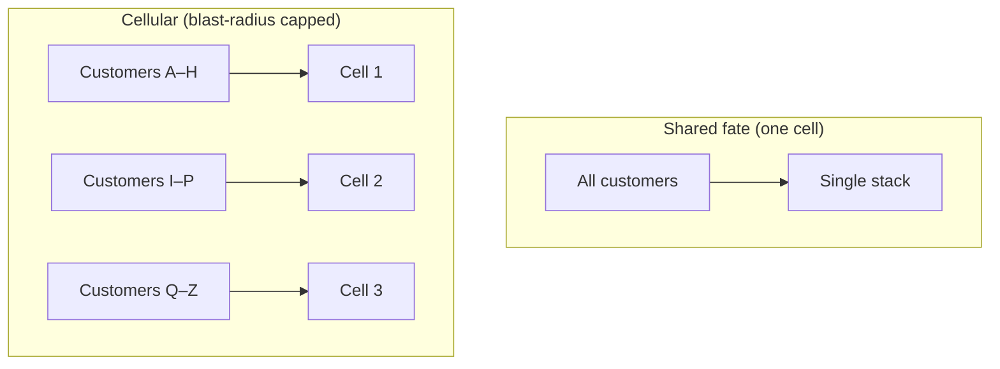

# Risk and Failure Probabilities — Professional

> **What?** At staff/principal level, "risk and failure probabilities" stops being a single calculation and becomes an *organizational discipline*: a risk register that survives turnover, **reliability/error budgets** that turn availability targets into engineering and product policy, architectural decisions made *because of* correlated-failure math, and a defensible answer to "is this expensive mitigation worth it, or is it theater?"
>
> **How?** You set availability targets from user impact and tie them to error budgets that gate releases. You quantify org risk in money and run FMEA / threat modeling as a led process, not a checkbox. You make correlated-failure the explicit reason behind multi-AZ / cellular / staged-rollout architecture. And you justify (or reject) mitigation spend with expected-value and tail-risk arguments that a VP and a finance partner both accept.

---

## Quick use
1. Maintain a risk register with probability, impact, owner, and residual risk.
2. Set error budgets from user impact and use them to guide releases.
3. Fund mitigations with correlated-failure and tail-risk evidence.

**Decision rule:** an unowned accepted risk is not managed risk.

## 1. From Component Math to Org Risk

A single service's availability is arithmetic. *Organizational* risk is a portfolio: dozens of services, shared platforms, vendors, and humans, each with failure modes, interacting. The staff engineer's job is to make that portfolio **legible and prioritized**.

The central artifact is the **risk register**: a living list where each risk carries probability, impact (ideally in money or user-minutes), owner, current mitigation, and residual risk. It exists to:

- force *numbers* onto fears so they can be ranked against each other and against feature work,
- assign **ownership** (an un-owned risk is an un-managed risk),
- record the *residual* risk you've consciously accepted (so it's a decision, not an accident),
- survive re-orgs — institutional memory of "why we built it this way."

| Risk | P(/yr) | Impact | Exp. loss/yr | Owner | Mitigation | Residual |
|---|---:|---:|---:|---|---|---|
| Region-wide outage | 0.3 | $4M | $1.2M | Platform | Multi-region failover (in progress) | Medium |
| Bad config to all nodes | 1.5 | $300k | $450k | Release Eng | Staged config rollout + validation | Low |
| Key vendor (payments) down | 2 | $200k | $400k | Payments | Secondary provider failover | Low |
| Loss of primary DB (no PITR test) | 0.1 | $20M | $2M | Data | Tested PITR + backup drills | **High → act** |

The register turns "what keeps you up at night" into a *sorted, budgeted* list. The last row — high expected-loss, untested recovery — is where leadership attention goes, regardless of how *frequent* it is. (This is tail-risk allocation from [senior](senior.md), institutionalized.)

---

## 2. Error Budgets: Reliability as a Policy Lever

Google's SRE practice gives the cleanest mechanism for *operationalizing* an availability target: the **error budget**.

```
error_budget = 1 − SLO
```

If the SLO is 99.9% over a 28-day window, the budget is **0.1% ≈ 40 minutes** of allowed unreliability. The budget is a *currency*:

- **Budget remaining →** ship fast, take risks, launch features.
- **Budget exhausted →** freeze risky changes, redirect to reliability until it recovers.

This reframes reliability from an argument into a **rule both product and engineering agreed to in advance.** It dissolves the eternal "ship vs. stability" fight: the data decides. It also enforces the key insight from this whole topic — *don't over-invest in nines you don't need*. If you're consistently *under*-spending the budget, you're too conservative; loosen up and ship.

### Choosing the SLO

The target comes from **user impact**, not vanity:

- What unavailability do users actually notice and react to?
- What does the dependency *above* you require (a 99.99% product can't sit on a 99.9% you)?
- What's the marginal cost of the next nine vs. its marginal value?

Most internal services are over-targeted. Setting a *lower* SLO that matches reality is a legitimate, money-saving staff decision.

---

## 3. Correlated-Failure-Driven Architecture

The single most consequential reliability decisions a principal makes are about **failure domains** — and they're driven by the correlation math in [senior](senior.md): redundancy only buys nines if copies fail *independently*, and `p_cc` (common-cause) is a floor redundancy can't cross.

That math directly justifies architecture spend:

- **Multi-AZ / multi-region.** Spreads the `p_cc` of "one location dies." The cost (cross-AZ latency, data replication, double infra) is justified *only by the size of the correlated-failure term* you're buying down. Quantify it: if a region outage is `0.3/yr × $4M`, a $300k/yr multi-region program clears the bar; if your region outage risk is `0.02/yr × $100k`, it's theater.
- **Cellular / shuffle-sharded architecture.** Caps *blast radius* — a failure hits one cell, not all customers. This attacks the *impact* dial, which (per the base rate that most outages are change-induced and the impossibility of zeroing `p_cc`) is usually the better marginal spend.
- **Staged rollout & static stability.** Directly attacks the dominant base-rate cause: change. Canary → wave → fleet, with bake time and automated rollback, converts "one bad deploy kills everything (a `p_cc` event)" into "one bad deploy kills one wave."



**The framing leadership accepts:** "We are not buying lower failure probability — past the first redundancy that's a losing fight against the common-cause floor. We are buying *smaller blast radius* and *faster recovery*, which give more felt availability per dollar."

---

## 4. Leading FMEA and Threat Modeling

At scale, FMEA and threat modeling are *facilitation*, not paperwork. A principal runs them to surface the risks individuals can't see alone:

1. **Scope a failure domain** (a service, a release process, a data flow).
2. **Enumerate failure modes** with the people who operate it — solicit the boring and the catastrophic.
3. **Score** (RPN = Severity × Occurrence × Detection for reliability; STRIDE / DREAD for security). The *Detection* axis is gold: high-severity, hard-to-detect, correlated modes are the silent killers.
4. **Convert top items into register entries** with owners and dates.
5. **Re-run after incidents and major changes** — the register is a living document.

The output isn't the spreadsheet; it's a *shared mental model* of how the system fails and an *agreed, owned* mitigation backlog. Tie it to postmortems: most real failure modes are discovered the hard way, and the loop FMEA → incident → register → architecture is how an org compounds reliability knowledge.

---

## 5. Justifying Mitigation Spend (vs. Theater)

The hardest staff skill: deciding when a low-probability/high-impact risk *justifies* expensive mitigation — and when the mitigation is **theater** (effort that *feels* like risk reduction but doesn't move the number).

A defensible framework:

```
Mitigate when:   cost_of_mitigation  <  Δ(expected_loss)  +  tail_premium
```

- **Δ(expected_loss)** = `(p_before − p_after) × impact` *plus* `p × (impact_before − impact_after)` if you're shrinking blast radius. Spend up to that, in pure EV terms.
- **tail_premium** — for *fat-tailed, ruin-class* risks (data loss, security breach, regulatory, anything company-ending), you rationally pay **above** EV. A 0.1% chance of an unrecoverable outcome warrants spend that naive expected value would reject, because you can't average your way out of ruin. This is the legitimate core of "insurance."

**It's theater when:**

- it doesn't change `p`, impact, *or* MTTR (a dashboard nobody watches; a runbook never drilled; a backup never test-restored);
- it mitigates a risk far down the sorted register while top risks go unfunded;
- it's bought to *look* diligent (compliance ✓) rather than to survive the failure;
- the mitigation adds *its own* failure mode bigger than the one it removes (complexity is a risk too).

**It's justified when:**

- it measurably shrinks `p`, blast radius, or MTTR, *and*
- it targets a top-of-register or ruin-class risk, *and*
- it's *tested* (the backup is restored, the failover is drilled, the rollback is exercised in game days). An untested mitigation is theater wearing a hi-vis vest.

> **Principal's test:** "If this exact failure happens tomorrow, does this spend change the outcome — and have we *proven* it does?" If you can't answer yes with evidence, it's theater.

---

## 6. Communicating Risk Upward

Numbers persuade leadership; fear doesn't. Translate every risk into the units the audience feels:

- **Money / user-minutes,** not "nines." "We risk ~$2M/yr from untested DB recovery" beats "our RPO is undefined."
- **Expected loss *and* tail.** Give both the average cost *and* the worst-case, because fat-tailed risks are invisible in the average.
- **A sorted list,** so trade-offs are explicit: "funding A means accepting B" — which connects directly to [evaluating tradeoffs objectively](../../04-critical-thinking/04-evaluating-tradeoffs-objectively/).
- **The residual you're accepting.** Make conscious risk acceptance a recorded leadership decision, not a silent default.

---

## 7. Principal Heuristics

1. **Maintain a sorted, owned, money-denominated risk register.** Un-owned risk is unmanaged.
2. **Run reliability via error budgets,** not vibes — and don't over-target nines users don't feel.
3. **Justify failure-domain architecture by the correlated-failure term it buys down,** quantified.
4. **Spend on blast radius and MTTR first** — the probability fight hits the `p_cc` floor.
5. **Pay above EV only for ruin-class, fat-tailed risks;** demand pure-EV justification for the rest.
6. **Test every mitigation,** or it's theater. Game days, restore drills, failover exercises.
7. **Report risk in money and tails,** sorted, with residual explicitly accepted.

---

## Where this goes next

- Apply it: [check your understanding](#check-your-understanding) and [check your understanding](#check-your-understanding).
- Siblings: [reasoning under uncertainty](../01-reasoning-under-uncertainty/), [base rates and expected value](../02-base-rates-and-expected-value/), [estimation under uncertainty](../04-estimation-under-uncertainty/).
- Related: [systems thinking](../../03-systems-thinking/), [evaluating tradeoffs objectively](../../04-critical-thinking/04-evaluating-tradeoffs-objectively/), the [section root](../), and the [Engineering Thinking overview](../../README.md).

---
## Recall and apply

Try to answer these questions from memory:

1. FMEA vs. fault tree — what does each give you?
2. You have one redundant pair already. Spend the next dollar on a third replica or on faster rollback?
3. When does a low-probability/high-impact risk justify expensive mitigation, and when is it theater?
4. SLO is 99.9% over 28 days. What's the error budget, and what's it for?
