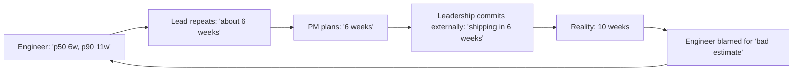

# Estimation Under Uncertainty — Professional

> **What?** At staff/principal level, estimation under uncertainty becomes *organizational governance*: building the systems, norms, and incentives that let an engineering org make good time-and-capacity bets at portfolio scale — turning individual gut feels into calibrated, auditable forecasts, and protecting those forecasts from the political forces that compress every range to its optimistic floor.
>
> **How?** You design how estimates flow into planning (commit p90, plan p50, fund the gap), instrument estimate-vs-actual across teams to detect systematic bias, run portfolio-level Monte Carlo for roadmap commitments, build reference-class libraries as shared infrastructure, and — most of all — change the *culture* so that "I don't know yet, here's the range and the cost to narrow it" is a sign of seniority, not weakness.

---

## Quick use
1. Preserve percentiles from estimate through portfolio commitment.
2. Measure estimate versus actual and tune reference classes.
3. Plan capacity and roadmap risk with portfolio-level distributions.

**Decision rule:** committing the p50 as a date is a policy choice, not an estimate.

## 1. The org-level failure mode: estimates as commitments

In most organizations the estimation pipeline is quietly broken in the same way:



Every arrow strips uncertainty until a *distribution* has become a *deadline* — and then the optimistic tail, chosen by no one, is what the company committed to externally. The engineer who gave an honest range gets blamed for a number they never said. This is not a people problem; it's a **systems problem**, and fixing it is principal-level work. Your job is to redesign the pipeline so uncertainty *survives* to the point of commitment.

### The three governance rules

1. **Commit the p90, plan the p50, fund the gap.** External commitments use p90. Internal capacity planning uses p50. The difference between them is explicitly *budgeted slack*, owned and visible — not a fudge factor hidden in someone's head.
2. **An estimate without stated assumptions is not accepted into the plan.** Assumptions are the contract; when they break, the estimate is *re-opened*, not "missed."
3. **Estimates are re-forecast at phase boundaries.** A kickoff estimate is the *widest* it will ever be (the Cone of Uncertainty); planning that treats it as final is malpractice.

---

## 2. Killing "just give me one number"

The single most damaging sentence in estimation culture is *"just give me one number."* It sounds reasonable and it is corrosive: it forces a forecaster to either lie (false precision) or pick the number the room wants (the floor). Principal engineers replace it with a better default.

| When leadership says... | Reframe the org onto... |
|---|---|
| "Just give me one number." | "Here's the number to commit (p90) and the number to plan against (p50)." |
| "Why can't engineering estimate?" | "We estimate ranges; single numbers are the part nobody can honestly give." |
| "The range is too wide to plan." | "The width is information — it tells us to spend $X reducing it before we commit." |
| "Last time you were wrong." | "We were inside our range 88% of the time last quarter; here's the ledger." |

The cultural win is when leadership starts *asking for the range*, because they've learned that a single number from engineering is the least reliable artifact in the building. You get there by **always pairing the number with its uncertainty, every time, until it's the norm** — and by having the data (calibration ledger) to win the argument when it's challenged.

> Hofstadter's Law (*"it always takes longer than you expect, even accounting for Hofstadter's Law"*) is, at org scale, an argument *against* central padding. A VP who adds a flat 30% buffer to every team's number is just re-introducing optimism one level up. The cure is calibrated p90s sourced from actuals, not a heroic fudge factor.

---

## 3. Calibration as portfolio infrastructure

Individual calibration (senior level) becomes a measured org capability. You instrument it.

### The org calibration dashboard

For every committed estimate, log: `team`, `class`, `p50`, `p90`, `actual`. Then compute, per team and rolled up:

| Metric | What it reveals | Healthy |
|---|---|---|
| **p90 hit rate** | Are 90% intervals actually 90%? | 85–95% |
| **Median bias (actual / p50)** | Systematic optimism/pessimism | ~1.0 |
| **Interval width trend** | Is the cone narrowing with maturity? | ↓ over time at fixed class |
| **Tail blow-up rate** | How often do disasters (>p90) hit | low + understood |

A team whose p90 hit rate is 60% is structurally overconfident — every roadmap built on their numbers is mis-priced. The intervention is not "estimate better," it's "widen intervals to your measured error and re-baseline." Hubbard's core finding (*How to Measure Anything*) generalizes here: calibration is **trainable and measurable**, so treat it as a capability you can invest in, not a personality trait.

> Beware **Goodhart's Law**: the moment estimate accuracy becomes a performance metric, engineers learn to sandbag (inflate to always hit). Measure calibration to *improve forecasting*, never to *grade individuals*. Coupling calibration to performance reviews destroys the honesty you're trying to build. Keep the ledger blameless.

---

## 4. Portfolio-level estimation

A roadmap is a *portfolio* of estimates, and portfolios behave differently from single tasks — diversification cuts both ways.

### Aggregate Monte Carlo for a quarter

You don't commit each project's p90 and sum them — that massively over-pads the portfolio (everything going wrong at once is vanishingly unlikely). Instead, simulate the *portfolio*:

```python
import random

# per-project (o, m, p) in weeks, plus discrete risk (prob, extra_weeks)
projects = [
    {"tri": (4, 6, 11),  "risk": (0.15, 6)},   # vendor dependency
    {"tri": (2, 3, 5),   "risk": (0.05, 4)},
    {"tri": (6, 9, 16),  "risk": (0.20, 8)},   # research-y, fat tail
]
CAPACITY = 30  # team-weeks available this quarter

def project_cost(p):
    base = random.triangular(p["tri"][0], p["tri"][2], p["tri"][1])
    pr, extra = p["risk"]
    return base + (extra if random.random() < pr else 0)

overruns = 0
for _ in range(100_000):
    total = sum(project_cost(p) for p in projects)
    if total > CAPACITY:
        overruns += 1
print(f"P(quarter overruns capacity) = {overruns/100_000:.0%}")
# e.g. 38%  → too aggressive; cut scope or accept a 38% slip risk knowingly
```

This converts roadmap planning from "does it feel doable?" into **"the plan as scoped has a 38% chance of overrunning the quarter — is that the risk appetite we want?"** Leadership can then make an informed call: cut a project, descope, or knowingly accept the slip probability. That is governance — surfacing the *probability of the plan*, not asserting the plan will happen.

The same machinery prices **commitment risk** for external dates, linking estimation directly to [risk and failure probabilities](../03-risk-and-failure-probabilities/): a committed date is a bet, and you can compute the odds.

---

## 5. Reference-class libraries as shared infrastructure

The outside view scales only if the reference classes are *institutional assets*, not tribal memory in one tech lead's head.

- **Capture actuals automatically.** Wire the tracker so every epic's estimate and actual are recorded without manual effort — manual logging decays the moment it's optional.
- **Define stable classes** the org agrees on (e.g., "new service from scratch," "integrate external vendor API," "schema migration on a hot table") with distributions attached.
- **Make the class the default anchor.** Planning templates should pre-fill "this class historically runs p50 X / p90 Y." Estimators *adjust from* the class rather than inventing from zero.
- **Review drift quarterly.** When a class's actuals shift (new tooling made migrations faster), update the library. Stale reference classes mis-anchor everyone.

Flyvbjerg's reference-class forecasting works at the org level precisely because it removes the individual's optimism from the loop and replaces it with the institution's measured history. The principal engineer's contribution is making that history *cheap to use* — the path of least resistance should be the calibrated path.

---

## 6. Defending ranges to leadership

At this level you are the last line of defense for the distribution before it becomes an external promise.

| Failure to avoid | Principal move |
|---|---|
| Range collapses to floor in the boardroom | Present p90 *as the commit* in the deck; p50 is labeled "stretch goal, do not promise externally" |
| Leadership adds its own hidden buffer | Make the slack *explicit and owned* so it isn't double-counted or quietly removed |
| "Engineering is sandbagging" | Show the calibration ledger: "our p90s hit 90%, our p50s hit 50% — these are honest, measured intervals" |
| Date is non-negotiable (contract) | Flip to **scope as the free variable**: "here's the scope that hits that date at p90" |
| One bad quarter weaponized | Distributions are *supposed* to be exceeded 10% of the time at p90 — that's not failure, that's calibration working |

The deepest skill is teaching leadership to read a distribution as *information that makes them money*: knowing the p10/p50/p90 lets them decide how much slack to buy, when to hedge, when to descope — decisions they cannot make from a single fake-precise number. When you've done your job, "give me the range and the cost to narrow it" becomes how the org thinks.

---

## 7. Where this sits

- The individual mechanics underneath: [senior](senior.md). Drills: [check your understanding](#check-your-understanding) · [check your understanding](#check-your-understanding).
- Estimation is one face of probabilistic thinking: [reasoning under uncertainty](../01-reasoning-under-uncertainty/) · [base rates & expected value](../02-base-rates-and-expected-value/) · [risk & failure probabilities](../03-risk-and-failure-probabilities/).
- The optimism this fights is a bias: [cognitive biases in code decisions](../../04-critical-thinking/03-cognitive-biases-in-code-decisions/). The decompose-and-multiply core is [first-principles reasoning](../../05-first-principles-thinking/01-reasoning-from-fundamentals/).
- Section: [probabilistic thinking](../) · Up: [engineering thinking roadmap](../../README.md).

### Takeaways

1. The org pipeline strips uncertainty until a distribution becomes a deadline — **redesign it so the p90 survives to commitment**.
2. **Commit p90, plan p50, fund the gap as explicit owned slack** — never a hidden fudge factor.
3. Measure **calibration across teams** as blameless infrastructure (beware Goodhart — never grade individuals on it).
4. Run **portfolio Monte Carlo** to surface "probability the roadmap overruns," and let leadership choose the risk knowingly.
5. Make **reference-class actuals shared, automatic infrastructure** so the calibrated path is the easy path.
6. Defend the distribution by **trading scope, showing the ledger, and making slack explicit** — kill "just give me one number" with a better default.

---
## Recall and apply

Try to answer these questions from memory:

1. How do you communicate an estimate so stakeholders don't hear only the optimistic end?
2. When you finish a task, what should you record, and why?
3. Estimate how much RAM you'd need to cache 100 million user sessions, each ~2 KB. (Worked Fermi)
4. Your estimate was "wrong" — actual came in above your p90. Were you a bad estimator?
