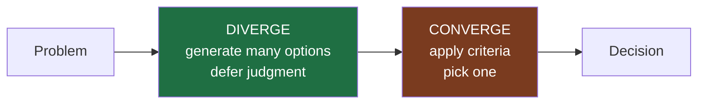

# Divergent vs Convergent — Junior

> **What?** Two opposite mental gears: *divergent* thinking opens up and produces many options; *convergent* thinking narrows down and picks one. They are both necessary, but they fight each other when you run them at the same time.
> **How?** When you face a problem, first generate several approaches *without* judging any of them, then switch deliberately into evaluation mode and choose. Notice when you've grabbed the first idea that worked and skipped the "generate" step entirely.

---

## 1. The two modes

Every non-trivial engineering decision passes through two distinct activities:

| Mode | Goal | Mindset | Sounds like |
|------|------|---------|-------------|
| **Divergent** | Generate many options | "What else? Quantity. Defer judgment." | "We could cache it. Or precompute it. Or denormalize. Or page the user. Or..." |
| **Convergent** | Choose one option | "Which is best? Evaluate. Decide." | "Given our read/write ratio, caching wins because..." |

Divergence is *expansive*: you widen the field of possibilities. Convergence is *reductive*: you collapse the field to a single decision. A complete piece of problem-solving needs both. Generate without choosing and you never ship; choose without generating and you ship the first thing that came to mind.

The skill is not "be more creative" or "be more decisive." The skill is **knowing which mode you are in and not mixing them.**

## 2. Why mixing them kills your work

The most common junior mistake is converging instantly — you think of one solution, it seems to work, and you start typing. The second most common is the opposite: you brainstorm so many options you never commit.

### Judging while generating

The moment you evaluate an idea ("that's too slow," "that won't pass review"), your brain stops producing new ideas. Criticism and generation use opposite stances. If you critique each idea as it appears, you'll have three timid options instead of fifteen wild ones — and the good idea was often #11, the one you never reached because you killed the flow at #3.

```text
Mixed (bad):
  idea 1 → "nah, too slow" → idea 2 → "won't scale" → idea 3 → "fine, ship it"
  Result: 3 ideas, settled on a mediocre one out of fatigue.

Separated (good):
  DIVERGE:  idea 1, 2, 3, 4, 5, 6, 7, 8 (no judgment, just list)
  CONVERGE: score them against criteria → pick #6
  Result: 8 ideas, picked the genuinely best.
```

### Generating forever (analysis paralysis)

The opposite failure: you keep adding options, comparing endlessly, and never decide. At some point more options stop helping and start costing you. Convergence has to actually *happen* — and on a schedule.

## 3. A concrete example: the slow endpoint

Your `/dashboard` endpoint takes 1.8s. A junior thinks "add an index" and does it. Done in five minutes — but the index didn't help much, because the real cost was N+1 queries.

A divergent pass first looks like this. Spend five minutes listing *causes*, judging none:

- Missing DB index
- N+1 query loop
- No HTTP caching
- Serializing fields nobody uses
- Synchronous call to a slow downstream service
- No pagination — returning 5,000 rows
- Cold connection pool

Now converge: cheaply check which actually applies. The query log shows 312 queries per request → it's N+1. You fixed the *real* problem because you generated the option, instead of grabbing the first plausible one.

> The point isn't that brainstorming is always worth five minutes. It's that the first idea that comes to mind is rarely the best one, and you can't know that until you've forced out a few more.

## 4. Switching modes on purpose

Say the mode out loud, even to yourself:

- "I'm **listing options** right now — no judging yet." (divergent)
- "Okay, I have seven. **Now I'm choosing.**" (convergent)

A tiny ritual that separates the phases prevents the silent slide into "first idea wins."



## 5. Tiny techniques you can use today

**Set a quantity target.** "Give me five ways to do this" beats "give me a good way." A number forces you past the obvious first answer. The fourth and fifth options are where the interesting ideas live.

**Worst-possible-idea.** Stuck and self-censoring? Deliberately list *terrible* solutions. "We could email the data as a CSV attachment on every request." It loosens you up, and sometimes the inverse of a bad idea is a good one.

**Decide the criteria before you look at the options.** Before comparing, write down what "best" means here: latency? simplicity? time-to-ship? Picking criteria *after* you see the options lets you rationalize whatever you already wanted. (You'll go deep on this in [evaluating trade-offs](../../04-critical-thinking/04-evaluating-tradeoffs-objectively/).)

## 6. Divergent thinking in debugging

Debugging is mostly divergent thinking under pressure. A bug appears and the rookie move is to latch onto one hypothesis ("must be the cache") and tunnel on it for an hour.

Better: list hypotheses first.

```text
Bug: users randomly logged out.

DIVERGE (hypotheses, no judging):
  - token expiry too short
  - clock skew between servers
  - session store evicting under memory pressure
  - load balancer not sticky, sessions on one node only
  - a deploy rotated the signing secret
  - race condition on token refresh

CONVERGE (cheapest discriminating test first):
  - "random" + multi-node → check stickiness / shared store
```

Five hypotheses cost two minutes to write and save you from an hour down the wrong hole.

## 7. Common mistakes at this level

| Mistake | Fix |
|---------|-----|
| Implementing the first idea that compiles | Force out 3-5 options before choosing |
| Critiquing each idea as you think of it | Separate "list" from "judge" — two passes |
| Comparing options without criteria | Write the criteria first |
| Never deciding (over-comparing) | Timebox the convergence; pick and move |
| One debugging hypothesis at a time | List hypotheses, then test the cheapest |

## 8. Where this goes next

These two modes are the foundation of all the creative-thinking techniques in this section. The siblings give you specific tools to push divergence further: [inversion](../02-inversion-thinking/) (think backward), [analogical thinking](../03-analogical-thinking/) (borrow from other domains), and [constraint-driven creativity](../04-constraint-driven-creativity/) (use limits to spark ideas). See the [section overview](../) for how they connect, and the broader [problem-solving](../../02-problem-solving/) material for the surrounding workflow.

**Takeaway:** Generate first, judge second, and never at the same time. The first idea is a starting point, not an answer.

---
## Use it today

1. Write at least five options or hypotheses before evaluating any.
2. Name the switch: **generate now; choose next**.
3. Pick using written criteria and a short timebox.

## Recall and apply

Use these prompts to check your understanding and choose one action to try in your next task.

Try to answer these questions from memory:

1. What's the difference between divergent and convergent thinking?
2. Why is it a problem to do both at once?
3. Walk me through the Double Diamond.
