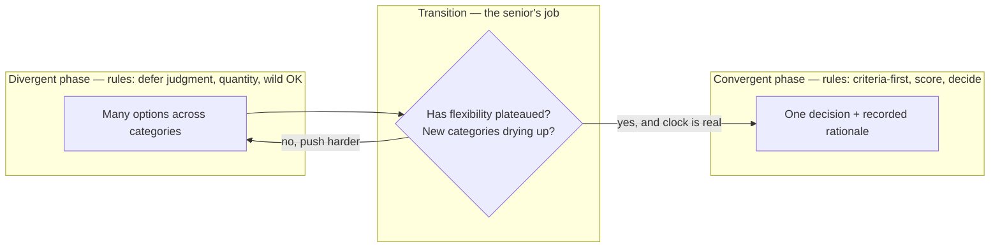

# Divergent vs Convergent — Senior

> **What?** At the senior level, divergent/convergent thinking is a *phase-control discipline*: you treat "generate" and "decide" as separate, scheduled activities with different rules, different participants' behavior, and different success measures — and you actively manage the transition between them rather than letting the group drift across it.
> **How?** You run design exploration as explicit diverge/converge cycles, protect the divergent phase from premature evaluation (yours and others'), build the convergence criteria *before* the options exist, and read your own and the team's pull toward early closure as a signal to push the design space open a little longer — without losing the thread to shipping.

---

## 1. The real skill is transition control

Anyone can be told "brainstorm, then decide." The senior skill is managing the **moment the modes switch** — because that's where the value leaks.

Two failure modes bracket every design discussion:

- **Premature convergence.** The group latches onto the first credible design (usually proposed by the most senior or loudest person) and spends the rest of the meeting *elaborating* it rather than *comparing alternatives to* it. The anchor wins by default. Studies of group ideation consistently find that early-anchored groups produce fewer and less varied ideas — the anchor becomes the reference everyone adjusts from.
- **Failure to converge.** The opposite: a design space that stays open past its usefulness. More options stop adding information and start adding cost — and worse, the *decision deadline* slips silently, which is itself a decision (to do nothing) made without owning it.

Your job is to keep the field genuinely open while it's still producing new *categories* of ideas, then close it cleanly and on time. Both halves require active work; neither happens on its own.



## 2. Diverging on the problem, not the solution

The cheapest leverage a senior has is the *first* diamond of the [Double Diamond](../) — divergence on the problem itself. Juniors and mid-levels mostly diverge on solutions. Seniors notice when the problem statement is itself a premature convergence.

> A ticket reads "add a Redis cache to the profile service." That's already a solution masquerading as a problem. The real problem might be "p99 on `/profile` is 900ms and the SLO is 200ms." Once restated, caching is *one option* alongside fixing the N+1, adding a covering index, denormalizing the hot fields, or moving the slow downstream call off the critical path.

Reframing techniques that force problem-divergence:

- **"What problem does this solve?" laddering.** Ask it three times. Each level up opens a wider solution space. ("Cache the profile" → "make `/profile` fast" → "make the dashboard feel instant" → maybe the answer is optimistic UI, not caching at all.)
- **Inversion.** "What would guarantee we *fail* to meet the SLO?" — see [inversion thinking](../02-inversion-thinking/). It surfaces failure modes you'd otherwise discover in production.
- **Constraint variation.** "If we had to halve the data, not speed up the query, how would we do it?" Connects to [constraint-driven creativity](../04-constraint-driven-creativity/).

## 3. Protecting the divergent phase

Divergence is fragile. A single "that won't work because…" early in the phase teaches everyone present that ideas will be judged on arrival, and the room goes quiet — especially the juniors, whose half-formed ideas are exactly the ones you want.

### Separate-and-name
State the mode explicitly: "We're in generate mode for the next ten minutes — capture everything, evaluate nothing." Then, visibly: "Okay, switching to evaluate mode." Naming the phase gives you a clean place to interrupt premature evaluation ("hold that critique — we're still generating") without it feeling personal.

### Write-before-speak (anti-anchoring)
For high-stakes designs, have people write their options *silently* before any discussion (a "brainwriting" pass). This is the single most effective anti-anchoring move: it captures the divergence before the first speaker's idea collapses everyone else's. Nominal-group technique research shows individuals writing independently out-produce the same people brainstorming aloud, precisely because verbal brainstorming serializes and anchors.

### Quantity and flexibility quotas
Set a number ("eight distinct approaches"), and explicitly require *category* spread, not restyling. Track Guilford's **flexibility** — count categories, not items. "Redis / Memcached / in-process LRU" is one category (caching); flag it and ask for a non-caching approach.

### Psychological safety as a divergence prerequisite
Group divergence is a direct function of psychological safety. In a team where a bad idea draws a smirk, people only voice safe, conventional ideas — you get fluency without originality. The senior sets the tone: voice a deliberately rough or wrong idea yourself early, react to others' wild ideas with "interesting, what if we pushed that further" rather than critique. You are protecting the *originality* axis, which dies first under judgment.

## 4. Engineering convergence honestly

The hard part of convergence isn't picking — it's picking *without self-deception*. The mind reaches a preferred option fast and then recruits reasons. Counter it structurally.

### Criteria before options, weighted
Write the decision criteria and rough weights *before* the options are on the table. Tie this directly to [evaluating trade-offs objectively](../../04-critical-thinking/04-evaluating-tradeoffs-objectively/): the criteria are the trade-off axes, the weights are the context. If you find yourself wanting to adjust the weights *after* seeing which option they favor, that's the rationalization reflex — note it and resist.

```text
Decision: storage engine for the new event log

Criteria fixed FIRST (before listing engines):
  write throughput @ 50k/s   weight 5
  operational familiarity      weight 4
  query flexibility            weight 2
  cost at 10TB                 weight 3

Then score each candidate. The winner can lose on a criterion
you personally care about — that's the criteria doing their job.
```

### Cheap discriminating tests
You don't always need full analysis. Often one cheap experiment collapses the space: a quick load test, a 30-line spike, reading one downstream service's rate limit. Converge by *eliminating* (which options are now impossible?) before *selecting* (which of the survivors is best?). Elimination is cheaper and less anchored than ranking.

### Owning the deadline
Convergence has a cost-of-delay. Make the decision deadline explicit and treat "good enough, decided today" as often superior to "optimal, decided in two weeks." A reversible decision deserves fast convergence (decide, ship, watch); an irreversible one earns more divergence. Calibrate the phase budget to reversibility.

## 5. Divergent thinking in the senior's daily work

### Debugging
Senior debugging is structured divergence under pressure. The discipline: **generate the hypothesis set before testing any of it**, then test in order of (information gained ÷ cost). The junior tunnels on one hypothesis; the senior lists six, picks the cheapest *discriminating* test, and bisects the hypothesis space — not the code line by line.

```text
Symptom: 0.3% of checkout writes silently lost, only at peak.

DIVERGE (hypotheses, no commitment):
  retry dedup dropping a real write · queue at-most-once under load ·
  DB deadlock rollback swallowed · idempotency key collision ·
  connection-pool exhaustion timing out mid-tx · LB dropping slow requests

CONVERGE (most discriminating cheap test first):
  "only at peak" + "silent" → check tx-rollback + pool-exhaustion logs
  one query splits the space in half.
```

### Code review
Good review is divergent before convergent. Diverge: "what are all the ways this could break?" — concurrency, nil/empty inputs, partial failure, the unhappy path, future maintainer confusion. *Then* converge: which of these matter enough to block on, versus a non-blocking note. Reviewers who converge immediately ("looks fine / change this line") miss the failure modes that come from holding the design space open for a moment.

### Architecture and ADRs
When you write an ADR, the "alternatives considered" section *is* the divergent phase, made durable. An ADR with one alternative ("do nothing") is a record of premature convergence. A good one shows the real categories you generated and the criteria that eliminated each — so a future reader can re-open the decision if the criteria change.

## 6. Reading your own pull toward closure

Self-awareness is the senior's edge. Specific tells that you've converged too early:

- You're *defending* an option instead of comparing it. (You converged; now you're rationalizing.)
- New ideas in the room feel *annoying* rather than interesting. (You've mentally closed.)
- You skipped the problem diamond entirely and went straight to "how."
- Everyone agreed quickly. (Easy consensus on a non-trivial design usually means low divergence, not a great idea.)

And the opposite tells — that you should *force convergence now*:

- The last three ideas were restyles of earlier ones (flexibility plateaued).
- The decision deadline is closer than the remaining analysis would take.
- You're comparing options on criteria nobody actually cares about.

## 7. Pitfalls

| Pitfall | Why it happens | Counter |
|---------|----------------|---------|
| Anchoring on the senior's first idea | Authority + serialized speaking | Brainwriting; speak last |
| "Divergence" that's all one category | Comfort with the familiar approach | Track flexibility; require non-X options |
| Criteria adjusted after seeing options | Rationalization reflex | Lock criteria before options; flag re-weighting |
| Open design space, slipping deadline | Divergence feels productive | Own the deadline; calibrate to reversibility |
| Reviewing/debugging by converging instantly | Pattern-match feels efficient | Generate the full set first, then prune |

## 8. Where this sits

This phase discipline underlies the whole [creative & lateral thinking section](../): [inversion](../02-inversion-thinking/) and [analogical thinking](../03-analogical-thinking/) are divergence amplifiers, [constraint-driven creativity](../04-constraint-driven-creativity/) turns limits into divergence fuel, and the convergent half hands directly to [evaluating trade-offs objectively](../../04-critical-thinking/04-evaluating-tradeoffs-objectively/). The surrounding workflow lives in [problem-solving](../../02-problem-solving/); the [roadmap root](../../README.md) frames where all of this fits.

**Takeaway:** Seniority is mostly transition control — holding the design space open across genuine categories while it still pays, protecting that openness from premature judgment, then converging on pre-fixed criteria, on time, calibrated to how reversible the decision is.

---
## Use it today

1. Start a high-stakes review with silent option writing.
2. Keep generating until new categories stop appearing.
3. **Decision rule:** spend more time exploring only when the decision is costly to reverse.

## Recall and apply

Try to answer these questions from memory:

1. How does this show up in debugging?
2. How does it apply to code review?
3. What is SCAMPER and when would you reach for it?
4. How is this related to lateral thinking?
