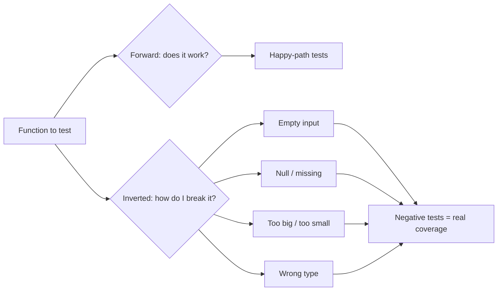

# Inversion Thinking — Junior

> **What?** Inversion thinking is solving a problem by turning it around: instead of asking "how do I make this work?", you ask "how would I make this fail?" — then you prevent each of those failures.
>
> **How?** When you're stuck or about to call something "done", list the ways it could break, go wrong, or be wrong. Fix or guard against the items on that list. The opposite question is often easier to answer than the original one.

---

## 1. The core move: ask the opposite question

The 19th-century mathematician **Carl Jacobi** was known for a piece of advice he gave to students stuck on hard problems: *"Invert, always invert"* (*man muss immer umkehren*). When you can't see how to reach a goal directly, flip it. Ask what the *opposite* of success looks like, work that out, and then steer away from it.

Two questions describe the same problem:

| Forward question | Inverted question |
|---|---|
| How do I make this function correct? | What inputs would make this function wrong? |
| How do I make the login secure? | How would I break into this login? |
| How do I make this test pass? | What case is this test *not* covering? |
| How do I make the deploy succeed? | What would make this deploy fail in production? |

The trick is that the inverted question is usually **more concrete**. "Make it correct" is vague — there are infinitely many ways to be correct. "What breaks it?" points you at specific inputs: empty string, negative number, `null`, a list of a million items, two users at once.

## 2. A worked example: the failure list

Suppose you've written a function that divides two numbers and you want it to be robust.

Forward thinking gives you the happy path:

```python
def divide(a, b):
    return a / b
```

Now **invert**. Ask: *"How would I guarantee this function blows up or returns garbage?"* Write the list:

1. Pass `b = 0` → crash (`ZeroDivisionError`).
2. Pass strings instead of numbers → crash or weird result.
3. Pass `None` → crash.
4. Pass two huge numbers → fine in Python, but overflow in other languages.
5. Expect an exact result for `0.1 / 0.3` → floating-point surprise.

Each item on the "how to break it" list becomes a guard on the "make it robust" version:

```python
def divide(a, b):
    if b == 0:
        raise ValueError("cannot divide by zero")
    if not isinstance(a, (int, float)) or not isinstance(b, (int, float)):
        raise TypeError("divide expects numbers")
    return a / b
```

You didn't have to *imagine* what robust code looks like. You generated a list of failures and closed each one. That's inversion: **the failure list is the spec for your defenses.**

## 3. Inversion in debugging: "what would have to be true?"

When you're hunting a bug, the forward question is "why is this happening?" — which can feel like staring at fog. The inverted question is sharper:

> **"What would have to be true for this bug to appear?"**

A button isn't responding to clicks. Instead of guessing, list the conditions that must *all* hold for a working button:

1. The element exists in the DOM.
2. The click handler is attached.
3. The handler isn't throwing an error silently.
4. Nothing is sitting on top of the button intercepting the click.
5. The handler's logic actually does something visible.

Now you have a checklist. Test each. The bug lives wherever one of these "must be true" conditions is actually false. You've converted a vague hunt into a list of yes/no checks. (For the disciplined version of this, see the troubleshooting habits in [problem-solving](../../02-problem-solving/).)

## 4. Inversion in testing: "how would I break this?"

Junior engineers often write tests that confirm the code does what they intended — the **happy path**. Inversion tells you to test the *unhappy* paths, because that's where real bugs hide.

For any function, ask "how would I break this?" and write a test for each answer:

```python
def test_divide_by_zero_raises():
    with pytest.raises(ValueError):
        divide(10, 0)

def test_divide_rejects_strings():
    with pytest.raises(TypeError):
        divide("10", 2)
```

This is **negative testing** — deliberately feeding bad input and asserting that the code refuses it cleanly instead of crashing or, worse, silently doing the wrong thing. A useful habit: for every "it works when..." test, write one "it fails safely when..." test.



## 5. Via negativa: improve by removing

There's a second flavour of inversion that has nothing to do with failure: **improvement by subtraction**. Nassim Taleb calls this *via negativa* — the idea that removing something is often a more reliable improvement than adding something.

In code, the cleanest fix is frequently a deletion:

- A function is confusing → delete the dead branch nobody hits.
- A config is fragile → remove the option that has only one sane value.
- A page is slow → remove the library you imported for one helper.

When asked to "improve" something, junior engineers reach for *more*: more code, more options, more abstraction. Often the better move is **less**. Before you add, ask: *can I solve this by removing something instead?* Removed code can't have bugs.

## 6. Avoiding stupidity beats seeking brilliance

The investor **Charlie Munger** (who popularised inversion in decision-making, crediting Jacobi) made a point that maps perfectly onto engineering:

> "It is remarkable how much long-term advantage people like us have gotten by trying to be consistently not stupid, instead of trying to be very intelligent."

You don't need a brilliant insight to ship reliable software. You need to avoid the **known, boring failure modes**: the unhandled null, the missing timeout, the SQL injection, the off-by-one, the forgotten `await`. There's a short, well-known list of ways software breaks. Most outages come from that list. Learning to recognise and avoid it gives you more leverage than any clever trick.

This is good news for a junior engineer: you can be *reliable* long before you're *brilliant*, just by systematically not stepping on the rakes everyone else has stepped on.

## 7. Productive inversion vs. just being negative

Inversion is **not** the same as being a pessimist or a contrarian who shoots down every idea. The difference:

| Productive inversion | Mere negativity |
|---|---|
| "Here are 5 ways this could fail — let's prevent them." | "This will never work." |
| Generates a concrete to-do list. | Generates discouragement. |
| Aimed at making the thing succeed. | Aimed at avoiding the work. |
| Ends with action items. | Ends with a shrug. |

The test: **does your inversion produce a list you can act on?** If asking "how would this fail?" gives you five specific things to fix, that's productive. If it just makes you want to give up, you've slipped into contrarianism. Inversion is a tool *in service of* building something good — you flip the question to find the answer faster, then you flip back and build.

## 8. Practice: the "how to guarantee an outage" drill

Here's a drill you can run on anything you own. Pretend your goal is the *opposite* of what you actually want, and write the playbook for achieving it.

**Goal: guarantee that my web service goes down.** How would I do it?

1. Never set a timeout on outbound calls — let one slow dependency hang every request.
2. Run a single instance with no restart-on-crash.
3. Log nothing, so I can't tell what happened.
4. Never test the database backup.
5. Deploy straight to production on a Friday afternoon with no rollback.
6. Hard-code one server's IP address.

Now flip every line. The "how to cause an outage" list becomes a **reliability checklist**:

1. ✅ Set timeouts on every outbound call.
2. ✅ Run multiple instances; auto-restart on crash.
3. ✅ Log enough to diagnose failures.
4. ✅ Test backups by actually restoring them.
5. ✅ Have a rollback; don't deploy carelessly.
6. ✅ Use service discovery, not hard-coded IPs.

You just produced a quality checklist without needing to be an expert — you only needed to imagine sabotage. That's the whole technique.

## 9. When to reach for inversion

- **You're stuck** on a "how do I make X good?" question → ask "how would I make X terrible?" instead.
- **You're about to call something done** → ask "how would I break this?" and run that list.
- **You're reviewing a design** → ask "what must this *never* do?" before "what should it do?"
- **You're asked to improve something** → ask "what can I remove?" before "what can I add?"

---

### Key takeaways

- **Invert, always invert** (Jacobi): when the forward question is hard, ask the opposite.
- The "how would I break this?" list is a **ready-made spec** for your defenses and your tests.
- **Avoiding known failures** (Munger) beats chasing brilliance — and it's reachable early in your career.
- **Via negativa**: removing is often a better improvement than adding.
- Productive inversion always ends in **action items**, never in a shrug.

### Where to go next

- [Divergent vs. convergent thinking](../01-divergent-vs-convergent/) — inversion is one way to generate options.
- [Cognitive biases in code decisions](../../04-critical-thinking/03-cognitive-biases-in-code-decisions/) — why we ignore failure modes by default.
- [Section overview](../) · [Engineering-thinking roadmap](../../README.md)

---
## Use it today

1. State the desired outcome in one sentence.
2. Ask, “What would make the opposite happen?” and list five answers.
3. Turn each answer into a prevention check before you ship.

## Recall and apply

Use these prompts to check your understanding and choose one action to try in your next task.

Try to answer these questions from memory:

1. What is inversion thinking, and who's associated with it?
2. Design a reliable payment service. Walk me through it using inversion.
3. What's the difference between requirements and anti-requirements?
