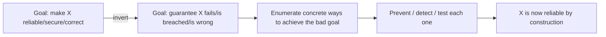

# Inversion Thinking — Middle

> **What?** Inversion thinking is a deliberate problem-solving move: define success by its opposite, enumerate the failure modes, and design against them. It treats "how would this fail / be attacked / be misused?" as a first-class design question, not an afterthought.
>
> **How?** You apply it across the lifecycle — anti-requirements during design, the failure list before "done", negative and adversarial tests, and the pre-mortem on projects. You convert each inverted answer into a concrete defense, test, or invariant.

---

## 1. Inversion as a repeatable technique, not a mood

At the junior level inversion is a trick you pull out when stuck. At the mid level it becomes a **standing question you ask on purpose**, at predictable points in your work. Three things make it productive rather than vibes:

1. **It targets a specific artifact.** You invert *a function*, *a design*, *a deploy*, *a project* — not "software" in the abstract.
2. **It produces an enumerated list.** "How would this fail?" must yield items, not a feeling.
3. **Each item maps to an action.** A guard, a test, an invariant, a runbook step. If the list doesn't drive action, you did contrarianism, not inversion.

The mental flip is always the same:



## 2. Anti-requirements: what must this NEVER do

Most requirements documents are lists of things the system *should* do. Inversion adds the complementary list: things it must **never** do. These **anti-requirements** are usually the safety- and security-critical ones, and they're invariants — properties that must hold across *every* path, not just the ones you tested.

For a payment endpoint, the forward requirements ("accept a card, charge it, return a receipt") are the easy part. The anti-requirements are where the real engineering lives:

- This endpoint must **never** charge a customer twice for one request (idempotency).
- It must **never** log a full card number or CVV.
- It must **never** complete a charge without an authenticated, authorised user.
- It must **never** leave money in a state where the customer was charged but the order wasn't created.

Notice each "never" implies design work: an idempotency key, a log redaction filter, an auth check, a transactional or saga-based write. Anti-requirements are a forcing function — they make the invariants explicit so you can defend them deliberately instead of discovering them in an incident.

> Write anti-requirements as testable negatives. "Never logs a CVV" becomes a test that submits a CVV and greps the log output to assert it's absent.

## 3. Design the failure cases first (API design)

When designing an API, the instinct is to design the success response and bolt on errors later. Invert it: **design the failure cases first.** The failure surface is where consumers actually get hurt, and it's far harder to change after release.

Before writing the happy path of a `POST /transfers` endpoint, enumerate failure first:

| Failure mode | Design decision it forces |
|---|---|
| Caller retries after a timeout | Idempotency key; same key returns the same result |
| Insufficient funds | A distinct, machine-readable error code — not a generic 400 |
| Source account frozen | Another distinct code so the client can react correctly |
| Two transfers race on the same account | Locking / serializable transaction; defined ordering |
| Downstream ledger is down | Timeout + clear "try again later" vs. silent hang |

Designing errors first gives you a **stable, well-typed error contract**. Clients can handle `INSUFFICIENT_FUNDS` differently from `ACCOUNT_FROZEN` only if you separated them — and you'll only separate them if you enumerated the failures up front. (More on this trade-off space in [constraint-driven creativity](../04-constraint-driven-creativity/).)

## 4. Inversion in debugging: "what would have to be true?"

The forward debugging question — "why is this broken?" — invites guessing. The inverted question is a **constraint solver**:

> "What would have to be true for this exact symptom to occur?"

A user reports that their cart total is occasionally wrong. Instead of re-reading the pricing code hoping for inspiration, enumerate what must be true to produce *that* symptom:

1. Two requests mutating the same cart concurrently (a race).
2. A stale cached total served after an item changed.
3. A rounding rule applied inconsistently across line items.
4. A currency or unit mismatch on one product.
5. An integer overflow on a large quantity.

Each candidate is now a **falsifiable hypothesis** you can test directly: add logging for concurrent writes, check cache TTLs, audit the rounding code. Inversion turns "stare and pray" into a ranked list you can knock down one at a time. This is the scientific method applied to a bug — see [scientific and hypothesis-driven thinking](../../09-scientific-and-hypothesis-driven/).

## 5. Adversarial and negative testing

A test suite that only checks intended behaviour is testing your *optimism*. Inversion-driven testing asks **"how would I, as an adversary, break this?"** and turns each answer into a test.

```python
# Forward test: confirms the happy path
def test_apply_coupon_reduces_total():
    assert apply_coupon(cart(100), "SAVE10").total == 90

# Inverted tests: how would I abuse this?
def test_coupon_cannot_be_applied_twice():
    c = apply_coupon(cart(100), "SAVE10")
    assert apply_coupon(c, "SAVE10").total == 90  # not 80

def test_coupon_cannot_make_total_negative():
    assert apply_coupon(cart(5), "SAVE10").total == 0  # not -5

def test_expired_coupon_is_rejected():
    with pytest.raises(CouponExpired):
        apply_coupon(cart(100), "EXPIRED2020")

def test_coupon_code_is_case_and_whitespace_safe():
    assert apply_coupon(cart(100), " save10 ").total == 90
```

The adversary's questions — *can I apply it twice? can I go negative? can I sneak whitespace past validation?* — are exactly the questions a real attacker or a confused user asks. **Property-based testing** is inversion at scale: instead of you enumerating bad inputs, the framework generates thousands and tries to falsify an invariant you stated ("total is never negative").

## 6. The pre-mortem: inversion applied to projects

The **pre-mortem**, a technique from psychologist **Gary Klein**, is inversion aimed at a plan instead of a function. Before a project starts, the team imagines it's months in the future and the project has **failed completely**. Then everyone writes down *why*.

A pre-mortem for "migrate the monolith to microservices in Q3" might surface:

- We underestimated the shared database and couldn't split it cleanly.
- A key person who understood the auth flow left.
- We had no way to run old and new side by side, so every cutover was big-bang and risky.
- Distributed tracing didn't exist, so debugging cross-service bugs took days.

The psychological reason it works: asking "what might go wrong?" gets polite, shallow answers because nobody wants to seem negative about a plan everyone just committed to. Asserting "it *has* failed — explain why" gives people **permission to voice doubts**, and the imagined certainty of failure unlocks specifics. Each failure reason becomes a risk to mitigate *now*, while it's cheap. (See the bias-fighting angle in [cognitive biases in code decisions](../../04-critical-thinking/03-cognitive-biases-in-code-decisions/).)

## 7. Via negativa: subtract before you add

When a system needs improvement, the default move is addition — a new cache, a new service, a new flag. **Via negativa** (Taleb) is the inverted lever: improve by *removing*.

| Symptom | Additive "fix" | Via negativa fix |
|---|---|---|
| Slow page | Add a CDN and a cache layer | Remove the 400 KB library used for one date format |
| Flaky deploy | Add retry logic to the deploy script | Remove the manual step that everyone forgets |
| Confusing config | Add documentation for the 12 options | Remove the 9 options that have only one sane value |
| Buggy module | Add more tests around it | Delete the unused code paths the bugs hide in |

Subtraction is underrated because it's invisible work — there's no shiny new component to point at. But removed complexity can't break, can't be misconfigured, and can't be misunderstood. Before adding, always ask: *is there something I can take away that solves this?*

## 8. Distinguishing inversion from contrarianism

Mid-level engineers sometimes weaponise "what could go wrong?" into a tool for blocking everything. That's not inversion — it's risk-aversion wearing inversion's clothes. The discipline:

- **Bound it.** Inversion is a phase, not a personality. You flip the question, generate the list, then flip back and build.
- **Rank it.** Not every failure mode is worth defending against. A failure that's catastrophic *and* likely gets fixed now; one that's trivial *and* rare gets a comment and a backlog ticket. (Pairing inversion with likelihood/impact is the topic of [risk and failure probabilities](../../06-probabilistic-thinking/03-risk-and-failure-probabilities/).)
- **Stay constructive.** The output of inversion is a better version of the thing, not a reason to abandon it.

## 9. Worked example: "how to guarantee this outage" → reliability checklist

Take a service you're shipping. Set the inverted goal: **"How would I guarantee this service has a bad outage?"** Write the sabotage playbook, then flip each line into a control.

```text
SABOTAGE PLAYBOOK                          →  RELIABILITY CONTROL
1. No timeouts on dependencies             →  Timeout + retry-with-backoff on every call
2. No circuit breaker                      →  Break the circuit when a dep is failing
3. Single instance, no health checks       →  N+1 instances behind a load balancer
4. Unbounded queues / no backpressure      →  Bounded queues; shed load gracefully
5. Deploy big-bang, no canary              →  Canary + automated rollback on error spike
6. No alerting on error rate or latency    →  SLO-based alerts before users notice
7. Untested backups                        →  Scheduled restore drills
8. One shared secret in plaintext config   →  Secret manager; rotation
```

The right column is a credible reliability checklist — and you derived it not by knowing reliability theory, but by imagining how to cause harm and inverting. That's the leverage of the technique: **sabotage is easier to imagine than excellence, and the inverse of a good sabotage plan is a good defense.**

---

### Key takeaways

- Make inversion a **scheduled question**, tied to an artifact and producing an actionable list.
- **Anti-requirements** ("must NEVER do X") capture safety/security invariants you'd otherwise discover in an incident.
- **Design failure cases first** — the error contract is the part you can't easily change later.
- The **pre-mortem** (Klein) unlocks honest risk-talk by asserting failure has already happened.
- **Via negativa**: subtract before you add; removed complexity can't break.

### Where to go next

- [Constraint-driven creativity](../04-constraint-driven-creativity/) — failure cases as design constraints.
- [Scientific & hypothesis-driven thinking](../../09-scientific-and-hypothesis-driven/) — falsifiable hypotheses in debugging.
- [Risk and failure probabilities](../../06-probabilistic-thinking/03-risk-and-failure-probabilities/) — ranking the failure list.
- [Section overview](../) · [Engineering-thinking roadmap](../../README.md)

---
## Check your understanding

Try to answer these questions from memory:

1. What is a pre-mortem and why does it beat just asking "what could go wrong?"
2. You're debugging an intermittent bug you can't reproduce. How does inversion help?
3. What does "design the failure cases first" mean for API design?
4. What is chaos engineering, and how is it inversion?
