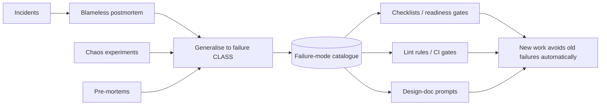

# Inversion Thinking — Professional

> **What?** At staff/principal level, inversion stops being a personal habit and becomes **organisational machinery**: pre-mortems, threat modeling, chaos engineering, anti-requirement reviews, and "how would this fail / be attacked / be abused?" embedded as standard, low-friction practice across teams. You're designing the *systems that make inversion automatic* — and tuning them so they catch real failures without becoming bureaucracy or a culture of "no."
>
> **How?** You install inversion into the SDLC (design templates, review gates, incident process), build the institutions that run it (game days, chaos platforms, threat-model cadences, error-budget policy), and steward the failure-mode catalogue as durable organisational memory.

---

## 1. From personal technique to institutional practice

A senior engineer inverts their own designs. A principal engineer makes inversion happen *whether or not any individual remembers to do it*. The difference is leverage: your personal pre-mortem protects one project; an org where every design doc has a mandatory failure-modes section, every significant launch has a pre-mortem, and every critical service runs game days protects hundreds.

The institutional forms of inversion map cleanly onto the lifecycle:

| Lifecycle stage | Inversion practice | The inverted question it answers |
|---|---|---|
| Design | Anti-requirement review; failure-first design docs | What must this NEVER do? |
| Design (security) | Threat modeling (STRIDE / attack trees) | How would an attacker abuse this? |
| Planning | Pre-mortem (Klein) | Why will this project have failed? |
| Implementation | Negative/property/fuzz tests as CI gates | How would I break this code? |
| Pre-launch | Launch readiness / operational readiness review | How does this fail in production? |
| Production | Chaos engineering; game days | What happens when X is actually down? |
| Post-incident | Blameless postmortem; failure-mode catalogue | What class of failure was this, and where else does it live? |

Your job is to make each of these *cheap, normal, and expected* — friction is the enemy, because a practice that's onerous gets skipped exactly when the team is busiest, which is exactly when it's needed.

## 2. Chaos engineering: inversion as a production discipline

Chaos engineering is inversion industrialised. Rather than asking "is this resilient?" in the abstract, you assert a hypothesis about steady-state behaviour and then **deliberately inject the failure** to see if it holds. The practice was popularised at Netflix (Chaos Monkey, which randomly kills instances) and articulated by **Casey Rosenthal and Nora Jones** in *Chaos Engineering* (O'Reilly). Its discipline distinguishes it from "just breaking things":

1. **Define steady state** as a measurable output (orders/sec, p99 latency, error rate) — not internals.
2. **Hypothesise** that steady state persists in both the control and the experimental (fault-injected) group.
3. **Inject real-world faults**: kill instances, add latency, drop a dependency, exhaust a connection pool, partition the network.
4. **Look for the difference.** A divergence in steady state is a weakness you just found *on your terms* instead of at 3 a.m.

The principal-level decisions are about *governance*, not the mechanics:

- **Blast radius control.** Start in staging, then production with a tiny, contained scope; have an abort switch. Chaos without a blast-radius limiter is just an outage you caused.
- **Run during business hours, on purpose.** The point is to fail when the experts are awake and watching, converting a future unplanned outage into a present, supervised one.
- **Game days** make it a *team* practice: a scheduled session where you inject a failure and the on-call team responds for real, exercising both the system and the humans/runbooks.

> Chaos engineering is the institutional answer to §6 of the senior level: it stops you from only testing the failures you imagined, by injecting failures into the real system and watching what actually happens.

## 3. The pre-mortem and operational readiness as gates

A **pre-mortem** (Gary Klein, *Harvard Business Review*, 2007) run once is a useful meeting. Run as a *gate* on every project above a size threshold, it becomes an organisational immune response. The principal's contribution is the template and the cadence, plus making the output binding:

- Facilitate so quiet skeptics speak: "It's six months out, the project failed badly. Spend five minutes writing why." Then round-robin so no one's reasons get crowded out.
- Cluster the failure reasons; rank by likelihood × impact; assign each top risk an owner and a mitigation *with a due date*. A pre-mortem whose output isn't tracked is theatre.

**Operational/launch readiness reviews** are the pre-mortem's deployment-time sibling — a standard checklist (itself derived from inverted questions) gating production launch: timeouts and retries on every dependency? defined degradation per dependency? alerts on SLO burn? rollback tested? backups restore-tested? on-call and runbooks ready? Google's SRE practice formalises this; the underlying engine is the same inversion — *enumerate how this fails in production, prove each is handled before it's allowed to launch.*

## 4. Error budgets: institutionalised "avoid stupidity"

Munger's "avoid stupidity over seek brilliance" has a direct operational analogue: the **error budget**. An SLO of 99.9% availability defines an explicit budget of allowed failure (≈43 minutes/month). The inversion is structural — instead of the unbounded goal "be reliable" (which invites either recklessness or paralysis), you define the *acceptable amount of failure* and manage against it.

This converts a fuzzy aspiration into a control loop with teeth: budget remaining → ship features faster; budget exhausted → freeze feature work and spend on reliability. It's the organisational version of "it's easier to avoid known failure than to chase brilliance" — you're not trying to be perfectly reliable (impossible, and the last nines cost exponentially), you're avoiding the *stupidity* of either over- or under-investing in reliability by making the trade-off explicit and quantified. (The probabilistic backbone is in [risk and failure probabilities](../../06-probabilistic-thinking/03-risk-and-failure-probabilities/).)

## 5. Threat modeling and abuse cases at scale

At scale, "how would an attacker abuse this?" must be a *cadence*, not a heroic one-off. The principal installs:

- **A trigger.** Threat modeling is mandatory for any design that crosses a trust boundary, handles money/PII, or changes the auth surface — not "when someone remembers."
- **A shared vocabulary.** STRIDE, attack trees, or abuse-case stories ("As an attacker, I want to…") so teams produce comparable, reviewable artifacts.
- **Abuse cases alongside user stories.** For every feature, a few "how could this be weaponised?" stories: rate-limit bypass, enumeration, mass-assignment, replay. These become acceptance criteria and tests.
- **A feedback loop from incidents.** Every security incident updates the threat model and the standard checklist, so the org learns once and defends everywhere.

The win is that security stops being a gate at the end (where it's adversarial and ignored) and becomes a design-time inversion the team does themselves.

## 6. Stewarding the failure-mode catalogue (organisational memory)

The highest-leverage principal artifact is the **living catalogue of failure modes** — the organisation's accumulated "ways we have broken and could break." It's the durable form of Munger's known-failure list, and it's what lets a 200-engineer org avoid re-learning the same outage five times.

Sources that feed it:

- **Blameless postmortems**, with the key inversion move: generalise from instance to *class*. The action item isn't only "fix this one null pointer"; it's "where else does this class — unbounded retry storm, missing timeout, cache stampede — live in our systems?"
- **Pre-mortem outputs** and the risks that did/didn't materialise (calibration over time).
- **Chaos experiment results** — every weakness found is a catalogued failure mode.

Encoded as checklists, lint rules, design-doc prompts, and readiness gates, the catalogue turns hard-won incident lessons into **automatic prevention** for teams that never lived the original outage. Stewarding it — keeping it current, pruning the obsolete, making it discoverable — is core principal work and the connective tissue to the org's [cognitive-bias defenses](../../04-critical-thinking/03-cognitive-biases-in-code-decisions/) (postmortems fight hindsight and outcome bias).

## 7. Via negativa as a portfolio and platform strategy

At the org level, via negativa is a leadership stance: the highest-leverage roadmap decisions are often *removals*. A principal applies the "subtract before adding" inversion to systems, products, and process:

- **Decommission** before you build adjacent. Each retired service removes an on-call surface, a CVE exposure, a dependency others inherit.
- **Kill features** with low usage and high failure surface; every code path is a liability someone maintains.
- **Prune process.** Inversion-driven process (reviews, gates, checklists) accretes; periodically ask "which of these gates has never caught anything?" and remove it. *Inversion applied to your own inversion machinery* keeps it from becoming bureaucracy.

The discipline (Taleb's *via negativa*): improvements by removal are robust because they reduce what can go wrong, whereas additions reliably increase surface area. The mature org tracks "complexity removed" as a first-class outcome, not just features shipped.

## 8. Keeping it productive: inversion without a culture of "no"

The failure mode of institutionalised inversion is **bureaucratic pessimism** — so many gates, reviews, and "what could go wrong" rituals that shipping grinds to a halt and inversion becomes a tool for blocking. Principal-level stewardship actively prevents this:

- **Proportionality.** A reversible, low-blast-radius change gets a lightweight check; an irreversible, high-blast-radius one gets the full pre-mortem + threat model + readiness review. Don't make a config tweak run the gauntlet built for a payments migration. (One-way vs. two-way doors — Bezos's framing.)
- **Inversion ends in a build.** Every practice must *terminate in action*: mitigations, accepted-and-signed-off residual risk, or a green light. A failure list with no decisions attached is process for its own sake.
- **Measure the machinery.** Track whether gates catch real issues. A readiness review that's never blocked a bad launch is either perfectly tuned or pure theatre — find out which.
- **Distinguish inversion from contrarianism, organisationally.** Reward people who surface a failure *with a mitigation*, not people who merely predict doom. The cultural norm is "find the failure so we can prevent it and ship," never "find a reason not to ship."

---

### Key takeaways

- Make inversion **organisational machinery** — embedded in design templates, review gates, readiness reviews, and incident process — so it happens without depending on any individual.
- **Chaos engineering / game days** (Rosenthal & Jones; Netflix) industrialise inversion in production, with governed blast radius.
- **Pre-mortems** as gates and **error budgets** as control loops operationalise Klein and Munger respectively.
- Steward the **failure-mode catalogue** — generalise incidents to classes — as durable organisational memory that auto-prevents repeat failures.
- Apply **via negativa** to systems *and* to your own inversion process; keep it proportional so it never becomes a culture of "no."

### Where to go next

- [Cognitive biases in code decisions](../../04-critical-thinking/03-cognitive-biases-in-code-decisions/) — biases that pre-mortems and postmortems counter.
- [Risk and failure probabilities](../../06-probabilistic-thinking/03-risk-and-failure-probabilities/) — error budgets, likelihood × impact ranking.
- [Constraint-driven creativity](../04-constraint-driven-creativity/) · [Analogical thinking](../03-analogical-thinking/)
- [Section overview](../) · [Engineering-thinking roadmap](../../README.md)

---
## Use it today

1. Build pre-mortems and failure-mode review into planning templates.
2. Make owners and follow-up dates visible for material risks.
3. Revisit the risk register when assumptions, scale, or dependencies change.

## Recall and apply

Try to answer these questions from memory:

1. You only test the failures you thought of. How do you find the ones you didn't?
2. Design "secure file upload" using inverted, attacker-style thinking.
3. When can inversion mislead you or be the wrong tool?
4. Give a concrete example of turning a "how to cause an outage" list into a reliability checklist.
