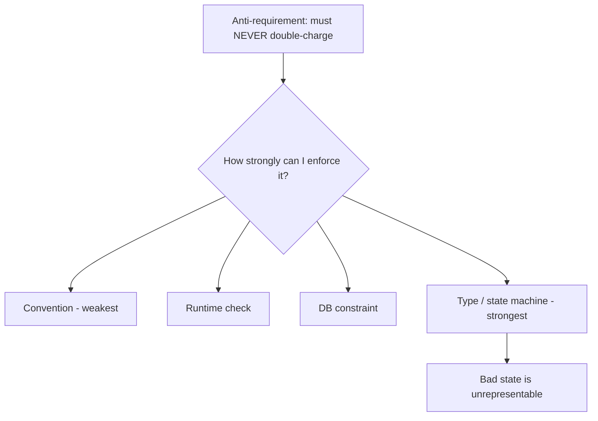
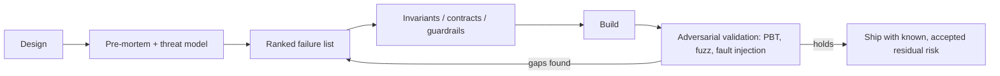

# Inversion Thinking — Senior

> **What?** At the senior level, inversion is a design and architecture discipline: you reason about a system primarily through its failure surface, attack surface, and invariants. You make "how does this break / get breached / get abused?" the structuring question of a design, and you encode the answers as invariants, contracts, and guardrails rather than ad-hoc checks.
>
> **How?** You run pre-mortems and threat models on designs, write anti-requirements into specs and review them, design failure-first APIs and degradation paths, and use adversarial/chaos thinking to validate that the invariants actually hold under stress — not just in the test you happened to write.

---

## 1. Designing from the failure surface inward

A senior engineer doesn't design the happy path and then "add error handling." The failure surface *is* the design. The reliability, security, and correctness of a system are properties of how it behaves at its edges — under load, under partial failure, under malicious input — and those edges are precisely what inversion surfaces.

The structuring question shifts:

| Mid-level framing | Senior framing |
|---|---|
| What should this system do? | Under what conditions does this system produce a wrong, unsafe, or unavailable result — and which of those can I make *impossible* vs. merely *unlikely*? |
| Where do I add validation? | What invariants must hold on every path, and how do I make violating them structurally hard? |
| What's the error response? | What's the degradation curve — what does this do at 2×, 10×, 100× expected load, and when each dependency is down? |

This is Munger's *avoid stupidity* operating at architecture scale: most systems don't fail because someone failed to be brilliant; they fail because a known, enumerable failure mode wasn't designed out. The senior skill is **maintaining the catalogue of known failure modes** and structurally precluding the ones that matter.

## 2. Invariants over checks: make the bad state unrepresentable

The weakest form of defense is a runtime check that someone remembered to write. The strongest is a design where the failure **cannot be expressed**. Inversion tells you *what* to defend; good design decides *how strongly*.

A ladder of strength, from weakest to strongest, for the anti-requirement "an order must never be charged twice":

1. **Convention** — "remember to pass an idempotency key." (Fails the moment someone forgets.)
2. **Runtime check** — reject duplicate keys at the handler. (Fails if a path skips the handler.)
3. **Database constraint** — a unique index on `(idempotency_key)`. (The database refuses the double-write regardless of code path.)
4. **Type/state machine** — an `Order` can transition `Pending → Charged` exactly once; the `charge()` method only exists on `Pending`. (The double-charge call doesn't compile / doesn't typecheck.)

Each rung pushes the guarantee *down* — closer to where the data lives, further from human memory. When you invert and find an anti-requirement, the senior follow-up is: *what's the lowest, most automatic rung I can enforce this on?* A unique index that the DB enforces on every writer beats a check in one service that three other writers bypass.

## 3. Threat modeling as institutional inversion

Threat modeling is inversion applied to security: you adopt the attacker's goal as your design lens. Instead of "how do users authenticate?", you ask **"how would I, the attacker, authenticate as someone else, or skip auth entirely?"** Frameworks like STRIDE are just an organised checklist of inverted questions — Spoofing ("how do I pretend to be another principal?"), Tampering, Repudiation, Information disclosure, Denial of service, Elevation of privilege.

The senior move is to run this at the **trust-boundary** level of an architecture diagram:

1. Draw the system; mark every boundary where data crosses a trust level (user → service, service → service, service → database, internet → edge).
2. At each boundary, invert: *"If I controlled the data crossing here, what could I make happen?"*
3. For each answer, decide: prevent, detect, or accept (with eyes open).

This produces concrete invariants: "all input crossing the internet boundary is validated against a schema before any business logic touches it"; "no service trusts a user-supplied identity claim without verifying the token signature." Threat modeling is inversion's most mature institutional form — it's a *standing practice*, run on every significant design, not a one-time audit.

## 4. Designing the degradation curve, not just the failure response

Juniors handle errors; seniors design **degradation**. The inverted question scales from "what's the error response?" to "**what does this system do as conditions get progressively worse?**"

Consider a product page that shows price, reviews, and recommendations. Invert: *how would I make this page fail catastrophically?* — by making the whole page depend on the slowest, least-critical service (recommendations). Now design the curve instead:

| Condition | Designed behaviour |
|---|---|
| All healthy | Full page |
| Recommendations down/slow | Render page without recs; no error to user |
| Reviews down | Show "reviews unavailable"; price + buy button still work |
| Pricing down | Fail closed — don't show a wrong price; show "temporarily unavailable" |
| Everything overloaded | Shed load: serve cached page, queue nothing unboundedly |

The inversion that drives this is asking, per dependency: *"if this is the thing that fails, what's the worst it should be allowed to do to the user?"* Critical dependencies (pricing) **fail closed**; non-critical ones (recs) **fail open** and degrade silently. That distinction — which is the heart of resilient design — comes directly from inverting each dependency's failure.

## 5. Anti-requirement reviews and the failure-first spec

A senior institutionalises inversion in the artifacts the team produces. Two concrete habits:

**Failure-first design docs.** Every design doc has a mandatory "Failure modes and non-goals" section *before* the solution, listing: what this must never do (anti-requirements/invariants), how it degrades per dependency, and the top failure modes from a mini pre-mortem. Reviewers are asked to attack the design, not admire it. The cultural shift is making it *normal and expected* to lead with how things break.

**The "design the failure cases first" API rule.** For any new interface, the error contract is specified and reviewed before the success path is implemented. Error codes are enumerated and made distinct (clients can only handle distinctly-typed failures); retries, idempotency, and partial-failure semantics are decided up front because they're contract-level and expensive to change later. (The trade-offs here connect to [constraint-driven creativity](../04-constraint-driven-creativity/) — failure cases are constraints that productively narrow the design.)

## 6. Adversarial validation: don't trust the test you wrote

There's a trap in inversion-driven testing: you only test the failures *you thought of*. The ones that bite are the ones you didn't. Seniors close this gap with techniques that generate adversity instead of hand-writing it:

- **Property-based testing** — state an invariant ("after any sequence of valid operations, account balance equals sum of ledger entries") and let the framework search thousands of operation sequences to falsify it. This finds the inputs your imagination didn't.
- **Fuzzing** — feed structured-random input to a parser/decoder and assert it never crashes, hangs, or corrupts state. The fuzzer is an automated adversary.
- **Fault injection** — make a dependency time out, return errors, or return slowly *in tests*, and assert the degradation curve from §4 actually holds.

The principle: an invariant you only verified with examples you chose is an invariant you've confirmed your own optimism about. Adversarial tooling is inversion that doesn't depend on the limits of your own imagination.

## 7. Via negativa at the architecture level

Senior leverage often comes from *removing*, and the highest-leverage removals are architectural:

- **Remove a state** rather than handle it. If "partially-charged order" is a painful state, redesign so it can't exist (transactional outbox, single atomic write) — eliminating the entire class of bugs that lived there.
- **Remove a mode.** A feature flag that's been "on" for a year, a config option with one used value, a legacy code path behind a header — each is a maintenance and failure surface. Deleting it removes the bugs it can have.
- **Remove a dependency.** Every service you call is a failure mode you inherit. Sometimes the resilient move is to *not* make the call — denormalise the data, accept staleness, or inline the logic.

The senior question on any "let's add X" proposal: *"What does adding X let fail that can't fail today? Is there a subtraction that gets us the same outcome with less surface?"* Often the most reliable change to a system is the component you decide not to build. (This is the architectural face of via negativa — see also the simplicity emphasis in [first-principles thinking](../../05-first-principles-thinking/).)

## 8. Keeping inversion productive at scale

The senior risk isn't forgetting to invert — it's inversion metastasising into analysis paralysis or a culture of "no." Guardrails:

- **Rank ruthlessly.** Cross every failure mode with likelihood × blast radius (see [risk and failure probabilities](../../06-probabilistic-thinking/03-risk-and-failure-probabilities/)). Defend the catastrophic-and-plausible; document-and-accept the trivial-or-fantastical. Inversion *generates* the list; risk analysis *prioritises* it.
- **Time-box the pre-mortem.** A 45-minute pre-mortem that surfaces the top five risks beats a three-week one that surfaces forty. Diminishing returns are real.
- **Convert, don't accumulate.** Every accepted failure mode becomes either a mitigation, an alert, a runbook entry, or an explicit, signed-off accepted risk. A failure list that just sits in a doc is theatre.
- **Build, then verify by breaking.** Inversion informs the build; chaos/fault injection verifies it. The two halves close the loop.

---

### Key takeaways

- Design from the **failure surface inward**: reliability and security are edge properties that inversion surfaces.
- Turn anti-requirements into **invariants enforced at the lowest rung** — make bad states unrepresentable, not merely checked.
- **Threat modeling** is institutional inversion at trust boundaries; **degradation curves** come from inverting each dependency.
- Validate invariants with **adversarial tooling** (PBT, fuzzing, fault injection), not just the failures you imagined.
- Use **via negativa** architecturally — removing a state/mode/dependency removes its whole bug class.

### Where to go next

- [Constraint-driven creativity](../04-constraint-driven-creativity/) — failure cases as productive constraints.
- [First-principles thinking](../../05-first-principles-thinking/) — reasoning down to invariants.
- [Risk and failure probabilities](../../06-probabilistic-thinking/03-risk-and-failure-probabilities/) — ranking the inverted list.
- [Section overview](../) · [Engineering-thinking roadmap](../../README.md)

---
## Check your understanding

Try to answer these questions from memory:

1. Distinguish productive inversion from contrarianism.
2. Explain "via negativa" with an engineering example.
3. "It's easier to avoid stupidity than to seek brilliance." How does that apply to writing reliable software?
4. How do you make an anti-requirement actually hold, instead of hoping people remember it?
