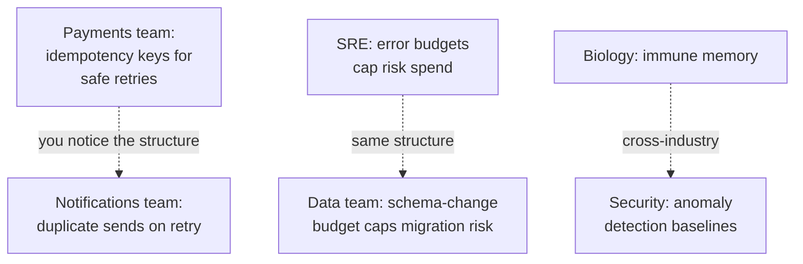

# Analogical Thinking — Professional

> **What?** At staff/principal level, analogical thinking is an instrument of *leverage and risk*: you use analogy to make complex architecture legible to executives, teams, and other disciplines; to cross-pollinate proven solutions between teams and domains; and — most importantly — to detect and dismantle analogies that have hardened into organizational dogma and are now steering large decisions wrong.
>
> **How?** You treat the *organization's shared analogies* as load-bearing infrastructure: you choose them deliberately when introducing direction, you audit them when they recur in strategy docs, and you retire them when their domain of validity is exceeded. You also act as the cross-domain router — the person who notices that the solution another team or industry already found maps onto a problem yours is stuck on.

---

## 1. Analogy as a leadership instrument

The higher you go, the more your output is *alignment* rather than code, and analogy is the highest-bandwidth alignment tool that exists. A single well-chosen analogy can do what a 30-slide deck can't: give a CFO, a VP, and a junior engineer the *same* working mental model in one sentence.

But this leverage cuts both ways. The analogy you pick *becomes how the org reasons about that thing for years.* So the principal-level concern is not "is this analogy catchy?" but "what decisions will this analogy *cause* downstream, including the ones I'm not in the room for?"

| Audience | Goal of the analogy | Failure mode to avoid |
|---|---|---|
| Executives / board | Convey risk and tradeoff at the right altitude | Over-simplifying so the analogy hides the real cost (e.g. "tech debt is like a credit card" → they think it's optional) |
| Adjacent teams | Transfer a proven pattern without re-deriving it | The receiving team copies the *surface* and skips the boundary conditions |
| Your own org, long-term | Establish a shared vocabulary that compounds | The analogy ossifies into a rule no one is allowed to question |

### Tech-debt example: the same analogy, used well and badly

"Technical debt is like financial debt" (Ward Cunningham's original) is one of the best analogies in software *because* its structure is rich: you borrow to ship sooner, you pay interest (slower future work), and you can choose to pay down principal or go bankrupt. Used well, it lets you have a *quantitative* conversation with finance-minded leaders.

Used badly, it leaks in exactly one place that executives latch onto: financial debt has a *known interest rate and a contract*; tech debt's "interest" is uncertain, compounding, and sometimes infinite (some debt you can never pay back because the system is gone). When a leader concludes "debt is fine, everyone carries debt", the analogy has leaked at its load-bearing point and you, as the principal, have to repair it: *"Yes — but this is debt with an unknown, compounding rate and no fixed term. More like a payday loan than a mortgage."* Repairing a leaking org-analogy in real time is a core staff skill.

## 2. Cross-pollination: you are the analogy router

Most organizations rediscover the same solutions independently, team by team, because no one carries patterns across the boundaries. The principal engineer's distinctive value is *breadth of source domains plus presence in many rooms*, which makes them the natural router for structural transfer:



The skill is recognizing that a problem in team B has the *same relational structure* as a solved problem in team A, even though the surfaces (payments vs. notifications) look unrelated. That's structure-mapping at organizational scale. Practically:

- Keep a personal, cross-team **pattern library** (the grown-up version of the junior analogy notebook): "problem shape → where I've seen it solved → the boundary that bit them."
- In design reviews across teams, your highest-value sentence is often *"this is the same shape as what the X team solved last quarter — talk to them before you re-derive it."*
- Cross-*industry* transfer (biomimicry, queueing theory from telecom, error budgets from manufacturing's defect budgets) is where the biggest wins hide, because almost no one in your org is reading those fields.

## 3. Auditing organizational analogies for dogma

This is the part only senior-most engineers are positioned to do, because it requires the authority to challenge "how we talk about things here."

An org analogy starts as a hypothesis and, if useful, becomes shared vocabulary. The danger is the third stage: it becomes an *unfalsifiable premise* that drives strategy without anyone re-checking its validity. By then it's invisible — it's not "an analogy we use", it's "just how it is."

Patterns that have hardened into dogma in real orgs:

| Dogma analogy | What it once illuminated | How it now misleads |
|---|---|---|
| "Move fast and break things" (org as a lab) | Early-stage learning beats polish | Applied to payments/healthcare, where "breaking things" means real harm |
| "Microservices = independent companies" | Team autonomy, deploy independence | Used to *forbid* shared libraries and justify duplicated critical logic → inconsistency, security drift |
| "The platform team is a product, devs are customers" | Internal tooling should be usable | Devs are *captive* customers who can't leave — the market-discipline part of the analogy is absent, so the platform underdelivers with no consequence |
| "Two-pizza teams" | Communication overhead grows with size | Mechanically split a team that has a single indivisible problem, creating coordination cost where there was none |

The audit move: when you see an analogy *recurring in strategy documents and architecture decisions*, surface it explicitly and ask the boundary question in front of leadership: **"This analogy was true when we adopted it. Is the part we're now relying on still inside its domain of validity?"** Often it isn't — the org grew, the regulatory context changed, the adversary appeared — and the analogy is now driving decisions in territory it was never valid for.

## 4. Designing the analogies you *deploy* into the org

Because your analogies propagate and persist, choose them like you'd choose an API you can never deprecate:

- **Pick analogies whose boundaries fail *safely*.** If people over-apply "tech debt = financial debt", the worst case is they reason about interest — recoverable. If people over-apply "the system is a living organism that heals itself", the worst case is they stop building deliberate recovery mechanisms and wait for magic — catastrophic. Prefer analogies whose misuse is benign.
- **Build the boundary *into* the analogy.** Don't say "config is code"; say "config is code — same review, same tests, same blast radius if wrong." The boundary travels with the analogy and resists the surface-copy failure.
- **Pre-state the expiry.** "We're treating the monolith like a single deployable for now; that analogy ends the day deploy time exceeds X." An analogy with a declared expiry can't become permanent dogma.

## 5. Analogy vs. first principles at the strategy level

The [generate-with-analogy, validate-with-fundamentals](../../05-first-principles-thinking/01-reasoning-from-fundamentals/) discipline scales up to strategy. Analogy ("we should build a platform like Stripe did") is a fine way to *generate* a strategic option and to *communicate* it. It is a dangerous way to *justify* one, because strategic analogies almost always smuggle in unstated context — Stripe's market, timing, capital, and talent are part of the source domain and rarely transfer.

So at the strategy table you do the same two-phase move, louder: praise the analogy as a hypothesis generator, then insist the actual bet be defended from fundamentals — *our* unit economics, *our* constraints, *our* failure model — with the analogy explicitly set aside. The principal who can say "great analogy, now let's pressure-test the decision without it" prevents a category of expensive, narratively-seductive mistakes.

## 6. The principal-level checklist

```text
DEPLOYING an analogy into the org:
  [ ] Will it fail SAFELY when over-applied?
  [ ] Is the boundary built INTO the phrasing?
  [ ] Have I declared when it expires?
  [ ] Does it convey the RISK/tradeoff at the audience's altitude, not hide it?

AUDITING an existing org analogy:
  [ ] Is it recurring in strategy/architecture docs as a premise?
  [ ] Is it being used to END decisions rather than inform them?
  [ ] Has the org/context grown PAST its original domain of validity?
  [ ] Who has the standing to retire it, and have I made the boundary visible to them?

ROUTING across teams/domains:
  [ ] Does problem B share the STRUCTURE (not surface) of solved problem A?
  [ ] Have I connected the two teams instead of letting B re-derive it?
  [ ] Am I scanning OTHER industries for the structural match?
```

---

## Key takeaways

- Analogy is the **highest-bandwidth alignment tool** you have, and the analogy you pick becomes how the org reasons for years — choose it like an undeprecatable API.
- Be the **analogy router**: your breadth + presence in many rooms lets you transfer proven solutions across teams and industries by *structural* match.
- **Audit org analogies for dogma**: when an analogy recurs as an unquestioned premise in strategy, surface it and ask whether the org has outgrown its domain of validity.
- Prefer analogies that **fail safely**, carry their **boundary in the phrasing**, and have a **declared expiry** so they can't ossify.
- At strategy level too: analogy **generates and communicates** the bet; **first principles** must defend it — set the analogy aside for the actual decision.

## See also

- [Reasoning from fundamentals](../../05-first-principles-thinking/01-reasoning-from-fundamentals/) — defend the bet without the analogy.
- [Logical fallacies in engineering](../../04-critical-thinking/02-logical-fallacies-in-engineering/) — false analogy, now operating at org scale.
- [Constraint-driven creativity](../04-constraint-driven-creativity/) · [Inversion thinking](../02-inversion-thinking/) · [Divergent vs. convergent](../01-divergent-vs-convergent/)
- [Section root](../) · [Roadmap home](../../README.md)

---
## Check your understanding

Try to answer these questions from memory:

1. What's an analogy's "domain of validity," and what three boundaries break analogies most often?
2. As a staff engineer, you notice the team uses "microservices are independent companies" to forbid a shared library. How do you respond?
3. The "technical debt = financial debt" analogy: why is it good, and where does it leak for executives?
4. How would you build your own ability to think analogically?
