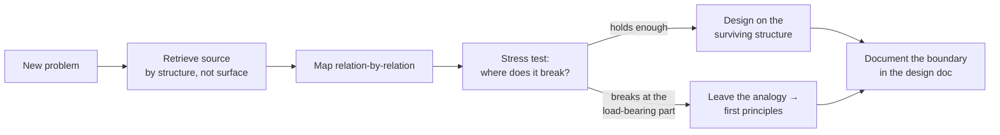

# Analogical Thinking — Senior

> **What?** At senior level, analogical thinking is a *governed* design tool: you generate candidate architectures by transferring structure from mature domains, you systematically map each analogy's domain of validity, and you know precisely when to abandon the analogy and reason from fundamentals instead. You also recognize analogy's social power — its ability to align or mislead a whole team — and you manage that.
>
> **How?** You run analogy as a disciplined loop: *retrieve a structurally-matching source → map relation-by-relation → stress the mapping until it breaks → decide whether the surviving structure is enough to design on, or whether you've left the analogy's valid domain and must derive the answer.* You document the breaks, and you never let an analogy close a decision it only opened.

---

## 1. Analogy in the senior reasoning loop

Juniors consume analogies; mid-levels wield them; seniors *govern* them. The governing loop:



The two failure modes a senior prevents are: (1) retrieving by *surface* ("we need fast lookup, NoSQL is fast, use NoSQL") instead of by *structure*, and (2) staying inside an analogy *past its boundary* because abandoning it feels like admitting you don't have an answer. Both are failures of discipline, not intelligence.

## 2. Retrieval is the hard part — and where surface bias lives

Gentner's later work distinguishes *retrieving* an analogy from *mapping* one. Mapping (once you have a source) is mostly mechanical. Retrieval — *which* prior system does this remind me of? — is where humans are weak: under time pressure we retrieve by **surface similarity** ("this also involves users and a feed, so copy the feed system") rather than by **structural similarity** ("this is, underneath, a fan-out-on-write vs fan-out-on-read tradeoff, like any push/pull notification system").

Senior practice forces structural retrieval:

- **Abstract before you search.** Strip the problem to its relations: "many producers, few consumers, ordering matters within a key, at-least-once is acceptable." *Now* search your library. You'll retrieve message queues, Kafka partitioning, even mailroom sorting — instead of "the last thing I built."
- **Retrieve multiple sources, deliberately.** One analogy is an anchor; three analogies are a triangulation. "This rate limiter is like a token bucket (telecom), like a turnstile (transit), and like a thermostat (control theory)." Where the three *agree* is robust structure; where they *disagree* is where you must think.

## 3. Worked example: choosing a consistency model by analogy

Suppose you're designing replication for a multi-region store. Candidate analogies, each importing a different mature mechanism:

| Analogy | Imports | What it gets right | Where it breaks for *this* problem |
|---|---|---|---|
| **Bank ledger** | Strong consistency, no lost writes | Money mental model forces you to take conflicts seriously | Real banks are *eventually* consistent across branches (clearing settles overnight) — the "instant strong" intuition is itself a misread of the source! |
| **Git** | Merge, branches, conflict resolution, CRDT-like reconciliation | Concurrent edits + explicit merge is a real, proven model | Git merges are *human-resolved*; an online store can't pause for a human on every write conflict |
| **Gossip / epidemic** (epidemiology) | Eventual convergence, anti-entropy, tunable fanout | Scales, partition-tolerant, no coordinator | Says nothing about *what value wins* — convergence ≠ correctness |
| **Disk write-back cache** | Buffer writes locally, flush later, accept a staleness window | Maps the latency/durability tradeoff cleanly | A cache can drop dirty data on crash; you usually can't |

The senior move is visible here: the *bank ledger* analogy, naively applied, would push you toward expensive global strong consistency — but interrogating the *real* source domain reveals banks themselves chose eventual consistency with reconciliation. The analogy, properly understood, *argues against* the conclusion most people draw from it. This is why you map the actual source mechanism, not the folk version of it.

The synthesis is usually not one analogy but a *composition*: gossip for propagation + CRDT/Git-style deterministic merge for "what wins" + a ledger-style audit trail for correctness. Each analogy contributes the part of its structure that survives the stress test — see the [behavioral patterns](../../../code-craft/design-patterns/03-behavioral) catalog for the reconciliation/merge shapes you'd compose here.

## 4. Knowing when the analogy breaks — domains of validity

Every analogy is a model, and "all models are wrong, some are useful." The senior discipline is to state the **domain of validity** explicitly, the way a physicist states "Newtonian mechanics, valid for v ≪ c."

Three boundary types you'll hit constantly:

**Scale boundary.** The analogy holds at one order of magnitude and fails at another. "Threads are like workers; add more workers, do more work" holds until context-switching, lock contention, and memory bandwidth dominate — then more workers makes it *slower*. The source domain (people) has no equivalent of cache-line bouncing.

**Continuity boundary.** Physical-source analogies (fluids, pressure, flow) are *continuous*; software is *discrete and lossy*. Backpressure from fluid dynamics breaks precisely where you can *drop* a message — fluids don't vanish, packets do. Any control-theory analogy (damping, PID, overshoot) similarly assumes smooth signals; sampled, bursty, quantized reality violates it.

**Adversary boundary.** Natural-source analogies assume a non-malicious environment. The immune-system analogy for security is gorgeous — detect non-self, remember, respond — but biological pathogens don't *read your detection rules and craft inputs to evade them*. The moment an intelligent adversary is in the loop, every "natural process" analogy needs a hard re-examination. This is also why "herd immunity" reasoning about security fails: attackers aren't a random epidemic.

## 5. Analogy is a hypothesis generator, never a proof

This is the load-bearing principle, and it's the explicit bridge to [first-principles thinking](../../05-first-principles-thinking/01-reasoning-from-fundamentals/).

An analogy can establish that something is *plausible* and *worth trying*. It can never establish that it is *correct*. The logical form "A is like B, B has property P, therefore A has property P" is the **false-analogy fallacy** the instant P falls outside the mapped structure (see [logical fallacies](../../04-critical-thinking/02-logical-fallacies-in-engineering/)).

So the senior protocol is two-phase:

1. **Generate with analogy** (cheap, fast, broad). Produce candidate designs by transfer.
2. **Validate with fundamentals** (expensive, slow, certain). For the candidate you'll actually build, *re-derive* the key properties from first principles — the CAP tradeoff, the actual latency budget, the real failure model — without leaning on the analogy at all.

If a design only survives because "it's like X", you haven't validated it; you've just relocated your faith. The analogy was the scaffold; first principles is the load test.

## 6. The social dimension: analogy that ends thinking

Seniors operate in groups, and analogies *propagate socially*. A well-chosen analogy aligns a team in one sentence ("treat config like code"). A badly-chosen one becomes a shared blind spot that no one questions because "everyone knows" the analogy.

Watch for the **analogy-as-dogma** pattern: an analogy that was once a useful hypothesis hardens into an unquestioned premise. "Microservices are independent, like separate companies" was generative in 2015; by the time it's used to *forbid* a shared library or *justify* duplicating critical logic five times, it has stopped illuminating and started dictating. The tell is the same as in the middle level but with higher stakes: **the analogy is being used to end a discussion rather than start one.**

Your job as a senior in a design review:

- When someone reasons purely by analogy to a decision, ask: *"Where does that analogy break for our case?"* — forcing the holds/breaks ledger into the open.
- When you yourself offer an analogy, *label it*: "as an analogy, not a proof — here's where I think it stops holding." This models the right epistemics for everyone junior to you.

## 7. The analogy-quality checklist

Before you let an analogy influence a real decision:

```text
[ ] Retrieved by STRUCTURE, not surface? (abstract the problem first)
[ ] Mapping is relation-to-relation, one-to-one, systematic?
[ ] I checked the REAL source mechanism, not the folk version of it?
[ ] Domain of validity stated: scale / continuity / adversary boundaries?
[ ] The load-bearing property is INSIDE the mapped structure?
[ ] Validated the actual design from first principles, independent of the analogy?
[ ] Used to GENERATE the option, not to END the debate?
[ ] Boundary documented where future readers will see it?
```

An analogy that passes all eight is a genuine design asset. One that fails the last three is a liability wearing the costume of insight.

---

## Key takeaways

- Govern the loop: **retrieve by structure → map → stress until it breaks → design or fall back to fundamentals.**
- The weak link is **retrieval**: abstract the problem to its relations before searching your library, and triangulate with multiple sources.
- Interrogate the *real* source mechanism — the folk version of an analogy (e.g. "banks are strongly consistent") is often wrong and will mislead you.
- State the **domain of validity**: scale, continuity, and adversary boundaries break the most analogies.
- Analogy **generates**, first principles **validates** — a design that only survives "because it's like X" is unvalidated.
- Manage analogy's **social power**: kill it the moment it ends a debate instead of opening one, and label your own analogies as hypotheses.

## See also

- [Reasoning from fundamentals](../../05-first-principles-thinking/01-reasoning-from-fundamentals/) — the validation half of the loop.
- [Logical fallacies in engineering](../../04-critical-thinking/02-logical-fallacies-in-engineering/) — false analogy formalized.
- [Inversion thinking](../02-inversion-thinking/) · [Constraint-driven creativity](../04-constraint-driven-creativity/)
- [Section root](../) · [Roadmap home](../../README.md)

---
## Use it today

1. Use an analogy to widen options, not to win an argument.
2. Write the structural match and the known mismatch in the design record.
3. **Decision rule:** validate the analogy with data or a small test before relying on it.

## Recall and apply

Try to answer these questions from memory:

1. What are the three main ways analogies mislead engineers?
2. The immune system is a popular analogy for security. Where's its dangerous boundary?
3. How do you decide *which* analogy to reach for? Why is that the hard part?
4. When is using an analogy to *explain* fine, but using it to *decide* risky?
