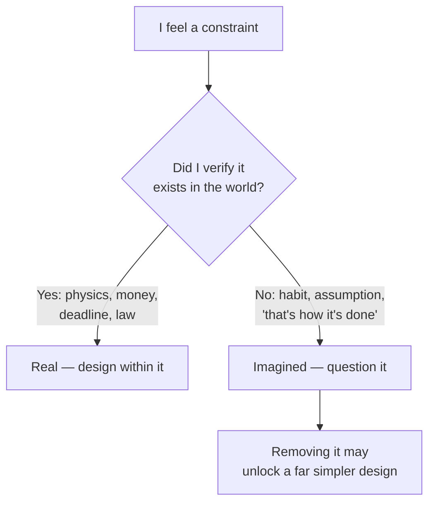

# Constraint-Driven Creativity — Junior

> **What?** The counterintuitive idea that **limits make you more inventive, not less**. A blank page with no rules is paralyzing; a tight box ("fit this in 64 KB", "answer in 140 characters", "no new dependencies") narrows the search and forces clever, focused solutions you'd never find with infinite freedom.
> **How?** When you're stuck staring at infinite options, *add a constraint on purpose* — timebox it, ban a tool, halve the budget — and watch the problem shrink to something you can actually solve. Then learn to tell which constraints are real (physics, deadline, money) and which you only imagined.

---

## 1. The blank-page problem

Ask a junior to "design anything you want" and they freeze. Ask them to "design a URL shortener that fits in one file, uses no database, and handles 100 links" and ideas appear in seconds. Nothing changed about their ability — the second prompt just **cut the search space** from infinite to small.

This is the core insight, and it feels backwards the first time you hear it:

> Constraints don't shrink creativity. They aim it.

A problem with no boundaries has too many directions to move in, so you move in none. A problem with sharp boundaries has *few* legal moves, so your brain can actually explore them — and exploring a small, well-defined space is exactly where clever ideas come from.

Antoine de Saint-Exupéry put the related idea about simplicity famously: *"Perfection is achieved, not when there is nothing more to add, but when there is nothing left to take away."* A constraint is what forces the taking-away.

## 2. Why the tighter box makes you smarter

When you have infinite RAM, infinite time, and infinite budget, the *lazy* solution always works: throw more at it. Add a cache, add a service, add a library, add a server. You never have to think.

A hard limit removes the lazy escape hatch. Now you must understand the problem well enough to do more with less.

| With no limit | With a tight limit |
|---------------|--------------------|
| "I'll just add a library." | "Can I do this in 20 lines myself?" |
| "Store everything." | "What's the *minimum* I must store?" |
| "We'll buy a bigger server." | "What's actually slow, and why?" |
| Endless options, no decision | Few options, real exploration |

The limit acts as a **forcing function**: it pushes you toward understanding instead of bolting on. The result is usually smaller, faster, and easier to reason about — not in spite of the constraint, but *because* of it.

## 3. Real limits that produced real cleverness

These aren't motivational stories — they're engineering history, with numbers.

- **The demoscene's 64 KB intros.** A whole genre of computer art exists where the entire program — 3D worlds, music, effects — must fit in **65,536 bytes**, smaller than this paragraph's worth of uncompressed text. To survive that, sceners invented procedural generation: instead of *storing* textures and music, they store the *math that creates them* at runtime. The constraint invented a technique.
- **Games in kilobytes.** Early home computers shipped games — full worlds, characters, levels — in **16 KB to 48 KB** of memory. Developers reused the same byte patterns as both graphics and code, generated levels from tiny seeds, and squeezed maps into bit-packed tables. None of that "waste nothing" ingenuity happens when memory is free.
- **Twitter's 140 characters.** The original limit came from SMS: a text message is 160 characters, and Twitter reserved 20 for the username, leaving **140**. That accident *became the product* — it forced brevity, made tweets glanceable, and created a new writing style. A different limit would have made a different (probably worse) product.

In every case, the limit came first and the cleverness came *because of it*.

## 4. Self-imposed constraints: a technique you can use today

You don't have to wait for a hard limit to appear. You can **invent one** to break a stuck problem or a bloated design. This is the practical, everyday version of the idea.

Common self-imposed constraints:

| Constraint | What it forces |
|------------|----------------|
| **Timebox** ("solve it in 2 hours") | Cut scope to the essential; stop polishing |
| **"No database"** | Find out whether you actually need persistence |
| **"One screen / one file"** | Kill features that don't fit the core |
| **"No new dependencies"** | Understand the problem instead of importing it |
| **"Half the budget"** | Question every cost line, not just the obvious ones |

```text
Stuck: "Build a notification system." (paralysis — infinite options)

Add a constraint:
  "Build it with no message queue, no new service, in 50 lines."

Suddenly the design is obvious:
  - a table `notifications(user_id, body, read_at)`
  - one INSERT on the event
  - one SELECT on page load
Ship that. Add the queue later only if real traffic demands it.
```

The point isn't that the constrained version is the final answer. It's that the constraint **got you unstuck and exposed the real core** of the problem — which is almost always smaller than you feared.

## 5. Real vs. imagined constraints

Here's the trap. Not every limit you feel is actually there.

- **Essential (real) constraints** exist in the world whether you like them or not: the speed of light, the size of RAM, the deadline, the money in the budget, the law. You design *within* these.
- **Assumed (imagined) constraints** exist only in your head: "we have to use Kafka," "it must be microservices," "we can't change the schema," "users expect a dashboard." Often nobody ever checked.



The danger of a **false constraint** is that it limits you for no reason — you suffer all the downside of a tight box with none of the focusing benefit, because the box wasn't real. The skill of telling them apart is so important it has its own topic: see [questioning assumptions](../../05-first-principles-thinking/02-questioning-assumptions/).

## 6. What to actually practice

1. **When stuck, add a constraint.** "Solve it with no X" or "in 1 hour." Watch the options collapse to something workable.
2. **When a design feels bloated, impose a tight budget.** "What if this had to fit in 10 MB / cost 1/10th / respond in 50 ms?" The gold-plating falls off.
3. **When you feel a limit, ask "is this real?"** Half the rules you obey were never written down by anyone.
4. **Notice the constraints behind tools you admire.** The brevity of a good CLI, the smallness of a good library — that didn't happen by accident.

The mature instinct, which you're starting to build now, is summed up simply: **infinite freedom is a trap; the right limit is a gift.**

---

## See also

- [Divergent vs. convergent thinking](../01-divergent-vs-convergent/) — constraints make the convergent (narrowing) step easier.
- [Inversion thinking](../02-inversion-thinking/) — another way to escape a blank page: start from the failure.
- [Analogical thinking](../03-analogical-thinking/) — borrow a solution from a domain with the *same* constraint.
- [Questioning assumptions](../../05-first-principles-thinking/02-questioning-assumptions/) — how to tell a real constraint from an imagined one.
- [Creative and lateral thinking](../) — section overview.
- [Engineering thinking roadmap](../../README.md) — the full map.

---
## Use it today

1. Write the real constraint: time, cost, reliability, compatibility, or scope.
2. Ask, “What becomes possible because this limit is fixed?”
3. Try one smaller, simpler solution before asking to remove the constraint.

## Recall and apply

Use these prompts to check your understanding and choose one action to try in your next task.

Try to answer these questions from memory:

1. The premise sounds backwards — how can a *constraint* help creativity?
2. Give a concrete historical example where a hard limit produced a technique.
3. How did Twitter's 140-character limit come about, and why does it matter here?
