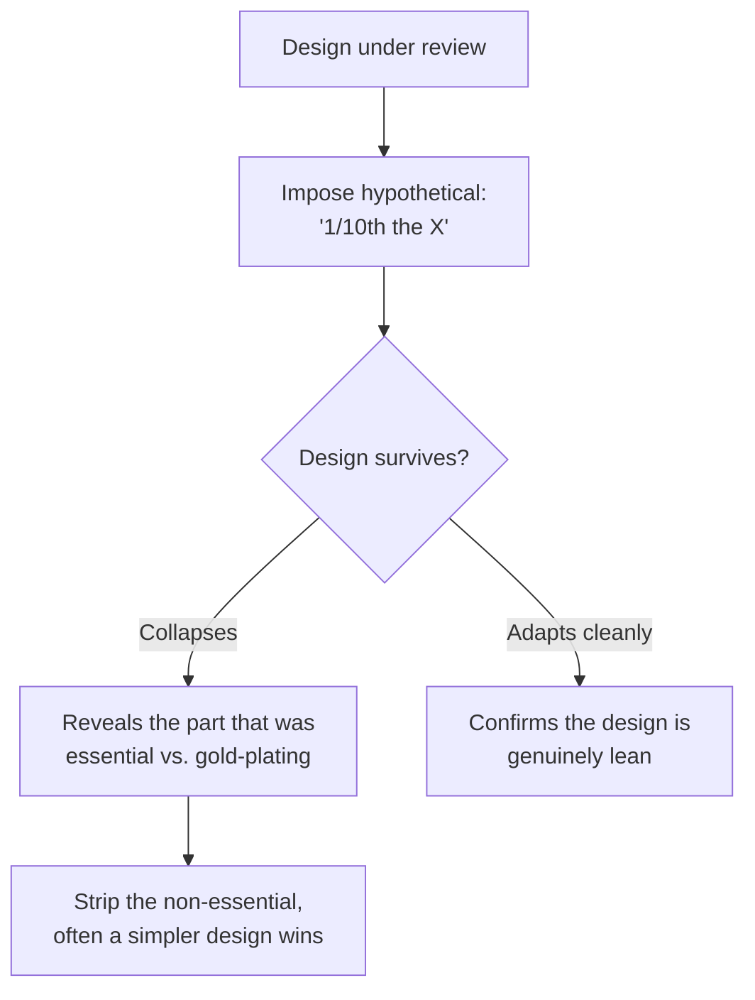

# Constraint-Driven Creativity — Senior

> **What?** A senior-level command of constraints as the primary lever for *shaping* a design: choosing which budgets to impose, deriving them from first principles, using them in design reviews to provoke better architectures, and rigorously distinguishing essential constraints (which you design within) from assumed ones (which you dismantle).
> **How?** You set the constraints, not just obey them. You translate fuzzy goals into hard numeric budgets, you run "what if you had 1/10th" thought experiments in reviews, you treat a violated budget as a design smell rather than a resourcing problem, and you keep a running audit of which team "rules" are real versus inherited.

---

## 1. The senior shift: from obeying constraints to setting them

Juniors design within whatever limits they're handed. Seniors **decide what the limits should be** and derive them, because the choice of constraint largely determines the design.

The leverage is enormous and asymmetric: a single well-chosen budget can eliminate an entire class of bad designs before anyone writes code, while a single false constraint can cripple a good one. So the senior skill is twofold:

1. **Author the right constraints** — derived, numeric, owned.
2. **Audit existing constraints** — keep the real, kill the imagined.

## 2. Deriving budgets from first principles, not from vibes

A budget pulled from the air ("let's say 100 ms") is nearly useless. A *derived* budget carries authority and shapes the design honestly. You decompose the goal into its parts and allocate.

### Example: a latency budget, derived

> *Goal:* "The search page should feel instant." → operationalize as **p99 < 100 ms server-side**.

Now decompose and allocate the 100 ms:

| Stage | Budget | Consequence of the budget |
|-------|--------|---------------------------|
| Auth + routing | 5 ms | No synchronous external auth call; cache the token check |
| Query execution | 40 ms | Index must serve it; no full scans; shape the index to the query |
| Serialization + network | 25 ms | Page results; cap payload size |
| Headroom | 30 ms | Absorb GC pauses, tail variance |

The allocation *is* the architecture. "40 ms for the query" forbids a design that does three sequential DB hops. The budget did the architectural pruning. Compare with [reasoning from fundamentals](../../05-first-principles-thinking/01-reasoning-from-fundamentals/) — same decomposition muscle, applied to limits.

### Example: a cost budget, derived

A "make it 10x cheaper" mandate is not a 10% optimization. You decompose cost into its dominant terms — say, **egress bandwidth 60%, compute 30%, storage 10%** — and realize a 10x win is *impossible* without attacking egress. That redirects all creative energy onto the one term that matters (cache at the edge, compress, change the protocol) instead of micro-optimizing the 10% term. The constraint, decomposed, tells you *where to be creative*.

## 3. Constraints in design reviews: the "1/10th" provocation

The most effective senior move in a review is to impose a hypothetical constraint and make the author defend against it:

- **"What if you had 1/10th the RAM?"** — exposes which state is essential vs. cached-for-convenience.
- **"What if you had 1/10th the time to ship?"** — reveals the true MVP hiding inside the gold-plated plan.
- **"What if you had 1/10th the budget?"** — surfaces the cost driver everyone was ignoring.
- **"What if you couldn't add any new service?"** — tests whether the operational complexity is load-bearing.



This isn't rhetorical bullying — it's a *cheap experiment*. The author either finds a simpler design (win) or articulates exactly why the extra resource is necessary (also a win: the design is now justified, not assumed). Either way the review produced understanding instead of rubber-stamping.

## 4. A violated budget is a design smell, not a hardware request

When a feature blows the latency or memory budget, the junior reflex is "we need a bigger instance." The senior reads it as a **signal that the design is the wrong shape**.

```text
Symptom: "p99 is 180 ms, budget is 100 ms."

Junior:  "Scale up / add replicas."         (treats budget as a resource problem)
Senior:  "Why is it 180? — N+1 query? a sync
         cross-region hop? unbounded payload?"  (treats budget as a design problem)
```

Holding the budget *fixed* and forcing the design to change is what produces the inventive solution (precompute, denormalize, move data closer, change the access pattern). The moment you relax the budget to fit the design, you've thrown away the forcing function and you'll ship the bloated thing. **Keep the constraint; change the design.**

## 5. The discipline of real vs. assumed — at the architecture level

False constraints are most dangerous at the architecture level because they're invisible and expensive. "It must be microservices," "we can't touch the legacy schema," "it has to be event-driven" are often inherited beliefs, not requirements — and each one forecloses simpler designs.

A senior keeps a constant audit:

| Constraint heard in a review | Test: who owns it? what breaks if violated? | Verdict |
|------------------------------|---------------------------------------------|---------|
| "p99 < 100 ms" | Customer SLA, signed | Essential — design within it |
| "Must be microservices" | Inherited precedent, no owner | Assumed — challenge it |
| "Can't change the schema" | Fear of migration, no hard blocker | Assumed — plan an expand/contract migration |
| "Budget $X/mo, hard cap" | Finance approved | Essential |
| "Has to use Kafka" | A past hire's preference | Assumed — verify against actual throughput |

The method is [questioning assumptions](../../05-first-principles-thinking/02-questioning-assumptions/) applied to constraints. The payoff is large: removing one false architectural constraint can collapse a multi-service design into a monolith that's simpler, cheaper, and faster — *and* keep the right real constraints that make it good.

## 6. Manufacturing constraints to unstick or simplify a team

Seniors deliberately introduce constraints to change *how the team thinks*:

- **A self-imposed simplicity budget** ("no new service for this quarter's roadmap") forces the team to reuse and consolidate instead of sprawl.
- **A timebox on a spike** ("two days, then we decide") prevents a research rabbit-hole and produces a real, if rough, answer.
- **An artificial scarcity** ("design as if storage cost 10x") pre-empts the wasteful design before it's built.
- **A "removing options" review** — actively delete a service, a flag, a dependency from a proposal and ask "does it still work?" Often it does, and the design is now simpler. *Creativity from removing options, not adding them.*

Patricia Stokes' *Creativity from Constraints* is the canonical articulation: constraints don't merely permit creativity, they **direct** it by precluding the obvious and leaving the inventive. The Saint-Exupéry line — *"perfection is achieved … when there is nothing left to take away"* — is the design-aesthetic version of the same law.

## 7. The failure mode: constraint theater and false limits

Two senior-level failures to guard against:

1. **Constraint theater** — imposing budgets that aren't derived or enforced. A made-up "100 ms" that nobody measures is worse than none; it gives false comfort and no pruning. A budget must be *measured* and *enforced* (a regression test, a CI check, an SLO) or it's decoration.
2. **Defending a false limit** — clinging to an assumed constraint because it's familiar. This is the silent killer of good designs. The antidote is the audit in §5: routinely ask of every limit, "real or inherited?"

The senior endpoint: you wield constraints as a scalpel — sharp enough to cut away complexity, but only ever applied to real tissue. You impose them to focus, derive them to justify, and dismantle them when they turn out to be ghosts.

---

## See also

- [Reasoning from fundamentals](../../05-first-principles-thinking/01-reasoning-from-fundamentals/) — derive budgets by decomposing latency/cost into their dominant terms.
- [Questioning assumptions](../../05-first-principles-thinking/02-questioning-assumptions/) — the audit that separates essential from assumed constraints.
- [Inversion thinking](../02-inversion-thinking/) — "what would blow this budget?" as a review tool.
- [Divergent vs. convergent thinking](../01-divergent-vs-convergent/) — constraints accelerate convergence.
- [Analogical thinking](../03-analogical-thinking/) — borrow designs from domains with the same hard limit.
- [Engineering thinking roadmap](../../README.md) — the full map.

---
## Check your understanding

Try to answer these questions from memory:

1. How do you use constraints in a design review?
2. There's a saying about simplicity that captures this. What is it, and how does it apply?
3. "Creativity comes from removing options, not adding them." Defend or refute.
4. How would you make a cost design "10x cheaper" rather than 10% cheaper?
