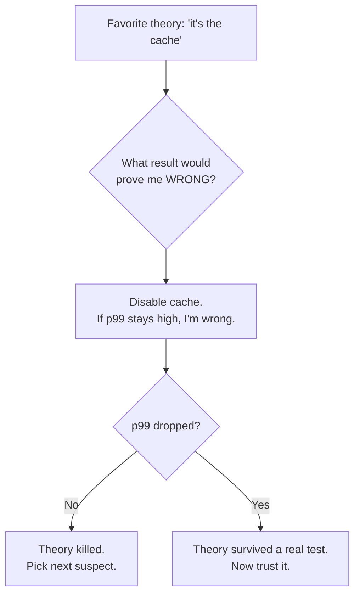

# Hypothesis and Falsifiability — Junior

> **What?** A hypothesis is a *testable, falsifiable* statement about why a system behaves the way it does — one that predicts a specific result you can go check. A vague hunch ("the cache is the problem") becomes a hypothesis when you attach a concrete, refutable prediction ("if I disable the cache, p99 latency drops below 200ms").
>
> **How?** Before you change code or run a test, write down the prediction *and* the result that would prove you wrong. Run the smallest experiment that can produce that result. If the predicted result doesn't appear, your idea is wrong — move on. Don't chase the theory that *feels* right; chase the one you can disprove fastest.

---

## 1. Hunch vs. hypothesis

Most debugging starts with a hunch — a gut feeling about where the problem is. Hunches are fine as a *starting point*. They become dangerous when you act on them without making them testable, because then you can't tell whether you've made progress.

A **hunch** is a vague belief. A **hypothesis** is a hunch turned into a sentence with a prediction inside it.

| Hunch (vague) | Hypothesis (testable) |
| --- | --- |
| "The cache is the problem." | "If I disable the cache, p99 drops below 200ms." |
| "It's a memory leak." | "If it's a leak, RSS will grow ~10MB per hour and never fall, even when idle." |
| "The new query is slow." | "If I revert the query to the old version, the endpoint's p95 returns under 80ms." |
| "It's probably the network." | "If it's the network, `ping` to the DB host will show >50ms RTT or packet loss during the spike." |

The right-hand column has two things the left-hand column lacks: a **specific action** ("disable the cache") and a **specific predicted result** ("p99 < 200ms"). Together they make a claim you can *check*. That is the whole game.

### Why "specific" matters

"The cache is the problem" can never be wrong. If you disable the cache and nothing improves, you can still say "well, maybe it's a *different* part of the cache." A claim that survives every possible result tells you nothing. "p99 drops below 200ms" *can* be wrong — and that's exactly why it's useful.

---

## 2. Falsifiability: a hypothesis you can't disprove is useless

This is the core idea, and it comes from the philosopher **Karl Popper** (*The Logic of Scientific Discovery*, 1934). Popper argued that what separates real knowledge from empty talk is **falsifiability**: a meaningful claim must rule something out. It must be possible, at least in principle, to observe a result that would prove the claim false.

Apply this to engineering:

- "It's probably a network blip" → **unfalsifiable as stated.** A blip is, by definition, transient and gone. There's no experiment that can prove it *wasn't* a blip. So this claim ends the investigation without explaining anything.
- "Works on my machine" → **unfalsifiable as stated.** It describes one environment and predicts nothing about the broken one. It can't be wrong, and it can't help.

To make these useful, force a prediction out of them:

- Network blip → "If it was a transient network event, the errors are clustered in a <60s window and don't recur. If I see the same errors steadily over the next hour, it wasn't a blip."
- Works on my machine → "If the difference is environmental, the failing machine has a different value for `TZ` / library version / config flag X. Let me diff the two environments."

Now both claims rule something out. Now they can be checked.

> **Rule of thumb:** If you can't describe a result that would make you abandon your theory, you don't have a hypothesis — you have a belief. Beliefs don't get fixed.

---

## 3. The kill criterion: "if I don't see Y, X is wrong"

Every hypothesis you test should come with a **kill criterion** — the result that ends it. Write it *before* you run the experiment, so you can't move the goalposts afterward.

The template is simple:

```
HYPOTHESIS: <X — the suspected cause>
EXPERIMENT:  <the smallest thing I can do to test it>
PREDICTION:  if X, I expect Y
KILL:        if I don't see Y, X is wrong — I drop it and pick the next hypothesis
```

A worked example from a real-feeling bug:

```
SYMPTOM:    /checkout returns 500 about 2% of the time
HYPOTHESIS: a downstream payment call is timing out
EXPERIMENT: grep the logs for the payment-client timeout error around each 500
PREDICTION: if the timeout is the cause, ~every 500 has a matching timeout log within 1s
KILL:       if 500s happen with NO nearby timeout log, the timeout is not the cause
```

You run the grep. Result: only 3 of the last 50 errors have a nearby timeout. **Kill it.** The timeout explains a few cases but not the 2%. You've spent five minutes and *eliminated* a suspect — that's real progress, even though your guess was wrong.

The discipline of writing the kill criterion first is what stops you from staring at ambiguous output and convincing yourself it "kind of confirms" your theory.

---

## 4. Confirmation bias: the enemy

Here is the trap everyone falls into. Once you have a favorite theory, your brain starts collecting evidence *for* it and quietly ignoring evidence *against* it. This is **confirmation bias**, and in debugging it wastes hours.

You'll notice it as a pattern:

- You're sure it's the database. You find one slow query, feel vindicated, and stop looking — even though that query runs once an hour and the bug happens every minute.
- You re-run the failing request "to confirm," it passes once, and you declare it fixed.

The cure is a mindset flip from the scientific method: **don't try to confirm your theory — try to break it.** Actively go looking for the result that would prove you wrong. If your theory survives a genuine attempt to falsify it, *now* you can trust it. If it dies, good — you saved yourself from a wrong fix.



---

## 5. One thing at a time

When you test a hypothesis, change **one variable** and hold everything else fixed. This comes straight from controlled experiments in science.

Suppose latency is high and you suspect both a slow query *and* a cold connection pool. If you bump the pool size **and** add an index in the same deploy, and latency improves — which one fixed it? You don't know. You've learned nothing about cause, and you may have shipped a useless change alongside the real one.

Test them separately:

1. Add the index alone → measure. Did p95 move?
2. Bump the pool alone → measure. Did p95 move?

Now each result is attributable. The cost is one extra round; the payoff is *knowing* what mattered.

> There are times to change several things at once (you're firefighting and just need it up). But when your goal is *understanding the cause*, isolate one variable.

---

## 6. A complete tiny walkthrough

Symptom: an internal dashboard takes ~8 seconds to load, intermittently.

```
HYPOTHESIS 1: a single slow API call dominates the load
EXPERIMENT:   open browser DevTools → Network tab → reload, sort by time
PREDICTION:   if one call dominates, I'll see one request ~7s, the rest fast
KILL:         if all calls are <500ms but the page is still slow, it's not one call
```

You reload. Every network call is under 400ms — but the page still hangs for 8s. **Hypothesis 1 killed.** It's not the network. The slowness is *after* the data arrives — probably rendering or client-side work.

```
HYPOTHESIS 2: client-side rendering of a big list is the bottleneck
EXPERIMENT:   DevTools → Performance tab → record a reload
PREDICTION:   if rendering is the cause, I'll see a long scripting/layout block after the fetches
KILL:         if the main thread is idle during the hang, rendering isn't it
```

You record. There's a 7-second scripting block rendering 20,000 table rows with no virtualization. **Hypothesis 2 survives.** Now you have a real lead — and you got there by *eliminating* the network first instead of guessing.

Notice what happened: you didn't "find the bug" by being clever. You found it by proposing falsifiable claims and letting the wrong ones die quickly.

---

## 7. What to take away

- A **hypothesis** is a hunch plus a specific, refutable prediction.
- **Falsifiable** means there's a result that would prove it wrong. If nothing can prove it wrong, it can't help you (Popper).
- Always write the **kill criterion** *before* the experiment.
- Fight **confirmation bias** by trying to break your favorite theory, not confirm it.
- Change **one variable at a time** when you want to understand cause.

This is the foundation for everything in this section. Next, see how the same mindset scales to controlled [experiments and A/B testing](../02-experiments-and-ab-testing/), why you should [measure before optimizing](../03-measure-before-optimize/), and how it connects to [systematic debugging](../../02-problem-solving/05-debugging-as-problem-solving/).

---

### References

- Karl Popper, *The Logic of Scientific Discovery* (1934) — falsifiability as the line between science and non-science.
- See also: [critical thinking](../../04-critical-thinking/) for the bias-defeating habits this builds on, and the [section overview](../).

---
## Check your understanding

Try to answer these questions from memory:

1. What's the difference between a hunch and a hypothesis?
2. What does "falsifiable" mean, and why does it matter in debugging?
3. What is a "kill criterion" and when do you write it?
