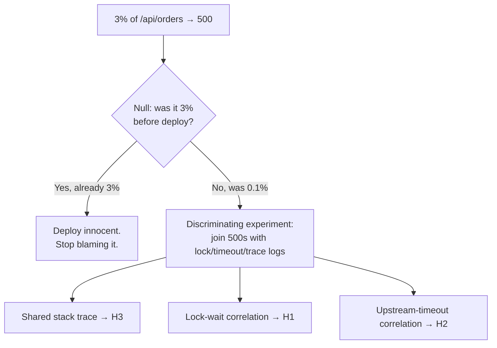

# Hypothesis and Falsifiability — Middle

> **What?** Treating each step of an investigation as a *falsifiable prediction* rather than a guess to be confirmed — and deliberately choosing the experiment that most cleanly separates the *competing* explanations, not the one that flatters your favorite. You move from "test my idea" to "run the test whose outcome forces me to discard at least one candidate."
>
> **How?** Enumerate the live hypotheses, attach a kill criterion to each, and pick the single experiment whose result splits the field fastest. Track which suspects are alive vs. eliminated. Treat the *null hypothesis* — "nothing here is causal; it's coincidence" — as a real candidate you must rule out, not background noise.

---

## 1. From single guesses to a hypothesis set

A junior debugger tests one idea at a time, sequentially, often the first one that came to mind. A mid-level debugger holds the whole **set of live hypotheses** at once and reasons about which test best discriminates between them.

This is **strong inference**, named by John Platt in his 1964 *Science* paper of that title. Platt's recipe:

1. Devise **alternative** hypotheses (plural — not one favorite plus strawmen).
2. Devise an experiment whose outcomes will **exclude** one or more of them.
3. Carry it out cleanly.
4. Repeat on the survivors.

The key word is *exclude*. A good experiment is one whose every possible outcome kills something. If a test would leave all your hypotheses standing no matter how it comes out, it's a bad test — don't run it.

### Worked example: the 500s

Symptom: `/api/orders` returns 500 on ~3% of requests, started after this morning's deploy.

Live hypotheses:

| # | Hypothesis | Predicted signature if true |
| --- | --- | --- |
| H1 | The new DB migration locks a table under load | 500s correlate with lock-wait timeouts in DB logs |
| H2 | A downstream service is intermittently timing out | 500s correlate with upstream-client timeout logs |
| H3 | A null-pointer in new code on a specific input shape | 500s correlate with the same stack trace + input field |
| H0 | **Null hypothesis:** it's unrelated to the deploy; pre-existing flakiness | 500 rate was already ~3% before the deploy |

Notice H0. Before you spend an afternoon on H1–H3, **check the null hypothesis first**: pull the 500 rate for the 24h *before* the deploy. If it was already 3%, the deploy is innocent and all three of your causal stories are distractions. That single query can eliminate the entire premise.

Suppose the pre-deploy rate was 0.1%. H0 is killed; the deploy is implicated. Now you need the experiment that best separates H1, H2, H3.

---

## 2. Designing the discriminating experiment

You *could* test H1, H2, H3 one at a time. But a single observation discriminates all three at once: **group the 500s and look at what co-occurs with each.**

```
EXPERIMENT: pull 50 recent 500 errors; for each, join the DB lock log,
            the upstream-timeout log, and the application stack trace by request-id.
```

The outcome splits the field in one shot:

| Observation | Eliminates | Survives |
| --- | --- | --- |
| All 50 share one stack trace, no lock/timeout nearby | H1, H2 | H3 |
| 500s line up with lock-wait timeouts | H2, H3 | H1 |
| 500s line up with upstream timeouts | H1, H3 | H2 |
| 500s scattered, no common signal | H1, H2, H3 (rethink) | — |

This is what "maximally discriminating" means: one experiment, three hypotheses potentially killed. Compare that to naively reverting the deploy — that might fix the symptom but tells you *nothing* about which of the three was the cause, so you can't prevent recurrence or write the right test.



---

## 3. The null hypothesis mindset in debugging

In statistics the **null hypothesis (H0)** is the default "there is no effect" — the position you assume until the evidence forces you to reject it. Importing this into debugging is a quiet superpower.

Your H0 should usually be one of:

- **"This is coincidence / noise."** The correlation you spotted is random. (Two metrics spiked together; that doesn't mean one caused the other.)
- **"Nothing changed; the symptom was always there, you just noticed it now."**
- **"My change had no effect."** When you apply a fix, the null is *it didn't help* — and a single passing run does not reject it.

The discipline: **state the null and try to reject it on evidence, not vibes.** When you "fix" a flaky test and it passes once, the null ("my change did nothing; it's still flaky") is very much alive — a 50%-flaky test passes half the time by chance. You haven't rejected H0 until it passes, say, 50 times in a row. Running it once and declaring victory is failing to take the null seriously.

> **Trap:** treating *absence of the symptom on one trial* as proof the symptom is gone. For an intermittent bug, you need enough trials that the probability of "still broken but got lucky" is negligible.

---

## 4. Falsifiability under uncertainty: make claims that rule things out

Mid-level work is messier than the junior examples — symptoms are intermittent, signals are noisy. The falsifiability discipline matters *more* here, not less, because noise gives confirmation bias room to operate.

Compare two ways of framing the same investigation:

**Unfalsifiable framing (stalls):**
> "It might be a network blip, or maybe GC pauses, or possibly the load balancer. Let me poke around."

This can't fail and can't conclude. Every observation can be retrofitted to *some* part of it. Days vanish.

**Falsifiable framing (converges):**
> "H_gc: if GC pauses cause the latency spikes, then the spikes line up with full-GC events in the GC log, and disabling/​tuning GC removes them. **Kill:** if spikes occur during windows with zero GC activity, GC is not the cause."

The second one has a result that ends it. Force every "maybe" into this shape before you spend time on it.

### Quantifying the prediction

Where you can, make the prediction **numeric** — it sharpens the kill criterion and resists wishful reading.

```
H: connection-pool exhaustion is causing the timeouts.
PREDICTION: if true, active_connections hits the pool max (=20) during every
            error window, and p99 latency tracks the time-spent-waiting-for-a-conn metric.
KILL: if errors occur while active_connections < 15, exhaustion isn't the cause.
```

"Pool exhaustion" is hand-wavy; "`active_connections` reaches 20 during every error window" is checkable and refutable.

---

## 5. One variable vs. multivariate — when each is right

The "change one thing at a time" rule (Section 5 of the junior file) is the default for *causal attribution*. But you should understand its limits:

| Situation | Approach | Why |
| --- | --- | --- |
| You need to know *which* factor is the cause | One variable at a time | Each result is attributable |
| The search space is large and you need to *localize* fast | **Bisection** (a structured multi-step "one variable" sweep) | Binary search over commits/config halves the space each step |
| Factors may **interact** (effect of A depends on B) | Factorial / multivariate experiment | One-at-a-time can't reveal interactions; see [experiments and A/B testing](../02-experiments-and-ab-testing/) |
| You're firefighting; cause can wait | Change several, restore service | Diagnosis is secondary to recovery — but go back and isolate later |

**Bisection** deserves a callout because it's the most efficient hypothesis-testing tool many engineers underuse. "The bug was introduced somewhere in these 200 commits" is a hypothesis space; `git bisect` runs a falsifiable test at the midpoint ("if the bug is in the older half, this commit reproduces it") and halves the space each round — ~8 tests for 200 commits. That's strong inference applied to version history.

---

## 6. Tracking the investigation as a hypothesis ledger

As an investigation runs longer than a few minutes, keep an explicit ledger. It externalizes the hypothesis set so confirmation bias can't quietly drop the inconvenient candidates.

```
ORDERS-500 INVESTIGATION LEDGER
─────────────────────────────────────────────
H0  pre-existing flakiness      KILLED  (was 0.1% pre-deploy)
H1  migration table-lock        KILLED  (zero lock-waits in error windows)
H2  upstream timeout            ALIVE   (12/50 errors had nearby timeout — partial)
H3  null-ptr on input shape     ALIVE   (38/50 share trace at OrderMapper:88)
NEXT: H3 explains the majority. Reproduce OrderMapper:88 locally with the
      offending input shape. If a unit test with that input throws, H3 confirmed.
```

The ledger makes two things obvious that memory hides: H1 is *dead* (stop revisiting it) and H2+H3 together might both be real (two bugs, not one — a common reality the single-favorite-theory mind misses).

---

## 7. Takeaways

- Hold a **set** of hypotheses, not one favorite; design the experiment that **excludes** the most candidates per run (Platt, strong inference).
- Always include and check the **null hypothesis** first — coincidence, no-change, my-fix-did-nothing.
- Force every "maybe" into a falsifiable, ideally **numeric** prediction with a kill criterion.
- **One variable** for attribution; **bisection** to localize; **multivariate** when factors interact.
- Keep a **ledger** of alive vs. killed hypotheses so bias can't drop the awkward ones.

Continue to the [senior](./senior.md) level for designing experiments under cost and risk constraints, and connect this with [measure before optimize](../03-measure-before-optimize/), [spikes and prototypes](../04-spikes-and-prototypes/), and [debugging as problem-solving](../../02-problem-solving/05-debugging-as-problem-solving/).

---

### References

- John R. Platt, "Strong Inference," *Science* 146:3642 (1964) — design experiments that exclude alternatives.
- Karl Popper, *The Logic of Scientific Discovery* (1934) — falsifiability.
- The null hypothesis — standard statistical-inference framing applied to debugging. See also [critical thinking](../../04-critical-thinking/).

---
## Use it today

1. State the cause, expected effect, and measurable prediction.
2. List competing hypotheses, not just your favorite.
3. Test the prediction that separates them most cheaply.

## Recall and apply

Try to answer these questions from memory:

1. You believe a slow query is the cause of a latency spike. How do you test it scientifically?
2. What is the null hypothesis, and how does it apply to debugging?
3. You "fixed" an intermittent test, ran it once, it passed. Is it fixed?
4. Explain strong inference. How does it change how you debug?
