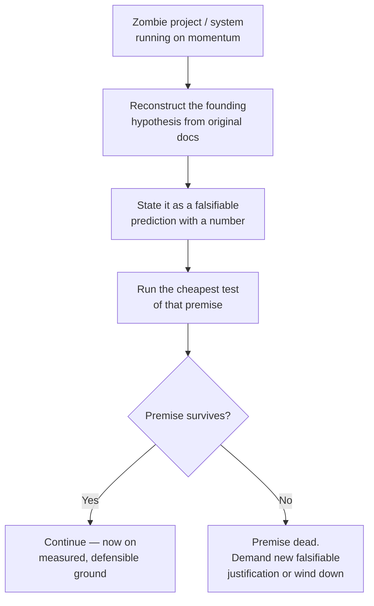

# Hypothesis and Falsifiability — Professional

> **What?** Institutionalizing falsifiable, hypothesis-driven thinking across an organization — so that incident response, technical strategy, and project portfolios all run on testable predictions with explicit kill criteria, rather than on authority, momentum, or the loudest theory. At staff/principal scale the unit of work is not "debug this" but "make the whole org reason this way and stop funding the unfalsifiable."
>
> **How?** Embed kill criteria into incident processes, RFC templates, and project charters; make falsifiability a review gate. Build the cultural muscle to *kill zombie projects* by forcing their premises into falsifiable form and checking them. Lead by modeling the harder discipline — publicly killing your own theories — because the org copies what senior people *do*, not what they say.

---

## 1. The organizational failure mode this prevents

Individual engineers can be taught strong inference. Organizations, by default, drift toward the opposite: decisions justified by **seniority, momentum, or narrative** rather than by checkable predictions. The symptoms are familiar to anyone who's been in a large eng org:

- Incidents close with "we believe it was a transient issue" and recur a month later — the explanation was never falsifiable, so nothing was actually learned.
- A re-platforming project runs for three quarters on the original premise ("the monolith can't scale") that *no one has tested* since the offsite where it was asserted.
- A perf initiative ships because a VP is attached to it, not because anyone predicted-and-verified a user-facing improvement.

The staff/principal job is to make the organization's beliefs **falsifiable and checked**. This is less about being the smartest debugger and more about *changing what counts as a valid reason to do something*: "because it's testable and we tested it" must beat "because someone senior said so."

---

## 2. Hypothesis-driven incident response

A mature incident process *is* strong inference with roles and a clock. Institutionalize it:

### The incident hypothesis board

During an active incident, maintain a shared, visible board — one row per hypothesis, updated live:

```
INC-4821  checkout error rate 12%  ·  SEV2  ·  IC: priya
──────────────────────────────────────────────────────────────────
ID  HYPOTHESIS                         STATUS    KILL CRITERION              OWNER
H0  pre-existing / not our change      KILLED    rate was 0.2% at T-1h       sam
H1  payment provider degraded          KILLED    provider status green +     sam
                                                  our other regions fine
H2  bad deploy r-1138 (cart service)   ALIVE     errors started at 14:02,    lee
                                                  deploy landed 14:01;
                                                  KILL if rollback doesn't
                                                  drop error rate in 5 min
H3  DB failover left stale replica      ALIVE     KILL if replica lag = 0     priya
──────────────────────────────────────────────────────────────────
ACTION: rolling back r-1138 (tests H2). Predicted: error rate < 1% by 14:20.
```

Three things this buys an org that ad-hoc incident response doesn't:

1. **No silent hypothesis death.** Everyone sees which suspects are alive; the inconvenient ones don't get dropped because the senior responder forgot them.
2. **Pre-registered kill criteria** stop the "well, it kind of helped" rationalization mid-incident, when bias is at its peak.
3. **The board becomes the postmortem's spine.** "We tested H1, H2, H3; H2 was the cause; here's the evidence" is a real RCA. "We think it was probably the deploy" is not.

### Postmortems must reach a falsified/confirmed root cause

Make it a review gate: a postmortem whose root cause is unfalsifiable ("likely a transient network issue," "intermittent flakiness") is **incomplete** and gets sent back. Either produce the prediction that would confirm the stated cause and check it, or label it explicitly "root cause unknown; here is the experiment that would identify it." Both are honest. "Probably a blip," accepted as closure, is how the same incident happens three times.

> The action items from a postmortem are themselves hypotheses ("adding this alert will catch this class of incident earlier"). Track whether they actually do — most orgs never check whether their remediations *worked*, which is its own unfalsified belief.

---

## 3. RFCs and strategy as falsifiable predictions

A technical strategy is a portfolio of bets about the future. Treat it like one. Bake falsifiability into the **RFC template** so it can't be skipped:

```markdown
## Hypotheses & Kill Criteria   (required section)

| # | Claim this design depends on | How we'll know it's WRONG | When we check |
|---|------------------------------|---------------------------|---------------|
| 1 | Sharding by tenant keeps 99% of queries single-shard | If cross-shard query share > 10% in shadow traffic | Before GA, via shadow read |
| 2 | This cuts p99 by ≥ 40% | If staging load test shows < 20% improvement | Spike, week 1 |
| 3 | Migration completes in < 4h maintenance window | If dry-run on prod-copy exceeds 6h | Dry-run, before scheduling |

## Decision reversal
If kill criterion #2 fires, we abandon this approach and fall back to <X>.
```

The **"how we'll know it's wrong"** column is the whole point. It does several things at once:

- Forces authors to surface the *load-bearing* assumptions (the ones that, if false, sink the project).
- Converts review from taste-debate into **bet-evaluation**: reviewers argue about the kill criteria and priors, not vibes.
- Creates a pre-committed **off-ramp**, which is the antidote to sunk-cost escalation. A project that has pre-agreed "if we see X, we stop" can actually stop.

A claim no author is willing to attach a kill criterion to is a claim no author actually believes is checkable — and that's exactly the claim most likely to be wishful. Surfacing it in review is high-leverage.

---

## 4. Killing zombie projects via falsification

A **zombie project** is one whose original justification is no longer true (or was never tested) but which continues on momentum, sunk cost, and the fact that nobody has standing to question the premise. These are among the most expensive things in a large org, and falsifiability is the tool that kills them cleanly — without it becoming a political knife-fight.

The move is to **reconstruct the project's founding hypothesis and test it as stated.**

### Worked example

A two-year "rewrite the monolith into microservices" program. Founding premise, from the original deck: *"The monolith cannot scale to our 2026 traffic; we must decompose it."*

Don't argue about microservices philosophy. **Falsify the premise:**

```
FOUNDING HYPOTHESIS: the monolith cannot serve projected 2026 peak (≈ 3× current).
EXPERIMENT: load-test the *current* monolith at 3× synthetic traffic on
            representative hardware. Cost: ~3 days.
PREDICTION (if premise true): it falls over / p99 blows past SLO well before 3×.
KILL (premise false): if it sustains 3× within SLO on bigger instances,
            the founding justification is dead — the project needs a NEW
            justification or it stops.
```

Three honest outcomes:

| Result | Meaning | Action |
| --- | --- | --- |
| Monolith dies at 1.5× | Premise holds | Project justified — continue, but now with a *measured* scaling cliff to design against |
| Monolith sustains 3× comfortably | **Premise falsified** | The stated reason is gone. Either find a real new justification (e.g., team-autonomy, deploy independence) and *state it falsifiably*, or wind the project down |
| Monolith sustains 3× but at 5× infra cost | Premise partially holds | Reframe as a cost-optimization bet with its own kill criterion |

The discipline depersonalizes the kill. You're not saying "your project is bad" — you're saying "the project's *own stated premise* makes a prediction; let's check it." If the premise survives, great, the project is on firmer ground than before. If it dies, the org reclaims headcount honestly. Three days of load testing can settle a question that politics would chew on for two more quarters.

> The same lens kills smaller zombies: a feature flag that's been "temporarily" on for 18 months ("we need it for X" — is X still true? what would prove it isn't?), a cache layer kept "because it helps" (does it? what hit rate would make it not worth its complexity?), a nightly job no one's sure is used ("if it's load-bearing, killing it for a week breaks *something measurable*; if nothing breaks, it's dead weight").



---

## 5. Building the culture: model it, don't mandate it

You cannot order an organization to stop fooling itself. Confirmation bias and authority-deference are defaults that reassert themselves under pressure. What actually moves culture is **what senior people visibly do**:

- **Kill your own theories in public.** When the principal engineer says in the incident channel, *"I was sure it was the cache; I was wrong, here's the evidence that killed my theory,"* it licenses everyone else to do the same. The most senior person being publicly falsifiable is worth more than any process doc. (Feynman's standard — *"you must not fool yourself, and you are the easiest person to fool"* — is a leadership behavior, not a poster.)
- **Reward the kill, not just the fix.** Celebrate the engineer who *eliminated* four hypotheses in an hour, not only the one who landed the patch. Eliminating suspects is the work; the fix is the easy last step.
- **Make "what would prove this wrong?" a normal question** in design reviews, planning, and 1:1s — asked neutrally, of everyone including yourself, so it reads as rigor and not attack.
- **Protect the null-advocate role.** Whoever is assigned to argue "it's coincidence / the project's premise is dead" must be safe from social punishment. If killing a cherished theory is career-risky, no one will do it and the org stays self-deluding.

The measurable goal: over time, "because it's falsifiable and we tested it" should become the *expected* form of a technical argument in your org, and "because it's probably fine / because we've always / because $SENIOR_PERSON said" should feel visibly weak by comparison.

---

## 6. Takeaways

- Run **incident response as a live hypothesis board** with pre-registered kill criteria; reject postmortems whose root cause is unfalsifiable.
- Put a mandatory **"how we'll know it's wrong"** section in the RFC template, with a pre-committed decision-reversal off-ramp.
- **Kill zombie projects** by reconstructing and falsifying their *founding premise* as stated — depersonalized, cheap, honest.
- Treat remediation items and "temporary" systems as **unverified hypotheses** and actually check them.
- Culture changes by **modeling**: senior people publicly falsifying their own theories, rewarding the kill, and protecting the null-advocate.

---

### References

- John R. Platt, "Strong Inference," *Science* 146:3642 (1964).
- Karl Popper, *Conjectures and Refutations* (1963); *The Logic of Scientific Discovery* (1934).
- Richard Feynman, "Cargo Cult Science" (1974) — the leadership standard for intellectual honesty.
- Related: [experiments and A/B testing](../02-experiments-and-ab-testing/), [measure before optimize](../03-measure-before-optimize/), [spikes and prototypes](../04-spikes-and-prototypes/), [debugging as problem-solving](../../02-problem-solving/05-debugging-as-problem-solving/), [critical thinking](../../04-critical-thinking/), and the [section overview](../).

---
## Check your understanding

Try to answer these questions from memory:

1. A teammate closes an incident with "it was probably a transient blip." What do you say?
2. How would you frame a system-design claim like "this will scale" so it's falsifiable?
3. How do you use falsifiability to challenge a long-running project you suspect is a zombie?
4. Quick one: give an example of an unfalsifiable claim engineers make daily, and fix it.
