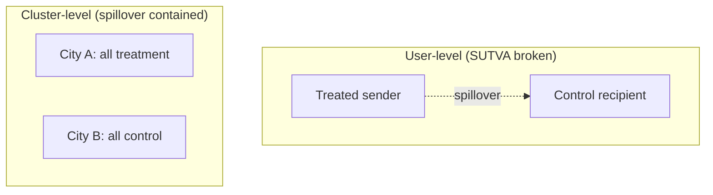

# Experiments and A/B Testing — Senior

> **What?** The failure modes that turn a "correct" experiment into a wrong conclusion: the multiple-comparisons trap, Simpson's paradox, novelty and primacy effects, network effects that violate SUTVA, survivorship in funnels, and variance-correlation traps. These are the things that make a *statistically significant* result still *false*.
>
> **How?** At senior level you own the design and the interpretation. You pre-register the primary metric, control the false-discovery rate when you slice, you reason about whether units are truly independent, you choose the assignment unit to defend against interference, and you treat suspicious results as bugs until proven otherwise.

---

## 1. The multiple-comparisons trap

At p < 0.05, a *true-null* metric has a 5% chance of looking "significant" by luck. Test 20 metrics on a change that does nothing, and you expect **one** false winner. Slice by country, device, browser, and acquisition channel, and you have hundreds of comparisons — false positives are guaranteed.

```
20 independent metrics, all truly null:
P(at least one false positive) = 1 − 0.95²⁰ ≈ 64%
```

This is why **dredging the dashboard for any green number is data-fishing, not analysis.** Defenses:

- **Pre-register one primary metric.** It decides the test. Everything else is hypothesis-generating, not deciding.
- **Correct for multiplicity** when you genuinely have many planned comparisons. Bonferroni (divide α by the number of tests) is crude but safe; Benjamini–Hochberg controls the *false-discovery rate* and is less brutal on power.
- **Treat subgroup wins as hypotheses, not conclusions.** "It worked for users in Brazil" from a post-hoc slice is a *new* experiment to run, not a result to ship.

## 2. Simpson's paradox

A trend that holds in every subgroup can *reverse* when you pool the data — or vice versa. Classic shape:

| Segment | Control | Treatment |
|---------|---------|-----------|
| Mobile | 1 / 100 = **1.0%** | 30 / 1000 = **3.0%** |
| Desktop | 200 / 400 = **50.0%** | 60 / 100 = **60.0%** |
| **Pooled** | 201 / 500 = **40.2%** | 90 / 1100 = **8.2%** |

Treatment **wins in both segments** (3% > 1%, 60% > 50%) yet **loses overall** (8.2% < 40.2%). The cause: the treatment got disproportionately more *mobile* traffic, and mobile converts far worse. The mix differs between arms.

In a *properly randomized* test, the mix should be balanced, so Simpson's paradox flags a problem: a **sample-ratio mismatch (SRM)** — your 50/50 split didn't actually come out 50/50, meaning assignment or logging is broken. The fix is not "pick the answer you like"; it's to find why the populations differ. A chi-squared test on the bucket counts catches SRM cheaply, and you should run it on *every* experiment automatically.

## 3. Sample ratio mismatch — the canary in the coal mine

If you assign 50/50 but observe 50.4% / 49.6% on 2M users, that gap is astronomically unlikely by chance — `p` far below 0.001. SRM means something filtered users *after* assignment differently per arm: a redirect that drops slow clients in treatment, a logging path that fires only on success, a crash in the treatment code that prevents events from being sent (survivorship — see §6). **When SRM fires, the experiment is invalid — stop and debug, don't interpret.** Kohavi et al. rank SRM among the top trustworthiness checks for exactly this reason.

## 4. Novelty and primacy effects

Behavior in the first days of a change is not steady-state behavior.

- **Novelty effect:** users click the shiny new thing *because* it's new. Engagement spikes, then decays. A test stopped at the peak overstates the lift.
- **Primacy / change-aversion:** the opposite — power users are annoyed by a changed UI, dip, then recover and even improve once they relearn. A test stopped early *understates* a good change.

Detection: plot the treatment effect **over time**, not just the average. If the lift is trending toward zero (or the dip is recovering), you haven't reached steady state. Mitigations: run longer; analyze **new users only** (who have no "old" to react to) as a novelty-free read; hold a long-term **holdback** group to measure the durable effect months later.

## 5. Network effects and SUTVA

The statistics of A/B testing rest on **SUTVA** — the Stable Unit Treatment Value Assumption: one unit's outcome depends only on *its own* treatment, not on which treatment other units got. Independent users, independent outcomes.

**Network effects break SUTVA.** Examples where treating user A changes user B's outcome even though B is in control:

- A messaging feature: a treated sender makes the *control* recipient engage more → control is "contaminated" with treatment, shrinking the measured gap.
- A marketplace: showing treatment buyers more listings depletes inventory for control buyers → you measure a fake win that won't survive full rollout.
- Anything with shared resources, social graphs, virality, or auctions.

When SUTVA is violated, ordinary user-level randomization *understates or distorts* the true effect. Defenses:

- **Cluster randomization:** randomize whole units of the network together — markets/cities (one geo all-treatment vs another all-control), social communities, or supply-side regions — so spillover stays *within* an arm.
- **Ego-network / graph-cluster designs** for social products.
- **Switchback tests** for marketplaces: flip the *entire* system between treatment and control in time slices, comparing periods rather than users. Used heavily for ride-hailing/delivery pricing where everyone shares one supply pool.



The cost is steep: your *effective sample size* drops from millions of users to a handful of cities, so power collapses. There's no free lunch — interference forces a worse-powered design, and you must accept that.

## 6. Survivorship in funnels

A funnel metric measured only on users who *reached* a step silently conditions on survival. If your change causes more weak-intent users to enter step 2, the *average* quality at step 2 drops — making a good change look bad (or vice versa). Worse: if treatment **crashes** for some users, those users vanish from your event logs entirely, and you're comparing all-of-control against the survivors-of-treatment. That's how survivorship produces SRM (§3).

Rule: define the metric on the **assigned** population (intent-to-treat), not the surviving population. Everyone bucketed into treatment counts in the denominator, including those who bounced — that's the only honest comparison, and it mirrors what production rollout will actually do.

## 7. Variance traps: correlated units and ratio metrics

The sample-size math in [middle.md](./middle.md) assumes **independent units**. Two common violations:

- **Per-request randomization** counts each request as an independent unit. They aren't — one user's requests are correlated, so the true variance is higher than the formula assumes. You'll think you have 10M independent observations when you effectively have 200k users. Result: confidence intervals far too narrow, false positives everywhere. Randomize and analyze at the **user** level (or use the **delta method / clustered standard errors** for ratio metrics like "clicks per session" where the denominator itself varies per user).
- **Outliers / heavy tails.** Revenue per user is dominated by whales; one big spender can swing the mean. Cap (winsorize) extreme values, or analyze a robust metric, so a single account doesn't decide your experiment.

A practical power booster worth knowing: **CUPED** (Controlled-experiment Using Pre-Experiment Data) uses each user's pre-period behavior as a covariate to subtract out baseline variance, often cutting required sample size 30–50% with no bias. It's the standard variance-reduction technique on mature platforms.

## 8. Twyman's law and the trust mindset

> **Twyman's law:** any figure that looks interesting or different is usually wrong.

A senior's reflex on seeing a 30% lift is not joy — it's suspicion. Big, clean, surprising results are far more often instrumentation bugs (double-logged events, a metric definition mismatch, SRM, a leaked treatment) than genuine breakthroughs. Build the habit: **verify the pipeline before believing the result.** Re-run the A/A, check SRM, confirm the metric definition, look for a deploy that coincided. Most "too good to be true" experiments are exactly that.

---

## Key takeaways

- **Multiple comparisons** manufacture false winners; pre-register one primary metric and correct (FDR/Bonferroni) for planned slices.
- **Simpson's paradox** and **SRM** signal a broken split or differing mix — debug, don't cherry-pick. Run a chi-squared SRM check on every experiment.
- **Novelty/primacy** mean early effects aren't steady-state — plot effect over time, run long, use holdbacks.
- **Network effects break SUTVA**; contain spillover with cluster/switchback designs, accepting the power hit.
- Measure on the **assigned (intent-to-treat)** population to avoid **survivorship**.
- **Correlated units and heavy tails** wreck variance estimates; randomize/analyze at the user level, winsorize, and consider **CUPED**.
- **Twyman's law:** treat surprising results as bugs until the pipeline is verified.

## Where to go next

- [professional.md](./professional.md) — running an experimentation platform and a trustworthy-experiment culture.
- [Cognitive biases in code decisions](../../04-critical-thinking/03-cognitive-biases-in-code-decisions/) — the human side of fooling yourself with data.
- [Probabilistic thinking](../../06-probabilistic-thinking/) — variance, base rates, risk.
- [Section root](../) · [Engineering Thinking roadmap](../../README.md)

---
## Use it today

1. Review experiment design for bias, interference, power, and harm before launch.
2. Give the experiment an owner and a precommitted decision rule.
3. **Decision rule:** ship only when the primary result and guardrails support the stated threshold.

## Recall and apply

Try to answer these questions from memory:

1. What's a guardrail metric and why do you need one?
2. You randomize per request instead of per user. What breaks?
3. Explain Simpson's paradox in an experiment and what it implies.
4. What is an A/A test and what does it catch?
