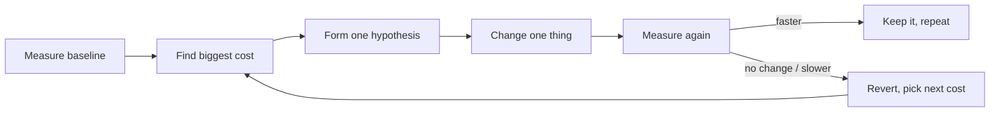

# Measure Before Optimize — Junior

> **What?** "Measure before optimize" is the discipline of finding out *where* your program actually spends its time and memory — by measuring — before you change any code to make it faster. It is the opposite of guessing.

> **How?** You run the program under a profiler or with timers on a realistic workload, read the numbers, identify the single biggest cost, change *only* that, and measure again to confirm the change actually helped. Numbers decide, not intuition.

---

## 1. The core problem: humans guess wrong

When code feels slow, the instinct is to *guess* what's slow and start "improving" it. This instinct is reliably wrong. Decades of profiling experience point to the same lesson: the bottleneck is almost never where you think it is.

A classic shape of a program's cost:

```
Function                  % of total time
----------------------------------------
parseInput                  2%
validate                    1%
buildIndex                 71%   <-- the real cost
render                      3%
formatOutput                1%
everything else            22%
```

If you'd guessed "the rendering is slow" and spent two days speeding up `render` from 3% to 1.5%, you'd have made the whole program **1.5% faster** and felt productive the entire time. The 71% sitting in `buildIndex` was invisible to your intuition. Measuring would have pointed straight at it.

> The rule: **don't optimize what you haven't measured.** You will waste effort on the wrong thing.

## 2. The famous Knuth quote — and what it really means

You will hear this line constantly, usually as a one-liner:

> "Premature optimization is the root of all evil."

It comes from Donald Knuth's 1974 paper *Structured Programming with go to Statements*. People quote it to mean "never optimize." That is **not** what Knuth said. The fuller quote is:

> "We *should* forget about small efficiencies, say about 97% of the time: premature optimization is the root of all evil. **Yet we should not pass up our opportunities in that critical 3%.**"

Read the whole thing and the message flips:

- **Don't** micro-optimize the 97% of code that doesn't matter (it adds bugs and complexity for nothing).
- **Do** optimize the critical 3% that does matter — *once you have measured and know which 3% it is.*

So the quote is not an anti-optimization slogan. It's a *pro-measurement* slogan. The only way to know which 3% is critical is to measure.

## 3. The measure → change → re-measure loop

Optimization is a small experiment, run over and over:



The non-negotiable steps:

1. **Measure a baseline.** Record an exact number *before* you touch anything: "search takes 840 ms."
2. **Change exactly one thing.** If you change three things and it gets faster, you don't know which one helped (and one of them may have hurt).
3. **Measure again.** Compare against the baseline. "Search now takes 210 ms" — confirmed improvement. "Search now takes 835 ms" — your change did nothing; revert it.

If you skip step 1, you have nothing to compare to and you're back to guessing. If you skip step 3, you're shipping a *belief* that your code is faster, not a *fact*.

## 4. The simplest measurement: a timer

You don't need fancy tools to start. A timer around the suspect code already beats guessing:

```python
import time

start = time.perf_counter()
result = build_index(records)      # the thing we suspect
elapsed = time.perf_counter() - start

print(f"build_index took {elapsed*1000:.1f} ms")
```

Run it on **realistic input** — the same number of records you'd see in production, not 10 rows. (We'll come back to "realistic" in a moment, because it matters a lot.)

Use `perf_counter` (a high-resolution monotonic clock), not the wall clock, and run a few times — the first run is often slower because caches are cold.

## 5. The next step up: a profiler

A timer tells you *one* number. A **profiler** runs your whole program and tells you where *all* the time went, automatically, without you guessing which functions to time.

```bash
# Python — record where time goes, then read it sorted by cost
python -m cProfile -o out.prof myscript.py
python -c "import pstats; pstats.Stats('out.prof').sort_stats('cumulative').print_stats(10)"
```

A profiler output (simplified):

```
   ncalls  tottime  cumtime  function
        1    0.004   0.840    main
   500000    0.610   0.610    build_index   <-- 73% of total, called 500k times
        1    0.002   0.110    render
```

Two numbers to read:

- **tottime** — time spent *inside* this function itself.
- **cumtime** — time spent in this function *plus everything it calls*.

Here `build_index` is the obvious target: 0.61 s of the 0.84 s total. Now you know *exactly* where to spend your effort — no guessing required.

## 6. Pick the right number to look at

"Fast" is vague. Decide *what* you're measuring before you measure it:

| Metric | What it tells you | When you care |
|---|---|---|
| **Latency** | How long *one* operation takes | A user is waiting (page load, API call) |
| **Throughput** | How many operations per second | A batch/queue must keep up |
| **Memory / allocations** | How much it allocates and holds | OOM crashes, GC pressure, cost |

Speeding up the wrong metric is a common junior mistake: you cut latency in half but the system was throughput-bound, so nothing improved for users.

One trap worth flagging early, even at this level: **don't trust averages alone.** "Average response time is 50 ms" can hide the fact that 1 in 100 requests takes 2 seconds. The senior levels cover percentiles (p99); for now, just remember the average can lie.

## 7. A worked mini-example

You're told "the report page is slow." Here's the junior, disciplined approach:

1. **Reproduce on realistic data.** Load a report with the size a real customer has (say 50,000 rows), not your 12-row test fixture.
2. **Baseline.** Page renders in **3,200 ms**. Write that down.
3. **Profile.** The profiler says 2,700 ms is in a function that re-queries the database *inside a loop* — once per row (the classic "N+1" pattern).
4. **One change.** Fetch all rows in a single query before the loop.
5. **Re-measure.** Page now renders in **410 ms**. Confirmed: 3,200 → 410.

Notice you never touched the rendering code, the CSS, or the "obvious" suspects. The profiler pointed at the database loop, and one change fixed it. That's the whole game.

## 8. Common beginner mistakes

- **Optimizing before measuring.** "This loop looks slow" → you rewrite it cleverly → it was 0.3% of runtime. Wasted day.
- **Measuring on toy data.** 10 rows runs in 1 ms; the bug only appears at 50,000 rows. Always measure at realistic scale.
- **Changing many things at once.** Now you can't attribute the result. One change per measurement.
- **No baseline.** "It feels faster" is not evidence. Record the before-number.
- **Trusting the first run.** Cold caches make the first run slow. Run several times.

## 9. Where this fits

Measuring before optimizing is the performance version of the scientific method: form a hypothesis ("`build_index` is the bottleneck"), test it (profile), keep or reject it based on evidence. See [hypothesis and falsifiability](../01-hypothesis-and-falsifiability/) for the general pattern, and the [section overview](../) for how this connects to experiments and prototypes.

**Takeaway for juniors:** Slow code is a *measurement* problem before it is a *coding* problem. Time it, profile it, find the real bottleneck, change one thing, measure again. The famous Knuth quote isn't telling you to never optimize — it's telling you to never optimize *blind*.

---
## Use it today

1. Measure the baseline before proposing an optimization.
2. Identify the largest cost in the real workload.
3. Change one thing, measure again, and keep the result.

## Recall and apply

Use these prompts to check your understanding and choose one action to try in your next task.

Try to answer these questions from memory:

1. What does Knuth actually mean by "premature optimization is the root of all evil"?
2. State Amdahl's law and why it matters before optimizing.
3. Why report p99 instead of the average latency?
