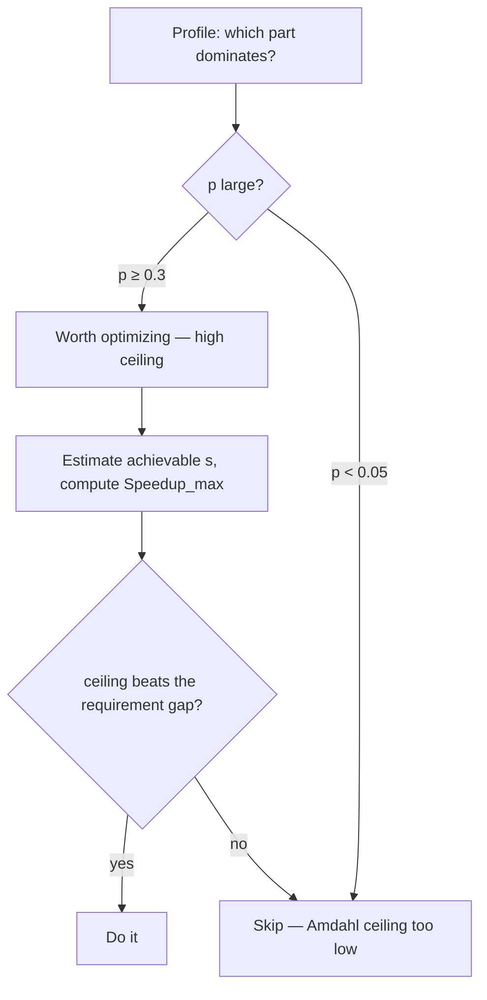

# Measure Before Optimize — Middle

> **What?** A repeatable, evidence-driven workflow for performance work: establish a baseline on a representative workload, profile to locate the dominant cost, compute the *ceiling* a fix can reach (Amdahl's law), change one thing, and re-measure against the baseline with the right metric — latency percentiles, throughput, or allocation rate — not averages.

> **How?** You pick the metric that matches the requirement, build a representative benchmark, take a baseline, read flame graphs and profiler output to find the hot path, estimate the maximum possible gain *before* coding, apply one change, and verify the win is real and statistically distinguishable from noise.

---

## 1. Choosing the right metric (averages lie)

The single most common mid-level error is optimizing the **average**. Averages hide the tail, and the tail is what users feel.

Consider 1,000 API requests:

```
p50  (median)   =  20 ms     half of requests are faster than this
p90             =  45 ms
p99             = 850 ms     1 in 100 requests
p999            = 3,400 ms   1 in 1,000 requests
mean (average)  =  31 ms     looks great — and is a lie
```

The mean of 31 ms says "fast." But 1% of your users wait 850 ms and 0.1% wait 3.4 seconds. On a page that makes 50 backend calls, the *probability* a user hits at least one p99-class call is `1 - 0.99^50 ≈ 39%`. So roughly **two in five page loads** are dragged down by tail latency the average never showed you. This is the central thesis of Dean & Barroso's *The Tail at Scale* (2013): in fan-out systems, the tail latency of components becomes the typical latency of the whole.

| Metric | Use when | Watch out for |
|---|---|---|
| **p50 / median** | Typical experience | Ignores the tail entirely |
| **p99 / p999** | User-facing latency, SLOs | Needs enough samples (≥1,000 for p99) |
| **throughput (req/s)** | Batch, queues, pipelines | Can rise while latency degrades |
| **allocation rate (MB/s)** | GC pressure, memory cost | Invisible to a pure latency view |
| **mean** | Almost never alone | Hides bimodal / tailed distributions |

**Rule:** for anything a human waits on, report percentiles. Reserve the mean for throughput-style aggregates.

## 2. Amdahl's law — know your ceiling before you code

Before optimizing a component, compute the *best case*. Amdahl's law gives the maximum speedup of the whole when you speed up a part:

```
                 1
Speedup_max = ---------------------
              (1 - p) + p / s
```

where `p` = fraction of total time the part consumes, `s` = how much faster you make that part.

Worked example. A request takes 100 ms; 5 ms is in a function you can make **10× faster** (`p = 0.05`, `s = 10`):

```
Speedup = 1 / ((1 - 0.05) + 0.05/10)
        = 1 / (0.95 + 0.005)
        = 1 / 0.955
        = 1.047×   →  100 ms becomes 95.5 ms
```

You worked hard for a **4.5%** gain. Even if you made that 5% section *infinitely* fast (`s → ∞`), the ceiling is `1/0.95 = 1.053×` — you can never beat 5.3%, because 95% of the time was untouched.

Now flip it: the part is **80%** of the time (`p = 0.8`) and you make it 2× faster:

```
Speedup = 1 / (0.2 + 0.8/2) = 1 / 0.6 = 1.67×  →  100 ms becomes 60 ms
```

Same effort, a 40% win, because you attacked the dominant cost. **Amdahl's law is the math behind "profile first": it tells you that optimizing a small `p` is capped no matter how clever you are.** Compute the ceiling, and if it's 4.5%, don't start.



## 3. Baseline + representative workload

A measurement is only as good as the workload it ran on. Two requirements:

**Baseline.** Record a fixed before-number under controlled conditions: same machine, warm caches, no other load, several runs. Report it with variance — "p99 = 120 ms ± 6 ms over 10 runs" — so a later "improvement" can be judged against noise.

**Representative workload.** The input must look like production:

- **Right size** — production cardinality, not a 10-row fixture.
- **Right shape** — real key distributions (hot keys, skew), not uniform-random. A cache hit rate measured on uniform keys is fiction.
- **Right mix** — the real read/write ratio, real request type proportions.

```
Toy benchmark:        1,000 uniform keys → 99% cache hit → "blazing fast"
Production reality:    Zipfian keys, 40% cold → 60% cache hit → 4× slower
```

Optimizing against an unrepresentative workload tunes your code for a world that doesn't exist.

## 4. The right tool for the question

Different questions need different instruments. Reaching for the wrong one wastes hours.

| Question | Tool |
|---|---|
| Which function burns CPU? | **Sampling profiler** → flame graph |
| Where does *wall-clock* time go (incl. waiting)? | **Tracing** / async profiler (off-CPU) |
| How many times does X happen? | **Counters / metrics** (cache hits, allocs, queries) |
| Is change A faster than B, precisely? | **Micro-benchmark** harness |
| Where is latency spent across services? | **Distributed tracing** (spans) |

### Reading a flame graph

Brendan Gregg's flame graphs visualize a sampling profiler's output: **width = time on CPU** (samples), stacked by call depth. You read them by scanning for **wide boxes** — wide means hot.

```
[ main ................................................. ] 100%
  [ handleRequest .................................. ]    78%
    [ serialize ........... ][ dbQuery ........... ]      (38% / 40%)
      [ json.Marshal ..... ]   [ rowScan ........ ]
```

A wide `json.Marshal` says serialization is your bottleneck — go look there. Narrow towers are cheap; ignore them. Color is usually meaningless (just contrast); **only width matters**. Off-CPU flame graphs (showing blocked/waiting time) catch the bottlenecks a normal CPU profile misses — a request stuck waiting on a lock shows zero CPU but huge latency.

## 5. The disciplined loop, mid-level version

```python
def optimize_cycle(workload):
    baseline = measure(workload, runs=10)          # p50, p99, alloc — with variance
    profile  = profile_run(workload)               # flame graph / pprof
    hot      = profile.dominant_cost()             # biggest p
    ceiling  = amdahl(hot.fraction, expected_speedup)
    if ceiling < required_gain:
        return "skip — ceiling too low"            # Amdahl says don't bother
    apply_one_change(hot)
    after = measure(workload, runs=10)
    if not significantly_better(before=baseline, after=after):
        revert()                                   # change did nothing real
    return after
```

`significantly_better` means the improvement exceeds the noise band — if baseline is 120 ± 6 ms and "after" is 117 ms, that's noise, not a win.

## 6. Micro vs macro benchmarks (and how they lie)

- **Micro-benchmark** — measures one function/loop in isolation. Precise, but easily fooled.
- **Macro-benchmark** — measures an end-to-end path (full request). Realistic, but noisier and harder to attribute.

Use micro-benchmarks to *compare two implementations* of a hot path you already found via macro profiling. Never use a micro-benchmark to *decide what's hot* — that's what the profiler is for.

Common micro-benchmark lies:

- **Dead-code elimination** — the compiler sees your result is unused and deletes the work. Your "loop" measures nothing. (Consume the result: assign to a sink, print it, return it.)
- **No warmup** — JIT/HotSpot languages run interpreted then compile hot code; the first iterations are 10–50× slower. Discard warmup iterations or you measure the compiler, not the code.
- **Constant folding** — fixed inputs let the compiler precompute the answer at compile time.
- **Unrealistic data** — sorted input where production is random, all-cache-hit where production misses.

```go
// Go: prevent dead-code elimination by assigning to a package-level sink
var sink int
func BenchmarkHash(b *testing.B) {
    var s int
    for i := 0; i < b.N; i++ {
        s += hash(data)   // result is used...
    }
    sink = s              // ...and escapes, so the compiler can't delete it
}
```

If a benchmark reports a function runs in **0.3 ns**, be suspicious — that's roughly one CPU cycle; the work was probably optimized away.

## 7. Observer effect: measurement isn't free

Instrumentation costs time, and heavy instrumentation can distort the very thing you measure.

- **Instrumenting (tracing) profilers** wrap every call — overhead can be 2–10× and inflates cheap, frequently-called functions, lying about where time goes.
- **Sampling profilers** interrupt at a fixed rate (e.g. 99 Hz) and record the stack. Overhead is typically 1–5% and roughly uniform, so the *shape* stays honest. Prefer sampling for finding hotspots.
- **Fine-grained timers** in a tight loop can cost more than the code being timed.

The fix: profile with a sampling profiler to find the hotspot, then micro-benchmark just that path. Don't trust a tracing profiler's absolute numbers for tiny hot functions.

## 8. Putting it together

A representative checklist for any mid-level performance task:

1. Define the metric and target (p99 < 200 ms? 10k req/s?).
2. Build a representative workload; take a baseline with variance.
3. Profile; identify the dominant `p`.
4. Compute the Amdahl ceiling — is the win even possible?
5. Change one thing; re-measure; confirm it beats noise.
6. Stop when you hit the target (see the senior file on "fast enough").

See also [experiments and A/B testing](../02-experiments-and-ab-testing/) for the statistical-significance side of "is this difference real," and [first-principles reasoning](../../05-first-principles-thinking/01-reasoning-from-fundamentals/) for deriving the latency floor a system can *physically* reach.

---
## Check your understanding

Try to answer these questions from memory:

1. Your micro-benchmark says a function runs in 0.3 ns. Why don't you believe it?
2. CPU is at 20% but p99 latency is terrible. Where do you look?
3. Explain the USE method.
4. How do you read a flame graph?
