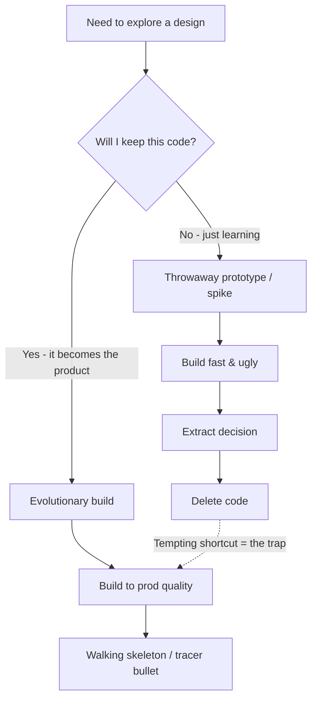

# Spikes and Prototypes — Middle

> **What?** Spikes and prototypes are *time-boxed exploratory builds* that exchange a fixed amount of effort for reduced uncertainty about a design. The spike (an XP technique) answers a single technical question with throwaway code; prototyping comes in two flavours — **throwaway** and **evolutionary** — and choosing the wrong one is how teams ship experiments to production by accident.
>
> **How?** You frame the spike as a research task with an explicit *acceptance question* and a *time box*, run it to get evidence, write a one-page conclusion, and feed a real decision back to the team. You learn to recognise the steel-thread / tracer-bullet techniques as the *evolutionary* cousins of the throwaway spike, and to keep the two mentally separated.

---

## 1. The spike as a controlled experiment

At its core, a spike is the scientific method applied to a build risk:

1. **Hypothesis** — "I believe library X can do Y at acceptable cost."
2. **Time box** — "I'll find out in ≤ 4 hours."
3. **Experiment** — the smallest code that exercises the risky part.
4. **Observation** — does it work? How well? What broke?
5. **Conclusion** — a recorded decision: do this, not that, because…

This is the same loop as [hypothesis and falsifiability](../01-hypothesis-and-falsifiability/). The spike's value comes from being *honestly falsifiable*: you should be able to learn "no, this doesn't work" just as easily as "yes." If your spike can only succeed, you didn't design an experiment — you designed a demo.

### Why the time box is the whole point

The time box isn't a soft suggestion; it's the mechanism that makes a spike *safe*. Without it, "exploration" expands to fill all available time, and you've turned a 2-hour risk-reduction exercise into a 2-week rabbit hole. The time box says: *"the uncertainty is worth at most N hours of my time to resolve."* If you hit the box without an answer, **that is itself a result** — the problem is harder than expected, which is valuable information for planning.

> A spike that overruns its time box has failed at being a spike, even if the code works.

---

## 2. Throwaway vs evolutionary prototyping

A *prototype* is a partial build used to learn about a design. The critical distinction is **what happens to the code afterward**.

| | **Throwaway (rapid) prototype** | **Evolutionary prototype** |
|---|---|---|
| **Goal** | Learn, then *discard* | Learn, then *keep and grow* |
| **Quality** | Deliberately low — speed over rigor | Production-grade from the start |
| **Risk** | Wasted code (intended) | Accidentally locking in early mistakes |
| **A spike is…** | …a throwaway prototype | (never — spikes are always thrown away) |
| **Examples** | UI mockups, library bake-off, perf probe | Walking skeleton, tracer bullet |

A **spike is always throwaway prototyping.** The mistake teams make is starting a *throwaway* prototype, getting a working result, and silently treating it as the *evolutionary* one — promoting code that was never built to last. Decide up front which kind you're doing, and label it. If you genuinely intend to keep and grow the code, you must build it to production standards *from line one* — which is slower, which means it's no longer a fast spike.



---

## 3. Walking skeleton and tracer bullets

These are *evolutionary* techniques, often confused with spikes because they're also early and minimal. They are minimal but **real** — they are kept and grown, not deleted.

### Walking skeleton (Alistair Cockburn)

A **walking skeleton** is a tiny end-to-end implementation that exercises the *whole* architecture — every major component connected, but each doing almost nothing. A web app's walking skeleton might be: a real HTTP handler that calls a real service method that does a real (trivial) database write and returns a real response — wired through your real build, deploy, and CI pipeline.

You build it not to answer one question but to **de-risk the integration**: prove the pieces connect and deploy before you fill them with logic. It "walks" (runs end-to-end) but has no muscle yet.

### Tracer bullets (Hunt & Thomas, *The Pragmatic Programmer*)

A **tracer bullet** is the same idea framed as a metaphor: in the dark, you fire a glowing round so you can *see where your shots land and adjust*. In code, you build a thin slice through every layer of the system, get it working end-to-end, then thicken it. Hunt & Thomas are explicit that tracer code is **not** throwaway — unlike a prototype, it's the real skeleton you keep building on.

> **Key contrast.** Spike: throwaway code answering *one question*. Tracer bullet / walking skeleton: kept code proving *the layers connect*. Confusing them leads to either over-engineering a spike or under-building a skeleton.

---

## 4. De-risking the riskiest assumption first

When a project has several unknowns, the worst strategy is to do the easy parts first and leave the scary unknown for the end — because if the scary part is impossible, everything you built around it was wasted.

The senior move is **risk-first ordering**: identify the assumption that, if false, kills or reshapes the whole plan, and spike *that* before anything else.

```
Project: "Real-time fraud scoring on checkout"
Assumptions, ranked by (impact-if-wrong × uncertainty):

1. [HIGH × HIGH] Can the ML model return a score in < 50ms?   ← spike THIS first
2. [HIGH × LOW ] Can we read the order from the DB?            (obviously yes)
3. [LOW  × HIGH] Will the dashboard charts library do X?       (cosmetic; defer)
```

You spike assumption #1 immediately. If the model can't hit 50ms, the entire "synchronous at checkout" design is dead and you redesign *before* writing a line of real code. This is [first-principles thinking](../../05-first-principles-thinking/) applied to scheduling: don't trust the comfortable assumption, find the load-bearing one and test it.

---

## 5. Running a spike well — a worked example

**Context:** Your team must add full-text search. Someone suggests Postgres `tsvector`; someone else insists you need Elasticsearch. Nobody knows if Postgres is fast enough at your data size. Classic spike.

**Frame it as an acceptance question:**

```markdown
SPIKE-91: Is Postgres full-text search fast enough for our catalog?
Acceptance question: At 5M products, does a typical search return p95 < 200ms?
Time box: 1 day
Owner: priya    Decision needed by: Thursday standup
```

**Run the smallest real experiment** — load representative data, build the index, measure:

```sql
-- throwaway spike SQL — measuring, not building
CREATE INDEX idx_search ON products USING GIN (to_tsvector('english', name || ' ' || description));

EXPLAIN ANALYZE
SELECT id, name FROM products
WHERE to_tsvector('english', name || ' ' || description) @@ plainto_tsquery('english', 'wireless headphones')
LIMIT 20;
-- Read the timing. Run 100 varied queries, record p95.
```

Note this is *measurement*, which ties to [measure before optimize](../03-measure-before-optimize/) — you don't argue about which is faster, you measure with realistic data.

**Conclude with a decision, not a vibe:**

```markdown
ANSWER: Yes. With a GIN index on 5M rows, p95 = 140ms across 100 sample queries.
DECISION: Use Postgres FTS. Skip Elasticsearch — saves an entire service to operate.
CAVEAT: Re-test if catalog exceeds ~20M rows; index build took 6 min (ok for now).
SPIKE CODE: deleted. Real ticket: SEARCH-12.
```

That writeup just saved the team from operating an Elasticsearch cluster on a guess.

---

## 6. Managing spikes on a team

A spike is a **research task**, and it has to be tracked differently from a feature task:

| Feature task | Spike task |
|---|---|
| Has an estimate | Has a **time box** (a cap, not a guess) |
| Done = code shipped | Done = **question answered + writeup** |
| Output = working feature | Output = a **decision** |
| Reviewed for quality | Reviewed for *what we learned* |

Two common failure modes to guard against:

- **Estimating a spike.** "How long will the spike take?" misunderstands it. You don't estimate uncertainty; you *cap* it. The right answer is "we'll spend up to a day and report back."
- **No acceptance question.** A spike ticket that just says "investigate caching" will sprawl. Force every spike to name the *one question* and the *decision it unblocks*.

> On the board, a spike is a card that reads: **"Spend ≤ X to answer Q so we can decide D."** If you can't fill in Q and D, it's not ready to be a spike.

---

## 7. When NOT to spike (revisited at this level)

Spiking has a cost, and over-spiking is its own anti-pattern. Skip it when:

- The answer is in the **docs or source** of the tool you're evaluating.
- A **back-of-envelope calculation** settles it (capacity, latency budgets).
- It's a **reversible decision** — if you can change your mind cheaply later, just pick one and move; the spike's overhead isn't worth it.
- The unknown is a **design preference**, not a fact — resolve it by discussion or a design doc, not code.

Spike when the decision is **expensive to reverse** *and* the answer is **unknowable without running code.** That intersection is the only place a spike pays for itself.

---

## 8. Takeaways

- A spike is a **falsifiable, time-boxed experiment** whose output is a decision.
- **Throwaway vs evolutionary** prototyping is the key fork — a spike is always throwaway; confusing the two is the prod-trap.
- **Walking skeleton** and **tracer bullets** are *kept*, end-to-end, evolutionary techniques — not spikes.
- De-risk the **highest impact × uncertainty** assumption *first*.
- On a team, a spike is a **research card** with a *question* and a *time box*, never an estimate.

Continue to [senior](./senior.md) for spike strategy across a roadmap, governing throwaway-vs-keep, and killing directions cheaply on spike evidence.

---
## Check your understanding

Try to answer these questions from memory:

1. Why is the time box essential, not optional?
2. When should you NOT spike?
3. What's the difference between throwaway and evolutionary prototyping?
4. What are tracer bullets, and how do they differ from a spike?
