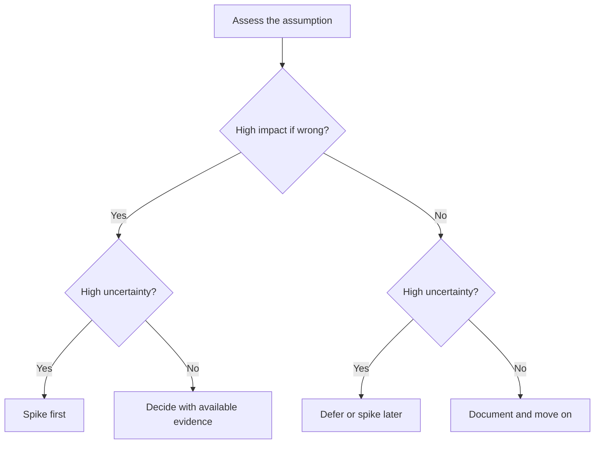
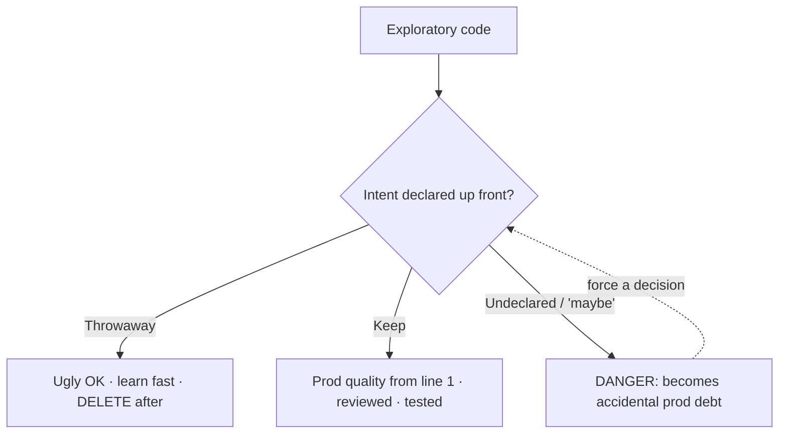

# Spikes and Prototypes — Senior

> **What?** At the senior level, spiking is not a one-off tactic but a *de-risking strategy*: a deliberate way to sequence uncertainty across a feature or project so that the cheapest possible experiment kills the most expensive possible mistake. You own the discipline that keeps spikes honest — explicit questions, real time boxes, throwaway code, recorded decisions — and the judgment about *which* unknowns deserve a spike at all.
>
> **How?** You map a project's unknowns by impact × uncertainty, design spikes that can *fail loudly*, run them risk-first, and convert results into decisions and design docs. You guard the team against the prototype-to-production trap, and you treat "the spike said no" as a *win* — a cheaply-killed direction is the highest ROI a spike can deliver.

---

## 1. Spikes as a risk-reduction strategy, not a task type

A junior runs a spike when they're stuck. A senior runs spikes *before anyone is stuck*, as a planned activity at the front of risky work. The mental shift is from "spike = I don't know how to do this" to "**spike = I am deliberately spending a known amount of effort to remove a known piece of risk before it becomes expensive.**"

Every nontrivial project carries a portfolio of unknowns. Your job is to triage them:



- **High impact × high uncertainty** → spike *first*. These are project-killers hiding in plain sight.
- **High impact × low uncertainty** → no spike; you already know, just build it well.
- **Low impact × high uncertainty** → defer; spike only if it bubbles up.
- **Low impact × low uncertainty** → ignore.

The discipline is resisting the gravitational pull toward the *comfortable* unknowns (the ones you half-know how to solve) and forcing attention onto the *scary* ones.

---

## 2. Designing a spike that can fail loudly

A weak spike is one rigged to succeed — you pick the happy-path input, the small dataset, the well-behaved API call, and conclude "it works." That's a demo, not an experiment. A strong spike, like any good experiment, is designed around the way it could **fail**:

> Ask: *"What's the single observation that would tell me this approach is wrong?"* — then go build the smallest thing that produces (or fails to produce) that observation.

For a "can Postgres handle our search load" spike, the failure-seeking version uses *production-scale* data, *adversarial* queries (rare terms, long phrases), and *concurrent* load — because those are where it would actually break. This is [falsifiability](../01-hypothesis-and-falsifiability/) applied to engineering: an experiment that can't disconfirm your belief teaches you nothing.

| Rigged spike (avoid) | Honest spike (aim for) |
|---|---|
| 1,000 rows of clean data | Production-scale, messy data |
| Single happy-path request | Concurrent + adversarial inputs |
| "Looks fast on my laptop" | Measured p95 against a stated threshold |
| Stops at first success | Stops at a decision (pass *or* fail) |

---

## 3. The throwaway-vs-keep decision, governed

The single most consequential governance call around spikes is: *does this code get thrown away or kept?* Getting it wrong in either direction is costly.

- **Wrongly keeping it (the trap):** spike code — no tests, no error handling, hardcoded shortcuts — gets "promoted" because it works. Every deliberate shortcut becomes permanent debt. This is the **prototype-to-production trap**, and as a senior you are the last line of defense against it.
- **Wrongly throwing it away:** sometimes a careful exploratory build *is* worth keeping (a walking skeleton). Deleting it on dogma wastes good work.

The governing rule:

> **Decide throwaway-vs-keep *before* you start, and let that decision set the quality bar.** If it's throwaway: optimize ruthlessly for learning speed, and *commit to deleting it*. If it's keep: build to production standard from line one — which means it's not a fast spike anymore, it's a walking skeleton, and it should be planned and reviewed as real work.

The danger zone is *ambiguity*: code written "to explore" with a quiet hope it might survive. That hope is what produces the worst production code in any company. Kill the ambiguity by naming the intent in the ticket and in the branch.



---

## 4. Killing a direction cheaply — the highest-ROI outcome

The best thing a spike can do is **save you from building the wrong thing.** A spike that returns "no, this won't work" after one day prevents weeks of doomed work — that's an enormous return, yet teams often treat it as a disappointment.

Reframe it explicitly:

> A spike that **kills a direction** is a success, not a failure. You bought certainty cheaply and dodged an expensive mistake.

Practical implications for how you lead:

- **Celebrate negative results.** If your team feels that "the spike didn't pan out" is a black mark, they'll start rigging spikes to succeed — and you lose the entire value of the practice.
- **Pre-commit to acting on the answer.** Before the spike, agree: *"If p95 > 200ms, we drop the synchronous design."* Deciding the response in advance prevents motivated reasoning when the inconvenient result arrives. (Same principle as pre-registering an experiment.)
- **Make the kill cheap to execute.** Risk-first ordering means the killable assumption is tested *before* you've built scaffolding around it, so killing it costs almost nothing.

### Worked: killing a direction

```markdown
SPIKE-204: Can we do client-side video transcoding in the browser (WASM ffmpeg)?
Pre-committed decision rule:
  - If a 2-min 1080p clip transcodes in < 30s on a mid-range laptop → pursue it.
  - If not → drop client-side; do server-side transcoding.

RESULT: 2-min clip took 4m10s; tab froze; mobile OOM-crashed.
DECISION: Killed client-side transcoding. Server-side it is.
VALUE: Avoided ~3 sprints building a feature that would never have shipped.
Spike branch deleted. Findings → ADR-017.
```

One day spent; three sprints saved; and crucially the kill was *pre-agreed*, so there was no sunk-cost argument.

---

## 5. Spikes vs the other "minimum" things — a senior's precise vocabulary

Seniors get called on to disambiguate these in design reviews. Keep the table sharp:

| Artifact | Core question | Kept? | Built to prod quality? | Who decides "done" |
|---|---|---|---|---|
| **Spike** | One technical unknown | No | No | Question answered |
| **Throwaway prototype** | What should the UX/shape be? | No | No | Learning captured |
| **PoC** | Is this whole approach viable? | Sometimes | Partially | Stakeholders convinced |
| **Walking skeleton** | Do the layers connect end-to-end? | Yes | Yes (thin) | Pipeline runs e2e |
| **Tracer bullet** | Same — thin real slice to aim by | Yes | Yes | Slice works e2e |
| **MVP** | Will real users get value? | Yes | Yes | Shipped to users |

The fault line runs between the first three (exploratory, low-quality, learning-oriented) and the last three (real, production-quality, kept). Mislabeling across that line is the root cause of most "we accidentally shipped a prototype" postmortems.

---

## 6. When NOT to spike — senior judgment

Over-spiking is an anti-pattern that masquerades as diligence. Don't spike when:

- **The decision is reversible and cheap to change.** Reserve spikes for one-way-door decisions; for two-way doors, just pick and move (decision velocity beats certainty).
- **The answer is in the docs, the code, or a colleague's head.** Reading and asking are faster than experimenting.
- **A calculation suffices.** Latency budgets, capacity, and throughput often yield to arithmetic — see [measure before optimize](../03-measure-before-optimize/) for when to compute vs. when to instrument.
- **You're using the spike to avoid a hard decision.** Endless "more research" is a procrastination smell. If you have enough evidence to decide, decide.

> The senior heuristic: **spike one-way doors that are unknowable without code; talk through everything else.**

---

## 7. Embedding spikes in the workflow

- **A spike is a research ticket with an acceptance question and a time box**, not an estimate. Track it as such; "done" = decision recorded.
- **Output flows into an ADR or design doc**, not just a closed ticket — the decision and its evidence must outlive the spike.
- **Time-box overruns are signals.** Hitting the cap without an answer means the problem is harder than the plan assumed — escalate that to planning immediately.
- **Pair spikes with pre-committed decision rules** so the result is acted on without re-litigation.

This connects to [questioning assumptions](../../05-first-principles-thinking/02-questioning-assumptions/): a senior's spikes target the *load-bearing assumption nobody has verified*, not the assumptions that are merely uncomfortable.

---

## 8. Takeaways

- Treat spiking as a **planned de-risking strategy**, triaged by impact × uncertainty, run risk-first.
- Design spikes to **fail loudly** — production-scale, adversarial, measured against a stated threshold.
- **Govern throwaway-vs-keep up front**; ambiguity is what produces accidental prod debt.
- A spike that **kills a direction is a win** — pre-commit to the decision rule so you act on bad news without sunk-cost arguments.
- **Don't spike** reversible decisions, knowable facts, or to dodge a decision you already have evidence for.

Continue to [professional](./professional.md) for spike *budgets* across a roadmap, portfolio-level de-risking, and governing exploration as an organizational practice.

---
## Check your understanding

Try to answer these questions from memory:

1. What is a walking skeleton?
2. Several unknowns in a project — which do you spike first?
3. How do you make sure a spike actually answers something?
4. How is a spike tracked differently from a feature on the board?
