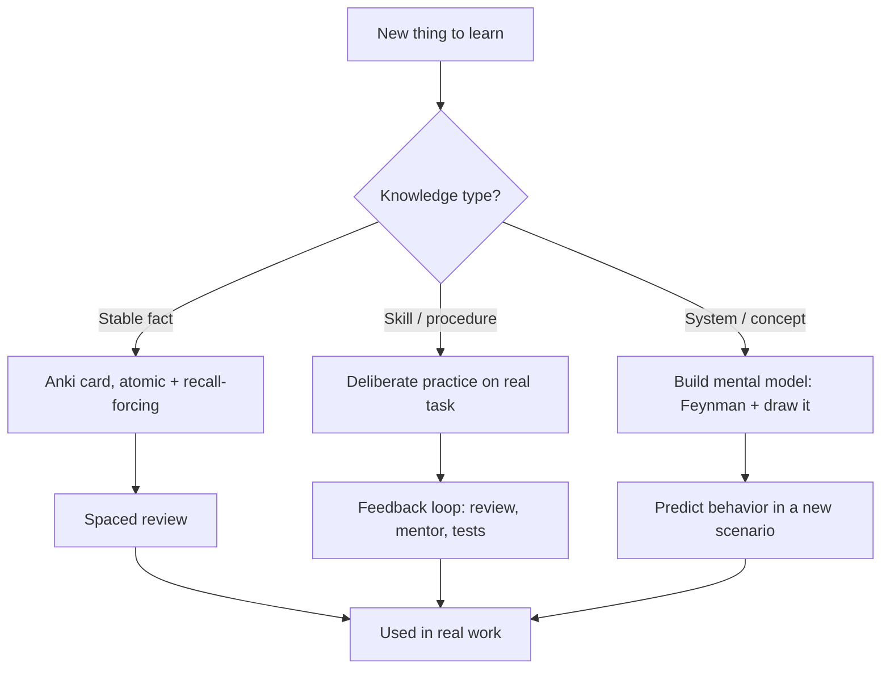

# Learning How to Learn — Middle

> **What?** At the middle level, learning how to learn becomes a deliberate system: spaced repetition tooling for facts, retrieval practice for skills, and effective techniques for reading code, docs, and papers you didn't write.
> **How?** You match the tool to the knowledge (flashcards for atomic facts, projects for procedural skill), build mental models instead of memorizing snippets, and learn unfamiliar codebases through structured exploration rather than reading top-to-bottom.

---

## 1. Matching the Method to the Knowledge

The junior lesson — active recall and spacing beat re-reading — is universal. The middle-level skill is knowing *which technique fits which kind of knowledge*. Cognitive science distinguishes:

| Knowledge type | Example | Best acquired by |
| --- | --- | --- |
| **Declarative** ("knowing that") | `git reset --hard` discards changes; HTTP 429 = too many requests | Flashcards / spaced repetition |
| **Procedural** ("knowing how") | Designing an API; debugging a deadlock; refactoring safely | Deliberate practice on real tasks |
| **Conceptual** (models & relationships) | How TCP backpressure works; why an index speeds reads | Feynman + building, then explaining |

Using the wrong method is why people stall. Flashcarding "how to design a system" doesn't work — that's procedural and conceptual, not a fact to memorize. Conversely, trying to *practice your way* into remembering every HTTP status code is slow when a 20-card deck would lock them in.

---

## 2. Spaced Repetition: Where Flashcards Help an Engineer (and Where They Don't)

Spaced repetition software (SRS) like Anki schedules each card to reappear *right before you'd forget it*, stretching the interval each time you recall successfully. It is extraordinarily efficient for **atomic, stable facts**.

**Where flashcards genuinely pay off for engineers:**

- Language/library APIs you use often but not daily (slice tricks, `strftime` codes, regex anchors).
- Keyboard shortcuts and CLI flags (`git`, `kubectl`, vim).
- Stable facts: HTTP semantics, SQL isolation levels, Big-O of common operations, port numbers, protocol fields.
- Vocabulary of a new domain you're ramping into (finance terms, medical codes).

**Where flashcards fail or even hurt:**

- **Anything procedural.** You can't flashcard your way to "good API design." Skill comes from doing.
- **Volatile facts.** Don't memorize a config option that changes every release — bookmark it.
- **Things you'll look up in 3 seconds and use constantly anyway** — daily use *is* the spacing.
- **Understanding.** A card that asks "what is a monad?" with a memorized one-liner gives you the words without the model.

> **Heuristic:** flashcard a fact only if (a) it's stable, (b) you need it from memory in flow, and (c) you forget it between uses. Everything else: build models and look it up.

**Card-writing discipline matters.** A card should test *one* atom and force *recall*, not recognition:

```
BAD (recognition, multi-fact):
Q: Tell me about Postgres isolation levels.

GOOD (atomic, recall):
Q: Which Postgres isolation level prevents phantom reads but not by default?
A: Serializable (REPEATABLE READ in Postgres also blocks phantoms via SSI).
```

---

## 3. Building Mental Models, Not Snippet Libraries

The difference between a junior and a strong mid-level engineer is largely about **mental models** — internal simulations of how a system behaves. A model lets you *predict* ("if I add this index, reads speed up but writes slow down") rather than recall a snippet.

To build a model of a system, repeatedly ask:

- **What problem does this exist to solve?** (A garbage collector exists because manual memory management is error-prone.)
- **What's the cost it's trading?** (GC trades pause time for safety.)
- **What breaks it?** (Allocating too fast outruns the collector.)
- **What's the simplest version?** Strip it to first principles, then add complexity back.

When you can *predict* a system's behavior under a new scenario you've never seen, you have a model. When you can only recall what you saw, you have a snippet. This connects directly to [first-principles thinking](../../05-first-principles-thinking/).

---

## 4. Chunking: Why Experts See What You Don't

In a famous series of studies, Chase & Simon (1973, building on de Groot) showed chess masters a board for 5 seconds, then asked them to reconstruct it. On *real game positions*, masters reconstructed them almost perfectly while novices managed only a few pieces. But on *random* positions, masters were no better than novices.

The masters weren't seeing 25 individual pieces — they were seeing a handful of **chunks**: familiar patterns ("castled kingside," "isolated pawn structure"). Their memory advantage vanished when the patterns were random because there was nothing to chunk.

This is exactly what happens as you grow as an engineer. A novice reads `for i := 0; i < n; i++` character by character. You read it as "a loop over n." Later you read an entire visitor pattern, retry-with-backoff, or producer-consumer setup as *one chunk*. Experts don't have bigger working memory — they've compressed experience into reusable patterns.

**The practical lesson:** deliberately study *patterns*, not just instances. When you solve a problem, ask "what category is this?" Learning design patterns, algorithmic patterns, and architectural patterns is literally building chunks so future problems become "oh, that's just a fan-out/fan-in."

---

## 5. Reading Code You Didn't Write

You will spend far more of your career *reading* code than writing it. Reading an unfamiliar codebase top-to-bottom is almost always a mistake — it's passive, it overflows working memory, and you forget the start by the end.

**A structured approach:**

1. **Start from the outside in.** What does the program *do*? Find the entry point (`main`, the route handler, the CLI command) and the README.
2. **Follow one real path, not the whole tree.** Pick a single feature ("what happens when a user logs in?") and trace it. One vertical slice beats a horizontal survey.
3. **Run it and add a breakpoint / log.** Watching real values flow through teaches more in five minutes than an hour of static reading. This is active, not passive.
4. **Use the tooling.** "Go to definition," "find references," and `git log -p <file>` to see *why* code looks the way it does.
5. **Form a hypothesis, then verify.** "I bet this function validates the token." Check. Predicting-then-checking is retrieval practice applied to code.
6. **Draw the model.** Sketch the 5–6 boxes (services, modules) and the arrows between them. If you can draw it, you understand it.

> Reading code is a learning task — apply retrieval practice. Predict what a function does *before* reading its body, then check. Passive scrolling teaches almost nothing.

---

## 6. Reading Docs and Papers Effectively

**Docs.** Don't read reference docs linearly; they're a lookup table, not a tutorial. For a new tool, read the *tutorial/quickstart* first to build a model, then keep the *reference* for just-in-time lookup. Read the "concepts" or "architecture" page before the API list — it gives you the chunks the API entries fit into.

**Papers and deep technical posts.** Use a multi-pass approach (popularized by S. Keshav's "How to Read a Paper"):

| Pass | What you read | Goal |
| --- | --- | --- |
| 1 | Title, abstract, intro, conclusion, headings | Is this even relevant? What's the claim? |
| 2 | Figures, tables, key paragraphs | Grasp the main idea without proofs |
| 3 | Everything, re-deriving the hard parts | Deep understanding (only if you need it) |

Most papers deserve only pass 1. The skill is *deciding how deep to go* — see [just-in-time vs. just-in-case](#7-just-in-time-vs-just-in-case-learning) below.

---

## 7. Just-In-Time vs. Just-In-Case Learning

| | Just-in-time | Just-in-case |
| --- | --- | --- |
| When | A real task needs it now | You'll need it broadly and often |
| Pro | Immediately applied → sticks; no wasted effort | Ready when you need to move fast |
| Con | Can leave gaps in fundamentals | Easy to over-invest in things you never use |
| Use for | Specific libraries, configs, one-off integrations | Fundamentals: your language, data structures, how systems fail |

The mid-level judgment call is allocating between them. Invest *just-in-case* in things that are foundational, slow to learn, and broadly applicable (concurrency, your primary language's runtime, SQL). Learn *just-in-time* the long tail of specific tools. Spending a weekend mastering a library you'll touch once is a poor trade.

---

## 8. A Middle-Level Learning System



---

## 9. Key Takeaways

- **Match the method to the knowledge:** flashcards for stable atomic facts, practice for skills, models for concepts.
- Flashcards help with APIs, shortcuts, and stable facts — **not** with design skill or volatile config.
- Build **mental models** (predict behavior), not snippet libraries (recall examples).
- **Chunking** is why experts see patterns (Chase & Simon) — study patterns deliberately to build chunks.
- Read unfamiliar code **outside-in, one slice at a time, running it** — and predict before reading.
- Read papers in **passes**; most deserve only the first.
- Balance **just-in-time** (the long tail) against **just-in-case** (the foundations).

Next, [senior.md](senior.md) covers deliberate practice in depth, transfer between skills, and the breadth/depth (T-shaped) tradeoff.

**See also:** [Deliberate practice](../03-deliberate-practice/) · [Debugging your own reasoning](../02-debugging-your-own-reasoning/) · [Section overview](../) · [Roadmap root](../../README.md)

---
## Use it today

1. Break a skill into concepts, examples, and practice tasks.
2. Alternate retrieval, feedback, and spaced review.
3. Keep a short log of what you can do unaided and what needs work.

## Recall and apply

Try to answer these questions from memory:

1. When do flashcards (Anki) help an engineer, and when are they useless?
2. Explain deliberate practice. Isn't 10 years of experience enough?
3. Feedback is central to deliberate practice, but engineering feedback is slow and noisy. How do you handle that?
4. Why does the second programming language take so much less time than the first?
