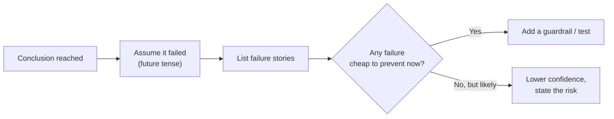
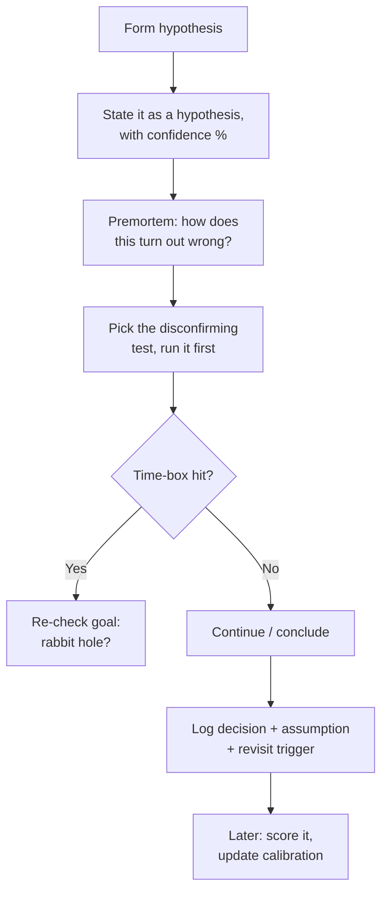

# Debugging Your Own Reasoning — Middle

> **What?** At the middle level, debugging your own reasoning becomes a *systematic practice*: you don't just notice the occasional gut-call, you build repeatable checks that catch your reasoning failures the way a test suite catches code regressions — and you start measuring whether your confidence actually tracks reality (calibration).
> **How?** You run premortems on your own conclusions, attach explicit confidence levels to your estimates and later check them, watch for rabbit holes and the sunk cost of attention, and keep a lightweight decision/bug journal so you can audit *why* you were wrong, not just *that* you were.

---

## 1. From "catch the guess" to "instrument the thinking"

The junior skill was inserting a pause between *feeling sure* and *acting*. The middle skill is realizing that pause is unreliable when you most need it — under pressure, when ego is involved, when you're deep in a problem — so you build **standing instruments** that fire automatically instead of relying on in-the-moment willpower.

Think of it as the difference between "I'll remember to check for nulls" and "I have a linter." You want linters for your reasoning.

| Reasoning bug | Junior fix | Middle-level instrument |
|---|---|---|
| Acting on a hunch | Notice and pause | Premortem before any irreversible action |
| Overconfidence | "Am I sure?" | Calibrated confidence + later scoring |
| Going down a rabbit hole | Feel the frustration | Time-box + "is this still the goal?" check |
| Repeating a mistake | — | Decision/bug journal you actually re-read |

---

## 2. Calibration: separating "confident" from "correct"

Confidence and correctness are *different variables*. A well-calibrated engineer's 90%-confident predictions come true about 90% of the time. A poorly-calibrated one's "definitely by Friday" estimates land on Friday maybe 40% of the time — and they never update, because they never check.

### Put numbers on it

Stop saying "this'll take a couple days." Start saying:

> "**80% confident** it ships by Thursday; **50%** it's done by Wednesday; if the auth refactor bites, it could slip to next Tuesday."

A confidence *interval* is more honest than a point estimate, and it forces you to surface the assumptions that would push you to the bad end of the range.

### Then actually score yourself

Calibration only improves if you close the loop. Keep a running log:

| Prediction | My confidence | Outcome | Right? |
|---|---|---|---|
| "Bug is in the retry logic" | 90% | It was in the timeout config | ✗ |
| "This query needs an index" | 70% | It did | ✓ |
| "Migration takes < 5 min" | 80% | Took 22 min | ✗ |

After ~20 rows you'll see a pattern — almost everyone discovers their "90%" is really about 60%. This is the core training loop behind Philip Tetlock's *Superforecasting* (2015): the best forecasters weren't smarter, they were **calibrated and they updated**. Calibration is a *trainable* skill, and the training is just this scoreboard.

---

## 3. The premortem: debug the conclusion before you ship it

A premortem (Gary Klein) inverts the postmortem. Instead of asking *"why did this fail?"* after the fact, you ask, before acting:

> **"It's three months from now and this decision blew up. What happened?"**

The framing matters. "Could this fail?" invites a defensive "nah, it's fine." "It *did* fail — explain how" gives your brain permission to surface the doubts it was suppressing.



Apply it to your own diagnoses: *"I'm sure the bug is in module X. Premortem: I shipped a fix to X, it didn't help, I lost a day. Why? Because the symptom also appears if Y is misconfigured — and I never checked Y."* Now you check Y first. (Five minutes of premortem just saved a day.)

---

## 4. Rabbit holes and the sunk cost of attention

A rabbit hole is when you keep digging into a sub-problem long after it stopped being the point. The trap is **sunk cost applied to attention**: *"I've already spent two hours understanding this thread-pool internals, I can't stop now."* But the hours you spent are gone whether you continue or not — they're not a reason to spend more.

### Catching yourself mid-hole

Set a **time-box and a tripwire**:

- Before diving in, say: "I'll give this 30 minutes." Set an actual timer.
- When it fires, ask: **"Is solving this still the fastest path to my real goal?"**
- If you can't even remember the original goal, you're in a hole. Climb out.

A good written note before you dive — "going into the connection-pool code to find out *whether* it leaks; if not relevant in 30 min, back out" — keeps the goal visible so the hole can't swallow it.

> Curiosity is a virtue and a liability. The fix isn't to suppress it; it's to *schedule* it. Note the interesting tangent, finish the task, then come back if it's still worth it.

---

## 5. The decision / bug journal

You cannot debug a reasoning pattern you can't see, and memory is a liar — it quietly rewrites the past so you *think* you predicted what actually happened (hindsight bias). The fix is a written record made *at decision time*.

A lightweight entry:

```
2026-06-25 — Chose Postgres over DynamoDB for the events table
Confidence: 75% this is right for our access patterns
Reasoning: mostly relational queries, team knows PG, < 10k writes/s
Assumption that would change my mind: if write volume 10x's,
  revisit — PG single-writer becomes the bottleneck
Revisit: 2026-Q4
```

The value isn't the decision; it's the **assumption and the trigger**. Months later you re-read it and learn one of two things:

1. Your reasoning was sound, the world changed → fine, you have a recorded trigger.
2. Your reasoning was *flawed at the time* → this is gold. You just caught a recurring bug in your own thinking.

### What to log

- Non-trivial technical decisions (DB choice, library, architecture).
- Predictions with a confidence number (feeds §2).
- Bugs that fooled you, and *what in your reasoning let them*.

Don't journal everything — that dies in a week. Journal the things you'd be embarrassed to get wrong twice.

---

## 6. The "what would change my mind?" test, upgraded

Juniors ask "what would prove me wrong?" Mids make it *specific and falsifiable*:

| Vague (weak) | Specific (strong) |
|---|---|
| "I might be wrong about the cache" | "If cache hit rate is >95%, my 'cache is the problem' theory is dead" |
| "Maybe it's not the DB" | "If `EXPLAIN ANALYZE` shows <5ms, the DB is exonerated" |

If you can't name a *concrete observation* that would flip your belief, your belief is probably unfalsifiable — which means it's not knowledge, it's faith. That's a reasoning bug in itself.

---

## 7. Metacognitive load: why you reason worse under pressure

System 2 thinking is expensive, and several things tax the budget *before* you even start reasoning:

- **Fatigue / hunger** — System 2 literally runs on glucose and rest.
- **Stress** — narrows attention to the threat, kills the wide search good debugging needs.
- **Ego investment** — once you've *said* "it's definitely X" out loud, admitting it isn't X now costs face, so you defend the wrong theory.

The ego one is the sneakiest and most middle-career. Defuse it by **holding theories loosely in public**: say "my current hypothesis is X" instead of "it's X." Now changing your mind is just updating a hypothesis, not eating a public loss.

> **Practical move:** When you notice the urge to *defend* an idea rather than *test* it, that urge is the bug. The stronger the urge, the more likely you're ego-invested in being right rather than in being correct.

---

## 8. A middle-level reasoning workflow



The point is not to run this ceremony on every line of code — that would be paralysis. It's to have these instruments *available* and to deploy them on the decisions that matter: anything irreversible, anything you're suspiciously confident about, anything where being wrong is expensive.

---

## Where this goes next

- Turning these instruments into trained reflexes → [Deliberate practice](../03-deliberate-practice/)
- The full map of your knowledge edges → [Knowing what you don't know](../04-knowing-what-you-dont-know/)
- Biases that corrupt the reasoning these instruments check → [Cognitive biases in code decisions](../../04-critical-thinking/03-cognitive-biases-in-code-decisions/)
- Structured debugging method → [Debugging as problem-solving](../../02-problem-solving/05-debugging-as-problem-solving/)
- Back to [Metacognition & learning](../) · [Engineering Thinking](../../README.md)

---
## Use it today

1. Separate observations, interpretations, and decisions in a short note.
2. Seek disconfirming evidence and a perspective outside the immediate team.
3. Check the outcome later to calibrate the original reasoning.

## Recall and apply

Try to answer these questions from memory:

1. What is the illusion of explanatory depth, and why should an engineer care?
2. Why does explaining a bug to a rubber duck (or a colleague) so often solve it before they respond?
3. When should you ask for help, and how?
4. What is the single most useful question to ask before acting on a belief?
