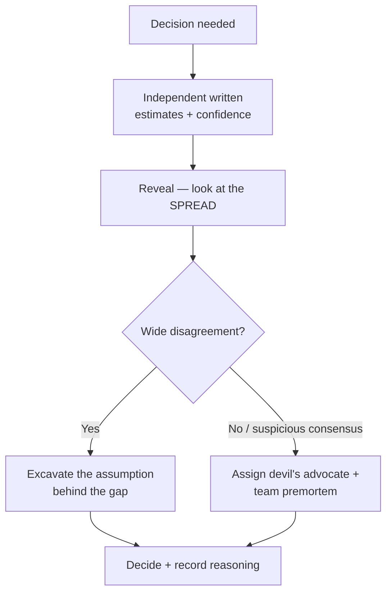
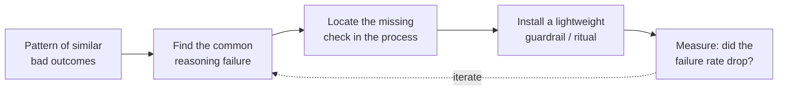

# Debugging Your Own Reasoning — Professional

> **What?** At the staff/principal level, debugging reasoning stops being a solo activity. Your job is to debug the **collective reasoning** of teams and organizations — catching groupthink, surfacing the assumptions nobody states, making the *group's* thinking legible — while modeling your own reasoning so visibly that it raises everyone's metacognitive baseline.
> **How?** You run structured decision reviews, design processes that fight groupthink by construction, make your RFCs trace their own logic, build calibration and premortems into team rituals, and treat a recurring class of bad team decisions as a *process* bug to fix, not a person to blame.

---

## 1. The unit of debugging is now the group's reasoning

A staff engineer's highest-leverage failure mode isn't being personally wrong — you've largely fixed that with the senior-level instruments. It's letting a *room full of smart people* be confidently, collectively wrong. Group reasoning has its own catalog of bugs that individual rigor doesn't touch:

| Group reasoning bug | What it looks like in a review | Why solo skills don't catch it |
|---|---|---|
| **Groupthink** (Janis) | Premature consensus, dissent feels disloyal | Everyone *individually* doubts but nobody says it |
| **HiPPO** | The highest-paid person's opinion anchors the room | The org structure suppresses the signal |
| **Shared blind spot** | Whole team has the same gap | No one in the room can see it |
| **Diffusion of doubt** | "Surely someone checked that" | Everyone assumes someone else verified |
| **Information cascade** | Each person defers to the prior speaker | Early speakers get disproportionate weight |

Your job is to be the **debugger for the group's thought process** — and crucially, to build *mechanisms* so it doesn't depend on you being in the room.

---

## 2. Design the process to fight groupthink by construction

Don't rely on people being brave enough to dissent. Engineer dissent into the process:

- **Independent estimates before discussion.** Have everyone write their confidence/estimate *privately first*, then reveal. This kills the anchoring/cascade where the first voice sets the answer. (Wide spread = a real disagreement worth excavating, not a number to average.)
- **Assign a rotating devil's advocate / red-team.** Make dissent a *role*, so disagreeing is doing your job, not attacking a colleague. Janis's own remedy for groupthink.
- **Leader speaks last.** If you're the most senior person, voice your opinion *after* the room, or you'll anchor everyone to it. Silence from you early is a feature.
- **Pre-mortem as a team ritual.** "It's a year out, this launch failed — everyone write down why." Surfaces the doubts the optimism of consensus was suppressing.
- **Make "I'm not sure" high status.** The fastest way to better group reasoning is a leader who publicly says "I was wrong about X" and "I don't know, let's find out." You set the ceiling for everyone's honesty by where you set yours.



---

## 3. Run decision reviews, not just code reviews

Most orgs review *code* obsessively and review *decisions* never — so the same flawed reasoning ships repeatedly. Institute lightweight decision reviews for consequential, hard-to-reverse calls (Bezos's "Type 1" decisions). A good review interrogates the *argument*:

1. **What's the actual decision and what's reversible about it?** (Cheap-to-undo decisions deserve *less* process — over-deliberating reversible calls is its own bug.)
2. **What must be true for this to be right?** — list the load-bearing assumptions explicitly.
3. **How would we know we were wrong, and when?** — name the disconfirming metric *and the date we check it*.
4. **What did we consider and reject, steelmanned?**
5. **Who disagrees, and is their objection addressed or just outvoted?**

The output isn't a yes/no — it's a *recorded argument with triggers*, so when reality arrives you can audit exactly which reasoning step failed.

---

## 4. Make reasoning legible in RFCs and ADRs

At your level, your most durable artifact is the *written argument*. An RFC that records only conclusions is undebuggable; one that records its reasoning is a permanent calibration instrument for the whole org.

**Structure that forces legible reasoning:**

```
## Context
What forces are in play. (Not the solution.)

## Decision
What we're doing.

## Reasoning
Why — the actual causal chain, not a list of buzzwords.

## Assumptions & Disconfirmers
- Assume: write volume stays < 10k/s.
  Wrong if: we onboard the EU region → revisit.
- Assume: team can operate Kafka.
  Wrong if: on-call load exceeds X → reconsider managed.

## Alternatives considered (steelmanned)
- Option B: <strongest case for it> — rejected because <specific>.

## Confidence
~70% this is right over a 1-year horizon.
```

The **Assumptions & Disconfirmers** and **Confidence** sections are the metacognition. They turn "here's our brilliant plan" into "here's a falsifiable hypothesis we can score later" — and they invite reviewers to attack *specific* load-bearing claims instead of arguing taste. Architecture Decision Records (Nygard) institutionalize exactly this at the team scale.

> A decision you can't trace is a decision you can't learn from. Legibility isn't bureaucracy; it's making the org's reasoning *debuggable*.

---

## 5. Model your own reasoning out loud — visibly

Your most scalable lever is **demonstrated metacognition.** When you think through a problem in front of the team, narrate the debugging of your *own* reasoning:

- "My gut says X, but this isn't a domain where my gut is calibrated, so let me check the data."
- "I notice I'm anchoring on my first idea — let me force a second option."
- "What would convince me I'm wrong here? ... that metric. Let's pull it."
- "I was confident about this last week and I've since updated — here's what changed my mind."

Every time you do this, you teach the reflex by example, and you make it *safe* for others to do the same. A principal engineer who visibly changes their mind on evidence does more for team reasoning quality than any process document. You're not just being right; you're *raising the metacognitive baseline of everyone watching.*

---

## 6. Treat recurring bad decisions as process bugs

When the org keeps making the same *class* of bad call — chronically optimistic timelines, repeatedly under-scoping migrations, always discovering the integration cost late — that is not a series of unlucky individuals. **It's a systemic reasoning bug**, and you debug it like one:



Examples of process-level fixes:

- Chronically optimistic estimates → require an explicit confidence interval and a recorded "what would make this slip" in every estimate.
- Late discovery of integration cost → a checklist item that forces naming every cross-team dependency before sizing.
- Repeated groupthink incidents → bake independent-estimate-first into the decision template.

The leverage is enormous: fixing the *process* fixes the reasoning of everyone who uses it, including future hires, without you in the room. Blame fixes nothing; a missing checklist item, added once, fixes it permanently.

---

## 7. Calibration as an organizational asset

Push the personal calibration loop (senior level) up to the team. Track, lightly, the org's predictions vs. outcomes — ship dates, incident-cause guesses, capacity forecasts — and review the calibration curve in retros. The goal isn't to punish wrong predictions; it's to discover *systematic* miscalibration ("our 'high confidence' ships at 50%") and correct the process that produces it. An org that knows its own calibration plans far better than one that runs on collective optimism. This is the team-scale version of Tetlock's finding: calibration is trainable, and the training is measurement plus feedback.

---

## 8. The principal's standing question set

Carry these into every consequential room; they debug group reasoning in real time:

- **"What would have to be true for this to be a mistake?"** (forces falsifiability)
- **"Who here disagrees? — genuinely."** (breaks false consensus)
- **"How will we know if we got this wrong, and by when?"** (installs the disconfirmer + a date)
- **"What's the strongest version of the option we're rejecting?"** (kills strawmen)
- **"Is this reversible? If so, why are we agonizing?"** (right-sizes the rigor)
- **"What are we all assuming that nobody has said out loud?"** (surfaces the shared blind spot)

These aren't gotchas — delivered with genuine curiosity, they make the *whole room* better at thinking, and over time the team starts asking them without you.

---

## Where this goes next

- The individual loop these scale up from → [senior](senior.md)
- Building team reasoning rituals as trained skills → [Deliberate practice](../03-deliberate-practice/)
- Mapping organizational competence boundaries → [Knowing what you don't know](../04-knowing-what-you-dont-know/)
- The bias catalog that drives group failure modes → [Cognitive biases in code decisions](../../04-critical-thinking/03-cognitive-biases-in-code-decisions/)
- Structured debugging method → [Debugging as problem-solving](../../02-problem-solving/05-debugging-as-problem-solving/)
- Back to [Metacognition & learning](../) · [Engineering Thinking](../../README.md)

---
## Use it today

1. Build blameless review and decision practices that surface reasoning errors.
2. Preserve predictions, assumptions, and outcomes so the organization can learn.
3. Reward evidence-based reversals rather than confidence that resists correction.

## Recall and apply

Try to answer these questions from memory:

1. What is a rabbit hole and how do you climb out?
2. How does keeping a decision journal improve your reasoning?
3. As a staff engineer, how do you debug a *team's* reasoning, not just your own?
4. How do you make your reasoning legible to others?
