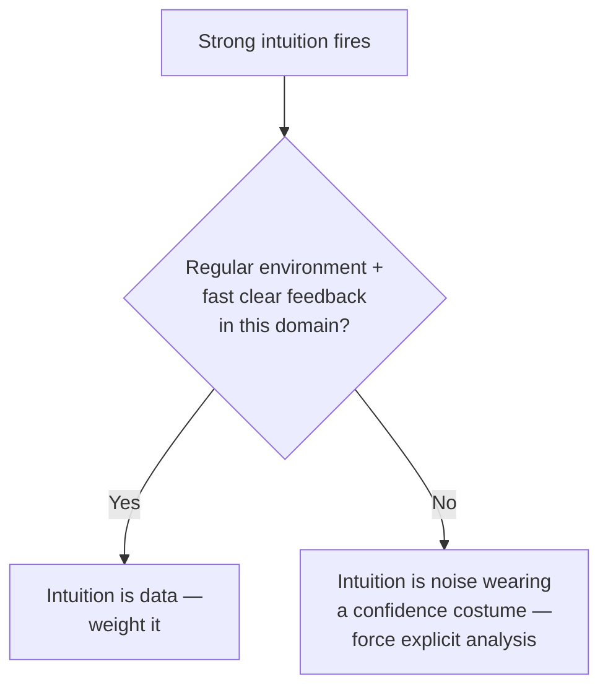
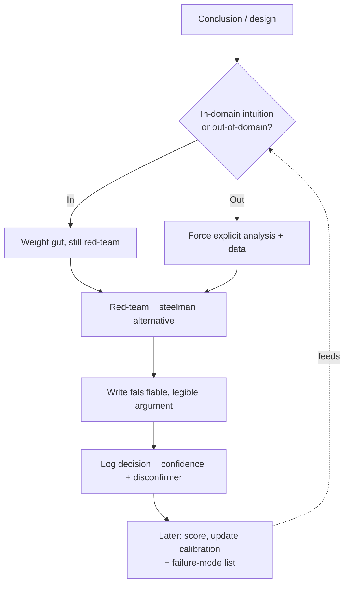

# Debugging Your Own Reasoning — Senior

> **What?** At the senior level, debugging your own reasoning means owning the *full feedback loop* of your judgment: you know your specific failure modes by name, you've measured your calibration across domains, and you can deconstruct *why* a past conclusion was wrong with the same rigor you'd apply to a production incident. You also start being a reasoning *check* for others.
> **How?** You run premortems and red-teams on your own designs, distinguish where your intuition is trustworthy from where it isn't (Kahneman's conditions for valid intuition), make your hypotheses explicit and falsifiable in writing, and keep a decision log rigorous enough to compute your own hit rate.

---

## 1. Seniority is partly knowing where your intuition is *not* valid

Junior intuition is mostly noise. Senior intuition is often genuinely good — *in the domains you've practiced* — which creates a new, more dangerous bug: **trusting expert intuition outside the zone where it was trained.**

Kahneman and Klein (*Conditions for Intuitive Expertise*, 2009) identified when gut judgment is actually trustworthy:

1. **The environment is regular enough** to have learnable patterns.
2. **You got prolonged practice with rapid, clear feedback.**

So your intuition about "this code smells like it'll have a race condition" is probably valid — you've debugged hundreds of those with fast feedback. Your intuition about "this hire will work out" or "this new market is the right bet" is probably *not* valid — low regularity, slow and noisy feedback. Same brain, same feeling of confidence, wildly different reliability.

> **The senior move:** before trusting a gut call, ask *"is this a domain where my gut has earned the right to be trusted?"* Where it hasn't, fall back to explicit System 2 analysis and external data — even though the gut feels just as sure.



---

## 2. Know your *named* failure modes

Generic self-doubt is weak. Seniors have an audited list of their *personal* recurring reasoning bugs. Mine (yours will differ):

- **Anchoring on the first hypothesis** — I latch onto my initial theory and explain away contradicting evidence.
- **Solution-shaped problem framing** — I unconsciously define the problem so my favorite tool is the answer.
- **Optimism on integration** — I estimate the happy path and forget the glue, the migration, the rollback.
- **Premature abstraction** — I "see the pattern" and generalize on two examples.

You discover these from your **decision journal** (§5) by looking for *patterns in your wrongness*, not one-offs. Once named, you can install a targeted check: because I know I anchor, I force myself to write down *three* hypotheses before investigating any of them.

---

## 3. Red-team your own designs

The premortem (from the middle level) scales up into structured self-adversarial review. Before an RFC or a big technical decision is final, run it through a **red-team pass** where your only job is to kill it:

| Lens | The attack question |
|---|---|
| Load | "At 100x traffic, what's the first thing that melts?" |
| Failure | "Which dependency, when down, takes the whole feature down?" |
| Time | "What does this look like in 2 years of accreted hacks?" |
| Adversary | "How does a malicious user abuse this?" |
| Reversibility | "If this is wrong, how expensive is the undo?" |
| The skeptic | "What would my sharpest critic say, and are they right?" |

The discipline is to *genuinely try to break it*, not to perform a token objection you've pre-rebutted. If you finish the red-team and your design survived without a single change, you probably red-teamed lazily — real designs always have at least one soft spot worth naming.

### Steelman the alternative you rejected

For any "we should do X, not Y" decision, write the *strongest possible* case for Y — better than its actual advocates would. If you can't, you don't understand the trade-off well enough to have chosen X. This kills the "I dismissed the alternative because I didn't really consider it" bug.

---

## 4. Make your reasoning falsifiable and legible — in writing

Senior conclusions get *written down* (RFCs, design docs, incident reviews), which is the highest form of forced articulation. Two disciplines elevate this from documentation to reasoning-debugging:

**Falsifiability.** Every load-bearing claim gets a concrete disconfirmer:

> "We expect p99 < 200ms (claim). **This is wrong if** the fan-out to the recommendation service exceeds 3 hops — we'd see it in the trace as serialized calls."

Now the claim is testable, and a reviewer can attack the *specific* condition instead of arguing vibes.

**Legibility.** Write the *reasoning*, not just the conclusion. "We chose Kafka" is a decision. "We chose Kafka *because* we need replay and ordered partitions, *accepting* operational complexity, *rejecting* SQS because it lacks replay" is a *traceable argument* — someone can find the exact step that was wrong if it turns out wrong. Conclusions you can't trace are conclusions you can't debug.

---

## 5. A decision log rigorous enough to score

The middle-level journal becomes, at senior level, an instrument you can actually compute against.

```
ID: D-204
Date: 2026-06-25
Decision: Move session store from sticky-LB to Redis
Confidence: 70% this is net-positive within 1 quarter
Key assumption: connection overhead to Redis < the cost of
  lost-session reconnects during deploys
Disconfirmer: if Redis p99 latency > 5ms under our load, the
  per-request cost outweighs the deploy benefit
Alternatives considered: signed stateless tokens (rejected:
  can't revoke mid-session); keep sticky (rejected: blocks
  zero-downtime deploys)
Revisit: end of Q3 — check actual Redis p99 + deploy error rate
Outcome (filled later): ____
Was I right (filled later): ____
```

Quarterly, tally the `Was I right` column. You get:

- **Your calibration curve** — are your 70%s really 70%? (Tetlock, *Superforecasting*: the elite forecasters were *consistently calibrated*, and got there by exactly this scoring loop.)
- **Your failure-mode inventory** (§2) — patterns across the wrong rows.
- **Credibility** — "my last 20 confident calls were right 18 times" is a real argument; "trust me, I'm senior" is not.

---

## 6. Metacognitive load management at scale

You now reason under more load: more context to hold, more people watching, more ego on the line because your name is on the design. Senior-specific countermeasures:

- **Externalize working memory.** Don't hold a six-step argument in your head — write it down. The bug usually hides in the step you were too cognitively loaded to examine.
- **Separate "generate" from "evaluate."** Brainstorm options with the critic *off* (you'll prematurely kill good ideas otherwise), then switch the critic *on* and red-team. Doing both at once does both badly.
- **Decouple ego from ideas in public.** "Here's my current thinking, attack it" invites the correction you need. "Here's the right answer" invites face-saving for everyone, including you.
- **Recognize the decision-fatigue cliff.** Your 11am architecture call and your 6pm one are not the same quality. Schedule consequential reasoning for when your tank is full; defer it when it isn't.

> The most expensive senior reasoning bug is **ego-defending a public conclusion.** The antidote is making "I changed my mind based on X" a normal, visible, *praised* thing — starting with yourself.

---

## 7. Begin checking *others'* reasoning (the bridge to staff)

Senior is where you start debugging reasoning beyond your own skull — in code review and design review you're not just checking the artifact, you're checking the *argument behind it*:

- "What did you expect to happen, and what convinced you it would?" — surfaces unstated assumptions.
- "What would have to be true for this to be wrong?" — runs *their* falsifiability check for them.
- "What did you consider and reject?" — exposes whether the alternative was steelmanned or strawmanned.

You're teaching the reflexes from this whole topic by *modeling them out loud*. That modeling is the seed of the staff/principal skill: debugging the **collective** reasoning of a team (covered in [professional](professional.md)).

---

## 8. The senior loop



---

## Where this goes next

- Debugging a *team's* shared reasoning, RFC legibility, decision reviews → [professional](professional.md)
- Sharpening these into trained reflexes → [Deliberate practice](../03-deliberate-practice/)
- Mapping competence boundaries precisely → [Knowing what you don't know](../04-knowing-what-you-dont-know/)
- The bias catalog these checks defend against → [Cognitive biases in code decisions](../../04-critical-thinking/03-cognitive-biases-in-code-decisions/)
- Back to [Metacognition & learning](../) · [Engineering Thinking](../../README.md)

---
## Check your understanding

Try to answer these questions from memory:

1. What is a premortem and how do you apply it to your own conclusions?
2. Walk me through calibrating your own estimates.
3. When is an expert's gut intuition trustworthy, and when isn't it?
4. Why do you reason worse when tired, stressed, or ego-invested?
