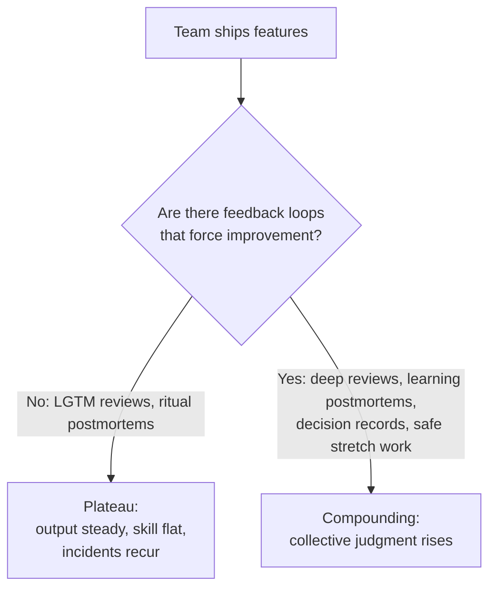

# Deliberate Practice — Professional

> **What?** At staff/principal level, deliberate practice becomes an *organizational* concern: you stop optimizing only your own slope and start designing the feedback loops, difficulty calibration, and culture that determine whether an entire team keeps improving or quietly plateaus. You also deliberately practice the leadership skills — design facilitation, technical writing, persuasion, mentoring — whose feedback is even slower and noisier than code's.
>
> **How?** You diagnose where the org has turned learning into autopilot; you build fast, blameless feedback systems (review culture, postmortems, decision records with dated predictions); you create safe "learning zones" so people can practice at the edge without career risk; and you model and structure deliberate practice for the non-coding skills that scale your impact. You measure the team's *rate of improvement*, not just its output.

---

## 1. Organizations plateau the same way individuals do

The "one year of experience ten times" pathology scales to teams. A team can ship steadily for years while its collective skill flatlines — because the *system* rewards comfortable, repeated execution and provides no feedback that would force improvement. Symptoms of an org on autopilot:

- Reviews are rubber stamps ("LGTM" within 90 seconds).
- Postmortems assign fixes but never change anyone's mental model.
- The same class of incident recurs; the org "knows" the cause but never *learned* from it.
- Senior engineers do the hard parts; juniors are never put in the learning zone, so they don't grow into seniors.
- "We've always done it this way" answers design questions.



Your job at this level is to move the team from the left branch to the right — to make deliberate practice a property of the *system*, not a virtue of individuals.

## 2. Building feedback loops at team scale

Ericsson's first ingredient that orgs systematically destroy is **immediate, honest feedback.** Rebuild it as infrastructure:

| Loop | Plateau version | Deliberate-practice version |
|---|---|---|
| **Code review** | "LGTM" gate | Reviewers asked to teach: explain *why*, propose alternatives; reviewees state what they want feedback on |
| **Postmortems** | Action items, then forgotten | Predict-then-check the root cause; update shared review checklists; share the *mental-model* error, not just the fix |
| **Design** | Decision made in a meeting, undocumented | ADRs with **dated predictions** of what might go wrong; revisited so judgment can be scored |
| **Onboarding** | "Read the wiki" | Staged real tasks at increasing difficulty with a paired reviewer = a difficulty curriculum |
| **1:1s** | Status update | Targeted skill feedback: "here's the one thing to work on, here's how I'll know" |

The principle: **make the feedback fast, specific, and safe enough that people act on it.** Slow feedback (annual reviews) is nearly useless for skill; specific-but-unsafe feedback gets ignored or breeds fear. You're engineering both speed and psychological safety.

## 3. Designing the difficulty curve for others

Individuals self-calibrate comfort/learning/panic zones. On a team, *you* place people on that curve — and most managers get it wrong in a predictable way: they give hard problems to the people who are already good (efficient this quarter, plateau-inducing long-term) and keep juniors in safe, comfortable work (low risk this quarter, no growth ever).

Deliberate org design inverts this:

- **Stretch assignments with a safety net.** Put someone one notch past their proven ability, *paired with* a stronger engineer as the feedback source. That's a real-system learning-zone rep.
- **Rotate the hard parts.** If the same two people always do the gnarly design, only they grow. Deliberately distribute the panic-adjacent work with support.
- **Protect the learning zone from the panic zone.** A stretch assignment with no support and a hard deadline is the panic zone — people freeze, fail, and learn fear, not skill. Calibrate the stretch *and* supply the scaffolding.

> Staff heuristic: every engineer should have one piece of work at any time that they're not yet sure they can do. If everyone's fully comfortable, the team is plateauing on your watch.

## 4. Culture: making it safe to be bad at things

Deliberate practice *requires* operating where you visibly fail ~⅓ of the time. An org that punishes visible struggle makes deliberate practice career-suicidal, so people retreat to the comfort zone and the org stagnates. The cultural levers:

- **Blamelessness with teeth.** Not "no consequences" — "consequences land on the *system*, learning lands on the *people*." Postmortems must be safe enough that the real mental-model error gets surfaced.
- **Model your own struggle.** Publicly do a kata you're bad at; share a design you got wrong and what you learned. Senior people visibly practicing gives everyone permission.
- **Reward slope, not just output.** In reviews, name and credit *skill growth*, not only shipped tickets. What you measure and praise is what the team practices.
- **Normalize "I don't know yet."** Tie to [knowing what you don't know](../04-knowing-what-you-dont-know/): a team that can say it is a team that can target practice; a team that can't will fake competence and never improve.

## 5. Concrete mechanisms you can install

```text
Review-as-teaching:
  - PR template field: "What feedback do you want?" (forces a practice target)
  - Reviewers expected to propose an alternative, not just approve

Decision records (ADRs) with predictions:
  - Every significant decision: options, choice, and DATED "what might go wrong"
  - Quarterly: revisit old ADRs; score the predictions; discuss what we misjudged

Learning postmortems:
  - "Predict the cause from symptoms" exercise before revealing the timeline
  - Output includes the mental-model error and a review-checklist update

Practice forum:
  - Weekly 45-min: one engineer presents a kata, a deconstruction, or a "thing I got wrong"
  - Deconstruct an expert system/PR together as a group rep

Skill 1:1s:
  - One named skill per report, one specific feedback loop, revisited monthly
```

The goal isn't ceremony. Each mechanism manufactures a feedback loop the work doesn't naturally provide, and each makes practicing the *default*, not an act of individual heroism.

## 6. Deliberately practicing leadership and design skills

Your own highest-leverage skills now have the *slowest, noisiest* feedback of all: facilitating a design, writing a strategy doc, persuading skeptics, mentoring. Apply the same discipline — prediction + later ground truth — to them.

| Skill | Deliberate rep | Manufactured feedback |
|---|---|---|
| **Design facilitation** | Run a design review; predict where it'll stall; debrief | Where it actually stalled; ask a peer to observe and critique |
| **Technical writing** | Write the doc; predict the questions readers will ask | The questions they *actually* ask = your unclear spots |
| **Persuasion / influence** | Before a proposal, write the objections you expect | The objections you actually get; the ones you missed |
| **Mentoring** | Predict what your mentee will struggle with; teach to it | Whether they struggled where you predicted |
| **Strategy** | Write a 1-year technical bet with dated checkpoints | The checkpoints; score your forecast |

Pattern, again: **a written prediction now, a checkable outcome later.** Without it, twenty years of leadership is twenty unverified opinions. With it, each meeting and doc becomes a rep.

## 7. Measuring whether the org is actually improving

Output metrics (velocity, throughput) say nothing about skill — a plateaued team can have great output. Watch *learning* signals instead:

- **Incident recurrence:** is the same class of failure dropping over time? (Learning) Or recurring? (Plateau)
- **Review depth:** are reviews surfacing design issues, or just approving?
- **Decision-prediction accuracy:** are the team's ADR predictions getting better when scored?
- **Bus-factor on hard problems:** is the set of people who can do the scary work *growing*?
- **Time-to-competence:** are new hires reaching real autonomy faster as your curriculum improves?

If output is fine but these are flat, your org is doing one year of experience repeatedly — at scale.

## 8. Pitfalls at staff/principal level

- **Optimizing your own slope only.** Your leverage is now the team's slope; a brilliant principal on a plateaued team is a wasted multiplier.
- **Mistaking process for practice.** Adding ADR templates and postmortem rituals without the *prediction-and-check* loop just creates paperwork. The feedback loop is the point.
- **Hoarding the learning zone.** Doing all the hard work yourself is efficient this quarter and quietly caps everyone else forever.
- **Punishing visible struggle.** Kills deliberate practice instantly; people flee to comfort.
- **No feedback on your own leadership reps.** The skills that now matter most are the ones easiest to fool yourself about. Manufacture the feedback or stop improving.
- **Measuring output, calling it learning.** They are different axes. A team can ship a lot and learn nothing.

---

## Where to go next

- [Learning how to learn](../01-learning-how-to-learn/) — the individual foundation you're now scaling to a team.
- [Knowing what you don't know](../04-knowing-what-you-dont-know/) — the cultural prerequisite for targeting practice.
- [Debugging your own reasoning](../02-debugging-your-own-reasoning/) — the basis of prediction-and-check feedback loops.
- [Section overview](../) · [Engineering Thinking root](../../README.md)

---
## Check your understanding

Try to answer these questions from memory:

1. How do you make deliberate practice sustainable?
2. How would you build a deliberate-practice culture on a team? (staff-level)
3. How do you know if you (or a team) are actually improving vs plateauing?
4. Where does the term "kata" come from, and who popularized it for programming?
