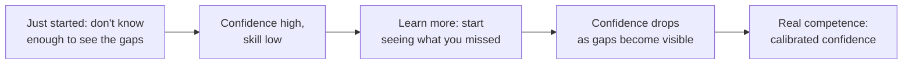

# Knowing What You Don't Know — Junior

> **What?** Knowing what you don't know is the skill of seeing the *edges* of your own competence — being able to point at a thing and honestly say "I understand this," "I know I don't understand this yet," or "I have no idea this even exists." At the junior level it mostly means catching yourself before you confidently act on a guess.
>
> **How?** You apply it by turning vague unease into explicit questions, by saying "I don't know — I'd have to check" instead of bluffing, and by deliberately exposing yourself to the parts of the system you've been avoiding so the blank spots on your map get smaller.

---

## 1. Three kinds of knowledge

In a 2002 press briefing, U.S. Secretary of Defense Donald Rumsfeld described a framing that has become a useful engineering tool (its roots go back to the **Johari window**, Luft & Ingham, 1955). Three categories of knowledge matter:

| Quadrant | Meaning | Example for a junior |
| --- | --- | --- |
| **Known knowns** | Things you know, and you know you know them | "I know how to write a `for` loop in Python." |
| **Known unknowns** | Things you know you *don't* know | "I know I don't understand how our auth tokens are refreshed." |
| **Unknown unknowns** | Things you don't know that you don't know | You didn't realize the database had *read replicas*, so you never asked why your write didn't show up immediately. |

There's a fourth box in the original Johari window — things others see in you that you can't see in yourself — which is exactly why **code review and pairing surface your gaps**.

The whole game of getting better is moving things up this ladder:

```text
unknown unknown  ──exposure──▶  known unknown  ──study/practice──▶  known known
```

You can't study a gap you don't know exists. So the first, most valuable move is **converting unknown unknowns into known unknowns** — making the invisible gaps visible.

### How gaps become visible

- **Reading code outside your task.** The file you never open is where your unknown unknowns live.
- **Code review** — the reviewer's "wait, did you consider X?" is a gift, not an attack.
- **Pairing** with someone more experienced; you'll hear them check things you didn't know existed.
- **Errors and outages** — the system teaches you what you ignored.

---

## 2. The danger of confident guessing

The single most expensive junior habit is **acting on a guess while feeling certain**. The bug you introduce by guessing how a function works is worse than the time you'd have spent reading it.

```python
# You THINK this returns a list. You never checked.
users = get_active_users()
first = users[0]          # works in dev...
# ...crashes in prod, because get_active_users() returns a generator,
# and an empty result raises IndexError instead of returning None.
```

The fix isn't "be smarter." It's **noticing the moment you're guessing** and converting it into a known unknown: *"I don't actually know what `get_active_users` returns — let me read it / check the type / write a quick test."*

> A useful internal alarm: any time you hear yourself think *"it probably..."*, stop. "Probably" is the sound of an unverified assumption. See [questioning assumptions](../../05-first-principles-thinking/02-questioning-assumptions/).

---

## 3. Saying "I don't know" is a strength

Many juniors believe admitting ignorance makes them look incompetent. The opposite is true on a healthy team. Compare:

| Bluffing | Calibrated honesty |
| --- | --- |
| "Yeah, that should be fine." | "I'm not sure — I haven't touched that path. I'd have to check." |
| Silent nodding in a design review | "Can you explain why we use a queue here? I don't follow yet." |
| Guessing an estimate to sound decisive | "I don't know this area well, so my estimate is rough — somewhere between 2 and 5 days." |

The honest version gives your team **accurate information to plan with**. The bluff gives them a landmine.

Richard Feynman put the principle bluntly in his 1974 Caltech address: *"The first principle is that you must not fool yourself — and you are the easiest person to fool."* Saying "I don't know" out loud is the cheapest defense against fooling yourself.

### The three sentences that build trust

1. **"I don't know."** — honest about a gap.
2. **"I'd have to check."** — committing to close the gap rather than leaving it open.
3. **"Let me make sure I understand: ..."** — surfacing a *possible* misunderstanding before it becomes a bug.

---

## 4. Dunning–Kruger, read correctly

You've probably seen a meme version of the **Dunning–Kruger effect** (Kruger & Dunning, 1999) that says "dumb people think they're smart." That is *not* what the research found, and believing the meme will hurt you.

The real finding: **novices in a skill lack the very knowledge needed to recognize how little they know.** The same gap that makes you bad at a task makes you bad at *judging* that you're bad at it. It's not about general intelligence — it's domain-specific and it applies to *everyone*, including you, in every new area.



**Practical takeaway for you:** when you feel *completely* confident about something you only learned recently, treat that feeling as a yellow flag, not a green light. Early confidence is often the *absence* of visible gaps, not the presence of mastery.

---

## 5. A simple practice: map your known unknowns

Once a week, write down the parts of your current work you *know* you don't understand. This converts a fuzzy feeling of "I'm a bit lost" into a concrete, attackable list.

```text
# My known-unknowns, week of June 23
- [ ] How does our CI decide which tests to run? (ask in #ci channel)
- [ ] What's the difference between our `staging` and `prod` configs?
- [ ] Why do we use Redis here instead of just the DB? (read design doc)
- [ ] What happens when the payment API times out? (pair with Sam)
```

Each item has a **way to close it**: ask, read, pair, or test. That's the whole loop. Doing this turns "I'm overwhelmed" into "here are five things I can learn this week."

This pairs naturally with [learning how to learn](../01-learning-how-to-learn/): your known-unknowns list *is* your study plan.

---

## 6. Estimating when you know you're missing information

When someone asks "how long will this take?" and you don't fully understand the task, the worst answer is a confident single number. The honest answer uses a **range** and names your assumptions:

> "If it's just the form change, about a day. But I don't know whether the backend already supports this field — if it doesn't, add 2–3 days. Let me check that and narrow it down."

A range plus an explicit assumption tells the truth: *you have a known unknown that controls the estimate.* Pretending you don't is how junior estimates miss by 5×. More on this in [probabilistic thinking](../../06-probabilistic-thinking/).

---

## 7. Common traps and how to escape them

| Trap | What it sounds like | Escape |
| --- | --- | --- |
| **Bluffing** | "Sure, no problem" (no idea) | "I haven't done this — can I pair with someone?" |
| **Copy-paste without understanding** | code works, you can't explain why | Read until you can explain each line out loud |
| **Fear of looking dumb** | staying silent in reviews | Ask one question per review, minimum |
| **False precision** | "It'll take exactly 3 hours" | Give a range; name the unknown |
| **Skipping the boring file** | never opening `config/` | Schedule 30 min to read an unfamiliar area |

---

## 8. Why this matters early

The engineers who grow fastest are not the ones who *know* the most at the start — they're the ones who **see their own gaps clearly and close them deliberately.** Every senior you admire is a person who got very good at this one meta-skill.

Start now, while the stakes are small and "I don't know yet" is fully expected of you.

---

## See also

- [Learning how to learn](../01-learning-how-to-learn/) — your known-unknowns list is a study plan
- [Debugging your own reasoning](../02-debugging-your-own-reasoning/) — catching the moment you're guessing
- [Deliberate practice](../03-deliberate-practice/) — closing a known unknown on purpose
- [Questioning assumptions](../../05-first-principles-thinking/02-questioning-assumptions/) — every "probably" is an unverified assumption
- [Section root](../) · [Engineering Thinking](../../README.md)

## References

- Kruger, J. & Dunning, D. (1999). *Unskilled and Unaware of It.* Journal of Personality and Social Psychology.
- Luft, J. & Ingham, H. (1955). *The Johari Window.*
- Feynman, R. (1974). *Cargo Cult Science* (Caltech commencement address).

---
## Check your understanding

Try to answer these questions from memory:

1. Explain the known knowns / known unknowns / unknown unknowns framing and why it matters in engineering.
2. How do you turn an unknown unknown into a known unknown?
3. State the Dunning–Kruger effect correctly. What does the meme get wrong?
