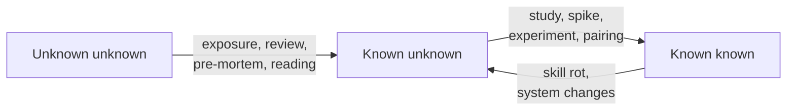

# Knowing What You Don't Know — Middle

> **What?** At the mid level, knowing what you don't know becomes an active, repeatable engineering practice: deliberately mapping the boundary between your competence and your ignorance for *each system you touch*, and treating that boundary as data that shapes your design and your estimates — not as a personal flaw to hide.
>
> **How?** You apply it by running the known/unknown quadrant against real tasks, by hunting unknown unknowns with cheap tools (pre-mortems, "what would an expert ask?", review by an outsider), by guarding the *danger zone* where competence in one area leaks into false confidence in an adjacent one, and by encoding your uncertainty directly into estimates and designs.

---

## 1. The quadrant as a working tool, not a poster

The known/unknown 2×2 (Rumsfeld's framing, rooted in the **Johari window**, Luft & Ingham 1955) is only useful if you run it against something concrete. Take a real task — "add idempotency to our payment webhook handler" — and fill the grid:

| | **You know it** | **You don't know it** |
| --- | --- | --- |
| **You know you're in this state** | *Known known:* how to write the handler, store a dedup key | *Known unknown:* exact at-least-once semantics of our queue; whether the DB unique constraint is enough |
| **You don't know you're in this state** | *(blind spots others see — surfaced by review)* | *Unknown unknown:* there's a retry path through a second gateway you've never seen |

The dangerous box is bottom-right. **Unknown unknowns are invisible by definition**, so you can't enumerate them — you can only run *processes that tend to flush them out*. That's the rest of this file.



Note the bottom arrow: known knowns **decay**. A thing you understood about the system six months ago may no longer be true. Competence isn't a permanent possession.

---

## 2. Converting unknown unknowns into known unknowns

This is the highest-leverage move in the whole topic. You can't fix or plan around a gap you can't see, so the practice is to *manufacture exposure*.

### Cheap exposure techniques

- **Pre-mortem** (Gary Klein): before building, imagine it's six months later and the project failed. Write the failure story. The reasons you invent are your hidden risks made visible. ("It failed because the webhook fired twice and we double-charged people" → now that's a known unknown you can address.)
- **"What would an expert ask here?"** Mentally simulate the most senior person you know reviewing your plan. The questions you can't answer are your gaps.
- **Read one layer down.** If you're using a library, read its docs on failure modes. If you're calling a service, read *its* runbook. Unknown unknowns hide one abstraction layer below where you stopped looking.
- **Outsider review.** Have someone from a *different* team or sub-system look at your design. People inside your bubble share your blind spots; an outsider doesn't. (This is the Johari "blind" quadrant in action.)
- **Checklists.** A checklist is institutional memory of other people's unknown unknowns. Atul Gawande's *The Checklist Manifesto* is the canonical argument: checklists catch the known-important thing the expert forgot, not the thing the expert never knew.

### A concrete pre-mortem snippet

```text
PRE-MORTEM: "Idempotent webhook" — it's Q4 and this caused an incident.
Plausible failure stories:
1. Two webhooks arrived 5ms apart; both passed the "already processed?" check
   before either wrote → double charge.   [RACE → known unknown: do we lock?]
2. The dedup key collided across merchants.  [KEY DESIGN → known unknown]
3. A *different* internal service also calls this path.  [WAS unknown unknown!]
```

Item 3 is the win: the pre-mortem turned a true unknown unknown ("there's another caller") into something you can now go verify.

---

## 3. Dunning–Kruger, applied to your daily work

Read correctly (Kruger & Dunning, 1999), the effect is not "novices are stupid." It's that **the skills needed to do a task well are often the same skills needed to judge whether you did it well.** Lacking the skill, you also lack the meta-skill to see you lack it. This is domain-specific: you can be a Dunning–Kruger novice in Kubernetes while being an expert in Postgres, *simultaneously*.

The mid-level trap is the **adjacent-domain leak** (the "danger zone"):

> You're genuinely strong at backend Go. You're asked to tweak the Terraform. It looks like just config. You feel competent (it's "just code") and skip the careful reading you'd give your own domain. You apply a change that recreates the database instead of updating it.

Your *real* competence in area A produced *false* confidence in adjacent area B. The cure is an explicit rule: **competence does not transfer across a domain boundary; re-enter beginner mode when you cross one.** Slow down, read, ask, pair — exactly as you would have when you were new.

---

## 4. The expert's opposite error

The mirror image of Dunning–Kruger is real and worth naming: **the more you genuinely learn, the more gaps become visible, so your felt confidence can drop even as your competence rises.** Experts often *underestimate* themselves and assume others know things they don't ("impostor-ish" underconfidence).

Both errors are calibration failures:

| Error | Who | Symptom | Fix |
| --- | --- | --- | --- |
| Over-confidence | novice in a domain | "this is easy, I've got it" | seek disconfirmation, get review |
| Under-confidence | expert | "everyone knows this but me" | track your hit rate; you're more right than you feel |

The goal isn't high confidence or low confidence — it's **calibrated** confidence: your stated certainty matches your actual hit rate. See [debugging your own reasoning](../02-debugging-your-own-reasoning/).

---

## 5. Encoding uncertainty into estimates

Once you can *see* a known unknown, the professional move is to put it *into* the estimate instead of hiding it.

**Bad (false precision):**
> "This'll take 3 days."

**Good (range + explicit assumptions):**
> "3 days *if* the queue already guarantees ordering. I don't know that yet — that's the main unknown. If it doesn't, add a day or two for a dedup table and tests. So: 3–5 days, and I'll narrow it after a 2-hour spike on the queue semantics tomorrow morning."

The pattern:

1. **State the range**, not a point. The width *is* the uncertainty.
2. **Name the assumption(s)** that, if wrong, blow up the estimate.
3. **Propose a spike** — a time-boxed investigation that converts the biggest known unknown into a known known, after which you re-estimate.

A spike is literally *paying a known cost to remove a known unknown.* It's one of the most underused mid-level skills. See [probabilistic thinking](../../06-probabilistic-thinking/) for reasoning about the ranges themselves.

---

## 6. Unknown unknowns cause the worst outages

Look at any serious incident review and the root cause is rarely "we did the known-hard thing badly." It's almost always **"a thing nobody knew was true."**

```text
- "We didn't know the cache had a 24h max TTL silently capped by the provider."
- "We didn't know that retrying also retried the *side effect*."
- "We didn't know region B's failover pointed back at region A."
```

These are all unknown unknowns. The known-hard problems get attention, redundancy, and tests. The *unknown* ones get none — which is exactly why they bite. This is why investing in exposure (§2) has an outsized payoff: you're buying down the category of risk that causes your worst days.

---

## 7. A weekly rhythm

| Cadence | Practice |
| --- | --- |
| Per task | Run the quadrant; list known unknowns before coding |
| Per design | One pre-mortem; one outsider review |
| Per estimate | Range + named assumptions + optional spike |
| Weekly | Update a personal known-unknowns list; close one |
| Per incident | Ask "what did we not know we didn't know?" and write it down |

The weekly list is the same artifact as in [learning how to learn](../01-learning-how-to-learn/) and feeds [deliberate practice](../03-deliberate-practice/): your visible gaps become your practice targets.

---

## 8. Making "I don't know" cheap on your team

You're now senior enough that *juniors watch how you handle ignorance.* When you confidently say "I don't know that — let me check" in a meeting, you give everyone below you permission to do the same. When you bluff, you teach them to bluff. Modeling calibrated honesty is the first step toward a team where unknown unknowns surface early instead of in production. (The professional file goes deep on building this culture.)

---

## See also

- [Debugging your own reasoning](../02-debugging-your-own-reasoning/) — calibration and self-checking
- [Learning how to learn](../01-learning-how-to-learn/) — turning known unknowns into a study plan
- [Deliberate practice](../03-deliberate-practice/) — practicing at the edge of competence
- [Cognitive biases in code decisions](../../04-critical-thinking/03-cognitive-biases-in-code-decisions/) — overconfidence and related biases
- [Probabilistic thinking](../../06-probabilistic-thinking/) — reasoning with ranges
- [Section root](../) · [Engineering Thinking](../../README.md)

## References

- Kruger, J. & Dunning, D. (1999). *Unskilled and Unaware of It.*
- Luft, J. & Ingham, H. (1955). *The Johari Window.*
- Klein, G. (2007). *Performing a Project Premortem.* Harvard Business Review.
- Gawande, A. (2009). *The Checklist Manifesto.*

---
## Check your understanding

Try to answer these questions from memory:

1. What's the expert's characteristic error?
2. Is it ever OK to say "I don't know" in an interview? How?
3. The "danger zone" — competence in area A leaking into area B. Give an example and the fix.
4. How does knowing what you don't know change how you estimate?
