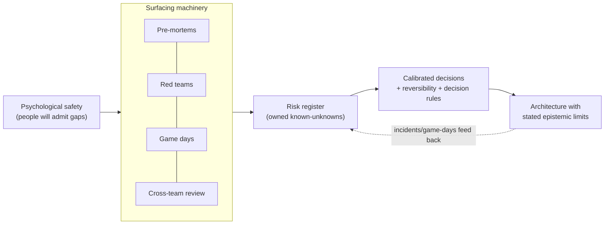

# Knowing What You Don't Know — Professional

> **What?** At staff/principal level, knowing what you don't know becomes an *organizational* capability, not a personal one. It's the discipline of surfacing and managing the unknown unknowns that span teams, systems, and time horizons — the gaps no single person can see — and of building a culture where admitting ignorance is the normal, rewarded behavior rather than a career risk.
>
> **How?** You apply it by owning risk registers and pre-mortem/red-team practices across an org, by detecting and dismantling collective blind spots (shared assumptions that whole teams hold), by being explicit about the epistemic limits of architectures you steward, by engineering psychological safety so "I don't know" flows upward freely, and by calibrating organizational confidence in big bets.

---

## 1. Organizational unknown unknowns are a different beast

A single engineer's blind spots are bounded by one head. An *organization's* blind spots are emergent and far more dangerous, because the knowledge needed to see them is distributed across people who never talk to each other.

Classic patterns of collective unknown unknowns:

| Pattern | The gap | Why no individual sees it |
| --- | --- | --- |
| **Seam ignorance** | Team A assumes B's API is synchronous; B assumes A handles retries | each team's view is locally consistent |
| **Inherited assumption** | "We've always assumed traffic is US-only" | the original assumer left years ago |
| **Conway's-law blind spot** | a failure mode spans two services owned by two orgs | no one owns the *interaction* |
| **Silent capacity cliff** | the system has never run at 5× and no one knows where it breaks | success hid the question |
| **Drifted runbook** | the documented recovery no longer matches reality | nobody re-ran it |

Your job as a principal is to **make the org's collective map visible** — to find the spots where everyone *individually* feels informed but the *system* has a hole. The Johari window scales here: the "blind" quadrant (what others see that you can't) becomes "what *other teams* see that *your* team can't," and the cure is the same — cross-boundary exposure.

---

## 2. Risk registers and the discipline of writing it down

Unknown unknowns can't be listed (they're invisible), but the *known* unknowns absolutely can — and most orgs leak risk simply by never writing them down. A **risk register** is the institutional memory of "things we know we don't know."

A useful entry is concrete and owned, not a vague worry:

```text
RISK-042
  Statement:  We don't know our actual RPO if region-1 fails. Replication lag
              to region-2 is unmeasured under load.
  Class:      known unknown (was unknown unknown until the Q2 game-day)
  Blast radius: data loss window for all write traffic during failover
  Owner:      Storage guild (Lena)
  Reduction:  game-day fault injection scheduled; instrument replication lag
  Status:     open — lag SLO TBD
  Decision rule: if lag p99 > 5s, block the multi-region GA
```

The register turns fuzzy organizational anxiety into a tracked, owned, *decidable* list. Its highest value is the column you can't pre-fill: every blameless incident and every game-day should *add* rows — that's the org converting unknown unknowns into known unknowns in real time. A register that only shrinks is a register nobody is feeding.

---

## 3. Facilitating pre-mortems and red teams at scale

You move from running these for one team to **designing them as repeatable org practice**.

**Pre-mortem facilitation craft:**

- **Independent first, social second.** Have everyone write failure stories *silently* before any discussion. Open brainstorming anchors on the first loud voice and suppresses the junior who actually spotted the real risk. (See [cognitive biases in code decisions](../../04-critical-thinking/03-cognitive-biases-in-code-decisions/).)
- **Invite the right diversity.** The unknown unknown one team can't see, another team can. Cross-functional pre-mortems (eng + SRE + security + support) surface seam risks no single discipline holds.
- **Make it safe to predict failure.** People won't write honest failure stories if "you predicted failure" becomes "you weren't a team player." You must explicitly protect the pessimists.
- **Convert outputs to owned register entries**, or the exercise is theater.

**Red teaming as a standing function:** for high-stakes systems (auth, payments, data integrity), institutionalize an adversarial reviewer whose job is to *break the plan on paper*. Rotate it so it's a respected role, not a punishment. Security red teams are the mature template; generalize the idea to availability, data loss, and cost.

**Game days / chaos engineering:** the empirical version. You can't reason your way to every unknown unknown, so you *inject faults and watch.* Each game day's surprises were, by definition, unknown unknowns moments before. Budget for them like you budget for tests.

---

## 4. Knowing the epistemic limits of *the org's* architecture

You are accountable for being honest about where the architecture you steward will fail — at a scale where being wrong is expensive and your confidence sets direction for hundreds of people.

```text
PLATFORM POSITION (stated explicitly to leadership):
  We are confident to ~5x current scale.   [known known: load-tested]
  Between 5x and 20x, two things are unmeasured:
    - the central metadata DB becomes a likely bottleneck   [known unknown — spike funded]
    - cross-region consistency model is untested at that write volume  [known unknown]
  Beyond 20x we are guessing.   [we are explicit that this is a guess, not a plan]
  Therefore: we keep the storage layer behind a stable interface (optionality)
  and we do NOT make irreversible commitments premised on >20x behavior.
```

The principal skill is **stating the confidence boundary out loud to non-engineers** — refusing to let "the platform scales" become an unqualified organizational belief. Overstated confidence in an architecture is itself an unknown-unknown generator: the org stops asking the question you implicitly answered "yes" to. Naming the boundary keeps the question open.

A related discipline: distinguish **reversible (Type 2)** from **irreversible (Type 1)** decisions. Irreversible decisions deserve heavy unknown-unknown hunting before commitment; reversible ones should be made fast and cheaply, *because* you've accepted you can't foresee everything and would rather learn by doing. Misclassifying a Type 2 as Type 1 wastes the org's time; the reverse causes its worst, unrecoverable mistakes.

---

## 5. Calibrating organizational confidence in big bets

Tetlock's calibration (*Superforecasting*, 2015) applies to roadmaps and architecture bets, not just personal predictions. Push the org toward:

- **Ranges and probabilities on commitments**, not theater dates. "60% we ship in Q3, 90% by Q4" carries the uncertainty honestly; a single "Q3" launders it away.
- **Reference-class / outside-view forecasting** (Kahneman & Lovallo): "How long did the *last three* platform migrations take?" beats the inside-view optimism of "this one's different."
- **Pre-registered decision rules.** Decide *now* what evidence would change the plan ("if the spike shows >5s replication lag, we don't GA"). This pre-commits the org to updating on reality instead of rationalizing.
- **Tracking calibration over time.** Periodically check whether the org's "90% confident" launches actually land 90% of the time. Most don't — and surfacing that gently recalibrates everyone.

---

## 6. The hard part: making "I don't know" safe and normal

All of the above collapses if people hide their unknowns. Amy Edmondson's research on **psychological safety** (*The Fearless Organization*, 2018) is the load-bearing dependency: teams that surface risks, doubts, and ignorance early outperform precisely because the unknown unknowns reach daylight before production. You cannot mandate this; you must *build* it.

**What a principal actually does:**

| Lever | Concrete action |
| --- | --- |
| **Model it loudly** | Say "I don't know" and "I was wrong about that" in high-visibility settings. The most senior person's vulnerability sets the ceiling for everyone's. |
| **Reward the messenger** | Publicly thank the engineer who flagged the risk that delayed a launch. Punish-by-eye-roll and the next risk stays hidden. |
| **Blameless retros** | Frame incidents as "the system let a gap through," not "who screwed up." Blame converts unknown unknowns into *secrets*. |
| **Structural permission** | A mandatory "What we don't know / Risks" section in every design doc; a blank one is challenged. |
| **Decouple status from certainty** | Stop rewarding the confident-sounding voice over the accurate one. Make calibration, not bravado, the prestige signal. |

The failure mode to fight is the **competence-as-performance culture**, where looking certain is rewarded and "I'd have to check" reads as weakness. In that culture, your strongest engineers learn to bluff, adjacent-domain leaks go unchallenged, and the org's unknown unknowns accumulate silently until an incident discharges them all at once. Your most important, least visible work is bending the culture the other way.

> A principal-level heuristic: the health of an org's epistemic culture is measured by how *junior* a person can be and still safely say "I don't think that's right" to how *senior* a person in a meeting.

---

## 7. Putting it together



The whole system has one purpose: to keep converting the org's unknown unknowns into owned, managed known unknowns *faster than the systems and the world generate new ones* — and to limit the blast radius of the ones that inevitably slip through.

---

## See also

- [Debugging your own reasoning](../02-debugging-your-own-reasoning/) — calibration and self-audit at scale
- [Deliberate practice](../03-deliberate-practice/) — building the surfacing skills deliberately
- [Cognitive biases in code decisions](../../04-critical-thinking/03-cognitive-biases-in-code-decisions/) — anchoring, groupthink, overconfidence in groups
- [Questioning assumptions](../../05-first-principles-thinking/02-questioning-assumptions/) — naming the inherited org assumptions
- [Probabilistic thinking](../../06-probabilistic-thinking/) — ranges, outside view, decision rules
- [Section root](../) · [Engineering Thinking](../../README.md)

## References

- Edmondson, A. (2018). *The Fearless Organization* (psychological safety).
- Tetlock, P. & Gardner, D. (2015). *Superforecasting.*
- Kahneman, D. & Lovallo, D. (1993). *Timid Choices and Bold Forecasts* (outside view).
- Klein, G. (2007). *Performing a Project Premortem.* HBR.
- Luft, J. & Ingham, H. (1955). *The Johari Window.*

---
## Use it today

1. Make uncertainty visible in strategy, portfolio, and architecture decisions.
2. Invest in discovery where unknowns have the largest organizational blast radius.
3. Make it safe to say “we do not know yet,” then fund the next evidence step.

## Recall and apply

Try to answer these questions from memory:

1. As a senior, how do you make "I don't know" safe on your team?
2. A teammate is loudly, confidently wrong in a design review, outside their expertise. How do you handle it?
3. Feynman said "the first principle is that you must not fool yourself." How does that apply here?
4. How would you decide how much unknown-unknown hunting a decision deserves?
