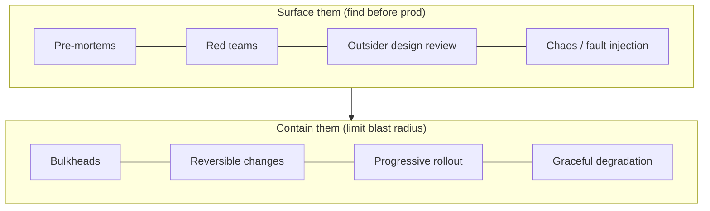

# Knowing What You Don't Know — Senior

> **What?** For a senior engineer, knowing what you don't know is *epistemic risk management*: treating the boundaries of your own and your design's competence as a first-class engineering concern that drives architecture, review processes, and incident prevention. You own not just code, but the *map of what's known and unknown* about the systems you steward.
>
> **How?** You apply it by systematically converting unknown unknowns into tracked, owned known unknowns; by knowing the *limits of your own designs* (where they'll break that you can't yet see); by running pre-mortems and lightweight red teams; by calibrating your confidence against your actual track record; and by designing review and exposure into the team's workflow so blind spots surface before customers find them.

---

## 1. Epistemic risk is the risk you don't budget for

Most engineering risk management addresses **known unknowns** — "the load might spike, so we autoscale"; "the third party might be down, so we add a circuit breaker." That's necessary, but it's the *easy half*. The hard half is **unknown unknowns**: the failure modes nobody modeled because nobody knew they were possible.

| Risk class | Visible? | Mitigated by | Your job as senior |
| --- | --- | --- | --- |
| Known known | yes | already handled | maintain |
| Known unknown | yes | redundancy, tests, fallbacks, monitoring | budget for it |
| Unknown unknown | **no** | exposure processes, defense in depth, blast-radius limits | *manufacture visibility + limit damage* |

You cannot test for a failure you haven't imagined. So senior engineering operates on two parallel tracks: (1) **surface** as many unknown unknowns as possible before they bite, and (2) **architect so that the ones you miss do limited damage** — bulkheads, blast-radius containment, graceful degradation, reversibility. Defense in depth is, fundamentally, a bet that you have unknown unknowns.



---

## 2. Knowing the limits of your own architecture decisions

A senior's most valuable form of "knowing what you don't know" is being clear about **where your own design will fail** — including the failure modes you can sense are out there but can't yet name.

Every significant decision should ship with its *epistemic boundary*: the assumptions it rests on and the conditions under which it stops being correct.

```text
DECISION: Use a single Postgres instance for the new service.
KNOWN KNOWN:  handles our current 200 writes/s comfortably.
KNOWN UNKNOWN: vertical-scaling ceiling — we haven't load-tested past 2k w/s.
              [tracked: spike before we cross 1k]
KNOWN UNKNOWN: we don't yet know our read/write ratio at 10x scale.
ASSUMED:       writes stay below ~2k/s for 18 months. If false, revisit sharding.
UNKNOWN UNKNOWN GUARD: keep the data access behind a repository interface so a
              future store swap doesn't ripple. (We can't predict *which* limit
              hits first, so we buy optionality.)
```

The last line is the senior move: because you *know there are limits you can't see*, you preserve **optionality** — reversibility and clean seams — rather than betting everything on a prediction. Decisions you can cheaply reverse don't need to be right; decisions you can't reverse demand far more unknown-unknown hunting before you commit. (See Bezos's "Type 1 / Type 2 decisions.")

### The architect's danger zone

The "competence in A leaks into false confidence in B" trap scales up dangerously at senior level, because *your confidence carries authority.* When the strong backend architect waves through the data-pipeline or ML-infra or security design "because it's basically the same," nobody pushes back — your competence in A bought you unearned trust in B. Discipline: **explicitly flag when you're operating outside your domain**, and pull in the actual expert. "I'm out of my depth on the crypto here — let's get Priya to review the key rotation" is a *senior* sentence, not a weak one.

---

## 3. Calibration: matching confidence to your track record

Philip Tetlock's *Superforecasting* (2015) showed the best forecasters aren't smarter — they're better **calibrated**: when they say "70% confident," they're right about 70% of the time. You can build the same muscle on engineering judgments.

Keep a lightweight **prediction log**:

```text
2026-05-02  "The migration will need a maintenance window" — 80% — WRONG (online worked)
2026-05-09  "This refactor breaks the export job"          — 60% — RIGHT
2026-05-14  "We'll hit the rate limit within a month"       — 90% — RIGHT
```

After 20–30 entries you'll learn whether your "90%"s are really 90% or really 65%. Most engineers discover they're **overconfident** in unfamiliar domains and **underconfident** in their core domain (the expert's error). Calibration is the cure for both, and it makes your "I'm 70% sure" actually mean something to the people relying on you.

---

## 4. Pre-mortems and lightweight red teams

As a senior you *run* these, not just attend them.

**Pre-mortem (Klein):** Before a risky launch, gather the team. Frame: *"It's three months from now and this was a disaster. Everyone, independently, write down why."* Independent-then-share beats open discussion (it dodges anchoring and groupthink — see [cognitive biases in code decisions](../../04-critical-thinking/03-cognitive-biases-in-code-decisions/)). Cluster the failure stories; the surprising ones are former unknown unknowns. Assign each a known-unknown owner.

**Red team:** Assign someone (or yourself) the explicit job of *attacking* the design. Not "what do you like" but "find the way this loses data / gets breached / falls over." A standing rule that *every* design gets one adversarial reader normalizes the practice so it doesn't feel like a personal attack.

**Outsider review:** People inside the sub-system share its blind spots (the Johari "blind" quadrant — what others see that you can't). Deliberately route a design past someone with *no* context on it. Their naive questions ("why does the client retry *and* the server retry?") are unknown-unknown detectors precisely because they don't share your assumptions.

> Rule of thumb: the review that taught you the most was done by the person who knew your system the *least*.

---

## 5. Unknown unknowns dominate the worst incidents and the worst estimates

Two places where this category disproportionately hurts:

**Outages.** Pull your last ten serious incidents. Count how many root causes were "a thing the team didn't know was true" versus "a known-hard thing done badly." It's lopsided toward the former — coupled retries, silent provider limits, a hidden second caller, failover that loops back. The known-hard problems got redundancy and tests; the *unknown* ones got nothing. This is the quantitative argument for spending real time on exposure processes.

**Estimates.** Estimate misses cluster the same way. The 5× overrun is almost never "we underestimated the part we understood" — it's "we didn't know the legacy module had no tests" or "we didn't know auth required a third-party review." Mature estimation widens the range *in proportion to the suspected volume of unknown unknowns*. A task in a familiar, well-tested area: ±20%. A task in a legacy system you've never touched: ±200%, and say so. Reference-class forecasting (Kahneman/Lovallo's outside view) helps: "similar 'small' changes in that subsystem historically took 3×."

---

## 6. Designing exposure into the workflow

Individual diligence doesn't scale; *processes* do. A senior bakes unknown-unknown hunting into how the team works so it happens by default:

| Mechanism | Surfaces unknown unknowns by... |
| --- | --- |
| Mandatory design doc with "Risks / What we don't know" section | forcing explicit articulation of gaps |
| Required reviewer from outside the immediate team | breaking the shared-blind-spot bubble |
| Pre-mortem gate for any irreversible / high-blast-radius change | inventing failure stories before launch |
| Chaos / fault-injection in staging | letting the system reveal what you ignored |
| Blameless incident reviews asking "what did we not know?" | converting outage lessons into team known-unknowns |
| Rotation through unfamiliar parts of the system | shrinking individual blind regions |

The "Risks / What we don't know" section is deceptively powerful: a doc with a *blank* risks section is itself a red flag ("you've found no unknowns? you haven't looked").

---

## 7. Modeling it makes it safe

Your behavior sets the team's norm. When you, the senior, say *"Honestly, I don't know how that subsystem fails — let's find out before we ship,"* you make it safe for everyone junior to admit the same. The fastest way to *hide* unknown unknowns is a culture where admitting them is punished; people then bluff, and the gaps surface in production instead of in review. Modeling calibrated humility — "I don't know," "I'd have to check," "I'm outside my domain here" — is the cheapest, highest-leverage cultural lever you have. The professional level scales this to the organization.

---

## See also

- [Debugging your own reasoning](../02-debugging-your-own-reasoning/) — calibration and self-audit
- [Deliberate practice](../03-deliberate-practice/) — closing tracked known-unknowns deliberately
- [Cognitive biases in code decisions](../../04-critical-thinking/03-cognitive-biases-in-code-decisions/) — anchoring, groupthink, overconfidence
- [Questioning assumptions](../../05-first-principles-thinking/02-questioning-assumptions/) — surfacing the assumptions a design rests on
- [Probabilistic thinking](../../06-probabilistic-thinking/) — calibrated ranges and reference-class forecasting
- [Section root](../) · [Engineering Thinking](../../README.md)

## References

- Tetlock, P. & Gardner, D. (2015). *Superforecasting.*
- Klein, G. (2007). *Performing a Project Premortem.* HBR.
- Kahneman, D. & Lovallo, D. (1993). *Timid Choices and Bold Forecasts* (outside view).
- Kruger, J. & Dunning, D. (1999). *Unskilled and Unaware of It.*
- Luft, J. & Ingham, H. (1955). *The Johari Window.*

---
## Check your understanding

Try to answer these questions from memory:

1. What is calibrated confidence and how do you build it?
2. Why do unknown unknowns dominate the worst incidents?
3. What's a pre-mortem and why run one independently-first?
4. How does the Johari window relate to this topic?
