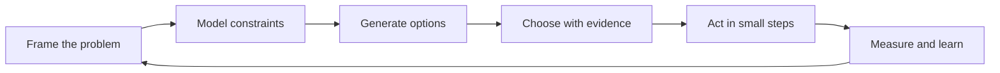

# Engineering Thinking

> The discipline of deciding what to build, why it should work, and how to know when your reasoning is wrong—before complexity turns an assumption into production behavior.

This roadmap develops the thinking skills that surround implementation. It starts with framing and solving a single problem, expands into systems and uncertainty, and finishes with techniques for generating better options, modeling responsibilities, testing beliefs, and improving how you learn.

The sections are complementary rather than isolated. Decomposition makes a problem tractable; critical and probabilistic thinking test the decisions inside it; systems thinking reveals consequences outside it; scientific thinking turns uncertainty into evidence.

## Sections

| # | Section | What you'll learn |
|---|---|---|
| 01 | [Computational Thinking](01-computational-thinking/) | Decompose problems, recognize recurring structures, choose useful abstractions, design algorithms, and map domain concepts into code. |
| 02 | [Problem-Solving](02-problem-solving/) | Understand the real problem, devise and execute a plan, debug from evidence, reflect, and recover when you are stuck. |
| 03 | [Systems Thinking](03-systems-thinking/) | Reason about emergence, feedback loops, second-order effects, trade-offs, leverage points, and bottlenecks. |
| 04 | [Critical Thinking](04-critical-thinking/) | Separate claims from evidence, catch fallacies and cognitive biases, and compare engineering trade-offs objectively. |
| 05 | [First-Principles Thinking](05-first-principles-thinking/) | Reduce a problem to genuine constraints, challenge inherited assumptions, and rebuild possible solutions from fundamentals. |
| 06 | [Probabilistic Thinking](06-probabilistic-thinking/) | Make calibrated decisions with base rates, expected value, failure probabilities, risk, and uncertain estimates. |
| 07 | [Creative and Lateral Thinking](07-creative-and-lateral-thinking/) | Generate and evaluate non-obvious options through divergence, inversion, analogy, and productive constraints. |
| 08 | [Object Thinking](../craftsmanship/object-oriented-design/08-object-thinking/) | Model behavior and responsibility, use tell-don't-ask and CRC techniques, and recognize when object thinking is the wrong fit. |
| 09 | [Scientific and Hypothesis-Driven Thinking](09-scientific-and-hypothesis-driven/) | Form falsifiable hypotheses, design experiments, measure before optimizing, and use spikes to retire uncertainty. |
| 10 | [Metacognition and Learning](10-metacognition-and-learning/) | Inspect your own reasoning, practice deliberately, learn efficiently, and map the limits of your knowledge. |
| 11 | [Professionalism](professionalism/) | Make honest commitments, protect quality under pressure, collaborate responsibly, mentor others, and act ethically. |

## How to use this roadmap

Each topic has four depth levels—**junior → middle → senior → professional**—and every guide ends with unanswered questions for active recall.

| Level | Primary scope | Expected outcome |
|---|---|---|
| Junior | A clear task or small feature | Apply a repeatable method with guidance and verify the immediate result. |
| Middle | A module or cross-component flow | Choose maintainable boundaries and explain local trade-offs independently. |
| Senior | A system under change and uncertainty | Protect invariants, evaluate architectural consequences, and contain future change. |
| Professional | Multiple teams and a sustained initiative | Align ownership, delivery, migration, operations, and measurable outcomes. |

Start with the level closest to your current responsibility. Move upward when you can answer the final questions and apply the method to a real engineering situation without relying on the example.

## A practical reasoning loop

Use the loop at every scale. What changes between levels is the size of the system, the cost of being wrong, and the number of people who must act on the decision.

---

> Pair this roadmap with [Craftsmanship](../craftsmanship/README.md) when the reasoning needs to become code, tests, architecture, or an operational system.
