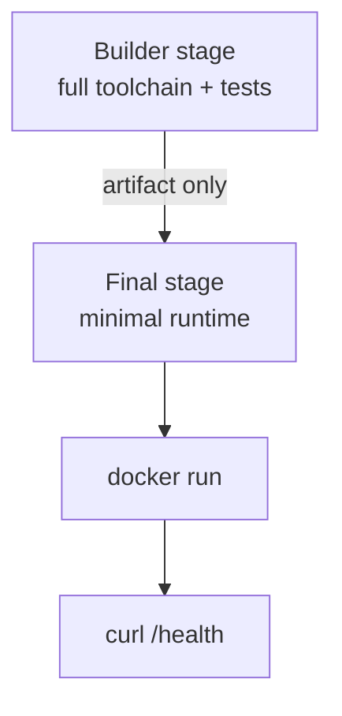

# Containers and Docker — Middle

<!-- level-focus -->
At middle level, focus on this question:

> When a compiled or transpiled service moves from a single-stage Dockerfile to a multi-stage build, how do you decide where the stage boundary belongs, and how do you keep the layer cache from silently going stale as dependencies and source both change?

Use the smallest realistic scenario that exposes the decision and its failure behavior.

---

## Core Concept 1 — Single-Stage vs Multi-Stage: What's Actually Being Traded

A junior-level Dockerfile builds and runs in one stage: install a compiler or toolchain, build the artifact, run it, all in the same final image. That's correct for an interpreted language with no build step (a Python or Node app run directly from source). It stops being correct the moment the build step produces something the *runtime* doesn't need — a compiled Go binary, a bundled JavaScript app, a compiled Java JAR — because the final image then ships the entire build toolchain (a C compiler, a full Node.js install, build-time dependencies) alongside the artifact it produced.

A **multi-stage build** splits this into a `builder` stage that has the toolchain and produces an artifact, and a final stage that copies *only* the artifact into a minimal runtime image:

```dockerfile
# ---- builder stage ----
FROM golang:1.22 AS builder
WORKDIR /src
COPY go.mod go.sum ./
RUN go mod download
COPY . .
RUN CGO_ENABLED=0 go build -o /out/server ./cmd/server

# ---- final stage ----
FROM gcr.io/distroless/static-debian12
COPY --from=builder /out/server /server
EXPOSE 8080
ENTRYPOINT ["/server"]
```

The trade-off is concrete, not aesthetic:

| | Single-stage | Multi-stage |
|---|---|---|
| Final image size | Includes full toolchain (often hundreds of MB) | Only the runtime and artifact (often single-digit to tens of MB) |
| Attack surface | Compiler, package manager, shell all present in production | Minimal — often no shell, no package manager |
| Build simplicity | One `FROM`, easiest to read | Two or more stages, slightly more Dockerfile to maintain |
| Debuggability | Can `docker exec` in and use the full toolchain | May have no shell to exec into at all (see Core Concept 3) |

For a compiled binary with no runtime dependency on its build tools, multi-stage is close to a strict improvement. For an interpreted app that runs its own source directly, there is often nothing to split — the "build" step is just installing dependencies, and a single stage with careful layer ordering (Core Concept 2) is enough.

## Core Concept 2 — Keeping the Cache Honest as Both Dependencies and Source Change

The junior lesson — copy the dependency manifest before the source — holds, but at middle level the failure mode to watch for is subtler: **a cache that appears to work but is silently rebuilding more than it needs to**, or worse, one that reuses a stale layer it shouldn't.

Three patterns that keep the cache trustworthy:

```dockerfile
# 1. Manifest and lockfile copied separately from source, so dependency
#    installs only rebuild when the manifest itself changes.
COPY package.json package-lock.json ./
RUN npm ci

# 2. BuildKit cache mounts let the package manager's own download cache
#    persist ACROSS builds, even when the layer above it does rebuild —
#    useful when the manifest changes often but most packages don't.
RUN --mount=type=cache,target=/root/.npm \
    npm ci

# 3. Pin toolchain versions in FROM, not just the app's dependencies —
#    an unpinned builder image can silently change compiler behavior
#    between builds on different days.
FROM node:20.11-bookworm-slim AS builder
```

Pattern 2 matters most on services with large dependency trees: without a cache mount, every time the lockfile changes even slightly, the package manager re-downloads everything from the network, because the Docker layer cache is coarse (all-or-nothing per instruction) while the package manager's own on-disk cache is fine-grained (per-package). A cache mount gives you both: Docker still rebuilds the `RUN npm ci` layer when the lockfile changes, but `npm` inside that rebuild reuses already-downloaded packages instead of refetching the whole tree.

## Core Concept 3 — Choosing a Base Image: Debuggability vs Size vs Surface

The final-stage base image is a real design decision with three live options:

| Base | What it gives you | Cost |
|---|---|---|
| **Full OS slim variant** (`python:3.12-slim`, `node:20-slim`) | A shell, a package manager, easy to `docker exec` in and debug | Larger image; more installed packages than the app needs, each a potential CVE |
| **Distroless** (`gcr.io/distroless/*`) | Runtime only — no shell, no package manager, minimal attack surface | Cannot `docker exec -it ... sh` into it at all; debugging requires attaching a separate ephemeral debug container or reading logs/metrics from outside |
| **Scratch** | Empty base — smallest possible image, for a fully static binary with zero OS dependencies | No CA certificates, no timezone data, no libc — must be supplied explicitly (or the binary must be fully static and self-sufficient) |

None of these is universally correct. A slim base is the right default for a service still under active development where engineers need to shell in and poke around. Distroless is the right choice for a mature, stable service where the operational cost of losing shell access is outweighed by removing an entire category of container-escape and dependency-CVE surface. Scratch is worth it specifically for a statically-linked Go binary that makes no outbound TLS calls requiring system CA certificates — otherwise the missing certificate bundle becomes a confusing runtime failure the first time the service tries to call an HTTPS endpoint.

The over-application signal is reaching for `scratch` on a service that still needs frequent interactive debugging in a lower environment — that trades away a real operational capability for a size reduction nobody asked for. The under-application signal is shipping a `python:3.12` full image (not even the slim variant) to production for a service that never needs a compiler or a package manager at runtime — that's paying for size and surface with nothing gained.

## Core Concept 4 — Debugging a Container With No Shell

If the final stage has no shell, `docker exec -it <container> sh` simply fails. The practical middle-level techniques:

```bash
# Attach a full-featured debug image sharing the target container's
# process namespace, without modifying the running image at all.
docker run -it --rm --pid=container:myapp --network=container:myapp \
    busybox sh

# Or, when the runtime supports it, an ephemeral debug tool built for
# exactly this: attaches a shell to a running container's namespace.
docker debug myapp
```

The key idea is the same either way: you don't need a shell *baked into* the production image to debug it — you attach a *separate*, throwaway debugging image to the running container's namespaces, get your shell there, and throw it away afterward. This decouples "the production image is minimal" from "engineers can never introspect a running container," which is what makes distroless viable in practice rather than just in theory.

## Core Concept 5 — Verification at Two Levels

A Dockerfile change is verified the same way any other change is: at the unit level and at the integrated-flow level.

**Unit level — inside the build itself:**

```dockerfile
FROM golang:1.22 AS builder
WORKDIR /src
COPY go.mod go.sum ./
RUN go mod download
COPY . .
RUN go test ./...              # build fails if tests fail — no artifact is produced
RUN CGO_ENABLED=0 go build -o /out/server ./cmd/server
```

Running tests as a build step means a broken change never produces an image at all — `docker build` exits non-zero and CI fails before anything reaches a registry.

**Integrated-flow level — against the running container:**

```bash
docker build -t myapp:test .
docker run -d --name myapp-test -p 8080:8080 myapp:test
sleep 2
curl -f http://localhost:8080/health || (docker logs myapp-test; exit 1)
docker stop myapp-test && docker rm myapp-test
```

This confirms something the unit-level test cannot: that the *final* image — the one with only the runtime, no toolchain, possibly no shell — actually starts, binds its port, and serves a real request. A common trap is a service that passes all unit tests in the `golang:1.22` builder stage but fails to start in the distroless final stage because of a missing shared library or a missing CA certificate bundle that only the builder image happened to provide.



## Core Concept 6 — Incremental Adoption

Moving an existing single-stage service to multi-stage in one pass, on a service the team depends on daily, is unnecessary risk. A workable order:

1. Add the layer-ordering fix from Core Concept 2 first (manifest before source) — it's a pure win with no behavior change and confirms the team's mental model of caching before anything else changes.
2. Introduce the `builder` stage while keeping the final stage on the *same* familiar base image (e.g., `python:3.12-slim`) — this isolates "does the multi-stage split work at all" from "does the new minimal base work," one variable at a time.
3. Only after the multi-stage split is verified in a lower environment, swap the final stage to distroless or scratch, and re-run the integrated-flow check from Core Concept 5 to catch any missing runtime dependency the builder stage was silently providing.
4. Add the debug-container workflow from Core Concept 4 to the team's runbook *before* the minimal final stage reaches production, so the first incident isn't also the first time anyone tried to debug a shell-less container.

## Real-World Examples

- **A cache that looked broken was actually working correctly.** A team notices `npm ci` reinstalling on almost every build and assumes their layer caching is broken; the real cause is that their lockfile changes on nearly every commit (a dependency-bumping bot runs daily). Adding a BuildKit cache mount for `~/.npm` cuts rebuild time sharply without changing the Dockerfile's layer order at all — the manifest-before-source ordering was already correct; the missing piece was the package manager's own cache.
- **A distroless migration breaks on a missing certificate bundle.** A Go service migrates its final stage from `debian:bookworm-slim` to `gcr.io/distroless/static-debian12` and immediately fails every outbound HTTPS call in the integrated-flow test — the slim Debian image had CA certificates installed by default and the static distroless variant does not. The fix is `gcr.io/distroless/static-debian12` isn't wrong, but the team needed to explicitly copy `/etc/ssl/certs/ca-certificates.crt` from the builder stage.
- **A premature scratch base costs a team a debugging session.** A service builds `FROM scratch` early in development; the first production incident requires shelling in to check a suspicious environment variable, and there is no shell, no `docker exec`, and no debug-container runbook yet. The team reverts to distroless with a documented `docker debug` procedure and revisits `scratch` only once the service is stable enough that interactive debugging is rarely needed.

## Common Mistakes

- **Splitting into multi-stage and changing the final base image in the same commit.** This conflates two independent risks — verify the stage split works before changing what the final image is built from.
- **Assuming a slow cache means broken layer ordering.** A dependency-bumping bot changing the lockfile daily will invalidate the install layer no matter how correct the ordering is; the fix there is a cache mount, not reordering `COPY` instructions.
- **Choosing distroless or scratch without a debug-container plan in place.** The first time engineers need to inspect a running container is the wrong time to discover there's no shell and no runbook for that.
- **Trusting unit tests run inside the builder stage as proof the final image works.** The final stage can be missing a runtime dependency (a certificate bundle, a shared library, a timezone database) that the builder image provided silently.
- **Applying the same base-image choice to every service regardless of its maturity.** A service still under active development pays a real debugging cost for a `scratch` base that a stable, well-observed service would not.

---

## Apply it

1. Take a service you have (or write a small one) that has a distinct build step — a compiled language, or a bundled frontend — and write a single-stage Dockerfile for it first, noting its final image size with `docker images`.
2. Convert it to a multi-stage build, keeping the final stage on the same base image family as the single-stage version, and confirm the image size drops while the integrated-flow health check (Core Concept 5) still passes.
3. Add a `RUN --mount=type=cache,...` mount for your language's package manager, then make a small dependency-manifest change and confirm from the build log that packages are fetched from the mount's cache rather than the network.
4. Swap the final stage to a distroless or scratch base appropriate to your language, rerun the integrated-flow check, and fix whichever missing runtime dependency (certificates, shared libraries) surfaces first.
5. Write down, in one or two sentences, which base image choice you'd make for this specific service today and why — citing its maturity and how often engineers currently need to shell into it.

## Verify your work

- The multi-stage image is measurably smaller than the single-stage version for the same application (`docker images` shows both sizes).
- A build-time unit test failure actually blocks the image from being produced — verify by deliberately breaking a test and confirming `docker build` exits non-zero.
- The integrated-flow health check passes against the *final* image specifically, not just the builder stage.
- The cache-mount build log shows a package being reused from cache after a manifest change, not refetched from the network.
- You can name the specific missing runtime dependency your minimal final-stage image needed once you moved off the full/slim base, and how you found it.

## Review questions

- Why does a multi-stage build stop being a clear win for a service that has no separate build step?
- What is the difference between the Docker layer cache going stale and a package manager's own cache being unable to help, and why does a cache mount address only the second?
- Why can unit tests passing inside a builder stage still leave a broken final image?
- What operational capability does a team give up by choosing a distroless or scratch base image, and what replaces it?
