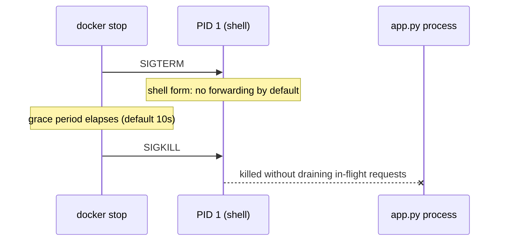

# Containers and Docker — Senior

<!-- level-focus -->
At senior level, focus on this question:

> What invariants must a container image and its runtime configuration guarantee so the same image behaves identically and shuts down safely in every environment it reaches — and what evidence proves those invariants hold today, not just at build time?

Use the smallest realistic scenario that exposes the decision and its failure behavior.

---

## Core Concept 1 — Anchor Image Design to Invariants, Not to a Working Build

A middle-level pass gets a Dockerfile that builds correctly and produces a small, verified image. At senior level, the organizing question changes: **which invariants does this image actually guarantee, across every environment and every failure it will eventually hit?** An invariant is a property that has to hold regardless of which engineer built which pipeline stage or which host the container lands on — not "the image built successfully in CI" but "the exact same bytes that passed CI are the bytes running in production, and they behave the same way under a kill signal whether that's a laptop or a fleet of production hosts."

Four invariants worth naming explicitly for a container image:

| Invariant | What it rules out |
|---|---|
| The image reference used in every environment resolves to the same immutable content | Staging tests one set of bytes; production, pulling the same tag a day later, runs a different set of bytes because the tag moved |
| The image's runtime behavior does not depend on anything not declared in the image or its explicit configuration | "Works on my machine" because a host-level package, timezone file, or environment variable happened to be present outside the image |
| The main process receives and correctly acts on a termination signal within a bounded, known time | A rollout or scale-down silently drops in-flight requests because the process never saw the signal telling it to drain |
| The image's contents (packages, dependencies, base OS) are known and can be enumerated at any time | A critical CVE is disclosed and nobody can say, without a fresh scan, which running images are affected |

A build that "works" is done when it produces a runnable artifact. An invariant-respecting build is done when each of these has a *mechanism* backing it — not a description of best practice, but something that actually enforces or verifies it: digest pinning, a reproducible-build check, a signal-handling test, an SBOM.

## Core Concept 2 — Invariant 1: Immutability, and the Tag-Drift Failure

A tag like `myapp:1.4` or even `myapp:latest` is a mutable pointer — pushing a new image with the same tag repoints it. Two environments that both say "running `myapp:1.4`" can, at different points in time, be running genuinely different bytes, because the tag moved between the two pulls. This is **tag drift**, and it is one of the most common sources of "it worked in staging" reports that turn out not to be about the application at all.

The fix is to pin by **digest**, not tag, for anything that must be reproducible:

```bash
# Tag-based reference: mutable. "1.4" can point to different bytes tomorrow.
docker pull myapp:1.4

# Digest-based reference: immutable. This exact reference can only ever
# resolve to these exact bytes, by construction of how content hashing works.
docker pull myapp@sha256:9f2a1b3c...e8d7
```

A deployment manifest that references `myapp:1.4` is making an assumption it cannot actually verify — that nobody repushed that tag. A manifest that references `myapp@sha256:...` is stating a fact that cryptographic hashing guarantees. The practical middle ground most teams land on: build immutable, uniquely-tagged images (a commit SHA or build number as the tag, never reused), and resolve deployment manifests to a digest derived from that unique tag at release time, so the tag itself never needs to be mutated after publish.

## Core Concept 3 — Invariant 2: Signal Handling and the PID 1 Problem

The process running as PID 1 inside a container has responsibilities an ordinary process doesn't: it must correctly receive and act on signals (particularly `SIGTERM`), and if it spawns children, it must reap them. Get this wrong and `docker stop` — or a production orchestrator's equivalent scale-down — does not do what it looks like it does.

The failure is concrete and easy to reproduce:

```dockerfile
# Shell form: the shell (/bin/sh -c "...") becomes PID 1, not your app.
# SIGTERM goes to the shell, which does not forward it to the child process
# by default. The app never sees the signal at all.
CMD python app.py
```

```dockerfile
# Exec form: your app's process itself becomes PID 1 and receives
# SIGTERM directly.
CMD ["python", "app.py"]
```



With the shell form, `docker stop` sends `SIGTERM`, the shell PID 1 does nothing with it, the default grace period (10 seconds) elapses with the application never told to shut down, and Docker escalates to `SIGKILL` — which cannot be caught or handled. In-flight requests are simply severed rather than drained. The exec form fixes the direct case, but the same problem returns the moment the entrypoint is a shell script that itself calls the real application as a subprocess: the script, not the app, is PID 1, and the same non-forwarding failure repeats one layer down. The general fix for a script entrypoint is `exec` at the last line, which replaces the shell process with the application rather than running it as a child:

```bash
#!/bin/sh
# entrypoint.sh
echo "starting up"
exec python app.py   # exec replaces this shell with the app — app becomes PID 1
```

For anything that legitimately needs to spawn multiple children and reap zombies, a minimal init process (`tini`, or Docker's built-in `--init` flag) does that job correctly without pulling in a full init system.

## Core Concept 4 — Invariant 3: Health, Draining, and Recovery

`HEALTHCHECK` in a Dockerfile is the mechanism that turns "the process is running" into "the process is actually able to serve traffic" — a distinction that matters the moment a container is up but its dependency (a database connection, a downstream service) is not:

```dockerfile
HEALTHCHECK --interval=10s --timeout=3s --retries=3 \
    CMD wget -qO- http://localhost:8080/health || exit 1
```

Recovery under failure has to be designed, not assumed:

- **Graceful shutdown** — on `SIGTERM`, an application should stop accepting new requests, finish in-flight ones within a bounded time, and only then exit. A restart policy or rollout that doesn't wait for this produces dropped requests indistinguishable, from the outside, to an outage.
- **Restart policy** — `docker run --restart unless-stopped` (or the platform equivalent) determines whether a crashed container comes back automatically. Set too permissively (`always`, no backoff), a container in a crash loop can hammer a downstream dependency continuously; set too conservatively, a transient failure requires manual intervention.
- **Resource limits** — a container with no memory limit declared can consume host memory until the kernel's OOM killer intervenes, at a time and target of the kernel's choosing, not the application's. Declaring an explicit limit (`docker run -m 512m`) makes the failure a predictable, attributable OOM-kill of *that* container rather than a mystery affecting whatever else happened to be running on the host.

## Core Concept 5 — Cross-Component Scenario: The Slow Rollout Nobody Can Explain

A service behind a load balancer is redeployed by replacing containers one at a time. The rollout takes far longer than expected, and a small percentage of requests during the rollout window return errors. Two plausible diagnoses, and what evidence would actually distinguish them:

| Hypothesis | Evidence that would confirm it | Evidence that would rule it out |
|---|---|---|
| **CMD is in shell form; SIGTERM never reaches the app; every container hits the full grace period before SIGKILL** | Rollout duration matches exactly `(grace period) × (number of containers replaced sequentially)`; app logs show no "shutting down" message before the process disappears | App logs show a graceful-shutdown message immediately after `docker stop`, and rollout duration is far shorter than the grace period times container count |
| **The load balancer keeps routing to a container after it has stopped accepting new connections, because health checks lag behind actual readiness** | Errors cluster in the few seconds right after each container is removed from rotation, not throughout its shutdown; health check interval is longer than the time between "stop accepting" and "process exits" | Errors are evenly distributed across the whole grace period rather than clustered near removal |

The evidence-gathering step matters more than guessing: pulling the exact rollout duration and dividing by the number of containers either confirms or immediately rules out the PID 1 hypothesis, without needing to reason about it in the abstract. In a real instance of this scenario, the arithmetic confirming "rollout time equals grace period times container count, to the second" was the piece of evidence that ended the debate — the shell-form `CMD` was the root cause, not the load balancer's health-check timing, and fixing the entrypoint (exec form, `exec` at the end of any wrapper script) cut the rollout time to a fraction of what it had been.

## Core Concept 6 — Questions That Expose Weak Assumptions

Before trusting that an image is production-ready, ask the questions that surface what hasn't actually been tested:

- "If I send this container's PID 1 a `SIGTERM` right now, does the application log a graceful-shutdown message before it exits — or does it just disappear after the grace period?" Most teams have never actually watched this happen; they've only assumed the framework or base image handles it.
- "Does our deployment manifest reference an image by a tag that can be silently repointed, or by something immutable?" An unpinned tag means "the same version in every environment" is an assumption, not a fact.
- "If the base image we build from today were updated tomorrow with a breaking change, would we notice before or after it reached production?" Surfaces whether the build pipeline pins the builder image's version too, not just the final one.
- "Can we enumerate every package and its version currently running in production, right now, without doing a fresh scan first?" An honest "no" means there is no current inventory — only a point-in-time snapshot from whenever the last scan happened.
- "What's the container's behavior under memory pressure — does it get OOM-killed predictably by its own limit, or does it compete with whatever else is on the host?" Surfaces whether resource limits are actually declared or just assumed to be handled by the platform.

## Core Concept 7 — Recovery and Evolution

An image's design is never finished; specific triggers should force a re-evaluation: a CVE disclosed in the base image or a dependency, a base image reaching end-of-life, a new failure mode discovered in production (a rollout that took too long, an OOM-kill nobody expected), or a change in how the image is deployed (moving from a single host to an orchestrator that enforces different signal-handling or resource-limit semantics). Treat each of these as a scheduled re-evaluation point for the invariants in Core Concept 1, not a one-off patch — and treat a "we discovered our app never handled SIGTERM correctly" finding as evidence the invariant was never actually verified, not as an unlucky one-time bug.

---

## Real-World Examples

- **A digest pin ends a "works in staging, not in prod" debate.** Two environments both report running `myapp:1.4`; comparing `docker inspect --format '{{.Image}}'` on each shows different digests behind the same tag, because a hotfix was pushed under the same tag rather than a new one — the bug was never in the application at all.
- **A rollout's slowness turns out to be arithmetic, not mystery.** As in Core Concept 5, computing grace-period × container-count against the observed rollout duration confirms the PID 1 signal-handling hypothesis before anyone needs to instrument the load balancer.
- **An OOM-kill becomes attributable instead of host-wide chaos.** A container with no declared memory limit is killed by the kernel along with an unrelated process on the same host during a memory spike; adding an explicit `-m` limit turns the next incident into a clean, single-container OOM event that's immediately traceable to its cause.

## Common Mistakes

- **Treating a tag as if it were immutable.** Deployment manifests referencing mutable tags make "same version everywhere" an assumption rather than a guaranteed, checkable fact.
- **Never actually testing signal handling.** Assuming the framework or base image forwards `SIGTERM` correctly, without ever sending one and watching for a graceful-shutdown log line.
- **Wrapping the real process in a shell script entrypoint without `exec`.** Reintroduces the PID 1 problem one layer down even after fixing the Dockerfile's `CMD` to exec form.
- **Leaving memory and CPU limits undeclared.** Turns a predictable, single-container failure into unpredictable host-wide resource contention.
- **Treating image security as a one-time scan.** Without a trigger tied to newly disclosed CVEs and base-image end-of-life dates, the "verified" image drifts out of date within weeks of the last scan.

---

## Apply it

1. Take a container image you run (or the one you built at middle level) and send its PID 1 process a `SIGTERM` directly (`docker kill --signal=TERM <container>`), then check the logs for a graceful-shutdown message before the process exits.
2. If no such message appears, find and fix the specific cause — shell-form `CMD`, or a wrapper script entrypoint missing `exec` — and confirm the fix by repeating step 1.
3. Compare `docker inspect --format '{{.Image}}'` for the same image tag pulled in two different environments (or at two different times) and confirm whether they resolve to the same digest.
4. Declare an explicit memory limit for the container (`docker run -m <limit>`) and deliberately trigger memory pressure (or reason through what would happen) to confirm the container is OOM-killed predictably rather than competing uncontrolled with the host.
5. Run the five weak-assumption questions from Core Concept 6 against this image and write down which one exposed the shakiest assumption.

## Verify your work

- You have direct evidence — a log line, not an assumption — that the application receives and acts on `SIGTERM` within a bounded time.
- You can state definitively, from `docker inspect` output, whether two references to "the same image" actually resolve to the same digest.
- The container has an explicit, deliberately chosen memory limit, not an unset default.
- At least one weak-assumption question surfaced a real, previously unverified gap in this specific image, not a hypothetical one.
- You can explain, using the rollout-time arithmetic from Core Concept 5 as a model, how you would distinguish a signal-handling failure from a load-balancer timing failure using evidence rather than guesswork.

## Review questions

- Why does a mutable tag reference undermine the claim that two environments are running "the same image"?
- What specifically breaks when a container's `CMD` is written in shell form instead of exec form, and why does wrapping the real process in a shell script reintroduce the same problem?
- What evidence would distinguish a signal-handling failure from a load-balancer health-check timing issue during a slow rollout?
- Why does treating an image security scan as a one-time event fail to guarantee the invariant that the image's contents are known at any point in time?
