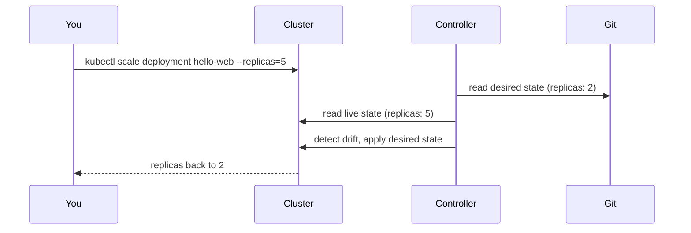

# GitOps (Argo CD, Flux) — Junior

<!-- level-focus -->
At junior level, focus on this question:

> Given one small application and one target cluster, can you make an Argo CD or Flux controller continuously reconcile the cluster to match a Git repository, and prove that a manual change gets detected and reverted?

Use the smallest realistic scenario that exposes the decision and its failure behavior.

*GitOps is not "we keep our YAML in Git." It is a running controller inside the cluster that continuously compares what Git says should exist against what actually exists, and closes the gap on its own. This level is about standing that loop up for one service and watching it actually enforce Git as the source of truth — not just believing that it does.*

---

## Core Concept 1 — Vocabulary

| Term | Meaning |
|---|---|
| **Desired state** | What the manifests in Git say the cluster should look like right now |
| **Actual (live) state** | What is really running in the cluster at this moment |
| **Reconciliation loop** | The controller's continuous cycle: read Git, read the cluster, compute the diff, apply the diff |
| **Drift** | Any difference between desired and actual state — usually caused by a manual `kubectl` change |
| **Sync** | The act of applying the diff so actual state matches desired state |
| **Self-heal** | Automatically re-applying Git's state whenever drift is detected, without a human clicking "sync" |
| **Prune** | Deleting cluster resources that are no longer defined in Git |
| **Application (Argo CD)** | The custom resource that tells Argo CD which Git repo/path to track and which cluster/namespace to deploy it into |
| **GitRepository + Kustomization (Flux)** | Flux's two-part equivalent: a source object (where to pull from) and a reconciler object (what to apply and where) |
| **Push-based deployment** | A CI pipeline runs `kubectl apply`/`helm upgrade` itself, using credentials it holds to reach the cluster |
| **Pull-based deployment (GitOps)** | A controller *inside* the cluster pulls from Git and applies changes; nothing outside the cluster needs write access to it |

## Core Concept 2 — Push vs Pull, Side by Side

| | Push-based CI/CD | Pull-based GitOps |
|---|---|---|
| Who initiates the deploy | The pipeline, on every commit/merge | A controller inside the cluster, on a timer or webhook |
| Where cluster credentials live | In the CI runner/pipeline secrets | Only inside the cluster's controller |
| How drift is detected | It usually isn't — nothing is watching after the deploy | Continuously — the reconciliation loop compares state every cycle |
| What "rollback" means | Re-run an old pipeline job, or `kubectl apply` an old manifest by hand | `git revert` the bad commit; the controller applies the reverted state |
| Audit trail | Pipeline logs, if kept | Git history — every change is a commit with an author and a message |

The point of this table isn't that one approach is universally better. It's that GitOps moves the "who is allowed to change the cluster" question from *pipeline credentials* to *who can merge to a Git branch*, and it adds a standing process that keeps checking the cluster even when nobody just deployed anything.

## Core Concept 3 — A Repeatable Method for One Service

1. **Put the manifests in Git.** Create a repo (e.g., `platform-gitops`) with a path per service, e.g. `apps/hello-web/deployment.yaml` and `apps/hello-web/service.yaml`.
2. **Install the controller in the cluster.** Argo CD via its Helm chart, or Flux via `flux bootstrap github --owner=... --repository=platform-gitops --path=clusters/dev`.
3. **Point the controller at your repo and path.** Create an Argo CD `Application` or a Flux `GitRepository` + `Kustomization` naming the repo URL, branch, and path to watch.
4. **Turn on automated sync with self-heal and prune.** Without this, the controller only tells you about drift — it does not correct it, and deleted manifests leave orphaned resources behind.
5. **Confirm live state matches Git.** Check the Application/Kustomization status; it should report both "in sync" and "healthy," not just one.

## Core Concept 4 — Worked Example: `hello-web`

Repository layout:

```
platform-gitops/
  apps/
    hello-web/
      deployment.yaml   # 2 replicas, image hello-web:1.2.0
      service.yaml
```

Argo CD `Application` manifest:

```yaml
apiVersion: argoproj.io/v1alpha1
kind: Application
metadata:
  name: hello-web
  namespace: argocd
spec:
  project: default
  source:
    repoURL: https://github.com/example-org/platform-gitops.git
    targetRevision: main
    path: apps/hello-web
  destination:
    server: https://kubernetes.default.svc
    namespace: hello-web
  syncPolicy:
    automated:
      prune: true
      selfHeal: true
```

Both controllers need to know two separate things: where to pull the desired state *from* (the Git source), and what to do with it once pulled (apply it to the cluster). Argo CD bundles both into one `Application` object; Flux keeps them as two objects on purpose, so one `GitRepository` source can feed several `Kustomization` reconcilers. Neither tool watches Git in real time by magic — the `interval` field is a polling period (here, Argo CD checks every few minutes by default and Flux is set explicitly to `1m`), and a repository webhook can shorten the gap between "I pushed" and "the controller noticed" without changing what the controller actually does once it notices.

The Flux equivalent — a `GitRepository` (the source) plus a `Kustomization` (the reconciler):

```yaml
apiVersion: source.toolkit.fluxcd.io/v1
kind: GitRepository
metadata:
  name: platform-gitops
  namespace: flux-system
spec:
  interval: 1m
  url: https://github.com/example-org/platform-gitops.git
  ref:
    branch: main
---
apiVersion: kustomize.toolkit.fluxcd.io/v1
kind: Kustomization
metadata:
  name: hello-web
  namespace: flux-system
spec:
  interval: 5m
  sourceRef:
    kind: GitRepository
    name: platform-gitops
  path: ./apps/hello-web
  prune: true
  targetNamespace: hello-web
```

Once applied, `argocd app get hello-web` (or `flux get kustomizations`) reports **Synced** and **Healthy**. Now prove the loop is real, not decorative:



Run `kubectl scale deployment hello-web --replicas=5 -n hello-web`. Within one reconciliation interval, the controller notices the live replica count doesn't match Git's `2`, and reverts it — with no human re-running anything. Then push a real change: bump the image tag to `1.3.0` in `deployment.yaml`, commit, and push. The controller picks it up and rolls out the new image without anyone touching `kubectl`.

## Core Concept 5 — What "Done" Looks Like

For one service, the setup is complete when all of these are true:

1. The Application/Kustomization status shows **both** Synced and Healthy — one without the other is not done.
2. A manual `kubectl` change to a tracked resource is detected and reverted automatically, and you watched it happen.
3. Deleting a manifest from Git and pushing actually removes the matching resource from the cluster (this requires `prune: true`).
4. The only way you changed the cluster the whole exercise was by committing to Git — never by running `kubectl apply` yourself.

## Common Mistakes

- **Editing GitOps-managed resources with `kubectl`.** With self-heal on, the controller reverts it — which feels like "the change didn't work" but is actually the system working correctly. Without self-heal, the edit silently persists as invisible drift.
- **Storing plaintext secrets in the repo.** A password or API key committed to Git — even in a "private" repo — is now in the Git history forever, readable by anyone with repo access, past or present.
- **Leaving sync policy manual and forgetting to sync.** A repo can look like "our source of truth" while the cluster has drifted for weeks because nobody clicked the sync button — manual sync only helps if someone actually does it.
- **Forgetting `prune: true`.** Deleting `service.yaml` from Git looks like it should remove the Service, but without pruning the old object is silently orphaned in the cluster.
- **Assuming "in Git" means "in the cluster."** Until the controller has actually completed a sync cycle, a commit is just a commit — check the Application/Kustomization status, don't assume.

## Apply it

1. Start a local `kind` cluster and install Argo CD (or Flux) into it.
2. Create a small Git repo with `apps/hello-web/deployment.yaml` (2 replicas, a real image) and `service.yaml`.
3. Create the Application (or GitRepository + Kustomization) pointing at that repo and path, with `automated: { prune: true, selfHeal: true }`.
4. Confirm the app reaches Synced + Healthy, then run `kubectl scale deployment hello-web --replicas=5 -n hello-web` and time how long it takes to revert on its own.
5. Change the image tag in Git only (no `kubectl`), push, and confirm a new rollout happens without you running any cluster command yourself.

## Verify your work

- `argocd app get hello-web` (or `flux get kustomizations`) shows **Synced** and **Healthy** simultaneously.
- A manual replica-count change you made with `kubectl` reverted back to Git's value without you re-running anything.
- Deleting `service.yaml` from Git and pushing removed the Service object from the cluster (pruning worked).
- A commit-only image tag change produced a new rollout, visible via `kubectl rollout history deployment/hello-web -n hello-web`.

## Review questions

- What is the difference between the controller detecting drift and the controller correcting drift?
- Why does pull-based GitOps mean cluster credentials never need to live in a CI pipeline?
- What two conditions must both be true for an Argo CD Application (or Flux Kustomization) to be considered fully synced?
- Why does deleting a manifest from Git only remove the matching resource from the cluster if pruning is enabled?
