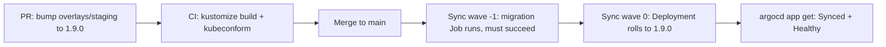

# GitOps (Argo CD, Flux) — Middle

<!-- level-focus -->
At middle level, focus on this question:

> Across dev, staging, and prod, how do you structure repos/overlays and choose sync policies so a promotion is a reviewable Git change instead of a fresh deployment risk?

Use the smallest realistic scenario that exposes the decision and its failure behavior.

*Junior-level GitOps proves the reconciliation loop works for one service in one place. Middle level is about composing that loop across several services and several environments without the repo layout, the sync policy, or an autoscaler fighting you — and about knowing when GitOps is the wrong tool for a given resource.*

---

## Core Concept 1 — Repo and Overlay Structures

| Structure | Promotion mechanism | Blast radius of a bad merge | Audit clarity | Notes |
|---|---|---|---|---|
| **Branch per environment** (`dev`, `staging`, `main`→prod) | Merge/cherry-pick between branches | Contained to one branch, but merge conflicts obscure what actually changed | Weak — a merge commit hides the real diff between environments | Simple to start, painful once environments diverge |
| **Directory per environment, Kustomize overlays** (`base/` + `overlays/dev,staging,prod`) | A PR that bumps an overlay's patch (e.g., image tag) | Contained to the touched overlay; base changes affect all overlays | Strong — one PR diff shows exactly what changed and where | Most common pattern for a handful to a few dozen services |
| **Repo per environment** | A pipeline or bot copies validated config from a "source" repo into each env repo | Strongest isolation; a bad prod repo commit still can't leak from dev | Strong, but harder to see one change across all env repos at a glance | Used when environments need separate access control at the repo level |
| **Helm chart + values-per-environment** | A PR changing `values-prod.yaml` | Depends on chart quality — a bad template change affects every values file at once | Strong if values are small and readable | Familiar to Helm users; templating complexity is the trade-off |

None of these is universally correct. The decision axis that matters most in practice is **how visible a single promotion is in one diff** — a reviewer approving "bump `hello-web` to `1.4.0` in staging" should not have to reconstruct that fact from a tangled merge. Kustomize overlays over a shared `base/` are the most common middle-ground: one repo, one branch, environment differences expressed as small patches instead of duplicated YAML.

## Core Concept 2 — Sync Policy Is a Design Decision, Not a Default

| Setting | What it does | When to leave it off |
|---|---|---|
| `automated` | Sync happens without a human clicking "sync" | Rarely — manual sync means drift silently accumulates until someone remembers to look |
| `selfHeal` | Reverts manual drift automatically | When a resource's field is legitimately managed by something other than Git (see Concept 4) |
| `prune` | Deletes cluster resources no longer defined in Git | Almost never off — leaving it off accumulates orphaned resources indefinitely |
| Sync waves / hooks | Orders resources within one sync (e.g., a migration Job before a Deployment) | Only needed once ordering actually matters — don't add waves speculatively |

The middle-level judgment call is less "on or off" and more "on for which resources, and with which exceptions." A blanket `selfHeal: true` across every field of every resource is what causes the most common intermediate mistake (next section).

## Core Concept 3 — Testability and Debugging at Two Levels

**Unit level (before merge, in CI):** validate manifests statically before Argo CD or Flux ever sees them.

```yaml
# .github/workflows/validate.yml (excerpt)
- name: Build and validate overlay
  run: |
    kustomize build overlays/staging | kubeconform -strict -summary
    kustomize build overlays/staging | conftest test -p policy/ -
```

This catches malformed YAML, missing required fields, and policy violations (e.g., "no `:latest` image tags," "every Deployment must set resource limits") *before* a human reviews the PR, let alone before the controller applies it.

**Integrated-flow level (after merge, against a real cluster):** static validation cannot catch everything — a valid manifest can still reference a Secret that doesn't exist, or a Service selector that doesn't match any Pod. Use the controller's own diff and health signals:

- `argocd app diff hello-web` shows exactly what would change against live state before forcing a sync.
- `argocd app get hello-web -o json | jq '.status.health'` and `.status.sync` show whether the last apply actually converged and passed readiness checks — not just "the YAML applied without error."
- Flux equivalents: `flux diff kustomization hello-web --path ./overlays/staging` and `flux get kustomizations` for status.

A change is "verified" at middle level only when both checks pass: it built and validated cleanly in CI, *and* it reached Synced+Healthy in a real cluster — usually staging — before the same commit is promoted to prod.

## Core Concept 4 — The Classic Under- vs Over-Application Signal: Fighting the Autoscaler

The most common intermediate mistake is tracking a field in Git that something else legitimately changes at runtime. A Horizontal Pod Autoscaler adjusts `spec.replicas` continuously based on load. If the Deployment's `replicas` field is also committed to Git with `selfHeal: true`, the controller and the HPA fight: the HPA scales up under load, the GitOps controller notices "drift" and scales back down to the committed value, over and over.

This is a real signal of **over-application** — using GitOps to manage a field that isn't actually static. The fix is narrow, not "turn off selfHeal everywhere":

```yaml
# Argo CD Application spec — stop tracking a specific field
spec:
  ignoreDifferences:
    - group: apps
      kind: Deployment
      name: hello-web
      jsonPointers:
        - /spec/replicas
```

The opposite failure — **under-application** — looks like a team that nominally "adopted GitOps" but still runs `kubectl apply` by hand for "just this one urgent fix." The tell is simple: if a manual change to a tracked resource does *not* get reverted, either self-heal is off, or the resource was never actually declared in Git in the first place. Either way, Git is not really the source of truth yet — it's aspirational documentation.

## Core Concept 5 — Incremental Adoption

Don't wire every service and every environment to automated GitOps in one step. A workable order:

1. Pick one **non-critical internal service** in **staging only**. Prove the reconciliation loop, the rollback story (`git revert`), and the on-call runbook for "the controller itself is unhealthy."
2. Add **drift alerting** (a notification when an Application goes OutOfSync unexpectedly, not just when it fails to sync) before adding more services — otherwise silent drift on service #2 goes unnoticed while you're focused on service #1.
3. Settle **secrets handling** (Sealed Secrets, SOPS, or External Secrets Operator) before onboarding prod — this is the piece teams most often defer, and prod is where deferring it hurts most.
4. Generalize the repo layout into a template (an "app-of-apps" or a scaffold script) so the next five services follow the same overlay/sync-wave conventions instead of five slightly different ones.

## Core Concept 6 — Worked Scenario: Promoting `payments-api` With a Migration Step

`payments-api` needs a database migration Job to finish *before* its new Deployment rolls out — a sequencing problem that crosses two Kubernetes objects and two lifecycle stages. Argo CD sync waves express the order declaratively:

```yaml
apiVersion: batch/v1
kind: Job
metadata:
  name: payments-api-migrate
  annotations:
    argocd.argoproj.io/hook: PreSync
    argocd.argoproj.io/sync-wave: "-1"
spec:
  template:
    spec:
      containers:
        - name: migrate
          image: payments-api:1.9.0
          command: ["./migrate", "up"]
      restartPolicy: Never
---
apiVersion: apps/v1
kind: Deployment
metadata:
  name: payments-api
  annotations:
    argocd.argoproj.io/sync-wave: "0"
spec:
  replicas: 3
  template:
    spec:
      containers:
        - name: payments-api
          image: payments-api:1.9.0
```



The same commit that bumps the overlay's image tag also carries the migration Job. Promotion to prod is the identical PR pattern applied to `overlays/prod` — reviewed separately, after staging has shown Synced+Healthy for that exact commit, not just "it looked fine in staging at some point."

## Common Mistakes at This Level

- **Tracking autoscaled or otherwise externally-managed fields** without `ignoreDifferences`, causing a permanent fight between the controller and whatever else changes that field.
- **One giant `base/` shared by unrelated services**, where an unrelated team's change to the base breaks your overlay — treat a shared base as a real dependency, not just shared YAML.
- **Restructuring the repo layout after a dozen services are already wired to it.** Changing overlay paths or introducing sync waves retroactively touches every consuming Application at once — decide the shape before scaling past a handful of services.
- **Skipping the integrated-flow check.** A PR that passes `kubeconform` in CI can still fail to reach Healthy in a real cluster (missing Secret, bad Service selector); relying on static validation alone misses this class of bug entirely.
- **Manual sync as the "safety" default.** It feels safer, but in practice it just means drift accumulates until the next time someone remembers to check — it's a false sense of control, not real control.

## Apply it

1. Set up `base/ + overlays/dev,staging,prod` for two services: one plain service (`hello-web`) and one with an HPA attached (`api-gateway`).
2. Add a CI job that runs `kustomize build` against each overlay and validates it with `kubeconform` before merge.
3. Give `payments-api` a `PreSync` migration Job at sync-wave `-1` and its Deployment at sync-wave `0`; confirm the migration completes before the Deployment updates.
4. Add `ignoreDifferences` on `api-gateway`'s `spec.replicas` and confirm the HPA can scale it without the controller reverting the change.
5. Promote a real change (an image tag bump) from `overlays/staging` to `overlays/prod` via a separate PR, only after staging shows Synced+Healthy for that exact commit.

## Verify your work

- CI fails the PR when an overlay's manifests are structurally invalid, before a human ever reviews it.
- The migration Job's pod completes and exits successfully before the `payments-api` Deployment's pods roll to the new image — visible in the sync operation's step order.
- After adding `ignoreDifferences`, the HPA can scale `api-gateway` up and down without the Application going OutOfSync.
- The prod promotion PR's diff shows only the intended overlay change, and `argocd app get` (or `flux get kustomizations`) reports Synced+Healthy for prod at the same commit SHA staging validated.

## Review questions

- Why do Kustomize overlays over a shared base typically make a promotion easier to review than a branch-per-environment layout?
- What concrete symptom tells you a tracked field is fighting something else (like an HPA) instead of correctly reflecting desired state?
- Why is a static manifest validation in CI not sufficient proof that a change is safe to promote to prod?
- What is the risk of restructuring repo layout or introducing sync waves only after a dozen services already depend on the existing structure?
