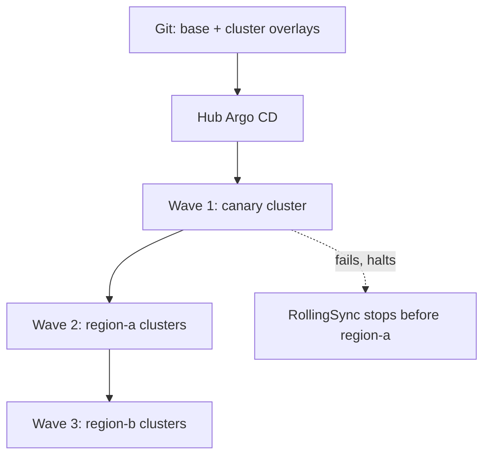

# GitOps (Argo CD, Flux) — Senior

<!-- level-focus -->
At senior level, focus on this question:

> When Git and a reconciliation controller become the standing authority over many clusters, which invariant protects you when a bad commit, a compromised credential, or a controller outage happens — and how do you contain the blast radius?

Use the smallest realistic scenario that exposes the decision and its failure behavior.

*At middle level the question was "how do I structure this for a handful of services." At senior level the structure is assumed solved, and the question becomes: Git plus a reconciliation loop is now a standing, autonomous system with real authority over production. What breaks it, what does it break when it breaks, and what has to be true before you hand it that authority across a fleet of clusters rather than one.*

---

## Core Concept 1 — The Trust Boundary Has Moved, Not Disappeared

Push-based CI/CD put trust in pipeline credentials. GitOps moves it, in full, to two places: **who can merge to the branch a controller tracks**, and **the credentials the controller itself holds** (its Git read access and its cluster write access). Neither is smaller than the old pipeline credential — a merge to `main` on a repo an Argo CD Application tracks with `automated.selfHeal: true` *is* a production deploy, whether or not anyone thinks of it that way. Branch protection, required reviews, and signed commits on GitOps-tracked branches are therefore not code-hygiene niceties; they are the access-control layer for the cluster.

## Core Concept 2 — Fan-Out Topology Determines Blast Radius

| Topology | What it looks like | Blast radius of one bad change | Operational cost |
|---|---|---|---|
| **Hub, one control plane** | One Argo CD instance (or Flux install) manages N clusters via `ApplicationSet` cluster generators | A bad template or a mis-scoped generator can touch every cluster in one reconciliation pass | One thing to upgrade, patch, and secure |
| **Spoke, controller per cluster** | Each cluster runs its own Argo CD/Flux instance, pointed at its own path in a shared repo | A bad commit or a compromised controller is contained to one cluster | N things to upgrade, patch, and monitor |

Most fleets land on hub-for-visibility with **staged rollout** layered on top, so the hub's convenience doesn't become a single blast radius. Argo CD's `ApplicationSet` supports a `RollingSync` strategy that applies changes to cluster groups in waves (canary cluster, then region A, then region B); Flux achieves the same shape with `dependsOn` between `Kustomization` objects, gating region B's reconciliation on region A's having succeeded.

```yaml
# ApplicationSet excerpt: staged fan-out by cluster label
spec:
  strategy:
    type: RollingSync
    rollingSync:
      steps:
        - matchExpressions:
            - {key: wave, operator: In, values: [canary]}
        - matchExpressions:
            - {key: wave, operator: In, values: [region-a]}
        - matchExpressions:
            - {key: wave, operator: In, values: [region-b]}
```



The trade-off is latency: a genuinely urgent fix (a live security patch) now takes several waves to reach everywhere, which is why a senior design also needs a documented, audited fast path — still through Git, just without the wait — rather than an informal "just kubectl it everywhere" escape hatch that undoes the whole model under pressure.

## Core Concept 3 — Secrets Cannot Live in Git, and Each Fix Has a Different Failure Mode

Git as source of truth does not mean plaintext credentials in Git. Three common approaches, with different senior-level failure modes:

| Approach | How it works | Failure mode to design for |
|---|---|---|
| **SOPS** | Secrets are encrypted in-place in the repo; the controller (or a plugin) decrypts at apply time with a KMS/PGP key | Key rotation and key-loss recovery — if the decryption key is gone, every encrypted file in history is unrecoverable |
| **Sealed Secrets** | A cluster-side controller holds a private key; `SealedSecret` objects are asymmetrically encrypted and only decryptable by that cluster's controller | The private key is tied to *one* cluster — a disaster-recovery restore into a new cluster needs the key backed up separately, or every SealedSecret must be re-sealed |
| **External Secrets Operator** | Git holds only a reference (e.g., a Vault path); the operator fetches the real value at sync time from an external store | Adds a hard runtime dependency — if Vault/Secrets Manager is unreachable, new syncs fail even though the manifest itself is fine |

None of these is strictly better; the senior judgment is matching the failure mode to what you can tolerate — e.g., Sealed Secrets' single-cluster key binding is a real problem for multi-region DR and needs an explicit backup plan, not a surprise discovered during a failover drill.

## Core Concept 4 — Reconciliation Failure Modes

- **Controller outage.** Already-synced workloads keep running — reconciliation is not in the live request path — but new commits stop landing, and drift accumulates *silently* until the controller recovers. The invariant to protect: alert on "time since last successful reconciliation" per Application/Kustomization, not merely on controller pod uptime, since the pod can be up while stuck on repeated sync errors.
- **Reconciliation storm.** A single commit to a shared base (a common ConfigMap, CRD, or NetworkPolicy referenced by many apps) can trigger simultaneous restarts across every consuming workload in one pass. Bound this with sync waves, staged fan-out, or by splitting a shared base so one change's blast radius is smaller than "everything at once."
- **Split-brain during an incident.** With `automated.selfHeal: true`, an on-call engineer's manual `kubectl` fix during an active incident gets silently reverted by the controller — they think their fix "didn't take" and repeat it, fighting the loop instead of the incident. The fix is procedural: a documented, audited way to pause reconciliation on a specific Application (Argo CD's manual sync mode, or Flux's `spec.suspend: true`) for the duration of an incident, then resume once the real fix is committed.
- **A bad commit auto-synced straight to prod.** If prod's overlay is in the same automated path as everything else, a broken manifest reaches prod as soon as it's merged. The invariant: prod's sync should be gated by an explicit signal — a passed staging health check, a required approval, or simply being later in a RollingSync wave — not by "merge equals deploy everywhere, immediately."

## Core Concept 5 — Recovery Is `git revert`, With One Hidden Assumption

Rollback in GitOps is reverting the bad commit and letting the controller reapply. This only works if the reverted manifests still apply cleanly — which quietly assumes the cluster's API surface hasn't moved out from under them. A CRD version bump, a removed API version, or a Kubernetes upgrade between the bad commit and the revert can make the "old" manifests invalid again, turning a one-line `git revert` into a real incident. Treat CRD/API deprecation windows as a compatibility contract with your own rollback story, not just with consumers.

## Evidence, Not Preference

Validate the design with the same rigor you'd apply to any other production system:

- **Kill the controller pod** in a non-prod cluster and confirm existing workloads keep serving; measure how long it takes reconciliation alerting to fire versus how long it actually takes the controller to recover.
- **Inject a deliberately broken commit** into a non-prod wave and confirm the staged rollout (RollingSync / `dependsOn`) actually halts before it reaches the next wave — don't assume the gate works, watch it stop something.
- **Time drift-to-detection.** Manually change a tracked resource and measure how long until it's flagged, and separately how long until self-heal reverts it — these are two different numbers and both matter for your alerting thresholds.
- **Run a revert drill.** Pick a real past commit, revert it, and measure how long until the fleet reports Synced+Healthy again — this is the number that matters during an actual incident, not an assumption about how fast `git revert` "should" be.

## Worked Scenario: 12 Clusters, 3 Regions, One Shared Base

A hub Argo CD instance manages 12 clusters (4 per region × 3 regions) via `ApplicationSet` with a cluster generator, using `RollingSync`: one canary cluster, then region A, then region B, then region C. Secrets come from External Secrets Operator backed by Vault. A commit changes the shared `base/` Kustomize layer that every region's overlay inherits — say, a new resource-quota default.

The rollout reaches the canary cluster first; its Applications go OutOfSync, sync, and report Healthy. RollingSync only advances to region A once canary reports success — if the new quota breaks a workload on canary, the wave halts there, and regions A–C never see the change. The cost is real: a genuinely urgent fix now takes multiple wave transitions to reach every cluster, which is why the design also needs an audited "break-glass" Application — still Git-driven, still reviewed, just outside the wave schedule — for the rare case where the delay itself is the risk.

## Questions That Expose Weak Assumptions Before Implementation

- What happens to already-running workloads if the controller is down for six hours — do they keep serving, and would you even know reconciliation had stopped?
- Who can actually merge to the branch prod tracks, and is that enforced by branch protection, or only by convention that a busy reviewer can forget?
- If the Git provider itself is unreachable, can already-synced clusters keep serving without any dependency on Git being reachable right now?
- Does reverting the last five commits actually restore working manifests, or has a CRD/API version moved underneath them so the "old" state no longer applies?

## Apply it

1. State the invariant this design must protect: bounded blast radius per change, and no silent, undetected drift.
2. Stand up (or simulate) a hub-and-spoke topology with at least three cluster groups and a staged `RollingSync` (or `dependsOn`) rollout.
3. Inject a deliberately broken commit into the canary wave and confirm the rollout halts before reaching the next wave.
4. Kill the controller pod and measure time-to-alert versus time-to-recover, separately.
5. Run a revert drill on a real past commit and measure time until the fleet reports Synced+Healthy again.

## Verify your work

- The broken canary commit measurably stopped the rollout before it touched the next wave — you watched it halt, not assumed it would.
- Reconciliation-outage alerting fired based on "time since last successful sync," not merely controller pod liveness.
- The revert drill produced a concrete time-to-recovery number, and any CRD/API compatibility issue during the revert was caught, not discovered later in a real incident.
- The secrets approach's specific failure mode (key loss, backend unavailability) was tested, not just assumed away.

## Review questions

- Why does a merge to a GitOps-tracked branch carry the same authority as a push-based deploy, and what should that imply about branch protection?
- What is the difference between "controller pod is up" and "reconciliation is healthy," and why does alerting need to distinguish them?
- Why can Sealed Secrets' single-cluster key binding become a disaster-recovery problem, and how would you design around it?
- What has to be true about API/CRD compatibility for a `git revert` to actually restore a working cluster state?
