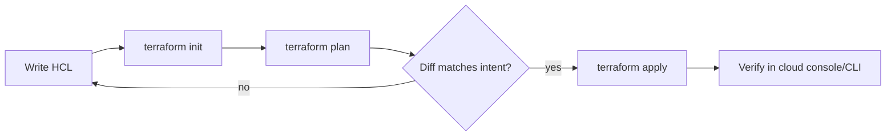

# Infrastructure as Code — Junior

<!-- level-focus -->
At junior level, focus on this question:

> Can you write, plan, and apply a small Terraform configuration, then reproduce the exact same infrastructure from scratch?

Use the smallest realistic scenario that exposes the decision and its failure behavior.

## 1. What Infrastructure as Code Actually Means

Infrastructure as Code (IaC) means you describe the servers, networks, storage, and other cloud resources you need as **text files**, check those files into version control, and let a tool create, change, or delete the real resources to match what the text says. The alternative — clicking buttons in a cloud console to create a bucket or a virtual machine — is sometimes called **ClickOps**. ClickOps works once. It does not survive a second environment, a second engineer, or a memory lapse six months later about which checkbox you ticked.

IaC tools fall into two families:

- **Declarative** — you describe the *end state* you want ("there should be exactly one S3 bucket named `acme-nightly-reports-dev`"), and the tool figures out what actions get you there. Terraform, CloudFormation, and Pulumi (in declarative mode) work this way.
- **Imperative** — you describe the *steps* to take ("create a bucket, then enable versioning on it"), similar to a shell script. Most cloud CLIs and hand-rolled bash scripts work this way.

This module uses **Terraform** as the reference tool because its plan/apply workflow is the clearest way to learn the core ideas, and those ideas transfer directly to Pulumi, CloudFormation, or any other declarative provisioning tool.

| Term | Meaning |
|---|---|
| **Provider** | A plugin that knows how to talk to one platform's API (`aws`, `google`, `azurerm`) |
| **Resource** | One concrete thing to create — a bucket, a VM, a database instance |
| **Configuration (HCL)** | The `.tf` files where you declare providers and resources |
| **State** | A file (usually JSON) recording what Terraform believes currently exists, mapping each resource block to a real, live object |
| **Plan** | A dry run: compares configuration + state + real infrastructure, and shows exactly what would change |
| **Apply** | Executes the plan: creates, updates, or destroys real resources to match the configuration |

## 2. The Repeatable Method

Every IaC change, from a single test bucket to a production database, follows the same loop:



- **`terraform init`** downloads the provider plugin and sets up the backend that stores state. You run it once per new configuration, and again whenever you add a provider.
- **`terraform plan`** is the step juniors skip and regret skipping. It never touches real infrastructure — it only computes and prints a diff. Read it every time, even on the tenth "trivial" change.
- **`terraform apply`** performs the actions the plan described. By default it re-shows the plan and asks for confirmation (`yes`) before doing anything.
- **Verify** independently — with the cloud CLI or console — that what you asked for is what you got. Don't trust "Apply complete" alone; trust the evidence.

## 3. A Worked Example: One S3 Bucket

Assume you need a bucket to hold nightly report exports, in a fresh AWS account, region `ap-southeast-1`.

```hcl
# main.tf
terraform {
  required_providers {
    aws = {
      source  = "hashicorp/aws"
      version = "~> 5.0"
    }
  }
}

provider "aws" {
  region = "ap-southeast-1"
}

resource "aws_s3_bucket" "reports" {
  bucket = "acme-nightly-reports-dev"

  tags = {
    Environment = "dev"
    ManagedBy   = "terraform"
  }
}

resource "aws_s3_bucket_versioning" "reports" {
  bucket = aws_s3_bucket.reports.id
  versioning_configuration {
    status = "Enabled"
  }
}
```

Run `terraform init`, then `terraform plan`:

```text
Terraform will perform the following actions:

  # aws_s3_bucket.reports will be created
  + resource "aws_s3_bucket" "reports" {
      + bucket = "acme-nightly-reports-dev"
      + id     = (known after apply)
      + tags   = {
          + "Environment" = "dev"
          + "ManagedBy"   = "terraform"
        }
    }

  # aws_s3_bucket_versioning.reports will be created
  + resource "aws_s3_bucket_versioning" "reports" {
      + bucket = (known after apply)
      + id     = (known after apply)
    }

Plan: 2 to add, 0 to change, 0 to destroy.
```

The `+` marks show only new resources — nothing existed before, so nothing changes or is destroyed. This is the moment to stop and read: does "2 to add, 0 to change, 0 to destroy" match what you expected? If a plan ever says "1 to destroy" when you thought you were only adding something, **stop before applying**.

Run `terraform apply`, type `yes` when prompted:

```text
aws_s3_bucket.reports: Creating...
aws_s3_bucket.reports: Creation complete after 1s [id=acme-nightly-reports-dev]
aws_s3_bucket_versioning.reports: Creating...
aws_s3_bucket_versioning.reports: Creation complete after 0s [id=acme-nightly-reports-dev,Enabled]

Apply complete! Resources: 2 added, 0 changed, 0 destroyed.
```

Verify independently:

```bash
$ aws s3api get-bucket-versioning --bucket acme-nightly-reports-dev
{
    "Status": "Enabled"
}
```

Now run `terraform plan` again with no changes to the file. You should see:

```text
No changes. Your infrastructure matches the configuration.
```

This is the property that makes IaC worth learning: the configuration is a *reproducible description* of reality. If you deleted this bucket and ran `terraform apply` again from the same `.tf` file, on the same or a different machine, you would get the identical bucket back (same name, same tags, same versioning setting) — that is reproducibility, and it is the whole point.

## 4. Success Criteria

| Check | What it proves |
|---|---|
| `terraform plan` shows the exact count of adds/changes/destroys you expect | Your mental model matches the tool's |
| `terraform apply` completes with "0 destroyed" when you only intended to add | Nothing was accidentally removed |
| The resource is visible via the cloud CLI/console, not just in Terraform's output | The change actually reached the real infrastructure |
| A second `terraform plan` reports "No changes" | Configuration and reality are in sync — no drift |
| Deleting the resource and re-applying recreates it identically | The configuration is reproducible, not a one-off |

## 5. Common Beginner Mistakes

1. **Applying without reading the plan.** Typing `yes` on autopilot is how a junior discovers, too late, that a rename was actually a destroy-and-recreate.
2. **Hand-editing a Terraform-managed resource in the console.** Change a tag by hand in the AWS console, and the next `terraform apply` will either silently revert it (if the attribute is managed) or leave it inconsistent — this is called **drift**, and it starts eroding trust in the state file immediately.
3. **Committing secrets in the configuration.** Hardcoding an access key or a database password directly in a `.tf` file puts it in your Git history forever, even if you delete the line later.
4. **Not pinning the provider version.** Omitting `version = "~> 5.0"` means a future `terraform init` can silently pull a newer provider with different defaults, and your "unchanged" configuration suddenly plans a diff.
5. **Forgetting to destroy throwaway resources.** A learning sandbox bucket or test VM left running after the exercise quietly accrues cost — always pair `apply` with a planned `terraform destroy` when you're done.
6. **Reusing a resource name across learners or environments.** Two people running the same tutorial in the same account with `bucket = "reports"` collide — bucket names in S3 are globally unique, and generic names are a frequent source of confusing plan errors.

## Apply it

1. Write a Terraform configuration with one `aws_s3_bucket` resource named uniquely to you (for example, `<yourname>-iac-junior-exercise`).
2. Run `terraform init` then `terraform plan`, and read the diff before doing anything else — confirm it says exactly "1 to add, 0 to change, 0 to destroy."
3. Run `terraform apply`, then verify the bucket exists using `aws s3api head-bucket --bucket <name>` (or your provider's equivalent CLI command).
4. Add an `aws_s3_bucket_versioning` resource pointing at the same bucket, run `plan` again, and confirm it now shows "1 to add" for the new resource only — nothing about the bucket itself should change.
5. Run `terraform destroy`, confirm the CLI verification command now fails with "not found," and run `terraform plan` once more to confirm it proposes recreating both resources from nothing.

## Verify your work

- The `plan` output before every `apply` matched the number of adds/changes/destroys you expected.
- An independent CLI or console check confirms the resource exists with the exact name and settings from your configuration.
- A `plan` run immediately after `apply` reports "No changes."
- `terraform destroy` removes the resources, and a follow-up CLI check proves they are gone.

## Review questions

- What is the difference between `terraform plan` and `terraform apply`, and why should you never skip reading the plan?
- Why does hand-editing a Terraform-managed resource in the cloud console cause problems on the next apply?
- What does it mean for a Terraform configuration to be "reproducible," and how would you prove it?
- Why is committing a hardcoded secret into a `.tf` file dangerous even if you remove it in a later commit?
