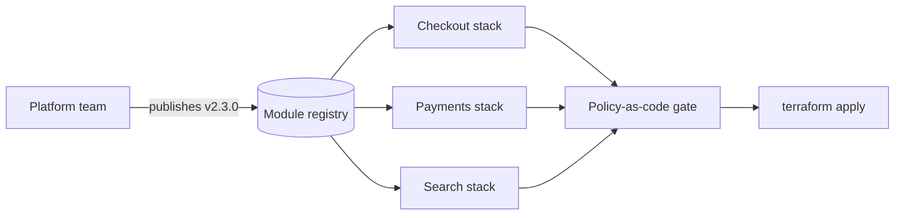

# Infrastructure as Code — Professional

<!-- level-focus -->
At professional level, focus on this question:

> How do you let many teams provision infrastructure safely and quickly, without a platform team becoming the bottleneck on every change?

Use the smallest realistic scenario that exposes the decision and its failure behavior.

## 1. The Organizational Problem IaC Creates

A single team with one state file has no organizational problem — whoever wrote the code owns it, and there's no one else to coordinate with. The moment IaC scales past that team, a new problem appears that has nothing to do with Terraform syntax: **who owns the shared modules, who is allowed to apply what, and how does a policy change reach forty stacks owned by eight different teams without freezing everyone's work for a week?**

The professional-level answer is an **operating model**: a platform team owns and versions the golden-path modules (network, database, compute, standard tagging); product teams consume those modules and own their own environment-level configuration and applies; and a policy layer sits between them, enforcing the organization's non-negotiables (tagging, cost allocation, security baselines) without the platform team reviewing every pull request by hand.



## 2. Decomposing a Migration Into Reversible Increments

"Migrate everything to IaC" is not a plan — it is a wish. A migration that can be rolled back at every step, and that produces evidence before the next step starts, looks like this:

| Phase | Scope | Reversible? | Exit evidence |
|---|---|---|---|
| **Phase 0 — Inventory & import** | Import existing resources into state without changing anything | Yes — `terraform plan` should show zero diffs | Every targeted resource appears in state, and `plan` reports "No changes" for all of them |
| **Phase 1 — Critical path under IaC** | New changes to core network/database go through PR + plan + apply; manual console access still works as a fallback | Yes — the old manual path is still available during the transition | N consecutive weeks with zero manual changes recorded against critical-path resources |
| **Phase 2 — Enforcement** | Console write access is revoked for managed resource types; CI is the only path that can apply | Harder to reverse — requires re-granting broad access | Audit log shows zero non-CI mutations to managed resources for 30 days |

Each phase's exit condition is a **measurement**, not a date on a calendar. Phase 1 doesn't end because six weeks passed; it ends when the audit log actually shows the behavior you wanted, which means you need the audit log wired up *before* you start counting.

## 3. Governance: Policy as Code, Not Policy as Slide Deck

A rule that lives in a wiki page ("all resources must have a `cost_center` tag") is a rule nobody follows under deadline pressure. A rule enforced by a CI gate is a rule that's actually true:

```text
# conftest / OPA policy (simplified)
deny[msg] {
  resource := input.resource_changes[_]
  resource.change.actions[_] == "create"
  not resource.change.after.tags.cost_center
  msg := sprintf("%s is missing required tag cost_center", [resource.address])
}
```

Running this against the JSON output of `terraform plan` in CI catches a missing tag before `apply`, not after a monthly cost report flags forty untagged resources. The same mechanism enforces security baselines (no public S3 buckets, no security group open to `0.0.0.0/0` on port 22) as a blocking check rather than a periodic manual audit.

**Secrets never live in state or in the repository.** A resource that needs a generated password should source it from a secrets manager (Vault, AWS Secrets Manager, SSM Parameter Store) at apply time, or generate it with a provider resource whose value is immediately written to that secrets manager and referenced by ARN elsewhere — not left sitting in plaintext inside the state file, which is exactly what a plain `random_password` resource does by default.

## 4. Compliance and Operational Accountability

An organization operating IaC at scale needs answers to three standing questions, on demand, not only during an audit:

- **Who applied what, and when?** Every `apply` runs through CI with the initiating pull request, approver, and plan output archived — never a local `terraform apply` from someone's laptop against a shared production state.
- **Is anything drifting right now?** A scheduled job runs `terraform plan -refresh-only` across every managed stack (not just the ones someone remembers to check) and pages the owning team when drift appears, rather than waiting for someone to notice during an unrelated change.
- **What would a break-glass manual change cost us?** Emergencies happen — a manual change during an incident, made faster than waiting for a CI pipeline. The process: the change references an incident ticket, and the owning team reconciles it back into code (via `terraform import` and a follow-up PR) within an agreed window, typically one or two business days. The scheduled drift job is what actually enforces the deadline — if reconciliation doesn't happen, the drift alert keeps firing.

## 5. Cross-Team Contracts: Module Versioning

Product teams cannot be forced onto a synchronized upgrade schedule for shared modules — one team is mid-launch, another has capacity to upgrade this sprint. A semver contract makes independent upgrade timing safe:

| Change type | Version bump | Consumer obligation |
|---|---|---|
| Add an optional variable or output | Patch/minor | None — safe to pick up automatically |
| Change a default value | Minor | Review the changelog before the next `apply`; behavior changes even though no code changed |
| Remove or rename a variable, or add a new required one | Major | Migrate on the consuming team's own timeline; the platform team supports the previous major version for a defined window (for example, two quarters) before retiring it |

The platform team's obligation mirrors any internal API provider's: **breaking changes are versioned and supported for a window, not shipped as silent in-place edits to a shared module that every consumer picks up on their next `plan`.**

## 6. Outcome Measures and Exit Conditions

| Measure | Baseline | Target | Evidence source |
|---|---|---|---|
| % of production infrastructure under IaC | 40% | 95%+ | Reconciliation: cloud API resource inventory vs. resources present in state |
| Mean time to provision a new environment | 3 weeks (manual request + ClickOps) | 2 days | CI pipeline duration for the environment-creation workflow |
| Drift incidents per month, unresolved past 1 week | Unmeasured | Fewer than 5 flagged, 0 left unresolved | Scheduled `plan -refresh-only` job results, tracked over time |
| Manual changes to enforced resource types | Unmeasured | 0 outside the break-glass process | Cloud audit log (CloudTrail or equivalent) diffed against CI-initiated changes |

These numbers are what "the migration is done" means — not a target date on a roadmap slide. If the % under IaC stalls at 70% for two quarters, that's a signal to investigate *why*, not to declare victory on a schedule.

## 7. A Sustained-Delivery Scenario: Rolling Out a Mandatory Tag Across 40 Stacks

The platform team needs every stack (40 of them, owned by 8 teams) to carry a `cost_center` tag for a finance cost-allocation project, without a synchronized "everyone stop and update this week" flag day.

1. **Ship the requirement as non-breaking first.** The shared tagging module adds `cost_center` as an optional variable with a safe fallback default (`"unallocated"`), released as a minor version bump — every consumer's next `plan` shows no forced changes.
2. **Turn on the policy gate in warn-only mode.** The CI policy check flags any stack missing an explicit `cost_center` value with a PR comment, but does not block merges yet. Adoption becomes visible on a dashboard: percentage of the 40 stacks with a real value set, tracked weekly.
3. **Give teams a real window, not a deadline shouted in a channel.** Three weeks, with the dashboard link shared in the platform team's regular sync, and a ticket opened per team for stacks still on the fallback value.
4. **Flip to enforcing once adoption crosses a threshold** — for example, 80% of stacks have a real value. The remaining stacks get individually tracked tickets with owners and dates; they are blocked on their *own next apply*, not force-changed centrally by the platform team.
5. **Close the loop with evidence, not a sign-off email.** The finance cost-allocation report itself, run against real tag data, is the final proof — not a checklist saying the rollout "happened."

This is what sustained delivery looks like: the rollout produces evidence at every step (adoption percentage, per-team tickets, the eventual cost report) instead of a single big-bang cutover that either works everywhere at once or breaks everywhere at once.

## Apply it

1. Pick one real or simulated migration (bringing an existing environment under IaC, or rolling out a mandatory policy) and define two measurable outcomes for it, plus exactly how each will be read from existing telemetry or logs.
2. Split that migration into at least three reversible phases — each with a stated, evidence-based exit condition, not a calendar date.
3. Write a version-bump contract for one shared module (what counts as patch, minor, and major) including the support window for a deprecated major version.
4. Roll out one policy-as-code check in warn-only mode across every consuming stack, and track adoption on a dashboard before flipping it to enforce.
5. Define and document the break-glass process for emergency manual changes, including the reconciliation deadline and what happens if it's missed.

## Verify your work

- The Phase 0 inventory reconciliation report shows zero-diff plans across every targeted resource before that phase is declared complete.
- The adoption dashboard for the policy rollout shows the threshold was crossed before the gate moved from warn-only to enforcing.
- The cloud audit log shows zero non-CI applies to enforced resource types over a rolling 30-day window.
- At least one break-glass event — real or drilled — was reconciled back into code within the committed window, with the drift job's alert as the trigger that made this happen.

## Review questions

- Which measurable outcome proves a migration is finished, rather than merely started?
- How does a module's version contract let eight teams upgrade on eight different schedules without breaking each other?
- What evidence would show a policy rollout succeeded without forcing a synchronized flag day?
- Who is accountable when a break-glass manual change is never reconciled back into code, and how would the organization even notice?
