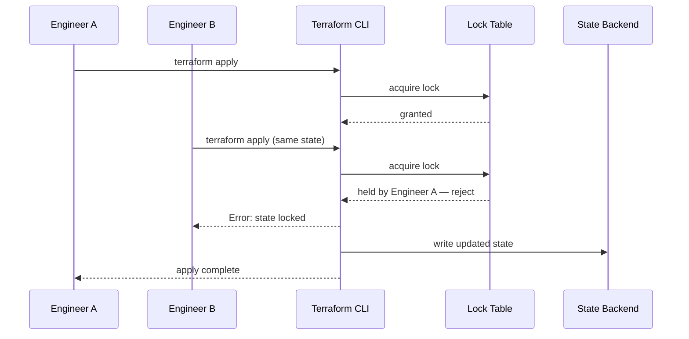

# Infrastructure as Code — Senior

<!-- level-focus -->
At senior level, focus on this question:

> Which invariant breaks first — under a concurrent apply, a hand-edited resource, or state drift — and how do you contain the blast radius before it reaches production?

Use the smallest realistic scenario that exposes the decision and its failure behavior.

## 1. Three Sources of Truth, One of Them Wrong

Every IaC system juggles three things that are supposed to agree and eventually don't:

1. **The code** — what you declared should exist.
2. **The state file** — what Terraform last recorded as existing.
3. **Reality** — what the cloud provider actually has right now.

Drift is any gap between these three. A senior engineer's job is not to prevent drift entirely — someone will always fix something by hand during an incident at 2 a.m. — it is to make drift **detectable before it's destructive**, and to know which of the three sources wins when they disagree.

The invariant to protect: **state is the only thing Terraform trusts when computing a plan.** If reality has changed and state hasn't been refreshed, the next `apply` reasons from a stale picture, and its diff can be actively wrong — proposing to "fix" something that was already fine, or missing something that quietly broke.

## 2. Failure Modes You Own

| Failure mode | Trigger | Symptom | Root cause |
|---|---|---|---|
| **State corruption** | Two engineers `apply` the same state concurrently without a lock | Resources duplicated or missing from state; subsequent plans nonsensical | No remote backend locking configured, or someone bypassed it with `-lock=false` |
| **Drift-induced destroy** | Someone edits or deletes a resource by hand in the console | Next `apply` tries to recreate, destroy, or "correct" a resource that was intentionally changed | State says the old configuration is truth; reality disagrees and nobody reconciled it |
| **Secret leakage** | A resource attribute is a plaintext secret (e.g., a generated database password) | Anyone with read access to the state file or its backend can read the secret | Terraform stores every attribute value in state, unencrypted by default, regardless of how the value was produced |
| **Downtime from forced replacement** | Changing an attribute the provider marks `ForceNew` (e.g., an RDS engine version that isn't upgradable in place, or renaming a launch template) | Plan shows `-/+ destroy and re-create` where you expected `~ update in place` | The resource's own API doesn't support updating that attribute; Terraform has no choice but to recreate |
| **Orphaned resources** | `terraform apply` is killed mid-run (CI timeout, network blip, a laptop that sleeps) | Some resources were created in the cloud but never recorded in state, or vice versa | Apply is not one atomic transaction across multiple resources — each resource is created and recorded individually |

## 3. What State Locking Actually Guarantees — And Doesn't



Locking guarantees that two `apply` runs against the *same state file* cannot interleave their writes. It does **not** guarantee that the plan Engineer A is applying still reflects reality by the time the lock is granted — if the cloud changed between A's `plan` and A's `apply`, locking has nothing to say about that. It also does not protect you from two people pointed at **different** state files that happen to manage overlapping real resources (for example, two teams both importing the same shared VPC into their own state) — that's a governance problem, not a locking problem, and no backend feature fixes it.

## 4. Recovering From Drift and Corruption

Terraform's state subcommands are the surgical toolkit for fixing a state file without destroying and recreating real infrastructure:

```bash
# See what Terraform believes exists
terraform state list

# Inspect one resource's recorded attributes
terraform state show aws_db_instance.primary

# Move a resource to a new address (e.g., after wrapping it in a module) with zero cloud changes
terraform state mv aws_db_instance.primary module.database.aws_db_instance.primary

# Detach a resource Terraform should stop managing, without deleting it
terraform state rm aws_instance.orphaned

# Attach a resource Terraform doesn't know about yet, without creating it
terraform import aws_instance.orphaned i-0abcd1234

# Detect drift without proposing a destructive fix
terraform plan -refresh-only
```

The discipline: **run `-refresh-only` on a schedule, not just when you suspect a problem.** A drift report that says "3 resources changed outside Terraform" is actionable when caught the day it happened; it is a landmine when discovered six months later during an unrelated change, because by then nobody remembers whether the drift was intentional.

State backups matter for the same reason: enable versioning on the S3 bucket (or equivalent) holding state, so a bad write — corrupted JSON, an accidental `state rm` of the wrong resource — has a previous version to roll back to. A state file with no version history is a single point of failure for your entire infrastructure's provenance.

## 5. Reducing Blast Radius: Splitting a Monolith State

A single state file managing network, database, and application for one environment means **any** change to any of the three carries the risk of touching the other two — a bug in an app-layer variable can, in the worst case, still show up as a diff against the database resource block if they share a state file and a careless refactor touches both. Splitting state by layer (network state, database state, application state, each with cross-references via `terraform_remote_state` data sources or a service like Terraform Cloud's remote state sharing) shrinks the blast radius of any single `apply` to one layer.

The cost: **cross-state dependencies become explicit and slower to resolve.** The application state must read the network state's outputs (subnet IDs, security group IDs) via a remote-state lookup instead of a same-state resource reference, and the network team's `apply` now has downstream consumers who won't see effects of a breaking change until *they* run `plan`.

## 6. Trade-offs Among Plausible Approaches

| Dimension | Terraform | Pulumi | CloudFormation / CDK |
|---|---|---|---|
| Configuration language | HCL — a purpose-built declarative DSL | General-purpose (TypeScript, Python, Go, etc.) | JSON/YAML; CDK synthesizes these from a general-purpose language |
| State | Explicit file you own and back up | Explicit, managed by Pulumi Cloud or self-hosted backend | Implicit — AWS tracks it; no file you manage directly |
| Multi-cloud | Strong — one tool, many providers | Strong — same model across providers | AWS-only |
| Drift detection | `terraform plan -refresh-only`, or third-party scanners | Built-in `pulumi refresh` | AWS drift-detection API |
| Blast-radius control | Manual — you choose how to split state | Manual — you choose how to split stacks | Nested stacks; more implicit boundaries |

| Dimension | One monolith state | Many small states (per layer/environment) |
|---|---|---|
| Blast radius of a bad apply | Everything in that state | Only the layer/environment affected |
| Cross-resource references | Direct, same-state, always current | Remote-state lookups; can lag one `apply` behind |
| Operational overhead | Low — one place to look | Higher — more backends, more locks, more CI jobs to maintain |
| Right fit | A single small team, few resources, low change frequency | Multiple teams or layers, frequent independent changes |

The senior judgment is not "which tool is best" — it's **which blast radius matches how independently your teams and layers actually need to change.** A five-person team shipping one product can tolerate a single state far longer than an eight-team org where a database change and a network change happen on unrelated schedules.

## 7. A Cross-Component Scenario

A shared `core-network` module publishes `vpc_id` and `subnet_ids` as outputs, stored in its own state and read by five downstream stacks (`checkout`, `payments`, `search`, `notifications`, `analytics`) via `terraform_remote_state`. A change to the core network's CIDR allocation — splitting one large subnet into two smaller ones for capacity reasons — forces subnet *replacement*, not an in-place update, because subnet CIDR blocks are immutable in the underlying API.

The core-network team's own `plan` looks reasonable in isolation: "2 to add, 2 to destroy." What it doesn't show is that the five downstream stacks have subnet IDs baked into their own state (security group rules referencing the old subnet, an RDS instance pinned to it for its subnet group). Those stacks won't see any diff until *they* run `plan` — by which point the old subnets may already be gone. The failure mode is entirely structural: **remote-state consumers are invisible to the producer's plan.** The fix is process, not tooling — a change to a shared module's outputs that affects existing IDs needs a deprecation window (publish new subnets alongside old ones, let consumers migrate their references, then remove the old ones) rather than an in-place replace-in-one-apply.

## 8. Questions That Expose Weak Assumptions Before Implementation

- What happens if two people run `apply` against this state at the same moment — has anyone actually tested it, or are we assuming the backend handles it?
- If the console and the state file disagree about a resource's configuration right now, which one do we trust, and how would we even notice the disagreement?
- What is the blast radius of this state file if someone runs `terraform destroy` in the wrong directory — and is that radius smaller than "the whole product"?
- Which attributes on this resource force replacement instead of an in-place update, and have we checked whether replacing this specific resource means a customer-visible outage?
- Who else reads this module's outputs via remote state, and would they even notice if we changed one?

## Apply it

1. Identify one monolithic state file currently managing network, database, and application resources for a single environment, and decide which layer is safest to split out first.
2. Use `terraform state mv` (or `moved` blocks) to relocate that layer's resources into their own state and backend key, and confirm the resulting plan shows zero creates or destroys.
3. From two terminals, run `terraform apply` against the same state simultaneously and record the exact lock error the second run produces.
4. Manually change a tag or setting on a live resource outside Terraform, then run `terraform plan -refresh-only` and confirm the drift is reported without proposing a destructive fix.
5. Change an attribute on a non-production copy of a resource that you know forces replacement, and document the `-/+ destroy and re-create` line in the plan before deciding whether a create-before-destroy lifecycle rule is needed.

## Verify your work

- The second concurrent `apply` fails with an explicit state-lock error rather than corrupting or silently overwriting state.
- `terraform state list` before and after the split shows the same resources under a new address, with the accompanying plan reporting no creates or destroys.
- The manually introduced drift appears in the `-refresh-only` plan output before any regular `apply` would have "corrected" it destructively.
- The forced-replacement plan is caught and discussed in review — with the destroy-and-recreate line visible — before it reaches an environment where it would cause downtime.

## Review questions

- Which invariant does state locking actually protect, and which drift scenario does it leave completely unprotected?
- How would you discover that the console and the state file disagree about a resource before the next `apply` acts on that disagreement?
- What evidence would justify splitting a monolithic state file, and what does that split cost in return?
- Which resource in your stack would cause the most damage if replaced instead of updated in place, and how would you find out before applying?
