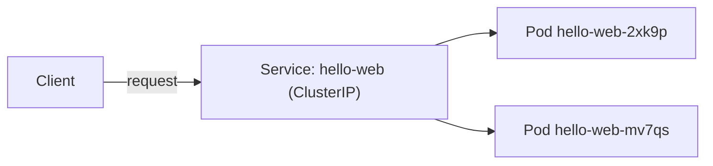

# Kubernetes Orchestration — Junior

<!-- level-focus -->
At junior level, focus on this question:

> Can I deploy a small stateless application to Kubernetes with a Deployment and Service, and prove that it is running and reachable?

Use the smallest realistic scenario that exposes the decision and its failure behavior.

## What Kubernetes actually manages

Kubernetes does not run your code directly. You describe the *desired state* of your application in YAML manifests — "I want 2 copies of this container image, listening on this port" — and hand that description to the cluster's API server. A set of control loops (controllers) then continuously compare desired state to actual state and take action to close any gap: start missing pods, restart crashed containers, remove pods that no longer match the spec. This is the **reconciliation model**, and it is the single most important idea in Kubernetes — you never tell it *how* to reach the desired state, only *what* the desired state is.

## The core objects

| Object | What it is | Why it exists |
|---|---|---|
| **Pod** | The smallest deployable unit — one or more containers sharing a network namespace and storage volumes | Containers in a Pod always land on the same node and can reach each other over `localhost` |
| **ReplicaSet** | Ensures a fixed number of identical Pod replicas exist at all times | Self-healing: if a Pod dies, the controller creates a replacement |
| **Deployment** | Manages one or more ReplicaSets on your behalf | Gives you declarative rollouts, restarts, and scaling as a single object — you almost never create a ReplicaSet or Pod directly |
| **Service** | A stable virtual IP and DNS name that load-balances traffic across a set of Pods | Pod IPs are ephemeral (a new Pod gets a new IP); a Service gives callers something durable to point at |
| **Label / selector** | Key-value tags on Pods, and the query a ReplicaSet or Service uses to find them | This is the *only* mechanism connecting a Service to the Pods behind it — there is no other wiring |

Pods are never meant to be created by hand in a real system. You create a Deployment; the Deployment creates a ReplicaSet; the ReplicaSet creates Pods. If a Pod is deleted, the ReplicaSet notices the count dropped below desired and creates a new one — that is the control loop working, not magic.

## The commands you'll reach for constantly

| Command | What it tells you |
|---|---|
| `kubectl get pods` | Current status of every Pod: `Running`, `Pending`, `CrashLoopBackOff`, and restart counts |
| `kubectl describe pod <name>` | Events at the bottom — why a Pod is stuck, which probe failed, which image pull errored |
| `kubectl logs <pod>` | The container's own stdout/stderr — the actual application error, not Kubernetes's view of it |
| `kubectl logs <pod> --previous` | Logs from the *last* container instance, essential when a container has already crashed and restarted |
| `kubectl get endpoints <service>` | Which Pod IPs a Service is actually routing to right now |

`kubectl describe` and `kubectl logs` answer two different questions, and beginners often only reach for one. `describe` tells you what Kubernetes *observed* (a probe timed out, an image couldn't be pulled); `logs` tells you what your *application* said about itself. A `CrashLoopBackOff` almost always needs both: `describe` to confirm it is indeed crash-looping and see the restart count, `logs --previous` to see why the last attempt died.

## Step-by-step method

1. Write a Deployment manifest: container image, replica count, container port, resource requests/limits, and a readiness/liveness probe.
2. Apply it with `kubectl apply -f deployment.yaml`.
3. Confirm the Pods reach `Running` and `READY 1/1` with `kubectl get pods`.
4. Write a Service manifest whose selector matches the Deployment's Pod labels exactly.
5. Apply the Service, confirm it has Endpoints, and reach the app through it.

## Worked example

A small stateless web app, two replicas, exposed inside the cluster.

```yaml
apiVersion: apps/v1
kind: Deployment
metadata:
  name: hello-web
  labels:
    app: hello-web
spec:
  replicas: 2
  selector:
    matchLabels:
      app: hello-web
  template:
    metadata:
      labels:
        app: hello-web
    spec:
      containers:
        - name: hello-web
          image: registry.example.com/hello-web:1.4.0
          ports:
            - containerPort: 8080
          resources:
            requests:
              cpu: "100m"
              memory: "128Mi"
            limits:
              cpu: "250m"
              memory: "256Mi"
          readinessProbe:
            httpGet:
              path: /healthz
              port: 8080
            initialDelaySeconds: 3
            periodSeconds: 5
          livenessProbe:
            httpGet:
              path: /healthz
              port: 8080
            initialDelaySeconds: 10
            periodSeconds: 10
```

```yaml
apiVersion: v1
kind: Service
metadata:
  name: hello-web
spec:
  selector:
    app: hello-web
  ports:
    - port: 80
      targetPort: 8080
```

Apply both, then check:

```text
$ kubectl apply -f deployment.yaml
deployment.apps/hello-web created
$ kubectl apply -f service.yaml
service/hello-web created

$ kubectl get pods -l app=hello-web
NAME                         READY   STATUS    RESTARTS   AGE
hello-web-7d8f9c6b4d-2xk9p   1/1     Running   0          32s
hello-web-7d8f9c6b4d-mv7qs   1/1     Running   0          32s

$ kubectl get endpoints hello-web
NAME        ENDPOINTS                          AGE
hello-web   10.244.1.14:8080,10.244.2.8:8080   40s
```

Two Pods, two IPs in the `hello-web` Service's Endpoints list — that is the proof the label selector matched and traffic has somewhere to go.



## Health probes, briefly

- **Readiness probe** — controls whether a Pod receives traffic through its Service. A Pod that fails readiness is removed from Endpoints but is *not* restarted.
- **Liveness probe** — controls whether the container gets restarted. A Pod that fails liveness enough times is killed and replaced.

Confusing the two is a classic junior mistake: putting a liveness check on a dependency (like a database) means a temporary database blip restarts your app instead of just pausing its traffic — the readiness probe is the right place for that check.

## Common mistakes

- **Selector/label mismatch.** The Service's `selector` must match the Pod template's `labels` exactly (same keys and values). A single typo produces a Service with zero Endpoints and total silence — no error, just nothing works.
- **Creating bare Pods.** A Pod created directly (no Deployment) is not self-healing — if it crashes or its node dies, nothing recreates it.
- **Skipping resource requests.** Without `resources.requests`, the scheduler has no idea how much CPU/memory the Pod needs, which leads to uneven packing and Pods that get evicted first under pressure.
- **`containerPort` vs `targetPort` mismatch.** The Service's `targetPort` must match the container's actual listening port, not the Service's external `port`.
- **Ignoring `CrashLoopBackOff`.** This status means the container is starting and dying repeatedly. `kubectl describe pod` and `kubectl logs <pod> --previous` show the actual failure — do not just re-apply and hope.

## Apply it

1. Write a Deployment manifest for a simple container image with 2 replicas, a container port, and resource requests/limits.
2. Add a readiness probe hitting an HTTP health endpoint and a separate liveness probe.
3. Apply the Deployment and confirm both Pods reach `Running` / `READY 1/1`.
4. Write and apply a Service whose selector matches the Deployment's Pod labels, then confirm it has Endpoints.
5. Break it on purpose: change the Service selector to a label that does not exist, observe the empty Endpoints list, then fix it back.

## Verify your work

- `kubectl get pods` shows all replicas `Running` with `READY` equal to the container count.
- `kubectl get endpoints <service-name>` lists one IP:port pair per ready Pod.
- Deleting one Pod (`kubectl delete pod <name>`) results in a replacement Pod appearing within seconds, proving the ReplicaSet's control loop is working.
- A deliberately broken selector produces an empty Endpoints list, and restoring the correct selector immediately repopulates it.

## Review questions

- What connects a Service to the Pods that receive its traffic, and what happens if that connection is wrong?
- Why do Deployments create ReplicaSets instead of managing Pods directly?
- What is the practical difference between a failed readiness probe and a failed liveness probe?
- Why does deleting a Pod that belongs to a Deployment not reduce the running replica count?
