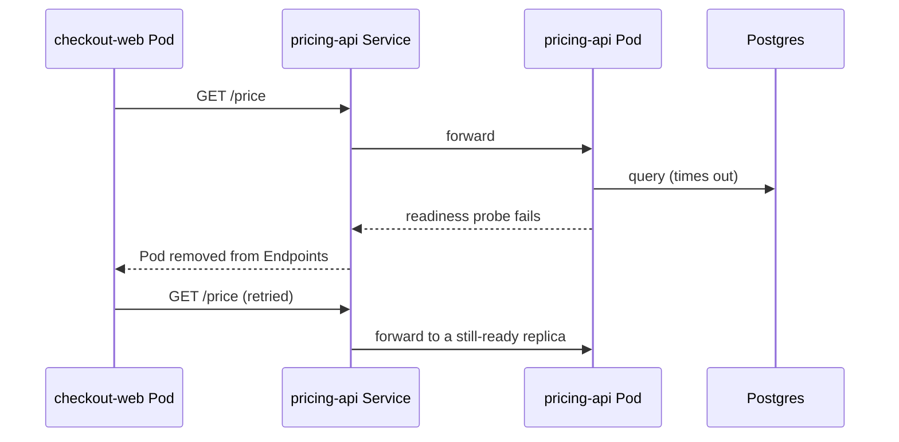

# Kubernetes Orchestration — Middle

<!-- level-focus -->
At middle level, focus on this question:

> When two services in the same cluster depend on each other, how do you configure probes, resource boundaries, and Service discovery so a slow or failing dependency degrades gracefully instead of taking both services down?

Use the smallest realistic scenario that exposes the decision and its failure behavior.

## From "it runs" to "it's designed"

At junior level the question was "does the Pod come up." At middle level the objects are the same (Pod, Deployment, Service, ReplicaSet) but the decisions move up a level: how do you compose several Deployments so failure in one does not cascade, how do you size resource requests/limits so the scheduler and kubelet make good decisions under real load, and how do you structure Service discovery so components find each other without hardcoding IPs.

## Boundaries: one Deployment per unit of independent change

The core boundary decision is what goes in one Deployment versus several. The rule that holds up in practice: **a Deployment should be the smallest unit that can be deployed, scaled, and rolled back independently.** Two containers that must always scale together and share local disk belong in one Pod (the sidecar pattern); two components with different scaling needs, different release cadences, or different failure domains belong in separate Deployments talking over the network.

Signs the boundary is drawn wrong:

- **Too coarse (under-decomposition):** one Deployment bundling an API and a background worker. A traffic spike forces you to scale both together even though only the API needs it, wasting worker replicas — or the reverse, where the worker needs more replicas but you cannot scale it without scaling the API too.
- **Too fine (over-decomposition):** splitting one logical service into three Deployments that always deploy together, must agree on the same schema version, and have no independent failure mode. This buys three sets of YAML and three sets of probes, and no independence to show for it.

## Service discovery: DNS, not IPs

Every Service gets a stable DNS name inside the cluster: `<service-name>.<namespace>.svc.cluster.local`, usually reachable within the same namespace as just `<service-name>`. This is the mechanism that lets a frontend Deployment call a backend Deployment without ever knowing a Pod IP.

```yaml
apiVersion: v1
kind: Service
metadata:
  name: pricing-api
  namespace: checkout
spec:
  selector:
    app: pricing-api
  ports:
    - port: 80
      targetPort: 8080
```

A frontend Deployment in the same namespace calls this as `http://pricing-api`; from another namespace it is `http://pricing-api.checkout`. Hardcoding a Pod IP anywhere in application config is a bug waiting to happen — Pod IPs change on every restart, rollout, and reschedule.

## Sizing resource requests and limits deliberately

`requests` and `limits` are two different decisions, not one:

- **`requests`** is what the scheduler uses to decide *where* a Pod fits. It is a reservation — the sum of requests on a node must not exceed the node's allocatable capacity.
- **`limits`** is what the kubelet enforces at runtime — a CPU limit throttles, a memory limit over the cap gets the container `OOMKilled`.

| Choice | Effect | Failure mode if wrong |
|---|---|---|
| `requests` too low | More Pods pack onto a node than it can really sustain | Node becomes CPU-starved under load; every Pod on it slows down (noisy neighbor) |
| `requests` too high | Fewer Pods fit per node | Wasted capacity and cost; nodes look full when they are not |
| `limits` too low (memory) | Container hits the cap under normal load | `OOMKilled` restarts under legitimate traffic, not just leaks |
| No `limits` at all | A single Pod can consume unbounded memory/CPU on a shared node | One misbehaving Pod degrades every other Pod on that node |

A middle-level habit: set `requests` from observed steady-state usage, not a guess, and set memory `limits` with headroom above the observed peak — a memory limit breach is terminal (`OOMKilled`) while a CPU limit breach only throttles.

## Probes as a dependency contract, not a checkbox

Readiness probes are the actual mechanism that keeps a failing dependency from taking down its callers. Consider a `checkout-web` Deployment calling a `pricing-api` Deployment:

```yaml
readinessProbe:
  httpGet:
    path: /ready
    port: 8080
  periodSeconds: 5
  failureThreshold: 2
  timeoutSeconds: 2
startupProbe:
  httpGet:
    path: /healthz
    port: 8080
  failureThreshold: 30
  periodSeconds: 2
```

The `/ready` endpoint on `pricing-api` should check its *own* downstream dependency (say, a pricing database) and fail readiness — not liveness — if that dependency is unreachable. That way:

- `pricing-api` Pods are pulled out of the Service's Endpoints (so `checkout-web` stops sending them traffic) instead of being killed and restarted, which would do nothing to fix a database outage and would only add restart churn.
- A **`startupProbe`** protects a slow-starting container (one doing cache warmup or migration checks) from being killed by liveness during a legitimately long startup. Without it, a container taking 45 seconds to become healthy might get liveness-killed at 10 seconds and loop forever.

## A cross-component scenario

Two Deployments in the `checkout` namespace: `checkout-web` (2 replicas) calls `pricing-api` (3 replicas) over its ClusterIP Service. `pricing-api`'s `/ready` endpoint checks connectivity to its Postgres instance.



Because only the readiness probe — not liveness — is tied to the database check, the two still-healthy `pricing-api` replicas keep serving while the third recovers. The blast radius is contained to one-third of `pricing-api`'s capacity instead of a full outage or a restart storm.

## Verification at two levels

- **Unit level (manifest correctness):** validate the manifest before it reaches a cluster — `kubectl apply --dry-run=server -f deployment.yaml`, and a manifest linter (`kubeval`, `kubeconform`, or an equivalent CI schema check) catches missing fields, bad selectors, and typo'd probe paths.
- **Integrated-flow level:** deploy to a real (or `kind`/`minikube`) cluster and exercise the failure path deliberately — kill the dependency, confirm the readiness probe trips, confirm Endpoints shrink, confirm the caller's retries succeed against the remaining replicas, then restore the dependency and confirm Endpoints recover without a manual restart.

## Common mistakes at this level

- **Liveness probe checking a downstream dependency.** Guarantees a cascading restart storm the moment that dependency has a blip — the exact opposite of graceful degradation.
- **No `startupProbe` on slow-starting containers**, causing `initialDelaySeconds` guesswork on the liveness probe that is wrong half the time.
- **Treating namespaces as a folder, not a boundary.** Grouping unrelated services in one namespace with no shared lifecycle, or the opposite — fragmenting cooperating services across namespaces so DNS names, RBAC, and network policy all need extra plumbing for no isolation benefit.
- **Copy-pasted resource requests.** Every Deployment in the cluster requesting the same `250m/256Mi` regardless of actual profile guarantees both waste and starvation somewhere in the fleet.
- **Under-application:** skipping resource requests/limits and probes entirely on "internal" services, then discovering they are load-bearing when a downstream call chain breaks during an incident.
- **Over-application:** adding multi-check readiness logic (checking five downstream systems) to a stateless service with no downstream dependency at all — adds latency and false-negative risk for no benefit.

## Apply it

1. Create two Deployments in the same namespace — a caller and a dependency — each with its own Service.
2. Give the dependency a `/ready` endpoint that can be toggled to fail, and wire only readiness (not liveness) to it.
3. Set resource `requests` based on a quick load test of steady-state usage, and set memory `limits` with headroom above observed peak.
4. Trigger the dependency's readiness failure and confirm the caller's requests still succeed against remaining replicas, with zero Pod restarts.
5. Restore the dependency and confirm the Service's Endpoints repopulate automatically.

## Verify your work

- `kubectl get endpoints <dependency-service>` shrinks when one replica fails readiness and grows back when it recovers, with the `RESTARTS` count on `kubectl get pods` unchanged throughout.
- The caller's request success rate stays above zero throughout the failure window — remaining replicas absorb the load.
- `kubectl apply --dry-run=server` or a manifest linter catches an intentionally broken selector or missing probe field before it reaches the cluster.
- Resource usage observed under load (`kubectl top pods`) stays comfortably under the configured limits, confirming the sizing was not a guess.

## Review questions

- Why should a downstream dependency check live in a readiness probe instead of a liveness probe?
- What signals tell you two components belong in one Deployment versus two?
- How do `requests` and `limits` fail differently when they are set too low?
- What would a code review need to see to trust a new Deployment's probes are correct without deploying it first?
