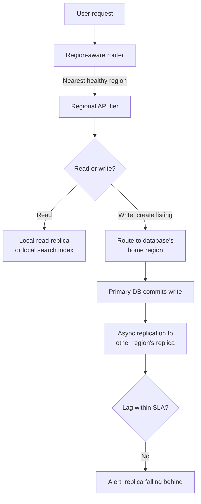

# Multi-Region Deployment — Middle

<!-- level-focus -->
At middle level, focus on this question:

> When you take a service multi-region, which parts should become active-active, which should stay active-passive, and how do you justify that split against the actual consistency and latency needs of the data involved?

Use the smallest realistic scenario that exposes the decision and its failure behavior.

At junior level, "multi-region" was a two-region routing exercise: deploy twice, route by latency, fail over the DNS. At middle level, the routing layer stops being the hard part. The hard part is that a real system isn't one thing — it's a web tier, a database, a cache, a search index, a queue — and each of those has a different tolerance for staleness, a different write pattern, and a different cost of getting the region split wrong. The skill here is deciding, component by component, how far toward active-active each one should go, and being able to justify that split with something more than "active-active sounds more resilient."

## Core Concept 1 — Three Shapes for Splitting Writes Across Regions

| Shape | How it works | What it buys | What it costs |
|---|---|---|---|
| **A — Single global writer, regional read replicas** | One region owns all writes; every other region holds an asynchronous read replica | Simple to reason about — one source of truth, no conflict resolution needed; reads are fast everywhere | Writes from far-away regions pay a full round trip to the writer region; the writer region is a single point of write availability |
| **B — Region-owned writes, partitioned by key** | Each entity (a user, a listing) has a home region that owns writes for it; other regions hold replicas and forward writes for foreign keys back to the owning region | Local writes are fast for most traffic; no conflict resolution needed because only one region ever writes a given key | Requires a clean way to assign "home region" per entity, and cross-region joins or moves (a user relocating) become explicit operations |
| **C — Multi-writer, conflict-resolved** | Any region can accept a write for any key; concurrent writes are reconciled by a merge rule (last-write-wins, a CRDT, or application-level logic) | True write-anywhere, lowest write latency in every region, no single region is a write bottleneck | Requires a conflict-resolution strategy that is correct for your data, and correctness now depends on logic, not just infrastructure — the hardest shape to get right and to debug |

Shape A is where most systems start, because it's the direct evolution of the junior-level topology: the web tier goes active-active, the database stays exactly as it was, just with replicas added elsewhere. Shape C is the one people reach for when they hear "active-active" without qualification, and it is usually the wrong first move — it solves a problem (write latency in every region) that most systems don't actually have for most of their data, while introducing a problem (conflict resolution) that most teams haven't designed for.

## Core Concept 2 — Evaluating the Trade-off Honestly

Ask these before picking a shape, per component — not once for the whole system:

1. **How write-heavy is this data, and where do the writers actually sit?** A catalog of listings written mostly by sellers who are geographically concentrated doesn't need write-anywhere semantics the way a chat message or a shopping-cart update does, where the writer is wherever the user happens to be right now.
2. **What does the write's latency budget actually allow?** A synchronous cross-region write (waiting for a remote replica to acknowledge) adds a real, physics-bound round trip — tens to well over a hundred milliseconds depending on the region pair. If your write-path SLO can't absorb that, either the write has to stay regional (Shape A or B) or you accept asynchronous replication and the staleness that comes with it.
3. **Can conflicting writes actually happen, and can they be resolved automatically?** If two users can plausibly write to the *same* record from two regions in the same short window, Shape C needs a merge rule that's actually correct for that data — numeric counters can sometimes merge safely (CRDT counters), but a user's "current shipping address" cannot be merged by taking the more recent timestamp without a defined tie-break, because a false tie-break is a silent data-correctness bug, not a crash you'd notice.
4. **What's the blast radius if a region disappears?** Under Shape A, losing the writer region means *no writes anywhere* until a replica is promoted. Under Shape B, losing a region means writes for that region's entities stop, but other regions' entities are unaffected. Under Shape C, losing a region loses only that region's traffic — everyone else keeps writing, which is the actual reason teams reach for Shape C, and it's worth confirming that reason is real before paying its cost.

## Core Concept 3 — Testability, Debugging, and Change Cost

- **Unit-level testability**: a test that feeds the conflict-resolution function two concurrent writes to the same key (same or different fields) and asserts the merged result matches the intended rule — this is cheap, fast, and is the only place you can exhaustively check edge cases like "both writes have the same timestamp" without standing up real infrastructure.
- **Integrated-flow testability**: a test that writes to region A's real endpoint, polls region B's real (replica or peer) endpoint until the write appears or a timeout elapses, and records the actual elapsed replication lag — this is slower and needs real cross-region infrastructure, but it's the only test that catches the class of bug a unit test structurally can't see: a replication link that's silently stalled, or a conflict-resolution rule that's correct in code but never actually triggered because the real write pattern doesn't produce concurrent writes the way you assumed.
- **Debugging cost**: under Shape C, "why does this record look different than I expect" now has an extra branch — which region did each contributing write land in, and in what order did the resolver see them? Shape A and B don't have this problem for a given key, because exactly one region ever writes it.
- **Change cost**: adding a new region is not just another deployment. Under Shape B it means deciding which entities (if any) get their home region reassigned there. Under Shape C it means the conflict-resolution logic must remain correct with one more writer in the mix — a merge rule that was "obviously" correct for two writers can become wrong with three (a classic case is a naive last-write-wins rule whose tie-break degrades as more clocks are added to the comparison).

## Core Concept 4 — Under- and Over-Application Signals

**Signals you're under-applying:**

- The web/API tier is deployed active-active in two regions, but every request still makes a synchronous call back to a single-region database for reads that could safely be served from a local, slightly-stale replica — you paid for a second region and aren't using it for anything but compute.
- A "second region" exists only as a cold standby that has never actually taken read traffic, so nobody knows whether its replica is healthy, current, or even queryable until the day it's needed.

**Signals you're over-applying:**

- Every entity in the system is on Shape C multi-writer conflict resolution, including data — audit logs, historical order records — that is written exactly once and never contested, so there is no conflict to resolve and the merge logic is complexity with no corresponding benefit.
- A conflict-resolution strategy was built for concurrent writes that, on inspection of real traffic, essentially never happen — the same user's session is effectively pinned to one region by client behavior, so Shape B (region-owned writes) would have delivered the same practical outcome with far less to get wrong.

## Core Concept 5 — Incremental Adoption

1. **Start with Shape A**: web tier active-active, database single-writer with asynchronous read replicas in each additional region. Measure real replication lag under real traffic before deciding anything else needs to change.
2. **Identify the specific entities where cross-region write latency is actually visible in your SLOs** — not everything, just the ones a stopwatch confirms are a problem.
3. **Move those entities to Shape B (region-owned writes)** first, because it adds far less risk than Shape C: no conflict resolution is needed if only one region ever writes a given key.
4. **Add integrated-flow replication-lag tests for each entity you move**, before moving the next one — this is the checkpoint that catches a stalled replication link before it becomes an incident.
5. **Reserve Shape C for the narrow set of entities that demonstrably need write-anywhere semantics** (a shopping cart a user edits from a phone in one region and a laptop in another, in the same session) — and only after the merge rule has been unit-tested against every concurrent-write case you can construct.

## Core Concept 6 — Cross-Component Scenario

A marketplace's listings service goes multi-region. The web/API tier is deployed to two regions; the primary listings database stays single-writer in the original region with an async replica in the new region; a search index is rebuilt from the database in each region independently.

The interesting decision is at F: even though the API tier is active-active, a write for this entity still has exactly one place it's allowed to land, so there is no conflict to resolve — the cost is that a write issued from the "far" region pays a cross-region round trip on the write path only, while reads (D → E) stay fast and local everywhere. The health of the whole design rides on I: if replication lag isn't measured and alerted on, a slow-growing lag turns into silently stale reads in the non-writer region long before anyone notices.

## Verification at Both Levels

| Level | What it checks | Example |
|---|---|---|
| Unit | Conflict-resolution and merge logic, in isolation, against constructed concurrent-write cases | A test asserts that two writes to the same cart with the same timestamp resolve deterministically rather than depending on arrival order |
| Integrated flow | Real replication behavior across real regional infrastructure, under real or simulated traffic | A scheduled job writes a marker record in the writer region, polls the replica in the other region, and reports the actual measured lag (for example, `p50: 340ms, p99: 2.1s`) against an agreed SLA |

Neither substitutes for the other. The unit test can exhaustively cover logical edge cases that would be expensive or flaky to reproduce against real infrastructure; the integrated-flow test is the only one that would catch a stalled replication link, a misconfigured replica, or a network path between regions that's degraded but not fully down.

## Common Mistakes

- **Reaching for multi-writer conflict resolution (Shape C) as the default "real" multi-region design**, when most of the data in the system never has a concurrent-write scenario in the first place.
- **Going active-active on the web tier while every read still round-trips to a single-region database**, which pays for a second region's compute without using it for anything that improves latency.
- **Treating a cold-standby replica as equivalent to a tested one** — a replica that has never served real read traffic is an unverified assumption, not a working failover path.
- **Skipping the integrated-flow replication-lag test** because the conflict-resolution unit tests pass — unit tests confirm the merge logic is correct; they say nothing about whether the actual replication link is keeping up.
- **Adding a third region to a two-writer conflict-resolution scheme without re-verifying the merge rule**, on the assumption that "it worked for two, it'll work for three."

## Apply it

1. Take a real (or realistic) service with at least one stateful component, and classify each of its main data entities against Shapes A, B, and C using the questions in Core Concept 2 — write down the shape you'd pick for each, not just for the system as a whole.
2. For one entity you classified as Shape A or B, add a second region's read replica and measure real replication lag under representative traffic for at least an hour.
3. For one entity that plausibly needs Shape C, write the conflict-resolution function and a unit test that feeds it two concurrent writes with the same timestamp — confirm the result is deterministic, not arrival-order-dependent.
4. Identify one entity in your system that is currently over-applying multi-region complexity (Shape C where B would do, or B where A would do) and describe what would have to be true for you to simplify it.
5. Write one integrated-flow test that writes a marker record in the writer region and asserts it appears in the replica within your target lag SLA.

## Verify your work

- Each data entity has an explicit shape assignment (A, B, or C) with a one-sentence justification tied to write concurrency, latency budget, or blast radius — not just "active-active is safer."
- The measured replication lag from step 2 is a real number from a real (or realistically simulated) run, not an assumed value.
- The conflict-resolution unit test in step 3 passes deterministically on repeated runs with the same inputs.
- You can name one entity you would simplify and the specific evidence (traffic pattern, SLO, or lag measurement) that justifies simplifying it.

## Review questions

- What distinguishes Shape B (region-owned writes) from Shape C (multi-writer, conflict-resolved), and why does that difference remove the need for conflict resolution entirely under Shape B?
- Why is a synchronous cross-region write latency-bound in a way that no amount of code optimization can remove?
- What can an integrated-flow replication-lag test catch that a conflict-resolution unit test structurally cannot?
- What evidence would tell you that a system has over-applied multi-writer conflict resolution to data that never actually needed it?
