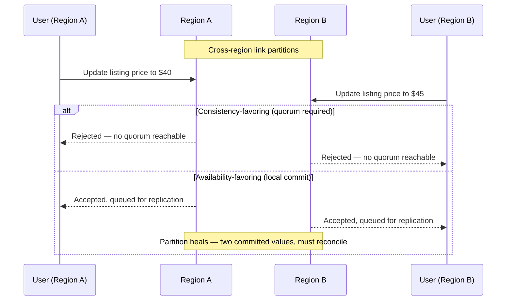

# Multi-Region Deployment — Senior

<!-- level-focus -->
At senior level, focus on this question:

> Under a real cross-region network partition, which invariant does your multi-region design protect — global write consistency or continued regional availability — and what evidence proves that choice holds before you ever need it?

Use the smallest realistic scenario that exposes the decision and its failure behavior.

## The invariant the whole design exists to protect

Strip away the topology diagrams and the replication tooling, and a multi-region deployment exists to hold exactly one of two possible promises during a partition, and it must have chosen which one on purpose:

> Either every region always returns a value consistent with every other region's view of the data (and some regions may refuse to serve during a partition), or every healthy region always serves requests (and regions may disagree with each other until the partition heals).

This is the CAP theorem's partition-tolerance trade-off, restated as an engineering decision instead of a trivia fact — and it's not a one-time abstract choice, it's the PACELC framing (see `estimation/02-tradeoffs-framework/02-pacelc`): *if Partitioned*, choose Availability or Consistency; *Else* (no partition), you're still choosing between Latency and Consistency on every synchronous cross-region write. Senior-level work on this topic is entirely about picking these trade-offs deliberately, per component, and having evidence the choice holds under the failure modes you actually expect — not discovering the choice was made by accident when a partition actually happens.

## Failure mode 1: the network between regions partitions

Two regions, each with a local copy of a listings database, lose their replication link — not down, not slow, genuinely partitioned; each side can still serve local traffic but can't see the other's writes. A user in each region tries to update the same listing's price within the partition window.

**Consistency-favoring design (quorum writes).** A write must be acknowledged by a majority of replicas across regions before it's considered committed. During a two-region partition with no third region to break the tie, *neither* side can reach a majority, so **both regions refuse the write** — availability is sacrificed to guarantee no two regions ever commit conflicting values.

**Availability-favoring design (local commit, reconcile later).** Each region commits the write locally and queues it for replication once the partition heals. Both users see their price update succeed immediately. When the partition heals, the system now holds two different prices for the same listing, committed at genuinely concurrent times, and something has to decide which one — or how to merge them — after the fact.

Neither answer is universally correct. The evidence that should decide it: how much does this specific data actually cost to get briefly wrong, versus how much it costs to be briefly unavailable? A listing price disagreement for a few minutes, resolved by a defined tie-break, is usually cheaper than refusing every price update in two regions during a partition. A financial ledger balance disagreeing between regions is a different calculus entirely — there, refusing the write is very often the correct and cheaper failure. The mistake is applying one answer to the whole system instead of asking this question per data type.

## Failure mode 2: split-brain — two regions both believe they're the writer

A subtler and more dangerous version of failure mode 1: a design intended to have exactly one writer region at a time (Shape A/B from the middle-level guide) experiences a partition, and *both* regions' health checks conclude "the other side is down," so both promote themselves to writer. Now two regions accept writes for keys that were supposed to have exactly one owner — the single-writer invariant is violated silently, because from inside either region, everything looks healthy.

The senior-level defense is a **fencing mechanism that survives the partition itself being ambiguous** — a majority-based leader election (so a leader can only exist if it can prove it holds a majority of votes, which a 2-of-2 partition cannot produce for either side) or an external, independently-available arbiter that both regions must check before assuming leadership. Relying on "the other region didn't answer my health check" as proof of the other region being down is not proof — a partition looks identical to an outage from either side of it, and a design that treats them as the same thing is exactly what produces split-brain.

## Failure mode 3: replication lag silently breaks read-your-writes

A user writes a change in Region A, is then routed (by the region-aware router, possibly for an unrelated reason — a load-balancing decision, a retry) to Region B, and reads back their own change as if it never happened, because Region B's replica hasn't caught up yet. No partition occurred; this is ordinary asynchronous replication lag colliding with routing that isn't aware of it.

The fix is not "make replication faster" — it's making the *routing* aware of the invariant that matters: either pin a user's session to the region that accepted their last write for some bounded window (sticky routing), or have the read path check a version/timestamp and route the read to whichever replica is known to be caught up to it. Measuring and alerting on p50/p99 replication lag (a concrete artifact: `listings-replica-lag{region="us-east-1"} p50=180ms p99=2.4s`) is necessary but not sufficient — the lag number alone doesn't tell you whether it's currently causing a read-your-writes violation; only the routing behavior does.

## Evolution: adding a third region changes the invariant, not just the topology

A two-region quorum scheme (majority of 2 = both) degrades to unavailable on any partition, because there's no way to get a majority of 2 with only 1 side reachable. Adding a third region isn't just "more capacity" — it changes the quorum math entirely: majority of 3 = 2, so a single region being partitioned off no longer stops the other two from reaching quorum and continuing to serve consistent writes. This is a genuine architectural improvement, but it's also a trap if the third region is added purely for read capacity or geographic reach without anyone revisiting whether it participates in the quorum at all — a "third region" that isn't a voting member buys you nothing for the partition-tolerance invariant, only for latency to users near it.

## Recovery: reconciling after a partition heals

Whichever failure mode 1 design was chosen, the healed-partition moment needs a defined, tested reconciliation path, not an improvised one written during the incident. For an availability-favoring design, that means: every entity that can be concurrently written needs a merge rule decided *before* the partition, not during it (last-write-wins with a defined tie-break, a CRDT, or an application-level "flag both values for human review" for data where silent merging is unacceptable, like a financial balance). For a consistency-favoring design, recovery is comparatively simple — nothing diverged, replicas just resume applying the backlog — but the backlog itself needs a bound; an unbounded replication queue during a long partition is its own failure mode (disk fills, replay takes hours), and the invariant "we never diverge" is only as good as the queue's actual capacity.

## Trade-offs among plausible approaches, summarized

| Decision | Option A | Option B | What tips the choice |
|---|---|---|---|
| Behavior during a partition | Quorum required — refuse writes without majority | Local commit, reconcile after healing | The real cost of a brief write outage vs. the real cost of a reconciled disagreement, for this specific data |
| Preventing split-brain | Trust each region's own health check of the other | Majority-based leader election or external arbiter | Whether "the other side didn't answer" can ever be treated as proof it's actually down |
| Read-your-writes | Ignore it, accept occasional stale reads after routing changes | Sticky routing or version-aware read routing | Whether the product experience tolerates a user seeing their own write disappear |
| Adding a region | Add for latency/read capacity only | Add as a voting member of quorum | Whether the new region should change the partition-tolerance math, not just serve local reads |
| Post-partition divergence | Reconcile silently with a merge rule | Flag for human review | Whether a wrong automatic merge is cheaper or more dangerous than a delayed manual one, for this data |

## Questions that expose weak assumptions before implementation

- "If the link between our two regions goes down for an hour, does each region keep accepting writes, or does it refuse them?" If the honest answer is "we're not sure," the choice was made by whatever the database driver defaults to, not by design.
- "Can both regions ever believe they're the writer at the same time?" If the answer relies on health checks alone, split-brain is possible and probably untested.
- "What happens to a user who writes in region A and is then routed to region B before replication catches up?" If nobody's traced this path, read-your-writes is broken silently, right now, in production.
- "If we add a third region, does it participate in quorum, or is it read-only?" A "no" here means the third region did nothing for partition tolerance, whatever the architecture diagram implies.
- "For this specific entity, if concurrent writes land in two regions during a partition, what happens when it heals — and has that merge rule ever actually been exercised?" An untested merge rule is a hope, not a mechanism.

## Apply it

1. Pick one stateful component in a real or realistic system and state, in one sentence, which invariant it currently protects during a cross-region partition — consistency or availability — by tracing what the code and infrastructure actually do, not what anyone assumes.
2. Design or simulate a partition between two regions for that component and observe the actual behavior: does it refuse writes, or does it commit locally on both sides?
3. If it commits locally on both sides, write down the exact merge rule that would apply when the partition heals, and construct one concurrent-write case that exercises it.
4. Trace whether your region-aware router could ever route a user's read to a replica that hasn't caught up to their own most recent write, and if so, whether anything currently prevents that.
5. If you have (or can simulate) three regions, work out the quorum math by hand for two-of-three versus a genuine two-region setup, and confirm which one actually tolerates a single-region partition without going unavailable.

## Verify your work

- The partition simulation in step 2 produces an observed behavior (write accepted or refused), not a predicted one — you watched it happen.
- The merge rule from step 3 is exercised against a real concurrent-write case and produces a deterministic, previously-agreed-on result, not an arrival-order-dependent one.
- The read-your-writes trace in step 4 either identifies a real gap (a read that can land on a stale replica) or specific evidence that sticky routing or version-aware reads actually close it.
- The quorum math in step 5 correctly predicts which topology keeps serving consistent writes when exactly one region is cut off.

## Review questions

- Why does a two-region quorum scheme become fully unavailable on any partition between the two regions, while a three-region scheme with the same quorum rule does not?
- What makes "the other region didn't answer my health check" insufficient proof that the other region is actually down, and why does that insufficiency lead directly to split-brain?
- Why can replication lag break read-your-writes even when no network partition has occurred at all?
- What has to be decided about a data entity's merge rule before a partition happens, rather than during the incident that follows one?
