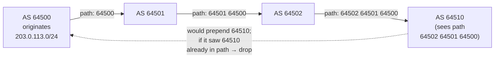

# BGP & Internet Routing — Interview

A tiered Q&A bank, from fundamentals to staff-level judgment. Each answer is a single tight paragraph you could deliver aloud.

1. What is an Autonomous System, and why does BGP exist?
2. eBGP vs iBGP — what's the difference?
3. How is a prefix advertised, and how does AS-path prevent loops?
4. Walk me through BGP best-path selection order.
5. What are the key BGP path attributes?
6. How does anycast deliver users to the nearest site — and what's the TCP caveat?
7. How do you multi-home and steer traffic with BGP?
8. What is a route leak vs a prefix hijack, and why does BGP allow them?
9. What is RPKI/ROA, and where does it fall short?
10. Why does iBGP need a full mesh, and how do route reflectors fix it?
11. Peering vs transit — what's the difference and why does it matter?
12. When would you use anycast in a system design (CDN, DNS, DDoS)?
13. (Staff) Should we run our own AS and announce our own prefixes, or rely on a CDN?
14. (Staff) A customer reports our service is slow only from one region. How do you reason about it at the routing layer?

---

## Q1: What is an Autonomous System, and why does BGP exist?

An Autonomous System (AS) is a network — or collection of networks — under a single administrative and routing policy, identified by a globally unique AS Number (ASN, now 32-bit). Examples: a large ISP, a cloud provider, a university, a big content company. The internet is roughly 75,000+ interconnected ASes, and no single entity owns a map of the whole thing. Interior protocols like OSPF or IS-IS work *inside* one AS where you trust every router and optimize for shortest path. BGP is the *exterior* protocol that glues ASes together: it exchanges **reachability** ("I can reach prefix 203.0.113.0/24, and the AS-path to get there is 65001 65002 …") rather than link metrics, and it is **policy-driven** rather than shortest-path, because between ASes the deciding factor is usually money and business relationship, not hop count. BGP exists because inter-domain routing is fundamentally a problem of scale, trust boundaries, and commercial policy — not of finding the mathematically shortest path.

## Q2: eBGP vs iBGP — what's the difference?

Both speak the same protocol, but they serve different roles. **eBGP** runs between routers in *different* ASes and is how prefixes and policy cross an AS boundary. **iBGP** runs between routers *inside the same* AS to distribute the externally-learned routes to every border router, so an internal router knows how to reach a destination it didn't learn directly. The behavioral differences follow from loop-prevention design:

| Property | eBGP | iBGP |
|---|---|---|
| Peers are in | Different ASes | Same AS |
| AS-path on advertise | Prepends own ASN | Unchanged (same AS) |
| TTL (default) | 1 (directly connected) | Can be multi-hop |
| Re-advertisement rule | Freely re-advertises | Won't re-advertise iBGP→iBGP (split horizon) |
| Loop prevention | AS-path check | The "don't re-advertise iBGP routes" rule |
| Next-hop on advertise | Rewritten to self | Preserved (often needs `next-hop-self`) |

The subtle one that bites people: because an iBGP router won't pass a route learned from one iBGP peer to another iBGP peer, iBGP has no built-in loop protection *within* the AS — which is exactly why iBGP historically required a full mesh (see Q10).

## Q3: How is a prefix advertised, and how does AS-path prevent loops?

A prefix is advertised in a BGP UPDATE message carrying the network (e.g. `198.51.100.0/24`) plus path attributes, the most important being the **AS_PATH** — the ordered list of ASNs the announcement has traversed. When an AS accepts a prefix and re-advertises it to an eBGP peer, it **prepends its own ASN** to the front of the AS_PATH. Loop prevention is beautifully simple: before accepting an UPDATE, a router checks whether **its own ASN already appears in the AS_PATH**; if it does, the announcement has looped back and is dropped. That single rule prevents inter-AS routing loops without any global coordination. Propagation is hop-by-hop and eventually consistent — each AS applies its own policy, so a prefix can reach different corners of the internet by very different paths.

## Q4: Walk me through BGP best-path selection order.

When a router has multiple routes to the same prefix, it picks *one* best path by walking a fixed tie-break list top to bottom, stopping at the first difference. The canonical order (Cisco-flavored, but conceptually universal):

1. **Highest Weight** (Cisco-local, non-transitive) — local override.
2. **Highest LOCAL_PREF** — the primary knob for *outbound* policy; set locally, shared inside the AS. "Prefer this exit."
3. **Locally originated** — prefer routes this router injected.
4. **Shortest AS_PATH** — fewer ASes wins.
5. **Lowest ORIGIN** type (IGP < EGP < Incomplete).
6. **Lowest MED** — a hint to a *neighboring* AS about which of *your* entry points to prefer (compared only among paths from the same neighbor AS by default).
7. **eBGP over iBGP**.
8. **Lowest IGP metric** to the next hop.
9. Then oldest route / lowest router-ID tie-breakers.

The two you must internalize: **LOCAL_PREF controls how traffic *leaves* your AS** (you set it), and **AS_PATH / MED / prepending influences how traffic *enters* your AS** (you hint to others, but they decide). The list ranks policy above path length above metrics on purpose — business relationships trump topology.

## Q5: What are the key BGP path attributes?

The ones that matter in interviews and in practice: **AS_PATH** — the ASN list, used for loop detection and as a path-length tie-break, and the main lever for inbound traffic engineering via prepending. **NEXT_HOP** — the IP to forward toward (often needs `next-hop-self` on iBGP so internal routers can resolve it). **LOCAL_PREF** — non-transitive, AS-wide, the dominant knob for *outbound* path choice. **MED** (Multi-Exit Discriminator) — a non-transitive hint to an adjacent AS about your preferred ingress point when you share multiple links. **ORIGIN** — how the route entered BGP (IGP/EGP/incomplete). **COMMUNITIES** — arbitrary tags (`ASN:value`) that ride along and let you signal policy across AS boundaries ("don't export to my transit," "prepend twice in region X"); well-known ones like `NO_EXPORT` control propagation scope. In a design conversation, communities plus local-pref plus prepending are the practical toolkit for steering traffic.

## Q6: How does anycast deliver users to the nearest site — and what's the TCP caveat?

With **anycast**, the *same* IP prefix is announced from multiple physical locations (different POPs, each in its own or the same AS). Every site says "I originate 192.0.2.0/24." BGP then does what it always does — each network across the internet picks *its* best path to that prefix — and because best-path favors shorter AS-paths and preferred peers, a given user's traffic lands at the topologically nearest announcing site. No application logic, no DNS trickery: the routing fabric itself load-balances by proximity, and if a site withdraws its announcement, traffic reconverges to the next-nearest site — instant failover. **The caveat is long-lived TCP connections.** Anycast picks the destination *per routing decision*, and if the internet's path changes mid-flow (a peering shift, a route flap, a site draining), packets can suddenly arrive at a *different* anycast site that has no state for that TCP connection — resetting it. That's why anycast is a natural fit for **short, stateless request/response** traffic (DNS over UDP, TLS handshakes, HTTP where the connection is short or session state lives elsewhere) and why anycast for long streaming or stateful sessions needs care — e.g. terminating the connection at the edge and carrying state in a shared backend, or steering with DNS instead.

## Q7: How do you multi-home and steer traffic with BGP?

**Multi-homing** means connecting to two or more upstreams (transit providers and/or peers) so you survive a link or provider failure and can optimize cost/performance. Steering splits into two directions. **Outbound** (how *your* traffic leaves) is fully under your control: set **LOCAL_PREF** to prefer one provider, e.g. send traffic out your cheaper/faster transit and fail over to the other automatically. **Inbound** (how traffic *reaches* you) is harder because *other people's routers* decide — you can only *hint*. Levers: **AS-path prepending** (advertise your prefix with your ASN repeated 1–3 times on the less-preferred link, making that path look longer so others avoid it); **MED** (tell a single upstream which of your entry points to prefer); **communities** (many providers publish communities to shape local-pref or prepend inside *their* network on your behalf); and **more-specific announcements** (announce a /24 out the preferred link — longest-prefix match beats any BGP attribute, though it bloats the global table and is frowned upon if abused). The honest framing: outbound is a dial you own, inbound is a request others may or may not honor.

## Q8: What is a route leak vs a prefix hijack, and why does BGP allow them?

Both are failures of BGP's original trust model. A **route leak** is when an AS re-advertises routes in violation of intended policy — classically, a customer with two transit providers accidentally announces provider A's routes to provider B, turning itself into an unintended transit and sucking global traffic through an undersized network (the 2019 Verizon/Cloudflare incident, various "cloud X becomes transit for the internet" outages). A **prefix hijack** is when an AS originates or claims a path to a prefix it doesn't own — accidentally (fat-finger a /24) or maliciously (to intercept traffic), and if peers accept it, traffic gets blackholed or intercepted (the 2018 Amazon Route 53 / MyEtherWallet hijack). BGP allows both because it was designed in an era of mutual trust with **no built-in authentication of *who owns a prefix* or *whether a path is legitimate*** — a router accepts what its neighbor tells it. Defenses are layered on top: prefix filters and max-prefix limits on sessions, IRR-based filtering, RPKI origin validation (Q9), and operational norms like MANRS. The mental model: BGP is a rumor network that mostly works because most participants are honest and most mistakes get filtered — but "mostly" and "most" are the whole security problem.

## Q9: What is RPKI/ROA, and where does it fall short?

**RPKI** (Resource Public Key Infrastructure) is a cryptographic system that binds IP prefixes to the ASNs authorized to originate them. A prefix owner publishes a signed **ROA** (Route Origin Authorization) — "AS 64500 is allowed to originate 203.0.113.0/24, up to /24." Routers running **ROV** (Route Origin Validation) check incoming announcements against ROAs and mark them Valid / Invalid / NotFound, typically dropping Invalids. This kills the most common *origin* hijacks and fat-finger mis-originations. **Where it falls short:** ROA validates only the *origin* AS, **not the AS-path** — a sophisticated attacker can prepend the *legitimate* origin AS to a forged path and still pass ROV (a path-forgery / on-path hijack). Adoption is partial, so many prefixes are NotFound (no ROA), which most networks still accept. It does nothing about **route leaks** (the origin is legitimate; the *propagation* is wrong). And it protects nobody unless upstreams actually *enforce* ROV. The complementary efforts are **ASPA** (AS Provider Authorization, to validate path relationships) and **BGPsec** (full path signing, but essentially undeployed due to cost). So RPKI is necessary and worth deploying, but it's a floor, not a ceiling — origin validation only.

## Q10: Why does iBGP need a full mesh, and how do route reflectors fix it?

Recall from Q2 that an iBGP router **won't re-advertise a route it learned via iBGP to another iBGP peer** (there's no AS-path loop protection inside a single AS, so this split-horizon rule prevents internal loops). The consequence: every iBGP router must peer *directly* with every other iBGP router so each one hears externally-learned prefixes firsthand — a **full mesh** of n·(n−1)/2 sessions. That's fine for 5 routers (10 sessions) and untenable for 100 (nearly 5,000). Two scaling fixes: **Route Reflectors (RRs)** — designate one (or a redundant pair of) router(s) allowed to *reflect* iBGP routes between clients, so each router peers only with the RR(s) instead of everyone, collapsing the mesh to a hub-and-spoke; RRs add an ORIGINATOR_ID and CLUSTER_LIST attribute for loop prevention among reflectors. The alternative is **Confederations** — split the AS into sub-ASes that run eBGP between them (getting AS-path loop protection back) while appearing as one AS externally. Route reflectors are by far the more common answer in practice.

## Q11: Peering vs transit — what's the difference and why does it matter?

**Transit** is a paid service: you pay an upstream ISP to reach the *entire* internet — they advertise the full routing table to you and carry your traffic everywhere. **Peering** is a (usually settlement-free) bilateral arrangement where two networks exchange *only their own and their customers'* routes directly — you don't pay each other, but you also don't get the rest of the internet through that link. Networks peer to cut transit costs and shorten paths (lower latency, fewer hops) for large mutual traffic flows, typically at Internet Exchange Points (IXPs). The distinction drives BGP policy directly: this is the "valley-free" / Gao-Rexford model — you prefer routes learned from **customers > peers > transit** via LOCAL_PREF, because customer routes make you money, peer routes are free, and transit routes cost you. It also explains route leaks (Q8): announcing a *peer's* or *transit's* routes to another peer/transit breaks the economic model and can wreck the internet, which is precisely why policy filters guard those boundaries.

## Q12: When would you use anycast in a system design (CDN, DNS, DDoS)?

Anycast shines wherever you want **geographic proximity, transparent failover, and inherent load distribution with a single IP.** For **DNS**, it's the default — the root servers and every serious authoritative/recursive provider anycast their resolvers, so queries hit the nearest instance over UDP (short, stateless — no TCP caveat), and a dead POP simply withdraws its route. For **CDN edge**, anycast lets one IP front hundreds of POPs so users terminate TLS at the nearest edge; because HTTP connections are relatively short and origin state lives centrally, the long-lived-TCP risk is manageable, and some CDNs still prefer DNS-based steering for finer geo/load control (see table). For **DDoS absorption**, anycast is a superpower: attack traffic aimed at one IP is **spread across every POP announcing it**, so a botnet's firepower gets diluted region-by-region instead of concentrated on one datacenter, and scrubbing happens close to the source. Contrast the two steering approaches:

| | Anycast (BGP-based) | DNS-based geo-routing |
|---|---|---|
| Steering layer | Routing fabric (BGP best-path) | DNS resolver / GeoDNS |
| Granularity | Coarse — network topology, not geography | Fine — geo, latency, health, weights |
| Failover speed | Seconds (route withdrawal) | Bounded by DNS TTL (cache lag) |
| Long-lived TCP | Risky (path can shift mid-flow) | Stable (IP fixed for connection lifetime) |
| DDoS dilution | Excellent (spreads across POPs) | Poor (resolves to one target) |
| Client visibility | Sees one IP everywhere | Sees different IPs per region |

## Q13: (Staff) Should we run our own AS and announce our own prefixes, or rely on a CDN?

This is a build-vs-buy call, and for the overwhelming majority of companies the answer is **rely on a CDN/cloud** — but a staff engineer should articulate *why* and *when it flips*. Running your own AS means: obtaining an ASN and provider-independent IP space, negotiating transit contracts and peering at IXPs, deploying routers, hiring people who can safely operate BGP (a discipline where one bad announcement causes a global outage), and owning RPKI/filtering/DDoS mitigation yourself. You buy in return: **portability** (your IPs aren't hostage to one provider), the ability to **multi-home and traffic-engineer** at the network layer, direct peering economics at massive scale, and anycast under your own control. That math only pays off past a threshold — think hyperscalers, large CDNs, high-frequency-trading networks, and companies pushing enough traffic that transit and peering savings dwarf the operational cost, or with hard requirements (regulatory, latency, sovereignty) that a shared CDN can't meet. For everyone else, a CDN gives you anycast, global POPs, DDoS absorption, and BGP expertise as a commodity — the leverage is enormous and the failure blast radius is someone else's problem. The staff answer names the threshold and the trade (control and economics vs operational risk and headcount), and defaults to "buy" unless traffic scale or a specific constraint justifies the investment.

## Q14: (Staff) A customer reports our service is slow only from one region. How do you reason about it at the routing layer?

Start by separating "slow" into latency vs loss vs throughput, then localize: is it *all* users in that region or *one eyeball network*? At the routing layer the usual suspects are **suboptimal paths** — traffic from that region is taking a scenic AS-path (backhauling to a distant POP because our anycast catchment or DNS steering sends them there, or because a peering link is congested/down and traffic failed over to transit through another continent). Tools and reasoning: pull **traceroutes and reverse traceroutes** from that region (RIPE Atlas probes, looking-glass servers) to see the actual AS-path and where latency jumps; check whether our **anycast POP** in that region is healthy and still announcing (a withdrawn prefix silently reroutes everyone to the next-nearest POP — often across an ocean); look at **BGP path selection** — maybe a shorter/better path exists but our (or our provider's) LOCAL_PREF/MED policy isn't preferring it, or the eyeball ISP prefers its transit over peering with us. Fixes align with Q7: adjust **prepending/communities/local-pref** to make the good path win, add or fix a **peering** relationship at that region's IXP, correct **DNS/anycast steering** so that region maps to the right POP, or engage the upstream to resolve a congested peer. The staff move is to reason from *observed AS-path* backward to *policy*, rather than guessing — and to remember that inbound path choice is partly the eyeball network's decision, so some fixes require changing *their* incentive (prepending, communities) rather than a config we fully own.

---

*Next step:* [DNS Resolution Flow — Junior](../../domain-name-system/dns-resolution-flow/junior.md)
