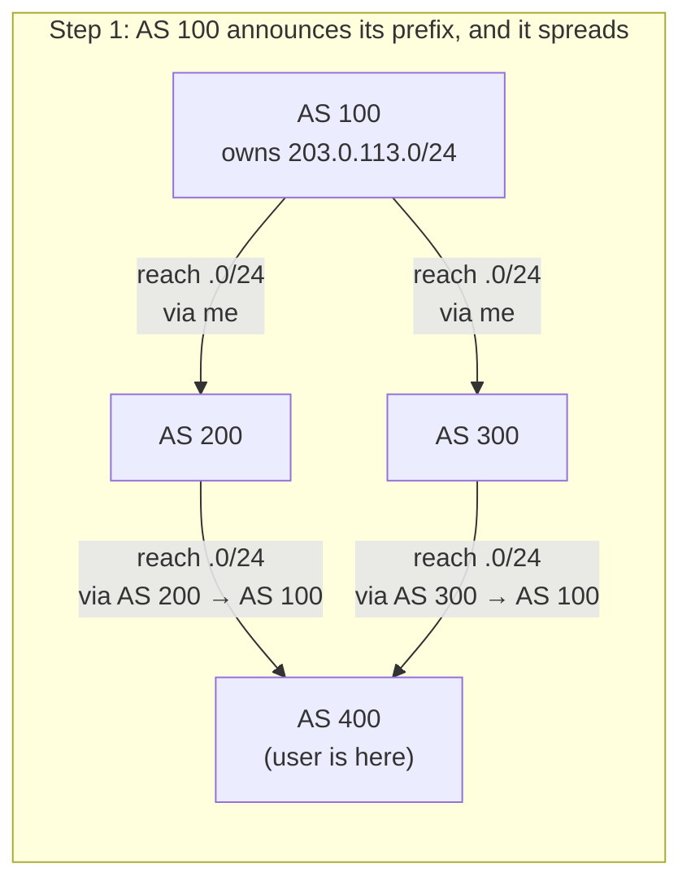
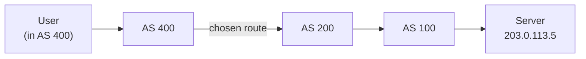
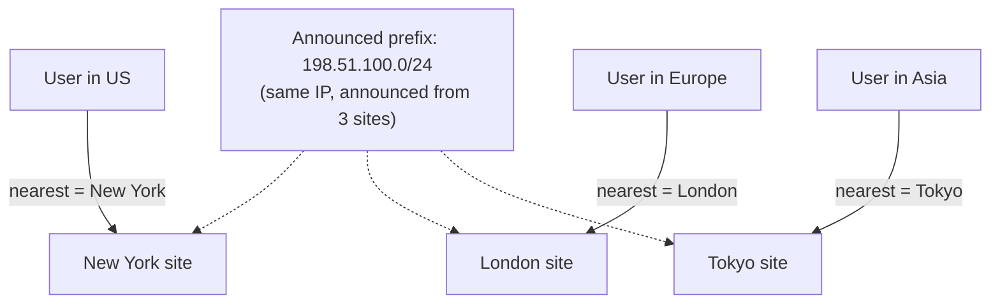

# BGP & Internet Routing — Junior

<!-- level-focus -->
At junior level, focus on this question:

> How can I apply **BGP & Internet Routing** in one small example and prove the result?

Use the smallest realistic scenario that exposes the decision and its failure behavior.
## 1. The internet is a network of networks

The word *internet* literally means "between networks." It is a collection of independently owned networks that agree to carry each other's traffic. Your home ISP is one network. The company hosting a website is on another. Between them may be several large "backbone" networks that carry traffic across cities and continents.

Each of these networks is managed separately: different owners, different budgets, different equipment, different rules about who they will and will not carry traffic for. No single organization controls the whole thing. That independence is the internet's greatest strength — and the reason routing across it is hard.

A packet leaving your laptop for a distant server usually crosses **several** of these networks in sequence. The problem: how does each network know which neighbor to hand the packet to, so it keeps moving *toward* its destination rather than in circles?

---

## 2. Autonomous Systems and AS numbers

Each independently managed network is called an **Autonomous System (AS)**. "Autonomous" means it makes its own routing decisions; it is not told what to do by a central authority.

Every AS on the public internet is given a unique **Autonomous System Number (ASN)**, handed out by regional registries. Think of an ASN as the network's identity card. Some well-known examples:

- Your ISP is an AS with its own number.
- A big cloud or content provider is an AS with its own number.
- A national research network is an AS with its own number.

An AS is also responsible for a set of **IP prefixes** — blocks of IP addresses it owns and can be reached at. A prefix is written like `203.0.113.0/24`, which is shorthand for "this block of 256 addresses." When an AS says "I own this prefix," it is claiming: *traffic for any address in this block should end up here.*

So the map of the internet, at the level BGP cares about, is not millions of individual machines — it is thousands of ASes, each announcing which prefixes live behind it.

---

## 3. Why we need a routing protocol between networks

Nobody has the whole map. There is no master file listing every network and how to reach it. So the ASes have to *tell each other*.

Two independent networks that physically connect (via a cable, an exchange point, or a leased link) become **neighbors**. Neighbors talk to each other and share reachability information: "Here are the prefixes you can reach through me." Each AS collects these announcements from all its neighbors and builds up a picture of which neighbor leads toward which part of the internet.

This information-sharing has to be:

- **Automatic** — the internet is too big to configure by hand for every destination.
- **Continuous** — links fail, new networks appear, routes change; the map must update.
- **Between independent parties** — it must work even though ASes don't trust each other and don't share management.

The protocol that does this job is the **Border Gateway Protocol (BGP)**. It runs at the *borders* between Autonomous Systems, which is where its name comes from. Because it routes *between* separate networks, it is called an **Exterior Gateway Protocol (EGP)**. (BGP is defined in [RFC 4271](https://www.rfc-editor.org/rfc/rfc4271).)

---

## 4. What BGP actually says: "reach these prefixes through me"

Strip away the detail and BGP is one simple idea repeated a billion times:

> An AS announces to its neighbors: **"You can reach these IP prefixes through me."**

That is an *advertisement*, or a **route announcement**. When AS 100 tells its neighbor AS 200 "you can reach `203.0.113.0/24` through me," AS 200 now knows: any packet for an address in that block should be handed to AS 100.

AS 200 can then re-announce this to *its* own neighbors: "you can reach `203.0.113.0/24` through me" — because it can now reach it through AS 100. This is how reachability spreads outward, hop by hop, until every corner of the internet has learned a way to reach that prefix.

Each time an announcement passes through an AS, that AS stamps its own AS number onto the route. So a route doesn't just say *which* prefix — it also records the **list of ASes** the announcement travelled through to get here. That list is the **path**, and it is what lets everyone reach everyone, and lets each AS choose sensibly among options.

---

## 5. Routes, paths, and choosing among them

A **route** is the pairing of a destination prefix with a way to reach it. The "way" includes the **path**: the sequence of ASes to traverse.

For example, a distant AS might learn two different routes to `203.0.113.0/24`:

- via path **[AS 400 → AS 300 → AS 100]** (goes through three networks)
- via path **[AS 400 → AS 200 → AS 100]** (goes through three networks)

Both eventually arrive at AS 100 (the owner of the prefix). When an AS learns more than one route to the same prefix, it has to **pick one** to actually use for forwarding.

At the junior level, the intuition is enough: BGP prefers routes that are, roughly, *shorter and preferred by the network's own policy*. A shorter path (fewer ASes to cross) is a reasonable default, but real networks also choose based on business relationships — for example, preferring a neighbor they don't have to pay. The key idea:

- Multiple routes to the same place can exist at once.
- Each AS selects **one best route** per prefix to use for forwarding.
- The path list also prevents **loops**: if an AS sees its own number already in a path, it rejects that route, so packets can't circle forever.

The precise rules BGP uses to rank routes are covered in the Middle tier. For now: *learn many, pick one, avoid loops.*

---

## 6. Following a packet across the internet

Let's watch reachability spread, then a packet follow it home. AS 100 owns `203.0.113.0/24` and announces it. The announcement propagates outward. A user sitting in AS 400 wants to reach a server in that prefix.

AS 400 has now learned **two** routes to the prefix and picks one best route — say, via AS 200. A packet for `203.0.113.5` then hops from network to network:

Notice what each AS does: it doesn't need the full end-to-end map. It only needs to know *which neighbor leads toward the destination prefix* — the next hop. BGP gives every AS exactly that, one prefix at a time. The packet is forwarded neighbor to neighbor, each step getting it closer, until it lands in the owning network.

---

## 7. Inside vs between networks: IGP vs BGP

Routing *inside* a single network is a different job from routing *between* networks. Inside your ISP, all the routers are owned by the same company, trust each other, and share a complete internal map. That job is done by an **Interior Gateway Protocol (IGP)** — protocols like OSPF or IS-IS. Between separate companies, none of that trust or shared map exists, so a different kind of protocol is needed: **BGP**, an **Exterior Gateway Protocol (EGP)**.

| Aspect | Inside one network (IGP) | Between networks (BGP / EGP) |
|---|---|---|
| Scope | One Autonomous System | Across many Autonomous Systems |
| Who runs it | A single owner | Independent, untrusting parties |
| What it routes on | Individual routers / subnets | IP prefixes, tagged with AS paths |
| Main goal | Find the fastest internal path | Reach every network; respect policy |
| Trust model | Full trust, shared map | No trust, no shared map |
| Example protocols | OSPF, IS-IS | BGP |
| Decision driver | Technical (shortest/fastest) | Path length **and** business policy |

The short version: an **IGP finds the best path *within* a network; BGP finds a path *across the whole internet*** by having independent networks advertise prefixes to each other.

---

## 8. Anycast: one IP, many locations

Normally an IP address lives in one place — this is **unicast**. But BGP enables a powerful trick: the **same** IP prefix can be announced by **many** locations at once. This is called **anycast**.

If a company runs identical servers in New York, London, and Tokyo, and all three announce the same prefix into BGP, then every network on the internet learns a route to that prefix — and each picks the *nearest* one. A user in Europe gets routed to London; a user in Asia gets routed to Tokyo. Same IP address, different physical destination, chosen automatically by routing.

Anycast is how large DNS resolvers and content networks put a "copy" of a service physically close to every user, using nothing more than the routing system itself. Compare the two addressing styles:

| | Unicast | Anycast |
|---|---|---|
| How many locations answer to the IP? | One | Many (identical copies) |
| Who receives the packet? | The one specific machine | The nearest advertising site |
| Chosen by | Fixed destination | BGP routing (proximity) |
| Typical use | An ordinary server | Global DNS, CDNs, DDoS absorption |

Because "nearest" is decided by BGP path selection, anycast automatically sends users to a close site *and* routes around a site that goes down — if London stops announcing, European users simply get pulled to the next-nearest one.

---

## Apply it

1. Choose one small, known input for **BGP & Internet Routing**.
2. Predict the output or observable behavior.
3. Run the smallest example or probe that exercises the concept.
4. Change one input to trigger a failure or boundary case.
5. Explain the evidence using the guide's vocabulary.

## Verify your work

- Record the exact input, command or code path, and output.
- Repeat the probe and confirm the result is consistent.
- Show one expected success and one expected failure.
- Resolve any difference between the prediction and the evidence.

## Review questions

- What problem does BGP & Internet Routing solve in the example?
- Which input changes the observed result, and why?
- What is the smallest useful success check?
- Which beginner mistake would your evidence catch?
