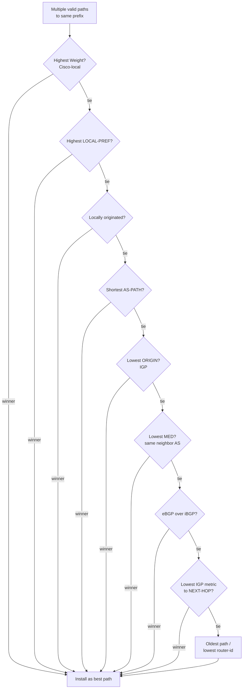

# BGP & Internet Routing — Professional

<!-- level-focus -->
At professional level, focus on this question:

> How should teams adopt and operate **BGP & Internet Routing** with measurable outcomes and limited coordination?

Use the smallest realistic scenario that exposes the decision and its failure behavior.
## 1. Path-Vector Model & Sessions

BGP runs over a TCP connection (port 179) between two *peers*. Two session types exist:

- **eBGP** (external): between routers in different autonomous systems. Typically directly connected; TTL is 1 by default. On advertisement across an eBGP session, the local AS number is prepended to the AS-PATH and NEXT-HOP is rewritten.
- **iBGP** (internal): between routers in the *same* AS. Carries externally learned routes across the AS. Critically, a route learned via iBGP is **not** re-advertised to other iBGP peers (loop prevention), which creates the full-mesh scaling problem discussed below.

The path-vector model prevents loops without a global view: each AS-PATH carries the ordered list of ASes the announcement traversed. A router rejects any UPDATE whose AS-PATH already contains its own ASN. This is the inter-domain analogue of split horizon and works without synchronized topology.

BGP is incremental and hard-state: after the initial table exchange, only *changes* (UPDATE, WITHDRAW) are sent, and KEEPALIVE messages maintain liveness. There is no periodic full refresh.

---

## 2. Path Attribute Taxonomy

Every route carries **path attributes** encoded as type-length-value triples. RFC 4271 classifies them along two axes — *well-known vs optional*, and *transitive vs non-transitive* — which together dictate how an unrecognized attribute propagates.

| Attribute | Class | Role |
|-----------|-------|------|
| **ORIGIN** | Well-known mandatory | How the prefix entered BGP: `IGP` (0) < `EGP` (1) < `Incomplete` (2). Lower wins. |
| **AS-PATH** | Well-known mandatory | Ordered list of traversed ASes; loop prevention + path length. |
| **NEXT-HOP** | Well-known mandatory | IP address to reach the prefix; rewritten on eBGP, preserved on iBGP by default. |
| **LOCAL-PREF** | Well-known discretionary | AS-wide preference for *outbound* path selection; higher wins. Never leaves the AS. |
| **ATOMIC-AGGREGATE** | Well-known discretionary | Flags that a less-specific aggregate may hide more-specific path info. |
| **AGGREGATOR** | Optional transitive | Identifies the AS and router that formed an aggregate. |
| **MED** (MULTI_EXIT_DISC) | Optional non-transitive | Hint to a neighboring AS about the preferred *inbound* entry point; lower wins. |
| **COMMUNITY** | Optional transitive | 32-bit tag (or extended/large) for grouping routes and signaling policy between ASes. |

The classification rules:

- **Well-known** attributes MUST be recognized by every conformant implementation and (if mandatory) MUST be present.
- **Optional** attributes may be unknown to a receiver. If the attribute is **transitive**, an unrecognized instance is passed along unchanged with its *partial* bit set; if **non-transitive**, it is silently dropped. This is why MED does not survive past the first neighboring AS, while COMMUNITY tags can ride across the Internet.

---

## 3. The Best-Path Selection Algorithm

When multiple paths to the same prefix exist, BGP runs a strict, ordered tiebreaker sequence and installs exactly one *best* path (the one also re-advertised to peers, subject to policy). The canonical order — with the Cisco-specific `Weight` step first — is:

| # | Step | Rule | Direction |
|---|------|------|-----------|
| 0 | **Weight** (Cisco) | Highest weight. Local to the router, never advertised. | Local |
| 1 | **Highest LOCAL-PREF** | Prefer the larger value. AS-wide policy knob. | Outbound |
| 2 | **Locally originated** | Prefer routes this router injected (via `network`/redistribution/aggregation) over learned ones. | — |
| 3 | **Shortest AS-PATH** | Fewer AS hops. AS_SET counts as 1; confederation segments do not count. | — |
| 4 | **Lowest ORIGIN** | IGP < EGP < Incomplete. | — |
| 5 | **Lowest MED** | Compared only among paths from the *same* neighboring AS (by default). | Inbound |
| 6 | **eBGP over iBGP** | Prefer externally learned paths. | — |
| 7 | **Lowest IGP metric to NEXT-HOP** | "Hot-potato" routing: hand traffic to the exit closest by IGP cost. | — |
| 8 | **Oldest / lowest router-id** | For eBGP, prefer the oldest (most stable) path; else lowest BGP router-id, then lowest neighbor address. | Tiebreak |

Two structural observations frame every design conversation:

- **LOCAL-PREF (outbound) sits above AS-PATH (length)**, so an operator can override "shortest path" with pure policy — the reason a customer route is preferred over a shorter peer route regardless of hop count.
- **MED is weak.** It ranks below AS-PATH and is only compared among routes from the same neighbor. It influences *inbound* traffic and is easily overridden by the upstream's LOCAL-PREF, so it is a hint, not a guarantee.

---

## 4. iBGP Full-Mesh & Scaling

Because an iBGP-learned route is never re-advertised to another iBGP peer, every iBGP speaker must peer with *every* other one to guarantee that externally learned prefixes reach all internal routers. That is a full mesh of `n(n−1)/2` sessions — 100 routers require 4,950 sessions, each with its own state and configuration. This does not scale.

Two mechanisms relax the full-mesh requirement:

- **Route Reflectors (RFC 4456).** A designated *reflector* is permitted to re-advertise iBGP routes. Clients peer only with reflectors, collapsing the mesh into a hub-and-spoke hierarchy. Loop prevention shifts from AS-PATH (useless inside one AS) to two new attributes: `ORIGINATOR_ID` (the router-id of the injecting router) and `CLUSTER_LIST` (the sequence of reflector clusters traversed). A reflector drops any route whose CLUSTER_LIST already contains its own cluster-id. Reflectors should be topologically redundant and physically placed so their best-path choice matches what clients would pick, or sub-optimal forwarding results.

- **Confederations (RFC 5065).** The AS is split into several *sub-ASes*, each running a full iBGP mesh internally, and the sub-ASes speak a special intra-confederation eBGP to each other. To the outside world the confederation appears as a single ASN; internal sub-AS numbers are stripped from the AS-PATH at the confederation boundary. Loop prevention inside the confederation uses `AS_CONFED_SEQUENCE` segments (which do not count toward external AS-PATH length).

| Dimension | Full mesh | Route Reflectors | Confederations |
|-----------|-----------|------------------|----------------|
| Session count | `n(n−1)/2` | Clients × reflectors | Mesh per sub-AS + inter-sub-AS |
| Loop prevention | iBGP no-readvertise rule | ORIGINATOR_ID + CLUSTER_LIST | AS_CONFED_SEQUENCE |
| Config change | Add sessions everywhere | Add client to a reflector | Add router to a sub-AS |
| Migration cost | — | Low (overlay) | High (re-numbering, per-hop) |

RRs dominate in practice because they layer onto an existing topology without re-numbering; confederations are chosen mainly by very large networks that also want internal policy boundaries.

---

## 5. Convergence Dynamics

BGP trades fast convergence for stability. Several timers and behaviors govern how a topology change ripples through the Internet.

**MRAI (Minimum Route Advertisement Interval).** RFC 4271 rate-limits how often UPDATEs for a given prefix are sent to a peer — historically ~30 s on eBGP, ~5 s on iBGP. MRAI batches successive changes into one advertisement, damping churn but adding a delay floor. It applies to advertisements, not withdrawals.

**Path hunting (path exploration).** When a prefix is withdrawn, path-vector routers do not immediately know it is gone globally. A router may transiently switch to a longer alternate path learned from another neighbor before that path is also withdrawn — walking through a sequence of ever-longer, ultimately invalid paths. Each transient step generates further UPDATEs, so convergence for a withdrawal can take tens of seconds even though the failure was instantaneous. Path hunting is the fundamental cost of having no global topology view.

**Route Flap Damping (RFC 2439).** To protect against a prefix that repeatedly appears and withdraws (a "flapping" link), a router accumulates a *penalty* per flap that decays exponentially. Above a suppress threshold the route is held down and not used or advertised until the penalty decays below a reuse threshold. Damping stops local churn but historically over-suppressed legitimate routes; modern guidance uses conservative, higher thresholds so brief flaps are tolerated while genuinely unstable prefixes are quarantined.

Design consequence: BGP is *eventually consistent* over the interval bounded by MRAI plus path-exploration depth. Systems that depend on fast failover (anycast, multi-region) must budget for seconds of inter-domain reconvergence, not milliseconds — and lean on faster local mechanisms (BFD, IGP) where sub-second recovery is required.

---

## 6. Security: RPKI, ROV, and BGPsec

BGP-4 as specified has **no built-in authentication of routing information**. A router accepts an AS's claim to originate a prefix and its claimed AS-PATH on trust. Two failure classes follow:

- **Prefix hijack:** an AS originates a prefix it does not own (accidental mis-origination or malicious), and the more-specific or shorter path wins best-path selection, drawing traffic away.
- **Path manipulation:** an AS forges the AS-PATH to appear closer to the origin.

**RPKI (Resource Public Key Infrastructure, RFC 6480)** addresses *origin* validation. Address holders publish cryptographically signed **ROAs (Route Origin Authorizations)** binding a prefix (and a max-length) to the ASN authorized to originate it. Routers (via a validating cache speaking the RPKI-to-Router protocol) then perform **ROV (Route Origin Validation)**, classifying each received route as:

- **Valid** — a ROA covers the prefix and matches the origin AS and max-length.
- **Invalid** — a ROA covers the prefix but the origin AS or prefix length disagrees (likely a hijack).
- **NotFound / Unknown** — no ROA exists (much of the Internet remains uncovered).

Common policy is to reject *Invalid* and accept *Valid* and *NotFound*, degrading gracefully during partial deployment.

**The path-validation gap.** RPKI/ROV validates only the *origin* — the last AS in the path. It does *not* prove the AS-PATH is real. An attacker can announce a ROA-valid origin while inserting a fraudulent intermediate path. **BGPsec** was designed to close this by having each AS cryptographically sign its forwarding of the AS-PATH, so the entire chain is verifiable. BGPsec has seen minimal deployment: it requires per-hop signing/verification (heavy on control-plane CPU), full-path adoption to be useful, and breaks with any un-upgraded AS in the path. In practice the ecosystem relies on RPKI/ROV plus operational hygiene (IRR-based prefix filters, ASPA proposals, peer-locking, and monitoring) rather than BGPsec.

---

## 7. Anycast & BGP Interaction

**Anycast** advertises the *same* prefix from multiple physically distributed sites, each running its own eBGP session to upstreams. The Internet's routing fabric then delivers any given client to the site whose path wins BGP best-path selection from that client's vantage point — normally the topologically nearest replica by AS-PATH length and local policy.

Formally, anycast piggybacks on the selection algorithm of [§3](#3-the-best-path-selection-algorithm): from a resolver's edge, the competing paths to the shared prefix differ by AS-PATH, LOCAL-PREF, and IGP metric, and BGP installs one. There is no application-layer coordination; the "load balancing" is a side effect of routing geography. This is why anycast underpins DNS root servers and large CDNs.

The interaction imposes two constraints:

- **Convergence, not sessions, defines failover.** When a site withdraws (planned drain or failure), clients re-home only after inter-domain reconvergence — bounded by MRAI and path exploration (§5), i.e. seconds. Anycast gives resilience, not instant failover.
- **Catchment is not controllable per-client.** Which clients map to which site is decided by third-party routing policy you do not own. Traffic-engineering levers (AS-PATH prepending, selective de-aggregation, communities) shift catchments coarsely and unpredictably. Stateless workloads (DNS, TLS-terminating edges) suit anycast; long-lived stateful sessions risk mid-flow re-homing when catchments shift and must tolerate reset.

---

## 8. Takeaways

- BGP is a **policy** protocol over a path-vector core: AS-PATH gives loop-free reachability without a global topology view (RFC 4271).
- Attributes are classified as **well-known mandatory** (ORIGIN, AS-PATH, NEXT-HOP), **well-known discretionary** (LOCAL-PREF, ATOMIC-AGGREGATE), and **optional** transitive/non-transitive (MED, COMMUNITY); the class determines propagation of unknown attributes.
- Best-path runs a strict ordered tiebreak — **Weight → LOCAL-PREF → local origin → AS-PATH → ORIGIN → MED → eBGP-over-iBGP → IGP metric → oldest/router-id** — with LOCAL-PREF (policy) deliberately outranking AS-PATH (length).
- iBGP's no-readvertise rule forces a full mesh; **route reflectors** (ORIGINATOR_ID/CLUSTER_LIST) and **confederations** (AS_CONFED segments) restore scale.
- Convergence is bounded by **MRAI** and **path hunting**; **route flap damping** trades churn for suppression risk. Budget seconds, not milliseconds.
- BGP has no native auth: **RPKI ROAs + ROV** (RFC 6480) secure the *origin*; the **path** remains unverified, which **BGPsec** would close but has not deployed at scale.
- **Anycast** is best-path selection applied to a shared prefix — resilient and scalable, but with uncontrollable per-client catchment and convergence-bounded failover.

---

## Apply it

1. Define the user or business outcome that **BGP & Internet Routing** should improve.
2. Assign one owner for code, contracts, operations, and incidents.
3. Split delivery into reversible increments that produce evidence early.
4. Publish responsibilities, escalation paths, and compatibility windows.
5. Stop or expand only when the agreed measures support that decision.

## Verify your work

- Each increment has an owner, rollback path, and observable exit condition.
- Adoption, reliability, delivery time, and coordination cost are measured.
- Incident and migration exercises prove that responsibility is executable.
- The old path is removed only after telemetry proves it is unused.

## Review questions

- Which measurable outcome justifies investing in BGP & Internet Routing?
- Which team owns the full lifecycle and incident response?
- What reversible increment produces the earliest useful evidence?
- Which exit condition proves that migration or adoption is complete?
