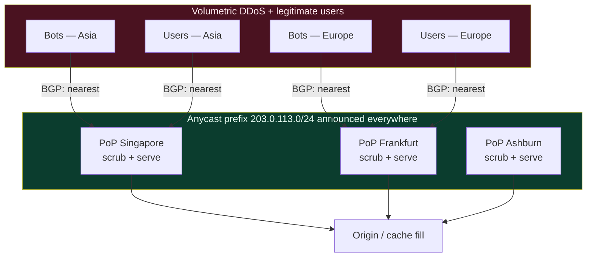
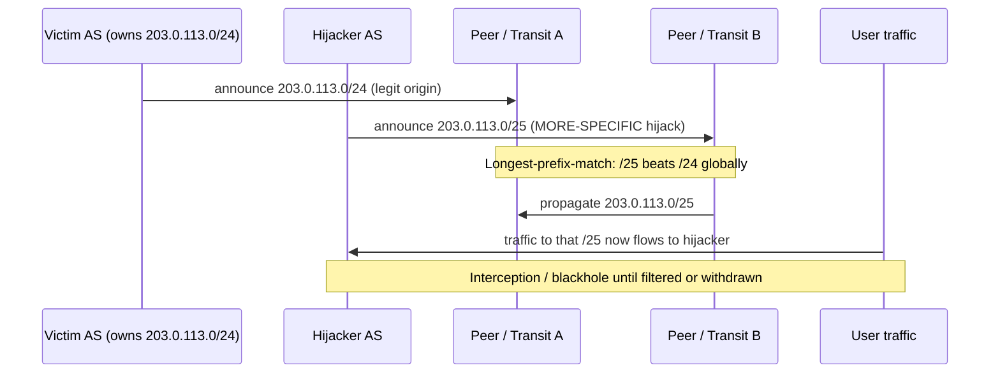

# BGP & Internet Routing — Senior

<!-- level-focus -->
At senior level, focus on this question:

> Which system invariant is affected by **BGP & Internet Routing** under failure, load, and change?

Use the smallest realistic scenario that exposes the decision and its failure behavior.
## 1. The mental model: BGP as trust-by-default policy routing

BGP is the protocol that stitches ~75,000 autonomous systems (ASes) into one Internet. Each AS announces the IP prefixes it originates; announcements propagate hop-by-hop, accumulating an AS-path. Routers pick a best path per prefix using policy (local preference, AS-path length, MED, and tie-breakers), then re-advertise.

Two properties drive every design decision downstream:

- **It is policy routing, not shortest-path routing.** The chosen path reflects business relationships and configured preferences, not latency or hop count. A geographically short route can be commercially unavailable; a longer AS-path can be faster. You cannot assume the network picks the "best" path for your users — you influence it.
- **It trusts announcements by default.** Classic BGP has no built-in authentication of *who* is allowed to originate a prefix or whether an AS-path is real. If a network announces a prefix it doesn't own, neighbors may believe it. Every serious operational control (filtering, RPKI) exists to bolt authenticity onto a protocol that started without it.

Hold both facts. Most anycast, traffic-engineering, and outage stories at the senior level are consequences of one or the other.

---

## 2. Anycast in system design

**Anycast** means announcing the *same* IP prefix from many locations. BGP routes each client to the topologically nearest announcing site. One address, many physical endpoints — the network does the "find the closest server" work for you, for free, at the routing layer.

Where anycast is the standard tool:

- **CDN edge / static asset delivery.** A single anycast VIP fronts hundreds of PoPs; users hit a nearby edge without any client-side logic or DNS trickery.
- **Authoritative DNS.** The root and most large authoritative DNS is anycast. DNS-over-UDP is a single request/response with no long-lived connection, which makes it an *ideal* anycast workload (see §3).
- **DDoS absorption.** Anycast spreads a volumetric attack across every PoP that announces the prefix. Instead of one target absorbing 2 Tbps, fifty PoPs each absorb their local share, and each site's scrubbing capacity is used in parallel. Attack traffic is *localized* to the region it originates from.
- **Global load balancing (GSLB).** Anycast can act as a coarse global balancer: routing steers users to the nearest edge, and per-site health withdrawal removes a dead PoP from the announcement.

The diagram shows the DDoS-absorption property directly: the attack never converges on one location because BGP keeps each attacker's traffic pinned to its nearest PoP, where local scrubbing handles it.

---

## 3. The anycast caveat: long-lived flows and mid-connection reroutes

Anycast has one dangerous failure mode that separates senior designers from cargo-culters: **BGP can move a flow to a different PoP mid-connection.**

Anycast does not remember which PoP a client is talking to. Every packet is routed independently by whatever the network's current best path is. If BGP re-converges — a peering session flaps, a PoP is drained, an upstream path changes — packets from an already-established TCP or TLS or QUIC connection can suddenly arrive at a *different* PoP that has no state for that connection. The result: reset connections, TLS handshake failures, aborted uploads.

Why DNS is fine and long uploads are not:

- **Stateless, single-shot request/response** (DNS-over-UDP, a small HTTP GET served entirely from a nearby cache) is immune — each request is independent, so a reroute just sends the *next* request to a different PoP with no harm.
- **Long-lived stateful flows** (large file uploads, streaming, WebSocket/gRPC sessions, database or SSH tunnels) are fragile — a reroute lands mid-flow at a stateless PoP.

Mitigations, roughly in order of how commonly they're used:

1. **Terminate at the edge, keep origins on unicast.** The classic pattern: anycast only fronts the edge TCP/TLS termination; long-lived backhaul from edge to origin uses stable unicast paths. Short client↔edge connections tolerate rare resets better than long ones.
2. **Prefer anycast for short connections.** Serve cacheable, short-lived requests over anycast; route uploads and streams over a **DNS/unicast** endpoint that resolves to a specific stable PoP so the flow can't be rerouted.
3. **Graceful PoP drains.** When taking a PoP out, stop *accepting new* connections but keep serving existing ones, and withdraw the route only after connections drain — instead of yanking the announcement instantly.
4. **Connection-oriented state at a stable layer.** Use QUIC connection migration or session resumption so a moved flow can re-establish quickly rather than hard-failing.

The senior instinct: *anycast is excellent for stateless, short, cacheable traffic and risky for anything that must survive a routing change.* Segment your traffic accordingly.

---

## 4. Anycast vs DNS-based global routing

The two ways to steer users to a nearby edge are anycast (routing-layer) and DNS-based GSLB (resolution-layer, returning a location-specific IP). They are not mutually exclusive — large providers use both — but the trade-offs matter.

| Dimension | Anycast (BGP) | DNS-based global routing (GSLB) |
|---|---|---|
| Steering mechanism | Nearest by BGP topology | Nearest by GeoIP / EDNS Client Subnet / latency maps |
| Granularity | Coarse — topology, not true latency | Finer — can weight, split, or A/B per resolver |
| Failover speed | BGP convergence (seconds to low minutes) | TTL-bound; clients pin the cached IP until it expires |
| Long-lived flows | **Risky** — mid-flow reroute possible | Stable — a client keeps its resolved IP for the connection |
| Control precision | Hard to shift a *fraction* of traffic | Easy — adjust weights/answers per query |
| Accuracy of "nearest" | Depends on peering; can misroute across oceans | Depends on resolver location honesty; ECS improves it |
| Attack surface | Spreads DDoS across PoPs natively | DNS itself becomes a target; no inherent spread |
| Operational cost | Requires owning IP space + running BGP | Works with provider IPs; just DNS config |
| Typical use | Authoritative DNS, CDN edge, DDoS scrubbing | App-tier GSLB, blue/green, gradual regional cutover |

Read this as: **anycast gives you free, fast, DDoS-resilient coarse steering but poor precision and flow stability; DNS gives you precise, controllable steering but slow failover (TTL) and its own attackable dependency.** A common composite: anycast the authoritative DNS *and* the CDN edge, but use DNS answers to do fine-grained app-layer steering behind them.

---

## 5. Multi-homing and traffic engineering

**Multi-homing** — connecting to two or more upstreams/ISPs — is the baseline for edge availability: lose one transit provider and you still reach the Internet. Once multi-homed, you can *engineer* traffic. The key asymmetry: **outbound is easy to control, inbound is hard.**

- **Outbound (you decide which upstream your traffic leaves through): `local-preference`.** Local-pref is the highest-priority BGP attribute and is entirely local to your AS. Set a higher local-pref for the routes learned from your preferred (cheaper or faster) transit, and your egress follows it. Fully under your control.

- **Inbound (you nudge how the Internet reaches you): AS-path prepending and MED — both are hints, not commands.**
  - **AS-path prepending**: artificially lengthen the AS-path on announcements over the link you want *less* used. Remote networks prefer the shorter path, so more inbound arrives on the un-prepended link. Blunt — it shifts a chunk of traffic, not a percentage — and remote local-pref policies can override it entirely.
  - **MED (Multi-Exit Discriminator)**: when you have *multiple links to the same neighbor AS*, MED suggests which entry point they should prefer. Only meaningful with that single directly-connected neighbor, and they may ignore it.
  - More surgical inbound control: advertise **more-specific prefixes** on the preferred link (longest-prefix-match wins globally) or use provider BGP **communities** to ask an upstream to prepend/deprioritize on your behalf.

The senior summary: you *own* your outbound path selection via local-pref; your inbound is a negotiation with the rest of the Internet, achieved with prepending, MED, more-specifics, and communities — none guaranteed, all overridable by remote policy.

---

## 6. Peering vs transit: cost and performance

Two ways to exchange traffic with the rest of the Internet:

- **Transit**: you pay an upstream to carry your traffic *to and from everywhere*. Full reachability, billed by volume (usually 95th-percentile Mbps). Simple, universal, and the thing you always need at least some of.
- **Peering**: you exchange traffic *directly* with another network — settlement-free at an Internet Exchange (IX) or via private interconnect — but only for *that network's* routes (and its customers'), not the whole Internet.

| Dimension | Transit | Peering |
|---|---|---|
| Reachability | Everywhere | Only the peer's own + customer routes |
| Cost model | Paid per volume (95th pct) | Often settlement-free; you pay IX port + cross-connect |
| Latency / path | Extra AS hop through provider | Direct — usually shorter, lower-latency |
| Setup effort | Buy a port, done | Find peers, join IXs, negotiate, maintain sessions |
| Best for | Baseline full connectivity, tail destinations | High-volume flows to specific big networks/eyeballs |

The economics: peering with the networks you exchange the most traffic with (large eyeball ISPs, big content networks) removes that volume from your paid transit bill *and* shortens the path, improving latency. Transit remains for the long tail of destinations you don't peer with. Serious edge operators run a **mix**: peer heavily at IXs where the traffic justifies the ports, and buy transit to cover everything else. This is a genuine cost/performance lever — not a networking-team-only concern — because it directly affects both your bandwidth spend and your users' latency.

---

## 7. BGP failure modes that cause real outages

Because BGP is trust-by-default and globally propagating, a local mistake or attack can become a global outage. The recurring classes (described as patterns; specifics vary by incident):

- **Route leaks.** A network re-advertises routes it shouldn't — e.g., a customer or misconfigured AS announces routes learned from one provider to another, or leaks a full table it never should have propagated. Traffic that should have flowed elsewhere is suddenly funneled through an undersized network that can't carry it, causing congestion and blackholing. These are usually *accidental*, born of a missing export filter.

- **Prefix hijacks.** An AS originates a prefix it does not own. Neighbors accept the announcement and route traffic to the hijacker. A **more-specific** hijack (announcing a longer prefix than the legitimate one) wins globally via longest-prefix-match, pulling traffic even from far away. Hijacks can be **accidental** (fat-fingered origin) or **malicious** (traffic interception, spam, crypto theft). Sub-prefix hijacks are especially dangerous because they beat the legitimate announcement everywhere.

- **Fat-finger withdrawals / mis-announcements.** An operator error withdraws prefixes that carry live production traffic, or pushes a bad policy that stops announcing critical routes. When a large network withdraws its own prefixes, entire services become globally unreachable within the convergence window — including, in past real incidents, the network's *own* out-of-band and DNS infrastructure, which complicates recovery.

The through-line: **a single announcement, right or wrong, propagates globally in seconds and everyone believes it by default.** That is exactly why the controls in §9 exist and why, as a designer, you should not assume your provider's prefixes are immune — you inherit whatever filtering and RPKI hygiene your upstreams practice.

---

## 8. Convergence, flap damping, and why they matter to you

**Convergence time** is how long it takes the Internet to agree on a new set of paths after a change (a link fails, a prefix is withdrawn, a better path appears). It is not instantaneous: withdrawals and updates propagate hop-by-hop, and pathological cases ("path hunting," where a router tries progressively longer alternative paths before giving up) can stretch convergence to tens of seconds or more. During convergence, packets can loop, blackhole, or arrive at a draining PoP.

This is why anycast failover is measured in *seconds to low minutes*, not milliseconds, and why long-lived anycast flows break during it. It's also why "just withdraw the route" is not an instant, clean failover primitive.

**Route flap damping** is the historical countermeasure to instability: a prefix that repeatedly appears and disappears (flaps) gets *suppressed* for a while, so the churn doesn't propagate. The senior caveat: aggressive damping can *penalize legitimate routes* — a prefix that flapped briefly can stay suppressed far longer than the underlying problem lasted, turning a transient blip into a prolonged outage for that prefix. Modern practice uses much more conservative damping parameters (or none) for this reason. The lesson to carry: **the mechanisms meant to protect stability can themselves extend outages if tuned naively.**

For you as a system designer: assume routing changes are not free and not instant. Health-based failover at the *application/DNS* layer (with short-but-sane TTLs) is often more predictable than relying on BGP re-convergence, and the two are frequently combined.

---

## 9. Filtering and RPKI: fixing trust-by-default

Because BGP believes announcements by default (§1, §7), the defenses are about *rejecting* announcements that fail validation:

- **Prefix filtering.** Networks configure explicit lists of which prefixes a peer/customer is allowed to announce, often driven by **IRR** (Internet Routing Registry) data. If a neighbor announces something outside its allowed set, drop it. This is the first line of defense against leaks and hijacks — and its weakness is that IRR data is only as good as it's kept.

- **AS-path / max-prefix limits and export filters.** Reject implausibly long paths, cap how many prefixes a session may carry (so a leak of a full table trips a limit instead of taking you down), and — critically — filter *exports* so you never re-advertise routes you shouldn't (the route-leak fix).

- **RPKI (Resource Public Key Infrastructure) + ROV.** RPKI cryptographically binds a prefix to the AS authorized to originate it, via a signed **ROA** (Route Origin Authorization). **Route Origin Validation** then marks announcements as *valid*, *invalid*, or *unknown*; networks doing ROV drop the *invalids*. This directly counters origin hijacks: an announcement originating a prefix from an unauthorized AS is flagged invalid and discarded by validating networks.
  - Limits to know: RPKI validates the *origin*, not the *whole path* — it doesn't stop a hijacker who fakes a valid origin further down the path. Path validation (e.g., ASPA, BGPsec) addresses that but is far less deployed. RPKI's protection is also only as strong as its *deployment*: it helps at every network that actually does ROV, and non-validating networks still accept the bad route.

The senior takeaway: **trust-by-default is a design flaw the ecosystem is retrofitting.** Prefix filtering + RPKI/ROV are now table stakes for a credible edge operator, and when you evaluate a CDN/transit provider, "do you sign ROAs and drop RPKI-invalids?" is a legitimate due-diligence question.

---

## 10. When you actually operate BGP vs rely on a cloud/CDN

The decisive question at this tier: *do you run BGP yourself, or is it someone else's problem?*

**You rely on a cloud/CDN's BGP** (the default for most teams) when:

- You use a CDN's anycast VIPs, a cloud provider's global load balancer, or their managed DNS. The provider owns the IP space, runs the peering/transit, does the filtering and RPKI, and absorbs DDoS. You get anycast and global steering as a product, configured with a dashboard, not a router.
- This covers the overwhelming majority of systems. You should still *understand* the trade-offs above (they explain your provider's behavior and limits), but you don't operate the control plane.

**You actually operate BGP** when:

- **You own IP space (a Provider-Independent block) and an ASN**, and want to announce it yourself — to be portable across providers, or to control your own anycast footprint.
- **You run your own edge/PoPs** (a CDN, a large SaaS with its own points of presence, a company that needs its own anycast prefix for DDoS or vanity/portability reasons).
- **You need direct peering** with specific networks for cost/latency reasons that a provider won't give you.
- **Regulatory or sovereignty requirements** dictate control over routing and IP origination.

When you cross into operating BGP, you *inherit* everything in §5–§9 as operational responsibilities: multi-homing and traffic engineering, peering/transit contracts, filtering and RPKI hygiene, convergence behavior, and the ability to cause (or suffer) the outages in §7. That is a meaningful step-change in operational maturity — most organizations should stay on the "rely on a provider" side until they have a concrete, quantified reason to cross over.

---

## 11. Senior takeaways

- BGP is **policy routing that trusts by default** — every design lever and failure mode flows from those two facts.
- **Anycast** is the right tool for stateless, short, cacheable traffic (CDN edge, authoritative DNS, DDoS absorption, coarse GSLB); its Achilles' heel is **mid-connection reroutes** breaking long-lived flows — segment traffic and drain gracefully.
- **Anycast vs DNS-GSLB** is coarse-fast-resilient vs precise-slow-controllable; large systems use both together.
- **Traffic engineering**: you own outbound via **local-pref**; inbound is a negotiation via **AS-path prepending, MED, more-specifics, and communities** — all overridable hints.
- **Peering vs transit** is a real cost *and* latency lever: peer high-volume flows, buy transit for the tail.
- The outage classes — **route leaks, hijacks, fat-finger withdrawals** — are consequences of trust-by-default and global propagation; **filtering + RPKI/ROV** are now table stakes to contain them.
- **Convergence and flap damping** mean routing changes are neither instant nor free; combine BGP failover with application/DNS-layer health failover.
- Know **which side of the line you're on**: most teams rely on a cloud/CDN's BGP; you operate it only when you own IP space, run your own edge, or need direct peering — and then you inherit all of the above as operations.

*Next step:* [BGP & Internet Routing — Professional](professional.md)

---

## Apply it

1. State the system invariant that **BGP & Internet Routing** must protect.
2. Mark ownership, state, and failure propagation at each boundary.
3. Compare two designs under load, dependency failure, and future change.
4. Define recovery and compatibility behavior before implementation.
5. Test the riskiest assumption with a focused experiment.

## Verify your work

- The experiment supports the design with evidence, not preference.
- Failure injection shows the blast radius and recovery path.
- Compatibility checks cover old and new callers or data.
- Operational signals reveal invariant violations and recovery progress.

## Review questions

- Which invariant must remain true when BGP & Internet Routing fails?
- Where should recovery responsibility live, and why?
- Which assumption deserves an experiment before implementation?
- How can the design evolve without changing every consumer at once?
