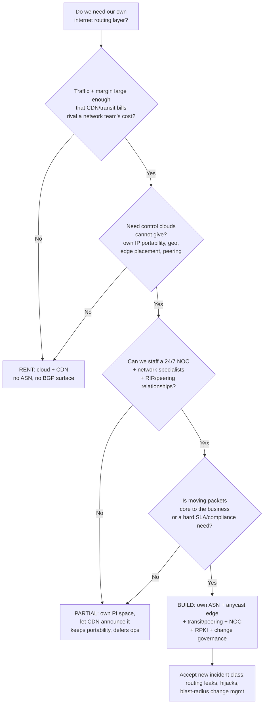
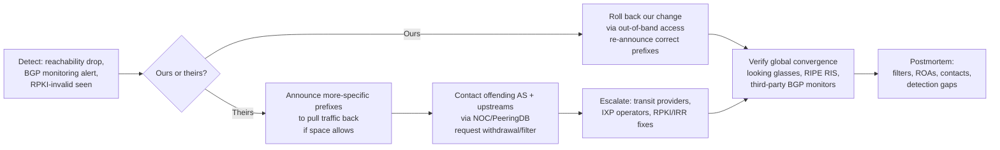

# BGP & Internet Routing — Staff

At the staff level, BGP stops being a protocol you study and becomes a category of **infrastructure risk you only partly control**. The routing table that determines whether your users can reach you is a distributed, mutually-untrusting graph run by tens of thousands of independent networks. A typo three ASes away can black-hole your product; your own bad announcement can leak someone else's traffic across the planet. The staff job is not to hand-configure route-maps — it is to decide *whether your organization should own an internet presence at all*, to govern the blast radius when it does, and to frame routing exposure honestly to leadership as a risk you can reduce but never eliminate.

## Contents

1. [The core decision: run your own AS or rent someone's](#1-the-core-decision-run-your-own-as-or-rent-someones)
2. [Signals table: own-AS/anycast vs cloud-CDN](#2-signals-table-own-asanycast-vs-cloud-cdn)
3. [BGP as a large-blast-radius incident source](#3-bgp-as-a-large-blast-radius-incident-source)
4. [Governance: change management, prefix filtering, RPKI](#4-governance-change-management-prefix-filtering-rpki)
5. [Peering strategy as a cost + performance lever](#5-peering-strategy-as-a-cost--performance-lever)
6. [Incident response when the fix is someone else's](#6-incident-response-when-the-fix-is-someone-elses)
7. [Regulatory and geo constraints on routing](#7-regulatory-and-geo-constraints-on-routing)
8. [Owning edge networking as a specialized team](#8-owning-edge-networking-as-a-specialized-team)
9. [Framing to leadership](#9-framing-to-leadership)
10. [Staff judgment checklist](#10-staff-judgment-checklist)

---

## 1. The core decision: run your own AS or rent someone's

Every company has an internet presence. The real question is **who operates the routing layer that delivers it**. There are three postures, in increasing order of control and cost:

- **Rent everything.** You live behind a cloud provider and a CDN. Their IP space, their ASNs, their peering, their NOC announce your service. You have no BGP surface of your own. This is where the overwhelming majority of companies should stay.
- **Own the address space, rent the routing.** You get a Provider-Independent (PI) allocation from an RIR (ARIN, RIPE, APNIC, LACNIC, AFRINIC), but still let clouds/CDNs announce it. This buys portability without running a network.
- **Own the network.** Your own ASN, your own RIR allocation, your own **anycast** edge in multiple facilities, your own transit contracts and peering relationships, and your own 24/7 network operations center (NOC) speaking BGP to the world.

The build-vs-buy line is not about prestige — it is about whether your **scale and control needs** justify a standing specialist team and a new class of incident. Below the line, a CDN gives you global anycast, DDoS absorption, and a routing team you never have to hire. Above the line — hyperscale traffic, strict data-residency, latency SLAs that need edge presence in specific markets, or a business *built on* moving packets — owning the AS becomes the cheaper and safer option despite the operational weight.

The staff signal to watch for: teams reach for "let's run our own AS" as a *technical aspiration* long before the business math supports it. Reverse the default — you rent until owning is demonstrably cheaper or the only way to meet a hard constraint.

---

## 2. Signals table: own-AS/anycast vs cloud-CDN

| Signal | Lean cloud/CDN (rent) | Lean own-AS + anycast (build) |
|---|---|---|
| Traffic scale | Any, especially spiky/unpredictable | Sustained, huge, predictable egress |
| Egress economics | CDN/transit bill < cost of a network team | Transit + peering savings dwarf team cost |
| Control over IP space | Don't care whose IPs serve you | Must own IPs (portability, reputation, allow-listing) |
| Edge placement | Provider's PoP map is good enough | Need presence in *specific* markets/IXPs |
| Latency SLA | Best-effort or provider-guaranteed is fine | Hard tail-latency targets tied to peering |
| Data residency / geo | Provider region controls suffice | Must control routing per jurisdiction |
| DDoS posture | Want provider to absorb it | Have your own scrubbing + capacity |
| Team you can staff | No network specialists on payroll | Standing NOC + BGP engineers viable |
| Incident appetite | Want routing incidents to be *their* pager | Willing to own hijack/leak blast radius |
| Time-to-market | Ship now, no RIR/peering lead time | Multi-month RIR + peering ramp acceptable |
| Regulatory pressure | Standard compliance | Sovereign/telco/finance routing mandates |

Read this table as a **weighted vote, not a checklist**. A single hard constraint (data residency, a regulator, a business model that *is* the network) can override a dozen "rent" signals. Conversely, "we're big now" alone never justifies building — plenty of very large products run entirely on rented routing and are better for it.

---

## 3. BGP as a large-blast-radius incident source

BGP's danger is structural: it is a **trust-by-default** protocol where any AS can announce any prefix, and the rest of the internet may believe it. The failure modes a staff engineer must be able to name:

- **Prefix hijack.** Another AS announces *your* prefix (accidentally or maliciously). Traffic to you gets pulled toward them and black-holed or intercepted.
- **Route leak.** An AS re-announces routes it should have kept internal (e.g. a customer leaking a provider's full table). Traffic that should never traverse a small network suddenly does, congesting and degrading it globally.
- **Self-inflicted withdrawal.** *Your own* bad announcement (a fat-fingered filter, an automation bug) withdraws your prefixes and takes your service off the internet. The 2021 Facebook outage was exactly this: a routing withdrawal made the whole platform unreachable — and locked out the tools needed to fix it.
- **De-aggregation storms.** Announcing thousands of more-specific prefixes to steer traffic can bloat the global table and get you filtered by peers.

The defining property is **blast radius**: a single line of config can affect *every* user simultaneously, worldwide, in seconds — and can also break the control plane you'd use to recover. This is why routing changes must be governed like the highest-risk deploys you have, not like an app config tweak.

---

## 4. Governance: change management, prefix filtering, RPKI

If you own an AS, three governance layers keep BGP from becoming an unbounded-blast-radius weapon pointed at yourself.

**Change management.** Treat every announcement change as a high-risk deploy: peer review, a documented intent (which prefixes, to whom, expected effect), a staged rollout (one edge/facility first), and — critically — a **tested rollback that does not depend on the network you might break**. Maintain genuine out-of-band access to your routers. Facebook's lesson was that recovery tooling must survive the outage it's meant to fix.

**Prefix filtering.** Filter both directions. Inbound: only accept routes you should from each peer (via IRR objects / RPKI). Outbound: never announce more than the exact prefixes you intend — an outbound filter is your last line against becoming *the* hijacker in someone else's incident.

**RPKI as governance, not just tech.** Resource Public Key Infrastructure lets you cryptographically state "AS *X* is authorized to originate prefix *P*" (a ROA), and lets others reject invalid announcements (ROV). Staff-level RPKI is an **organizational commitment**: publishing ROAs for all your space *and* dropping RPKI-invalid routes at your borders. It doesn't stop every attack, but it removes the most common accidental hijacks from the threat model and signals to peers that you operate responsibly.

| Governance control | What it prevents | Ownership question it forces |
|---|---|---|
| Change review + staged rollout | Self-inflicted withdrawal | Who signs off on a route change? |
| Out-of-band router access | Un-recoverable outages | Can we fix routing if routing is down? |
| Inbound prefix/IRR filters | Accepting hijacked routes | Do we trust each peer's announcements? |
| Outbound filters | *Being* the hijacker | Can we accidentally leak others' traffic? |
| RPKI ROA publication | Others hijacking your space | Is all our IP space cryptographically claimed? |
| RPKI ROV enforcement | Believing invalid routes | Do we drop invalids at every border? |

---

## 5. Peering strategy as a cost + performance lever

Once you run your own AS, how you connect to the rest of the internet is a **direct cost and performance decision**, not a networking detail.

- **Transit** — you pay an upstream provider (per Mbps/95th-percentile) to reach *everywhere*. Simple, universal, but the most expensive per bit and adds a hop.
- **Peering** — you exchange traffic *directly* with another network, usually settlement-free. Cheaper (often just port + facility cost) and lower-latency because you cut out the transit middleman.
- **IXPs (Internet Exchange Points)** — you plug into a shared fabric where hundreds of networks peer at once. One port buys direct reach to many peers; the highest-leverage way to convert transit spend into peering.

The staff framing: transit is an **opex line that scales with traffic**, while peering is **capex + relationships that reduce that line**. At low volume, transit is correct — peering's fixed costs don't pay back. At high volume, peering at the right IXPs can cut both the bill and the latency your users feel. The optimal posture is almost always a **mix**: peer where you have the volume to justify it, keep transit for the long tail and as a failover.

| Dimension | Transit | Peering (direct / IXP) |
|---|---|---|
| Reach | The whole internet | Only the networks you peer with |
| Cost model | Per-Mbps opex, scales with traffic | Port + facility capex, mostly fixed |
| Unit cost at scale | Highest | Lowest once volume justifies it |
| Latency | Extra provider hop | Direct, shortest path |
| Effort | Buy and forget | Ongoing relationships, IXP presence, NOC |
| Best for | Long tail, small volume, failover | High-volume destinations, latency-critical |

---

## 6. Incident response when the fix is someone else's

The hardest truth of internet routing: **during many incidents, you cannot fix it yourself.** If another AS hijacks your prefix or leaks your routes, the authoritative fix lives in *their* config. Your incident response is therefore as much diplomacy and detection as engineering.

What this demands *before* an incident:

- **External BGP monitoring** — you must learn about a hijack from independent observers (route collectors, third-party monitors), because your own routers may still look fine while the world routes around you.
- **A contact web** — up-to-date NOC contacts for your transit providers, major peers, and relevant IXPs. In a routing incident, a phone call to the right network can end it faster than any config you control.
- **Pre-agreed mitigations** — knowing which more-specifics you're *allowed* to announce, and having RPKI/IRR data current so peers can act on your behalf.

Staff must set the expectation with leadership plainly: **for a whole class of routing incidents, mean-time-to-recovery depends on parties we don't employ.** You reduce that dependency with RPKI and relationships; you never eliminate it.

---

## 7. Regulatory and geo constraints on routing

Routing is increasingly shaped by law, not just economics.

- **Data residency / sovereignty.** Some jurisdictions require that traffic for their citizens be served — and sometimes routed — within national borders. Owning your edge and IP space may be the only way to *prove* where packets enter and exit, something a global CDN's opaque PoP selection can't always guarantee.
- **Sanctions and geoblocking.** You may be legally required to *not* serve certain regions, or to serve them only from specific infrastructure. Enforcing this at the routing/anycast layer is more robust than at the application layer alone.
- **Telco / financial mandates.** Regulated sectors sometimes carry explicit routing, interconnection, or lawful-intercept obligations that only an operator with its own AS can meet.
- **Local peering requirements.** Some markets effectively require presence at a national IXP to get acceptable latency and to satisfy local-traffic-stays-local expectations.

The staff point: **regulation can force the build side of the build-vs-buy decision** independent of scale or cost. A modest-traffic product may still need its own routing footprint because a regulator, not the traffic graph, demands it. Get legal and networking in the same room early — retrofitting residency onto a rented routing layer is expensive and sometimes impossible.

---

## 8. Owning edge networking as a specialized team

If you cross into owning an AS, you are standing up a **specialized, standing team** — not adding a task to platform engineering. This is a durable org commitment.

- **Distinct skill set.** BGP, anycast, transit/peering negotiation, RIR administration, and hardware/facility ops are their own discipline. These are not skills your app-platform engineers pick up on the side, and the labor market for them is thin.
- **24/7 coverage.** Routing incidents are global and immediate. A NOC (or a genuine follow-the-sun on-call) is table stakes — the internet doesn't wait for business hours.
- **Relationships as an asset.** Peering agreements, IXP memberships, and NOC-to-NOC trust are built over years and are part of what you're buying when you build. They can't be spun up in an incident.
- **Interfaces to the rest of eng.** The network team owns a blast-radius-1 layer under every product. It needs the change-governance rigor of a platform team and clear escalation paths *to* product teams when routing degrades a service.

The honest staff framing to leadership is that "run our own AS" means "**hire and retain a scarce specialist team, forever**", plus facilities and hardware — not a one-time project. If you can't commit to that team, stay on the partial or rent posture; a half-staffed network is more dangerous than a rented one.

---

## 9. Framing to leadership

Leadership rarely wants to hear about BGP. Translate it into the language they own — risk, cost, and control:

- **"This is infrastructure risk we partly don't control."** Be explicit that some routing incidents are fixed by other networks, not us. We can reduce exposure (RPKI, filtering, relationships, monitoring) but not drive it to zero. Set MTTR expectations accordingly.
- **Build-vs-buy is a cost + control trade, not prestige.** Renting routing is the responsible default; we build only when scale economics, a hard SLA, or regulation demand it — and we can show the math.
- **Blast radius is the headline.** A single routing change can take the entire product off the internet worldwide in seconds, and can break the tools we'd use to recover. That's why routing changes get our strictest change-management, and why out-of-band access is non-negotiable if we own a network.
- **Owning an AS is a standing team commitment.** It's not a project with an end date; it's a specialist function on the payroll indefinitely. Fund it fully or don't start.
- **Peering is a lever, transit is a bill.** At scale, investing in peering/IXP presence reduces both the transit line and user-facing latency — a rare cost-*and*-performance win, but only above the volume threshold.

The goal is a leadership team that understands *why* the routing layer deserves either a serious standing investment or a deliberate decision to keep it someone else's problem — and never a half-measure in between.

---

## 10. Staff judgment checklist

- Default to **renting** routing (cloud + CDN); require the build case to prove itself on economics, a hard SLA, or regulation.
- Consider the **partial posture** (own PI space, rented announcement) to keep IP portability without a NOC.
- Never let "we're big now" alone justify running your own AS — pair it with a staffing and incident-appetite decision.
- If you build, treat routing changes as your **highest-blast-radius deploys**: review, staged rollout, tested rollback, out-of-band recovery.
- Publish **RPKI ROAs** for all owned space and enforce **ROV** at every border; filter both inbound and outbound.
- Model **transit vs peering** as opex-vs-fixed-cost; peer where volume justifies it, keep transit for the long tail and failover.
- Stand up **external BGP monitoring** and a current **NOC contact web** *before* you need them — many fixes aren't yours to make.
- Bring **legal + networking together early** on residency, sanctions, and local-peering mandates; regulation can force the build decision.
- Commit to the **specialist team** as a permanent function, or stay rented — a half-staffed AS is worse than none.
- Frame routing to leadership as **infrastructure risk you partly don't control** — reducible, never eliminable.

*Next step:* [BGP & Internet Routing — Interview](interview.md)
