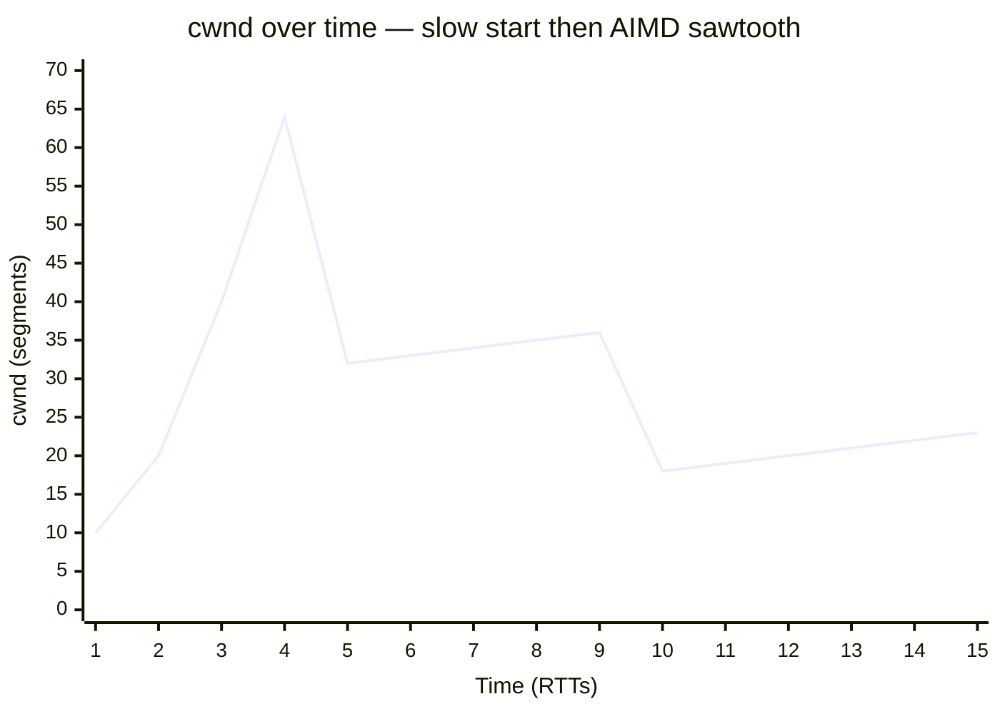

# Congestion Control & TCP Tuning — Interview

A tiered question bank, fundamentals first, then design and staff-level judgment. Answers assume TCP-family transports (including QUIC), and aim for what an interviewer actually wants to hear: not the RFC recital, but the model, the trade-off, and the operational instinct.

1. What is congestion control and why does it exist?
2. Flow control vs congestion control — what's the difference?
3. Walk through slow start and AIMD.
4. Fast retransmit vs a retransmission timeout — why does the distinction matter?
5. Compare Reno, Cubic, and BBR.
6. What is bufferbloat, and how do AQM / CoDel fix it?
7. What is the bandwidth-delay product, and why does window scaling matter on long-fat networks?
8. What are DCTCP and ECN, and why are they datacenter-specific?
9. Why does HTTP/3 / QUIC run congestion control in userspace?
10. Which kernel knobs actually matter, and how do you set them?
11. Is BBR unfair to Cubic? Should that stop you deploying it?
12. When do you tune TCP versus just put a CDN in front?
13. You raised the receive buffer and throughput didn't improve. Why?
14. How do you diagnose whether a slow transfer is congestion-limited, buffer-limited, or app-limited?

---

## Q1: What is congestion control and why does it exist?

Congestion control is the sender-side discipline that limits how much unacknowledged data a connection injects into the network, so that aggregate demand across many flows stays below the capacity of the bottleneck link and its buffers. Its reason for existence is **congestion collapse**: in the mid-1980s the early Internet observed throughput drop by orders of magnitude because senders, on loss, retransmitted *harder*, filling queues with duplicate packets that were themselves dropped, in a positive-feedback death spiral. Van Jacobson's 1988 algorithms (slow start, congestion avoidance) added a feedback loop that treats loss as a congestion signal and *backs off*. The second goal is **fairness**: because there is no central scheduler, every endpoint must voluntarily converge toward roughly its fair share of a shared bottleneck. So congestion control is really a distributed, cooperative resource-allocation protocol implemented independently in millions of kernels — which is why "how does it stay fair without coordination" is the interesting part.

## Q2: Flow control vs congestion control — what's the difference?

Flow control protects the **receiver**; congestion control protects the **network**. Flow control is the receiver advertising `rwnd` (receive window) in every ACK — "I have this much buffer space, don't overrun me." Congestion control is the sender maintaining `cwnd` (congestion window) internally — "the network can absorb this much in flight before it drops." The sender is bounded by both simultaneously: the amount it may have outstanding is

```
effective window = min(cwnd, rwnd)
```

They fail differently, which is the tell in an interview. If `rwnd` is the limit, the receiver's application isn't reading fast enough (or the receive buffer is too small for the BDP). If `cwnd` is the limit, the path is genuinely congested. A common production bug is a small receive buffer capping `rwnd` on a fast, high-latency link — throughput stalls while the network is nearly idle, and no amount of congestion-control tuning helps because congestion control was never the binding constraint.

## Q3: Walk through slow start and AIMD.

A connection starts in **slow start**: `cwnd` begins at roughly 10 segments (IW10) and *doubles every RTT* (each ACK bumps `cwnd` by one MSS, so a full window of ACKs doubles it). Despite the name it's exponential — "slow" only relative to blasting the full pipe immediately. This continues until `cwnd` reaches `ssthresh` or a loss occurs, at which point the flow enters **congestion avoidance**, governed by AIMD — Additive Increase, Multiplicative Decrease:

- **Additive increase:** grow `cwnd` by ~1 MSS per RTT — a gentle linear probe for more bandwidth.
- **Multiplicative decrease:** on loss, cut `cwnd` (classically to half) — a sharp back-off.

The reason AIMD is the "right" rule is a convergence argument (Chiu & Jain): multiplicative decrease plus additive increase drives competing flows toward equal shares, whereas AIAD or MIMD do not. The visible result is the classic **sawtooth**:



The steep front is slow start (exponential); each vertical drop is a multiplicative decrease on loss; each slow linear climb is additive increase probing for capacity.

## Q4: Fast retransmit vs a retransmission timeout — why does the distinction matter?

Both recover a lost segment, but they cost wildly different amounts of throughput. A **retransmission timeout (RTO)** fires when *no* ACK arrives for a segment within the timeout — the sender assumes the worst, retransmits, and resets `cwnd` all the way back to 1 (slow-start restart). That's catastrophic for throughput and adds a latency spike of at least the RTO (often hundreds of ms). **Fast retransmit** avoids the timeout entirely: three duplicate ACKs signal that a specific segment was lost while later ones arrived, so the sender retransmits immediately without waiting for the timer, then enters **fast recovery** — halving `cwnd` rather than collapsing to 1. The interview point: isolated packet loss should be cheap (fast retransmit), and only genuine "the pipe went dark" events should trigger the expensive RTO path. This is also why SACK matters — it lets the sender retransmit *only* the missing segments instead of everything after the gap, and why tail losses (the last packets of a burst, with no following packets to trigger dup-ACKs) are pathological: they often can only be recovered by a timeout, which is what Tail Loss Probe was designed to short-circuit.

## Q5: Compare Reno, Cubic, and BBR.

They differ in what signal they treat as "the network is full."

| | Reno / NewReno | Cubic | BBR |
|---|---|---|---|
| Congestion signal | Packet loss | Packet loss | Model: measured bandwidth + min RTT |
| Growth in avoidance | Linear (1 MSS/RTT) | Cubic function of time since last loss | Paces to estimated bottleneck bandwidth |
| Behavior on loss | Halve cwnd | Multiplicative decrease (~0.7) | Loss is *not* the primary signal |
| Long-fat networks | Poor (too slow to fill) | Good (aggressive re-probe) | Good |
| Bufferbloat | Fills buffers (loss = full buffer) | Fills buffers | Avoids filling buffers |
| Fairness with Cubic | — | Baseline | Can be aggressive; contested |
| Default in | Legacy | Linux default | YouTube/Google; opt-in elsewhere |

**Reno/NewReno** is the textbook loss-based AIMD — correct but too timid to fill a modern long-fat pipe, since recovering from a single loss takes many RTTs of linear growth. **Cubic** (Linux default since 2.6.19) replaces linear growth with a cubic curve of time since the last congestion event: it climbs fast after a cut, plateaus near the previous ceiling, then probes aggressively again — much better at saturating high-BDP paths, but still loss-based, so it *fills the bottleneck buffer until packets drop*, which is precisely what causes bufferbloat. **BBR** (Bottleneck Bandwidth and RTT) is model-based: it continuously estimates the bottleneck's delivery rate and the minimum RTT, then paces sending to keep the pipe *full but the queue near-empty* — it doesn't wait for loss, so it thrives on lossy links (mobile, satellite) and doesn't induce bufferbloat. The catch is fairness (see Q11).

## Q6: What is bufferbloat, and how do AQM / CoDel fix it?

Bufferbloat is chronically high latency caused by **oversized buffers** in routers, modems, and NICs. Loss-based congestion control (Reno, Cubic) only backs off when it sees loss — but if a buffer is huge, it fills completely *before* dropping anything, so the flow keeps a large standing queue. Every packet then waits behind that queue: you get bulk throughput but hundreds of milliseconds of latency, which destroys interactive traffic (a video call sharing a link with a file upload). The buffer, meant to absorb bursts, becomes a permanent latency tax. The fix is **Active Queue Management** — drop or mark packets *before* the buffer is full so senders back off earlier. Naïve AQM (RED) required tuning queue-length thresholds that nobody got right. **CoDel** (Controlled Delay) sidesteps that by measuring the *sojourn time* of packets through the queue rather than its length: if the minimum time-in-queue stays above a target (~5 ms) for an interval (~100 ms), it starts dropping, distinguishing a *standing* queue (bad, must drain) from a transient *burst* (fine, leave it). **fq_codel** adds fair queuing on top, isolating flows so one bulk transfer can't inflate latency for a latency-sensitive flow. The takeaway: throughput and latency are in tension, and AQM is how you buy low latency back without starving throughput.

## Q7: What is the bandwidth-delay product, and why does window scaling matter on long-fat networks?

The **bandwidth-delay product** is the amount of data "in flight" that fills a path: `BDP = bandwidth × RTT`. It's the ideal window — to keep a pipe fully utilized, you must have BDP bytes unacknowledged at all times, because that's how much is en route before the first ACK returns. On a **long-fat network** (LFN) — high bandwidth *and* high latency, e.g. 1 Gbps across 100 ms RTT — the BDP is ~12.5 MB. But TCP's window field is 16 bits: max 64 KB. Without help, a single flow tops out at 64 KB per RTT ≈ 5 Mbps on that path, using 0.5% of the link, no matter how fat the pipe. **Window scaling** (RFC 1323) is the fix: a TCP option negotiated at handshake that left-shifts the window value, allowing windows up to ~1 GB. The corollary for tuning is that your socket buffers must be sized to at least the BDP, or the OS caps the window below what the path can carry — this is the single most common reason a fast, high-latency transfer underperforms, and why cross-continent replication and backup jobs need explicitly enlarged buffers (or auto-tuning enabled).

## Q8: What are DCTCP and ECN, and why are they datacenter-specific?

**ECN** (Explicit Congestion Notification) lets a router signal congestion by *marking* a bit in the IP header instead of dropping the packet; the receiver echoes the mark back and the sender reduces its window. You get the congestion signal without paying the retransmission cost of a drop. **DCTCP** (Data Center TCP) builds on ECN to react *proportionally*: instead of Reno's blunt "mark seen → halve," it estimates the *fraction* of packets marked in the last window and reduces `cwnd` in proportion to that fraction. A little congestion → a little back-off; heavy congestion → a big back-off. The result is very short, stable queues and low latency, which is exactly what matters for the incast-heavy, RPC-fan-out traffic inside a datacenter. It's datacenter-specific for two reasons: it requires switches configured to mark ECN at a shallow queue threshold (you control the whole fabric — you can't on the open Internet), and it is *deliberately more aggressive* than Internet-safe congestion control, so it must be isolated to a controlled network where every endpoint speaks DCTCP and won't be crushed by, or crush, standard Cubic flows.

## Q9: Why does HTTP/3 / QUIC run congestion control in userspace?

QUIC runs over UDP, so the kernel's TCP stack — and its congestion control — is out of the picture entirely; QUIC implements its own in userspace, typically starting from a Cubic or BBR equivalent. Several concrete wins follow. **Deployability and iteration speed:** improving TCP congestion control means shipping a kernel change to billions of devices — a decade-long tail; a QUIC library ships a new algorithm in an app update, which is how Google rolls out BBR variants at scale. **Better signals:** QUIC uses monotonically increasing packet numbers, so it can *unambiguously* distinguish an original transmission from its retransmission — TCP can't (the retransmission reuses the sequence number), which corrupts its RTT samples (the "retransmission ambiguity" problem). Cleaner RTT and loss measurement means better control decisions. **No head-of-line blocking across streams:** loss on one QUIC stream doesn't stall the others, so congestion recovery on one resource doesn't freeze an unrelated one, unlike HTTP/2 over TCP. The cost is CPU — userspace UDP processing lacks decades of kernel and NIC-offload optimization — which is why QUIC servers lean on techniques like GSO/GRO and, increasingly, offload to close the gap.

## Q10: Which kernel knobs actually matter, and how do you set them?

On Linux the ones worth knowing in an interview:

- **`net.ipv4.tcp_congestion_control`** — selects the algorithm (`cubic` default, `bbr` opt-in). Switching to BBR is the single highest-leverage change for high-latency or lossy paths. Requires the `tcp_bbr` module and, ideally, `fq` as the qdisc since BBR relies on pacing.
- **`net.core.rmem_max` / `wmem_max`** and **`net.ipv4.tcp_rmem` / `tcp_wmem`** — the max socket buffer sizes, which cap the window. These must be ≥ the BDP of your longest fat path or you'll never fill it (Q7). Linux *auto-tunes* buffers within these bounds by default, so usually you raise the ceiling and let auto-tuning work rather than pinning `SO_RCVBUF` (which *disables* auto-tuning — a classic footgun).
- **`net.core.default_qdisc`** — set to `fq` (fair queue) for pacing, or `fq_codel` for AQM against bufferbloat.
- **`net.ipv4.tcp_notsent_lowat`** — bounds unsent bytes buffered in the kernel, cutting local latency for latency-sensitive senders.

The instinct interviewers reward: *measure the binding constraint first* (Q13/Q14), change one knob, re-measure. Blindly cranking buffers to gigabytes can make things worse (more bufferbloat, memory pressure). And most of these are host-level defaults — for a specific connection you often set them per-socket rather than system-wide.

## Q11: Is BBR unfair to Cubic? Should that stop you deploying it?

This is the real staff-level nuance. Because BBR paces to a *bandwidth/RTT model* rather than backing off on loss, when it shares a bottleneck with loss-based Cubic flows it can hold a larger share: Cubic sees the loss BBR's queue probing causes and cuts, while BBR — indifferent to that loss — does not, so it can crowd Cubic out, especially in shallow-buffered links. Early **BBRv1** was notably aggressive and could also over-send on deep buffers; **BBRv2/v3** were specifically redesigned to respond to loss and ECN and to coexist more fairly. So the honest answer is "it depends on version, buffer depth, and RTT." Should it stop you? Usually no — for Google-scale properties BBR's throughput on lossy last-mile links and its bufferbloat avoidance are decisive wins, and they control enough of the traffic that intra-BBR fairness dominates. But if you're a smaller player pushing BBRv1 onto a shared bottleneck full of other people's Cubic flows, you're externalizing a fairness cost. The mature move is to deploy a fairness-aware version (BBRv2+), pair it with `fq` pacing and AQM, and validate coexistence in your actual environment rather than trusting a benchmark.

## Q12: When do you tune TCP versus just put a CDN in front?

Tuning changes the *behavior* of a connection; a CDN changes the *distance* of the connection — and distance is what dominates. The heuristic: if the pain is **latency-driven** for geographically dispersed users hitting a distant origin, a CDN wins decisively, because it terminates TCP close to the user, slashing RTT (which shrinks slow-start ramp time, BDP, and TLS handshake cost all at once) and reuses warm, already-scaled connections to origin. No amount of `cwnd` tuning beats cutting 150 ms of RTT to 10 ms. You **tune TCP** when the CDN can't help or isn't the bottleneck: internal service-to-service traffic inside your own datacenters or between your regions (where you own both ends — set BBR/DCTCP, size buffers to the inter-region BDP); large bulk transfers over your own long-fat links (backups, replication — window scaling and buffers); or on the CDN/origin nodes themselves, which are exactly the hosts where BBR + `fq` + large buffers pay off because they serve many long-lived, high-BDP flows. So it's not either/or: CDN for the user-facing latency problem, TCP tuning on the machines behind it and on the paths a CDN can't shorten. The staff answer names the binding constraint (RTT vs throughput vs origin scaling) *before* choosing.

## Q13: You raised the receive buffer and throughput didn't improve. Why?

Because the receive buffer was not the binding constraint — you tuned the wrong knob. Run through the possibilities in order. (1) The **sender's** congestion window or send buffer is the limit, not `rwnd` — a bigger receive window does nothing if `cwnd` is small (loss-limited path) or the sender's `wmem` is capped. (2) The path is genuinely **congestion-limited**: you're already at the fair share of a busy bottleneck; more buffer just means a bigger standing queue (bufferbloat), not more goodput. (3) The connection is **application-limited** — the app isn't calling `write()`/`read()` fast enough, so the window is never the constraint (see Q14). (4) You **pinned** `SO_RCVBUF` and thereby *disabled* Linux receive-buffer auto-tuning, capping yourself below what auto-tuning would have chosen. (5) The system-wide max (`rmem_max`) still clamps your larger request. The lesson interviewers want: *diagnose the limiter before you tune.* effective window = min(cwnd, rwnd) — raising the term that wasn't the minimum changes nothing.

## Q14: How do you diagnose whether a slow transfer is congestion-limited, buffer-limited, or app-limited?

Get the kernel's own view of the connection rather than guessing. On Linux, `ss -tie` (or `ss -tim`) dumps per-socket TCP internals: `cwnd`, `ssthresh`, current RTT and variance, retransmit counts, delivery rate, and — critically — an **`app_limited`** flag when the connection was throttled by the application, not the network. The decision tree: if `cwnd` is large, retransmits are near zero, and throughput is still low, the limit is elsewhere — check `rwnd` (buffer-limited) or the `app_limited` flag / whether the app's read loop is starving (app-limited). If `cwnd` is small and *retransmits/losses are high*, you're congestion-limited on a lossy or busy path — that's where switching to BBR or investigating the bottleneck pays off. If RTT is inflated far above the path's baseline min-RTT under load, you're staring at bufferbloat, and the fix is AQM/`fq_codel`, not more buffer. Pair `ss` with `tcp_info`/`ptcpdump`, and confirm against a controlled test (`iperf3` between the same hosts) to separate application behavior from the network path. The habit — measure the limiter, change one thing, re-measure — is the whole discipline of tuning.

---

*Next step:* [Container & Overlay Networking — Junior](../container-and-overlay-networking/junior.md)
